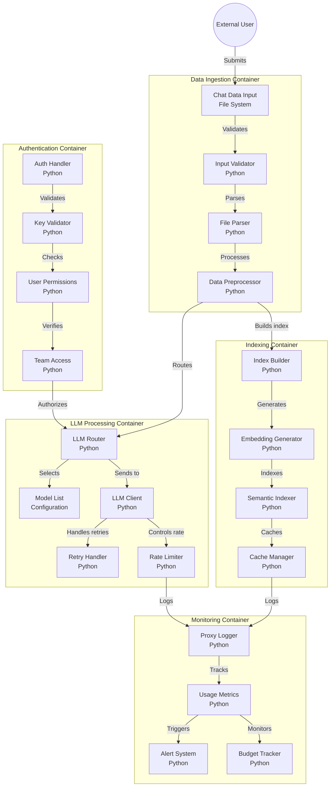

# System Context

## I am working on a software system with the following directory structure, architecture, and analyzed files

## Directory Structure

```
├── .env.template
├── .github
│   ├── ISSUE_TEMPLATE
│   │   ├── bug_report.md
│   │   ├── custom.md
│   │   └── feature_request.md
│   └── workflows
│       └── codeql.yml
├── .gitignore
├── CODE_OF_CONDUCT.md
├── CONTRIBUTING.md
├── README.md
├── SECURITY.md
├── archive
│   ├── LLM Chat Indexer_ Review and Potential.wav
│   ├── Project-POC.rar
│   ├── v0.1.tar
│   └── v0.2.tar
├── assets
│   └── llm-chat-indexer.png
├── chats
│   ├── ai-snake-game-treejs-gemini-2.5-pro.md
│   ├── pwntools-sheetcheat-qwen-2.5-max.md
│   └── what-is-context-chatgpt.md
├── docs
│   ├── v0.2-chat-indexer.drawio
│   ├── v0.2-prompt.md
│   └── v0.2-sequence-diagram.md
├── htmlcov
│   ├── .gitignore
│   ├── class_index.html
│   ├── coverage_html_cb_497bf287.js
│   ├── favicon_32_cb_58284776.png
│   ├── function_index.html
│   ├── index.html
│   ├── keybd_closed_cb_ce680311.png
│   ├── status.json
│   ├── style_cb_718ce007.css
│   ├── z_145eef247bfb46b6___init___py.html
│   ├── z_145eef247bfb46b6_config_py.html
│   ├── z_145eef247bfb46b6_file_parser_py.html
│   ├── z_145eef247bfb46b6_index_builder_py.html
│   ├── z_145eef247bfb46b6_llm_client_py.html
│   └── z_145eef247bfb46b6_logger_py.html
├── pytest.ini
└── requirements.txt

```

## Mermaid Diagram



## Analyzed Files

<project_metadata>

# Project Information

- Workspace root: `f:\BACKUP\FRED\PROJECTS\__GITHUB-TheRealFredP3D\llm-chat-indexer\REPO`

## High Value Files

</project_metadata>

<files>
<file>
<file_metadata>
### docs/v0.2-sequence-diagram.md
- Reason: Contains sequence diagrams showing component interactions and processing flow
- File size: 638 bytes
</file_metadata>
<file_source>
 1 | # v0.2 - llm-chat-indexer - Sequence Diagram
 2 |
 3 | ```mermaid
 4 | sequenceDiagram
 5 |     participant CI as ChatIndexer
 6 |     participant FP as FileParser
 7 |     participant LC as LLMClient
 8 |     participant IB as IndexBuilder
 9 |
10 |     CI->>FP: parse_file(file_path, content)
11 |     FP-->>CI: messages
12 |     alt messages
13 |         CI->>LC: extract_topics(messages, max_topic_keywords)
14 |         LC-->>CI: topics
15 |         CI->>LC: summarize(messages)
16 |         LC-->>CI: summary
17 |     else no messages
18 |         CI-->>CI: return empty data
19 |     end
20 |     CI->>IB: build_index(index_data, output_dir, index_filename, summary_filename)
21 |     IB-->>CI: success
22 | ```
23 | </file_source>

</file>
<file>
<file_metadata>
### docs/v0.2-chat-indexer.drawio
- Reason: System architecture diagrams showing component relationships and data flow
- File size: 17742 bytes
</file_metadata>
<file_source>
  1 | <?xml version="1.0" encoding="UTF-8"?>
  2 |       <mxfile host="codeviz.app" modified="2025-03-23T11:42:51.429Z" agent="CodeViz Exporter" version="14.6.5" type="device">
  3 |         <diagram id="codeviz-diagram" name="System Diagram">
  4 |           <mxGraphModel dx="1000" dy="1000" grid="1" gridSize="10" guides="1" tooltips="1" connect="1" arrows="1" fold="1" page="1" pageScale="1" pageWidth="1169" pageHeight="827" math="0" shadow="0">
  5 |             <root>
  6 |               <mxCell id="0"/>
  7 |               <mxCell id="1" parent="0"/>
  8 |               <mxCell id="subGraph4" value="" style="html=1;whiteSpace=wrap;container=1;fillColor=#dae8fc;strokeColor=#6c8ebf;dashed=1;fillOpacity=20;strokeWidth=2;containerType=none;recursiveResize=0;movable=1;resizable=1;autosize=0;dropTarget=0" vertex="1" parent="1">
  9 |                 <mxGeometry x="197" y="982" width="380" height="380" as="geometry"/>
 10 |               </mxCell>
 11 |               <mxCell id="subGraph4_label" value="Monitoring &amp; Logging" style="edgeLabel;html=1;align=center;verticalAlign=middle;resizable=0;labelBackgroundColor=white;spacing=5" vertex="1" parent="1">
 12 |                 <mxGeometry x="205" y="990" width="304" height="24" as="geometry"/>
 13 |               </mxCell>
 14 | <mxCell id="subGraph3" value="" style="html=1;whiteSpace=wrap;container=1;fillColor=#dae8fc;strokeColor=#6c8ebf;dashed=1;fillOpacity=20;strokeWidth=2;containerType=none;recursiveResize=0;movable=1;resizable=1;autosize=0;dropTarget=0" vertex="1" parent="1">
 15 |                 <mxGeometry x="22" y="502" width="240" height="460" as="geometry"/>
 16 |               </mxCell>
 17 |               <mxCell id="subGraph3_label" value="Indexing Pipeline" style="edgeLabel;html=1;align=center;verticalAlign=middle;resizable=0;labelBackgroundColor=white;spacing=5" vertex="1" parent="1">
 18 |                 <mxGeometry x="30" y="510" width="164" height="24" as="geometry"/>
 19 |               </mxCell>
 20 | <mxCell id="subGraph2" value="" style="html=1;whiteSpace=wrap;container=1;fillColor=#dae8fc;strokeColor=#6c8ebf;dashed=1;fillOpacity=20;strokeWidth=2;containerType=none;recursiveResize=0;movable=1;resizable=1;autosize=0;dropTarget=0" vertex="1" parent="1">
 21 |                 <mxGeometry x="392" y="22" width="240" height="460" as="geometry"/>
 22 |               </mxCell>
 23 |               <mxCell id="subGraph2_label" value="Authentication &amp; Authorization" style="edgeLabel;html=1;align=center;verticalAlign=middle;resizable=0;labelBackgroundColor=white;spacing=5" vertex="1" parent="1">
 24 |                 <mxGeometry x="400" y="30" width="164" height="24" as="geometry"/>
 25 |               </mxCell>
 26 | <mxCell id="subGraph1" value="" style="html=1;whiteSpace=wrap;container=1;fillColor=#dae8fc;strokeColor=#6c8ebf;dashed=1;fillOpacity=20;strokeWidth=2;containerType=none;recursiveResize=0;movable=1;resizable=1;autosize=0;dropTarget=0" vertex="1" parent="1">
 27 |                 <mxGeometry x="252" y="528.6666666666667" width="400" height="380" as="geometry"/>
 28 |               </mxCell>
 29 |               <mxCell id="subGraph1_label" value="LLM Processing" style="edgeLabel;html=1;align=center;verticalAlign=middle;resizable=0;labelBackgroundColor=white;spacing=5" vertex="1" parent="1">
 30 |                 <mxGeometry x="260" y="536.6666666666667" width="324" height="24" as="geometry"/>
 31 |               </mxCell>
 32 | <mxCell id="subGraph0" value="" style="html=1;whiteSpace=wrap;container=1;fillColor=#dae8fc;strokeColor=#6c8ebf;dashed=1;fillOpacity=20;strokeWidth=2;containerType=none;recursiveResize=0;movable=1;resizable=1;autosize=0;dropTarget=0" vertex="1" parent="1">
 33 |                 <mxGeometry x="42" y="22" width="240" height="460" as="geometry"/>
 34 |               </mxCell>
 35 |               <mxCell id="subGraph0_label" value="Data Ingestion" style="edgeLabel;html=1;align=center;verticalAlign=middle;resizable=0;labelBackgroundColor=white;spacing=5" vertex="1" parent="1">
 36 |                 <mxGeometry x="50" y="30" width="164" height="24" as="geometry"/>
 37 |               </mxCell>
 38 |               <mxCell id="input" value="Chat Data Input" style="rounded=1;whiteSpace=wrap;html=1;fillColor=#f5f5f5" vertex="1" parent="subGraph0">
 39 |                     <mxGeometry x="40" y="120" width="120" height="60" as="geometry"/>
 40 |                   </mxCell>
 41 | <mxCell id="fileParser" value="File Parser" style="rounded=1;whiteSpace=wrap;html=1;fillColor=#f5f5f5" vertex="1" parent="subGraph0">
 42 |                     <mxGeometry x="40" y="280" width="120" height="60" as="geometry"/>
 43 |                   </mxCell>
 44 | <mxCell id="preprocessor" value="Data Preprocessor" style="rounded=1;whiteSpace=wrap;html=1;fillColor=#f5f5f5" vertex="1" parent="subGraph0">
 45 |                     <mxGeometry x="40" y="360" width="120" height="60" as="geometry"/>
 46 |                   </mxCell>
 47 | <mxCell id="validator" value="Input Validator" style="rounded=1;whiteSpace=wrap;html=1;fillColor=#f5f5f5" vertex="1" parent="subGraph0">
 48 |                     <mxGeometry x="40" y="200" width="120" height="60" as="geometry"/>
 49 |                   </mxCell>
 50 | <mxCell id="router" value="LLM Router" style="rounded=1;whiteSpace=wrap;html=1;fillColor=#f5f5f5" vertex="1" parent="subGraph1">
 51 |                     <mxGeometry x="160" y="120" width="120" height="60" as="geometry"/>
 52 |                   </mxCell>
 53 | <mxCell id="modelList" value="Model List" style="rounded=1;whiteSpace=wrap;html=1;fillColor=#f5f5f5" vertex="1" parent="subGraph1">
 54 |                     <mxGeometry x="40" y="200" width="120" height="60" as="geometry"/>
 55 |                   </mxCell>
 56 | <mxCell id="llmClient" value="LLM Client" style="rounded=1;whiteSpace=wrap;html=1;fillColor=#f5f5f5" vertex="1" parent="subGraph1">
 57 |                     <mxGeometry x="180" y="200" width="120" height="60" as="geometry"/>
 58 |                   </mxCell>
 59 | <mxCell id="retryHandler" value="Retry Handler" style="rounded=1;whiteSpace=wrap;html=1;fillColor=#f5f5f5" vertex="1" parent="subGraph1">
 60 |                     <mxGeometry x="60" y="280" width="120" height="60" as="geometry"/>
 61 |                   </mxCell>
 62 | <mxCell id="rateLimit" value="Rate Limiter" style="rounded=1;whiteSpace=wrap;html=1;fillColor=#f5f5f5" vertex="1" parent="subGraph1">
 63 |                     <mxGeometry x="200" y="280" width="120" height="60" as="geometry"/>
 64 |                   </mxCell>
 65 | <mxCell id="auth" value="Auth Handler" style="rounded=1;whiteSpace=wrap;html=1;fillColor=#f5f5f5" vertex="1" parent="subGraph2">
 66 |                     <mxGeometry x="40" y="120" width="120" height="60" as="geometry"/>
 67 |                   </mxCell>
 68 | <mxCell id="keyValidator" value="Key Validator" style="rounded=1;whiteSpace=wrap;html=1;fillColor=#f5f5f5" vertex="1" parent="subGraph2">
 69 |                     <mxGeometry x="40" y="200" width="120" height="60" as="geometry"/>
 70 |                   </mxCell>
 71 | <mxCell id="userCheck" value="User Permissions" style="rounded=1;whiteSpace=wrap;html=1;fillColor=#f5f5f5" vertex="1" parent="subGraph2">
 72 |                     <mxGeometry x="40" y="280" width="120" height="60" as="geometry"/>
 73 |                   </mxCell>
 74 | <mxCell id="teamCheck" value="Team Access" style="rounded=1;whiteSpace=wrap;html=1;fillColor=#f5f5f5" vertex="1" parent="subGraph2">
 75 |                     <mxGeometry x="40" y="360" width="120" height="60" as="geometry"/>
 76 |                   </mxCell>
 77 | <mxCell id="indexBuilder" value="Index Builder" style="rounded=1;whiteSpace=wrap;html=1;fillColor=#f5f5f5" vertex="1" parent="subGraph3">
 78 |                     <mxGeometry x="40" y="120" width="120" height="60" as="geometry"/>
 79 |                   </mxCell>
 80 | <mxCell id="embedGen" value="Embedding Generator" style="rounded=1;whiteSpace=wrap;html=1;fillColor=#f5f5f5" vertex="1" parent="subGraph3">
 81 |                     <mxGeometry x="40" y="200" width="120" height="60" as="geometry"/>
 82 |                   </mxCell>
 83 | <mxCell id="semanticIndex" value="Semantic Indexer" style="rounded=1;whiteSpace=wrap;html=1;fillColor=#f5f5f5" vertex="1" parent="subGraph3">
 84 |                     <mxGeometry x="40" y="280" width="120" height="60" as="geometry"/>
 85 |                   </mxCell>
 86 | <mxCell id="cacheLayer" value="Cache Manager" style="rounded=1;whiteSpace=wrap;html=1;fillColor=#f5f5f5" vertex="1" parent="subGraph3">
 87 |                     <mxGeometry x="40" y="360" width="120" height="60" as="geometry"/>
 88 |                   </mxCell>
 89 | <mxCell id="logger" value="Proxy Logger" style="rounded=1;whiteSpace=wrap;html=1;fillColor=#f5f5f5" vertex="1" parent="subGraph4">
 90 |                     <mxGeometry x="60" y="120" width="120" height="60" as="geometry"/>
 91 |                   </mxCell>
 92 | <mxCell id="metrics" value="Usage Metrics" style="rounded=1;whiteSpace=wrap;html=1;fillColor=#f5f5f5" vertex="1" parent="subGraph4">
 93 |                     <mxGeometry x="60" y="200" width="120" height="60" as="geometry"/>
 94 |                   </mxCell>
 95 | <mxCell id="alerting" value="Alert System" style="rounded=1;whiteSpace=wrap;html=1;fillColor=#f5f5f5" vertex="1" parent="subGraph4">
 96 |                     <mxGeometry x="40" y="280" width="120" height="60" as="geometry"/>
 97 |                   </mxCell>
 98 | <mxCell id="budgetTracker" value="Budget Tracker" style="rounded=1;whiteSpace=wrap;html=1;fillColor=#f5f5f5" vertex="1" parent="subGraph4">
 99 |                     <mxGeometry x="180" y="280" width="120" height="60" as="geometry"/>
100 |                   </mxCell>
101 |               <mxCell id="edge-L_input_validator_0" style="edgeStyle=orthogonalEdgeStyle;rounded=1;orthogonalLoop=1;jettySize=auto;html=1;strokeColor=#808080;strokeWidth=2;jumpStyle=arc;jumpSize=10;spacing=15;labelBackgroundColor=white;labelBorderColor=none" edge="1" parent="1" source="input" target="validator">
102 |                   <mxGeometry relative="1" as="geometry"/>
103 |                 </mxCell>
104 | <mxCell id="edge-L_validator_fileParser_1" style="edgeStyle=orthogonalEdgeStyle;rounded=1;orthogonalLoop=1;jettySize=auto;html=1;strokeColor=#808080;strokeWidth=2;jumpStyle=arc;jumpSize=10;spacing=15;labelBackgroundColor=white;labelBorderColor=none" edge="1" parent="1" source="validator" target="fileParser">
105 |                   <mxGeometry relative="1" as="geometry"/>
106 |                 </mxCell>
107 | <mxCell id="edge-L_fileParser_preprocessor_2" style="edgeStyle=orthogonalEdgeStyle;rounded=1;orthogonalLoop=1;jettySize=auto;html=1;strokeColor=#808080;strokeWidth=2;jumpStyle=arc;jumpSize=10;spacing=15;labelBackgroundColor=white;labelBorderColor=none" edge="1" parent="1" source="fileParser" target="preprocessor">
108 |                   <mxGeometry relative="1" as="geometry"/>
109 |                 </mxCell>
110 | <mxCell id="edge-L_preprocessor_indexBuilder_3" style="edgeStyle=orthogonalEdgeStyle;rounded=1;orthogonalLoop=1;jettySize=auto;html=1;strokeColor=#808080;strokeWidth=2;jumpStyle=arc;jumpSize=10;spacing=15;labelBackgroundColor=white;labelBorderColor=none" edge="1" parent="1" source="preprocessor" target="indexBuilder">
111 |                   <mxGeometry relative="1" as="geometry"/>
112 |                 </mxCell>
113 | <mxCell id="edge-L_indexBuilder_embedGen_4" style="edgeStyle=orthogonalEdgeStyle;rounded=1;orthogonalLoop=1;jettySize=auto;html=1;strokeColor=#808080;strokeWidth=2;jumpStyle=arc;jumpSize=10;spacing=15;labelBackgroundColor=white;labelBorderColor=none" edge="1" parent="1" source="indexBuilder" target="embedGen">
114 |                   <mxGeometry relative="1" as="geometry"/>
115 |                 </mxCell>
116 | <mxCell id="edge-L_embedGen_semanticIndex_5" style="edgeStyle=orthogonalEdgeStyle;rounded=1;orthogonalLoop=1;jettySize=auto;html=1;strokeColor=#808080;strokeWidth=2;jumpStyle=arc;jumpSize=10;spacing=15;labelBackgroundColor=white;labelBorderColor=none" edge="1" parent="1" source="embedGen" target="semanticIndex">
117 |                   <mxGeometry relative="1" as="geometry"/>
118 |                 </mxCell>
119 | <mxCell id="edge-L_semanticIndex_cacheLayer_6" style="edgeStyle=orthogonalEdgeStyle;rounded=1;orthogonalLoop=1;jettySize=auto;html=1;strokeColor=#808080;strokeWidth=2;jumpStyle=arc;jumpSize=10;spacing=15;labelBackgroundColor=white;labelBorderColor=none" edge="1" parent="1" source="semanticIndex" target="cacheLayer">
120 |                   <mxGeometry relative="1" as="geometry"/>
121 |                 </mxCell>
122 | <mxCell id="edge-L_auth_keyValidator_7" style="edgeStyle=orthogonalEdgeStyle;rounded=1;orthogonalLoop=1;jettySize=auto;html=1;strokeColor=#808080;strokeWidth=2;jumpStyle=arc;jumpSize=10;spacing=15;labelBackgroundColor=white;labelBorderColor=none" edge="1" parent="1" source="auth" target="keyValidator">
123 |                   <mxGeometry relative="1" as="geometry"/>
124 |                 </mxCell>
125 | <mxCell id="edge-L_keyValidator_userCheck_8" style="edgeStyle=orthogonalEdgeStyle;rounded=1;orthogonalLoop=1;jettySize=auto;html=1;strokeColor=#808080;strokeWidth=2;jumpStyle=arc;jumpSize=10;spacing=15;labelBackgroundColor=white;labelBorderColor=none" edge="1" parent="1" source="keyValidator" target="userCheck">
126 |                   <mxGeometry relative="1" as="geometry"/>
127 |                 </mxCell>
128 | <mxCell id="edge-L_userCheck_teamCheck_9" style="edgeStyle=orthogonalEdgeStyle;rounded=1;orthogonalLoop=1;jettySize=auto;html=1;strokeColor=#808080;strokeWidth=2;jumpStyle=arc;jumpSize=10;spacing=15;labelBackgroundColor=white;labelBorderColor=none" edge="1" parent="1" source="userCheck" target="teamCheck">
129 |                   <mxGeometry relative="1" as="geometry"/>
130 |                 </mxCell>
131 | <mxCell id="edge-L_router_modelList_10" style="edgeStyle=orthogonalEdgeStyle;rounded=1;orthogonalLoop=1;jettySize=auto;html=1;strokeColor=#808080;strokeWidth=2;jumpStyle=arc;jumpSize=10;spacing=15;labelBackgroundColor=white;labelBorderColor=none" edge="1" parent="1" source="router" target="modelList">
132 |                   <mxGeometry relative="1" as="geometry"/>
133 |                 </mxCell>
134 | <mxCell id="edge-L_router_llmClient_11" style="edgeStyle=orthogonalEdgeStyle;rounded=1;orthogonalLoop=1;jettySize=auto;html=1;strokeColor=#808080;strokeWidth=2;jumpStyle=arc;jumpSize=10;spacing=15;labelBackgroundColor=white;labelBorderColor=none" edge="1" parent="1" source="router" target="llmClient">
135 |                   <mxGeometry relative="1" as="geometry"/>
136 |                 </mxCell>
137 | <mxCell id="edge-L_llmClient_retryHandler_12" style="edgeStyle=orthogonalEdgeStyle;rounded=1;orthogonalLoop=1;jettySize=auto;html=1;strokeColor=#808080;strokeWidth=2;jumpStyle=arc;jumpSize=10;spacing=15;labelBackgroundColor=white;labelBorderColor=none" edge="1" parent="1" source="llmClient" target="retryHandler">
138 |                   <mxGeometry relative="1" as="geometry"/>
139 |                 </mxCell>
140 | <mxCell id="edge-L_llmClient_rateLimit_13" style="edgeStyle=orthogonalEdgeStyle;rounded=1;orthogonalLoop=1;jettySize=auto;html=1;strokeColor=#808080;strokeWidth=2;jumpStyle=arc;jumpSize=10;spacing=15;labelBackgroundColor=white;labelBorderColor=none" edge="1" parent="1" source="llmClient" target="rateLimit">
141 |                   <mxGeometry relative="1" as="geometry"/>
142 |                 </mxCell>
143 | <mxCell id="edge-L_logger_metrics_14" style="edgeStyle=orthogonalEdgeStyle;rounded=1;orthogonalLoop=1;jettySize=auto;html=1;strokeColor=#808080;strokeWidth=2;jumpStyle=arc;jumpSize=10;spacing=15;labelBackgroundColor=white;labelBorderColor=none" edge="1" parent="1" source="logger" target="metrics">
144 |                   <mxGeometry relative="1" as="geometry"/>
145 |                 </mxCell>
146 | <mxCell id="edge-L_metrics_alerting_15" style="edgeStyle=orthogonalEdgeStyle;rounded=1;orthogonalLoop=1;jettySize=auto;html=1;strokeColor=#808080;strokeWidth=2;jumpStyle=arc;jumpSize=10;spacing=15;labelBackgroundColor=white;labelBorderColor=none" edge="1" parent="1" source="metrics" target="alerting">
147 |                   <mxGeometry relative="1" as="geometry"/>
148 |                 </mxCell>
149 | <mxCell id="edge-L_metrics_budgetTracker_16" style="edgeStyle=orthogonalEdgeStyle;rounded=1;orthogonalLoop=1;jettySize=auto;html=1;strokeColor=#808080;strokeWidth=2;jumpStyle=arc;jumpSize=10;spacing=15;labelBackgroundColor=white;labelBorderColor=none" edge="1" parent="1" source="metrics" target="budgetTracker">
150 |                   <mxGeometry relative="1" as="geometry"/>
151 |                 </mxCell>
152 | <mxCell id="edge-L_preprocessor_router_17" style="edgeStyle=orthogonalEdgeStyle;rounded=1;orthogonalLoop=1;jettySize=auto;html=1;strokeColor=#808080;strokeWidth=2;jumpStyle=arc;jumpSize=10;spacing=15;labelBackgroundColor=white;labelBorderColor=none" edge="1" parent="1" source="preprocessor" target="router">
153 |                   <mxGeometry relative="1" as="geometry"/>
154 |                 </mxCell>
155 | <mxCell id="edge-L_teamCheck_router_18" style="edgeStyle=orthogonalEdgeStyle;rounded=1;orthogonalLoop=1;jettySize=auto;html=1;strokeColor=#808080;strokeWidth=2;jumpStyle=arc;jumpSize=10;spacing=15;labelBackgroundColor=white;labelBorderColor=none" edge="1" parent="1" source="teamCheck" target="router">
156 |                   <mxGeometry relative="1" as="geometry"/>
157 |                 </mxCell>
158 | <mxCell id="edge-L_rateLimit_logger_19" style="edgeStyle=orthogonalEdgeStyle;rounded=1;orthogonalLoop=1;jettySize=auto;html=1;strokeColor=#808080;strokeWidth=2;jumpStyle=arc;jumpSize=10;spacing=15;labelBackgroundColor=white;labelBorderColor=none" edge="1" parent="1" source="rateLimit" target="logger">
159 |                   <mxGeometry relative="1" as="geometry"/>
160 |                 </mxCell>
161 | <mxCell id="edge-L_cacheLayer_logger_20" style="edgeStyle=orthogonalEdgeStyle;rounded=1;orthogonalLoop=1;jettySize=auto;html=1;strokeColor=#808080;strokeWidth=2;jumpStyle=arc;jumpSize=10;spacing=15;labelBackgroundColor=white;labelBorderColor=none" edge="1" parent="1" source="cacheLayer" target="logger">
162 |                   <mxGeometry relative="1" as="geometry"/>
163 |                 </mxCell>
164 |             </root>
165 |           </mxGraphModel>
166 |         </diagram>
167 |       </mxfile></file_source>

</file>
</files>
