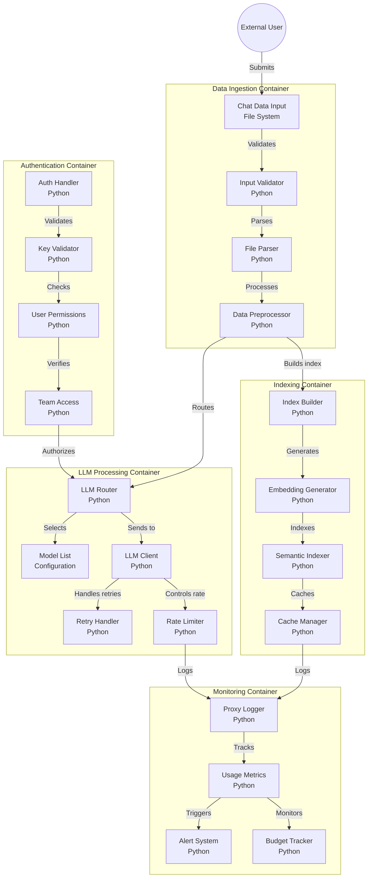

# v0.2 FINAL - Diagram

```mermaid
graph TB
    User((External User))

    subgraph "Data Ingestion Container"
        direction TB
        Input["Chat Data Input<br>File System"]
        Validator["Input Validator<br>Python"]
        FileParser["File Parser<br>Python"]
        Preprocessor["Data Preprocessor<br>Python"]
    end

    subgraph "LLM Processing Container"
        direction TB
        Router["LLM Router<br>Python"]
        ModelList["Model List<br>Configuration"]
        LLMClient["LLM Client<br>Python"]
        RetryHandler["Retry Handler<br>Python"]
        RateLimiter["Rate Limiter<br>Python"]
    end

    subgraph "Authentication Container"
        direction TB
        AuthHandler["Auth Handler<br>Python"]
        KeyValidator["Key Validator<br>Python"]
        UserPerms["User Permissions<br>Python"]
        TeamAccess["Team Access<br>Python"]
    end

    subgraph "Indexing Container"
        direction TB
        IndexBuilder["Index Builder<br>Python"]
        EmbedGen["Embedding Generator<br>Python"]
        SemanticIndex["Semantic Indexer<br>Python"]
        CacheManager["Cache Manager<br>Python"]
    end

    subgraph "Monitoring Container"
        direction TB
        Logger["Proxy Logger<br>Python"]
        Metrics["Usage Metrics<br>Python"]
        AlertSystem["Alert System<br>Python"]
        BudgetTracker["Budget Tracker<br>Python"]
    end

    %% Data Ingestion Flow
    User -->|"Submits"| Input
    Input -->|"Validates"| Validator
    Validator -->|"Parses"| FileParser
    FileParser -->|"Processes"| Preprocessor

    %% Authentication Flow
    AuthHandler -->|"Validates"| KeyValidator
    KeyValidator -->|"Checks"| UserPerms
    UserPerms -->|"Verifies"| TeamAccess

    %% LLM Processing Flow
    Preprocessor -->|"Routes"| Router
    Router -->|"Selects"| ModelList
    Router -->|"Sends to"| LLMClient
    LLMClient -->|"Handles retries"| RetryHandler
    LLMClient -->|"Controls rate"| RateLimiter

    %% Indexing Flow
    Preprocessor -->|"Builds index"| IndexBuilder
    IndexBuilder -->|"Generates"| EmbedGen
    EmbedGen -->|"Indexes"| SemanticIndex
    SemanticIndex -->|"Caches"| CacheManager

    %% Monitoring Flow
    RateLimiter -->|"Logs"| Logger
    CacheManager -->|"Logs"| Logger
    Logger -->|"Tracks"| Metrics
    Metrics -->|"Triggers"| AlertSystem
    Metrics -->|"Monitors"| BudgetTracker

    %% Cross-container Authorization
    TeamAccess -->|"Authorizes"| Router
```
