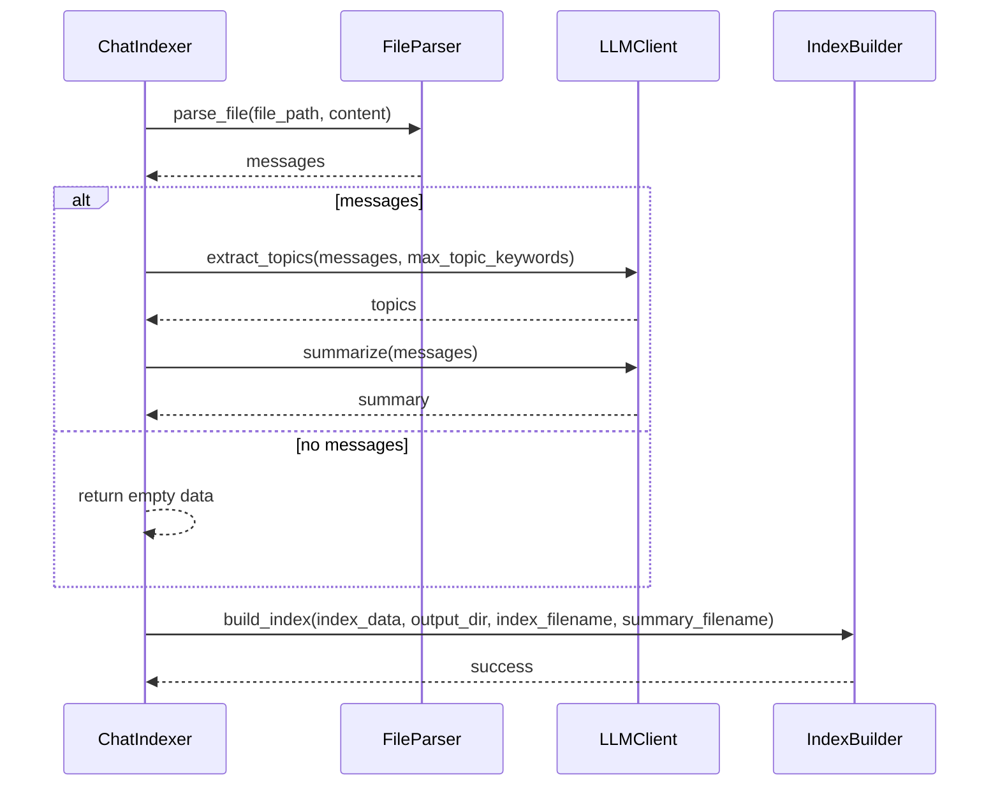

# v0.2 - llm-chat-indexer - Sequence Diagram

```mermaid
sequenceDiagram
    participant CI as ChatIndexer
    participant FP as FileParser
    participant LC as LLMClient
    participant IB as IndexBuilder

    CI->>FP: parse_file(file_path, content)
    FP-->>CI: messages
    alt messages
        CI->>LC: extract_topics(messages, max_topic_keywords)
        LC-->>CI: topics
        CI->>LC: summarize(messages)
        LC-->>CI: summary
    else no messages
        CI-->>CI: return empty data
    end
    CI->>IB: build_index(index_data, output_dir, index_filename, summary_filename)
    IB-->>CI: success
```
