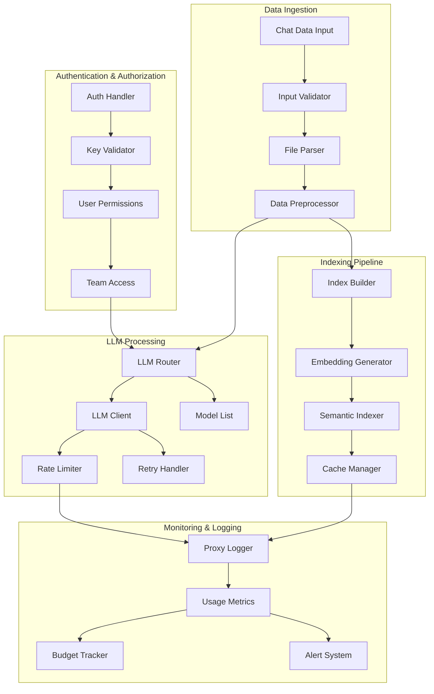

# System Context

## I am working on a software system with the following directory structure, architecture, and analyzed files

## Directory Structure

```sh
├── .env.template
├── .github
│   └── ISSUE_TEMPLATE
│       ├── bug_report.md
│       ├── custom.md
│       └── feature_request.md
├── .gitignore
             └── vertex_passthrough_router.py
    ├── .vscode
│   └── settings.json
├── Pipfile.lock
├── README.md
├── archive
│   └── Project-POC.rar
├── assets
│   └── llm-chat-indexer.png
├── htmlcov
│   ├── .gitignore
│   ├── class_index.html
│   ├── coverage_html_cb_497bf287.js
│   ├── favicon_32_cb_58284776.png
│   ├── function_index.html
│   ├── index.html
│   ├── keybd_closed_cb_ce680311.png
│   ├── status.json
│   ├── style_cb_718ce007.css
│   ├── z_145eef247bfb46b6___init___py.html
│   ├── z_145eef247bfb46b6_config_py.html
│   ├── z_145eef247bfb46b6_file_parser_py.html
│   ├── z_145eef247bfb46b6_index_builder_py.html
│   ├── z_145eef247bfb46b6_llm_client_py.html
│   └── z_145eef247bfb46b6_logger_py.html
├── output
│   ├── chat_index.json
│   └── chat_summaries.md
├── pytest.ini
└── requirements.txt

```

## Mermaid Diagram



## Analyzed Files

<project_metadata>

# Project Information

- Workspace root: `c:\Users\bloga\Desktop\REPO`

## High Value Files

</project_metadata>

<files>
<file>
<file_metadata>
### .env.template
- Reason: Contains configuration settings for LLM providers, API keys, and core system parameters including output paths and supported file types
- File size: 1415 bytes
</file_metadata>
<file_source>
 1 | # LLM Provider API Keys - Add your API keys for the LLM service you want to use
 2 | GOOGLE_API_KEY=your_google_api_key_here        # Required for Gemini models
 3 | # OPENAI_API_KEY=your_openai_key_here          # Required for OpenAI models
 4 | # ANTHROPIC_API_KEY=your_anthropic_key_here    # Required for Anthropic models
 5 | # GROQ_API_KEY=your_groq_jey_here              # Required for Groq models
 6 |
 7 | # Add any supported by LiteLLM or that are OpenAI compatible
 8 |
 9 |
10 | # Configuration
11 | BASE_DIR=.                                      # Root directory for the application
12 | OUTPUT_DIR=./output                             # Dire

... (content truncated) ...

    # Filename for the JSON index of all processed chats
15 | LLM_PROVIDER=gemini/gemini-2.0-flash            # LLM provider and model to use for summarization
16 | LLM_API_KEY=
17 | SUPPORTED_FILE_EXTENSIONS=.txt,.md,.json,.html,.csv  # File types that can be processed by the indexer
18 | MAX_TOPIC_KEYWORDS=5                            # Maximum number of keywords to extract per chat (higher values provide more detailed but potentially noisier topics)
19 | LOG_LEVEL=INFO                                  # Logging verbosity (DEBUG, INFO, WARNING, ERROR, CRITICAL)
20 | LOG_FILE=chat_indexer.log                       # File where logs will be written
21 | </file_source>

</file>
<file>
<file_metadata>
### htmlcov/z_145eef247bfb46b6_index_builder_py.html
- Reason: Shows the index building logic including document processing workflow and persistence mechanisms
- File size: 38033 bytes
</file_metadata>
<file_source>
  1 | <!DOCTYPE html>
  2 | <html lang="en">
  3 | <head>
  4 |     <meta http-equiv="Content-Type" content="text/html; charset=utf-8">
  5 |     <title>Coverage for src\index_builder.py: 11%</title>
  6 |     <link rel="icon" sizes="32x32" href="favicon_32_cb_58284776.png">
  7 |     <link rel="stylesheet" href="style_cb_718ce007.css" type="text/css">
  8 |     <script src="coverage_html_cb_497bf287.js" defer></script>
  9 | </head>
 10 | <body class="pyfile">
 11 | <header>
 12 |     <div class="content">
 13 |         <h1>
 14 |             <span class="text">Coverage for </span><b>src\index_builder.py</b>:
 15 |             <span class="pc_cov">11%</span>
 16 |         </h1>
 17 |         <aside id="help_panel_wrapper">
 18 |             <input id="help_panel_state" type="checkbox">
 19 |             <label for="help_panel_state">
 20 |                 
 21 |             </label>
 22 |             <div id="help_panel">
 23 |                 <p class="legend">Shortcuts on this page</p>
 24 |                 <div class="keyhelp">
 25 |                     <p>
 26 |                         <kbd>r</kbd>
 27 |                         <kbd>m</kbd>
 28 |                         <kbd>x</kbd>
 29 |                         &nbsp; toggle line displays
 30 |                     </p>
 31 |                     <p>
 32 |                         <kbd>j</kbd>
 33 |                         <kbd>k</kbd>
 34 |                         &nbsp; next/prev highlighted chunk
 35 |                     </p>
 36 |                     <p>
 37 |                         <kbd>0</kbd> &nbsp; (zero) top of page
 38 |                     </p>
 39 |                     <p>
 40 |                         <kbd>1</kbd> &nbsp; (one) first highlighted chunk
 41 |                     </p>
 42 |                     <p>
 43 |                         <kbd>[</kbd>
 44 |                         <kbd>]</kbd>
 45 |                         &nbsp; prev/next file
 46 |                     </p>
 47 |                     <p>
 48 |                         <kbd>u</kbd> &nbsp; up to the index
 49 |                     </p>
 50 |                     <p>
 51 |                         <kbd>?</kbd> &nbsp; show/hide this help
 52 |                     </p>
 53 |                 </div>
 54 |             </div>
 55 |         </aside>
 56 |         <h2>
 57 |             <span class="text">65 statements &nbsp;</span>
 58 |             <button type="button" class="run button_toggle_run" value="run" data-shortcut="r" title="Toggle lines run">7<span class="text"> run</span></button>
 59 |             <button type="button" class="mis show_mis button_toggle_mis" value="mis" data-shortcut="m" title="Toggle lines missing">58<span class="text"> missing</span></button>
 60 |             <button type="button" class="exc show_exc button_toggle_exc" value="exc" data-shortcut="x" title="Toggle lines excluded">0<span class="text"> excluded</span></button>
 61 |         </h2>
 62 |         <p class="text">
 63 |             <a id="prevFileLink" class="nav" href="z_145eef247bfb46b6_file_parser_py.html">&#xab; prev</a> &nbsp; &nbsp;
 64 |             <a id="indexLink" class="nav" href="index.html">&Hat; index</a> &nbsp; &nbsp;
 65 |             <a id="nextFileLink" class="nav" href="z_145eef247bfb46b6_llm_client_py.html">&#xbb; next</a>
 66 |             &nbsp; &nbsp; &nbsp;
 67 |             <a class="nav" href="https://coverage.readthedocs.io/en/7.7.1">coverage.py v7.7.1</a>,
 68 |             created at 2025-03-22 23:38 -0400
 69 |         </p>
 70 |         <aside class="hidden">
 71 |             <button type="button" class="button_next_chunk" data-shortcut="j"></button>
 72 |             <button type="button" class="button_prev_chunk" data-shortcut="k"></button>
 73 |             <button type="button" class="button_top_of_page" data-shortcut="0"></button>
 74 |             <button type="button" class="button_first_chunk" data-shortcut="1"></button>
 75 |             <button type="button" class="button_prev_file" data-shortcut="["></button>
 76 |             <button type="button" class="button_next_file" data-shortcut="]"></button>
 77 |             <button type="button" class="button_to_index" data-shortcut="u"></button>
 78 |             <button type="button" class="button_show_hide_help" data-shortcut="?"></button>
 79 |         </aside>
 80 |     </div>
 81 | </header>
 82 | <main id="source">
 83 |     <p class="pln"><span class="n"><a id="t1" href="#t1">1</a></span><span class="t"><span class="str">"""</span>&nbsp;</span><span class="r"></span></p>
 84 |     <p class="pln"><span class="n"><a id="t2" href="#t2">2</a></span><span class="t"><span class="str">Index builder module for creating searchable indexes and summaries.</span>&nbsp;</span><span class="r"></span></p>
 85 |     <p class="pln"><span class="n"><a id="t3" href="#t3">3</a></span><span class="t"><span class="str">"""</span>&nbsp;</span><span class="r"></span></p>
 86 |     <p class="pln"><span class="n"><a id="t4" href="#t4">4</a></span><span class="t">&nbsp;</span><span class="r"></span></p>
 87 |     <p class="run"><span class="n"><a id="t5" href="#t5">5</a></span><span class="t"><span class="key">import</span> <span class="nam">os</span>&nbsp;</span><span class="r"></span></p>
 88 |     <p class="run"><span class="n"><a id="t6" href="#t6">6</a></span><span class="t"><span class="key">import</span> <span class="nam">json</span>&nbsp;</span><span class="r"></span></p>
 89 |     <p class="run"><span class="n"><a id="t7" href="#t7">7</a></span><span class="t"><span class="key">import</span> <span class="nam">logging</span>&nbsp;</span><span class="r"></span></p>
 90 |     <p class="run"><span class="n"><a id="t8" href="#t8">8</a></span><span class="t"><span class="key">from</span> <span class="nam">datetime</span> <span class="key">import</span> <span class="nam">datetime</span>&nbsp;</span><span class="r"></span></p>
 91 |     <p class="pln"><span class="n"><a id="t9" href="#t9">9</a></span><span class="t">&nbsp;</span><span class="r"></span></p>
 92 |     <p class="run"><span class="n"><a id="t10" href="#t10">10</a></span><span class="t"><span class="nam">logger</span> <span class="op">=</span> <span class="nam">logging</span><span class="op">.</span><span class="nam">getLogger</span><span class="op">(</span><span class="str">"LLMChatIndexer"</span><span class="op">)</span>&nbsp;</span><span class="r"></span></p>
 93 |     <p class="pln"><span class="n"><a id="t11" href="#t11">11</a></span><span class="t">&nbsp;</span><span class="r"></span></p>
 94 |     <p class="pln"><span class="n"><a id="t12" href="#t12">12</a></span><span class="t">&nbsp;</span><span class="r"></span></p>
 95 |     <p class="run"><span class="n"><a id="t13" href="#t13">13</a></span><span class="t"><span class="key">def</span> <span class="nam">build_index</span><span class="op">(</span><span class="nam">index_data</span><span class="op">,</span> <span class="nam">output_dir</span><span class="op">,</span> <span class="nam">index_filename</span><span class="op">,</span> <span class="nam">summary_filename</span><span class="op">)</span><span class="op">:</span>&nbsp;</span><span class="r"></span></p>
 96 |     <p class="pln"><span class="n"><a id="t14" href="#t14">14</a></span><span class="t">    <span class="str">"""</span>&nbsp;</span><span class="r"></span></p>
 97 |     <p class="pln"><span class="n"><a id="t15" href="#t15">15</a></span><span class="t"><span class="str">    Build JSON index and markdown summary files.</span>&nbsp;</span><span class="r"></span></p>
 98 |     <p class="pln"><span class="n"><a id="t16" href="#t16">16</a></span><span class="t">&nbsp;</span><span class="r"></span></p>
 99 |     <p class="pln"><span class="n"><a id="t17" href="#t17">17</a></span><span class="t"><span class="str">    Args:</span>&nbsp;</span><span class="r"></span></p>
100 |     <p class="pln"><span class="n"><a id="t18" href="#t18">18</a></span><span class="t"><span class="str">        index_data (dict): Processed data with files and topics</span>&nbsp;</span><span class="r"></span></p>
101 |     <p class="pln"><span class="n"><a id="t19" href="#t19">19</a></span><span class="t"><span class="str">        output_dir (str): Directory to store output files</span>&nbsp;</span><span class="r"></span></p>
102 |     <p class="pln"><span class="n"><a id="t20" href="#t20">20</a></span><span class="t"><span class="str">        index_filename (str): Filename for JSON index</span>&nbsp;</span><span class="r"></span></p>
103 |     <p class="pln"><span class="n"><a id="t21" href="#t21">21</a></span><span class="t"><span class="str">        summary_filename (str): Filename for markdown summary</span>&nbsp;</span><span class="r"></span></p>
104 |     <p class="pln"><span class="n"><a id="t22" href="#t22">22</a></span><span class="t">&nbsp;</span><span class="r"></span></p>
105 |     <p class="pln"><span class="n"><a id="t23" href="#t23">23</a></span><span class="t"><span class="str">    Returns:</span>&nbsp;</span><span class="r"></span></p>
106 |     <p class="pln"><span class="n"><a id="t24" href="#t24">24</a></span><span class="t"><span class="str">        bool: True if successful, False otherwise</span>&nbsp;</span><span class="r"></span></p>
107 |     <p class="pln"><span class="n"><a id="t25" href="#t25">25</a></span><span class="t"><span class="str">    """</span>&nbsp;</span><span class="r"></span></p>
108 |     <p class="pln"><span class="n"><a id="t26" href="#t26">26</a></span><span class="t">    <span class="com"># Validate inputs</span>&nbsp;</span><span class="r"></span></p>
109 |     <p class="mis show_mis"><span class="n"><a id="t27" href="#t27">27</a></span><span class="t">    <span class="key">if</span> <span class="key">not</span> <span class="nam">isinstance</span><span class="op">(</span><span class="nam">index_data</span><span class="op">,</span> <span class="nam">dict</span><span class="op">)</span> <span class="key">or</span> <span class="str">"files"</span> <span class="key">not</span> <span class="key">in</span> <span class="nam">index_data</span><span class="op">:</span>&nbsp;</span><span class="r"></span></p>
110 |     <p class="mis show_mis"><span class="n"><a id="t28" href="#t28">28</a></span><span class="t">        <span class="nam">logger</span><span class="op">.</span><span class="nam">error</span><span class="op">(</span><span class="str">"Invalid index_data format: expected dict with 'files' key"</span><span class="op">)</span>&nbsp;</span><span class="r"></span></p>
111 |     <p class="mis show_mis"><span class="n"><a id="t29" href="#t29">29</a></span><span class="t">        <span class="key">return</span> <span class="key">False</span>&nbsp;</span><span class="r"></span></p>
112 |     <p class="pln"><span class="n"><a id="t30" href="#t30">30</a></span><span class="t">&nbsp;</span><span class="r"></span></p>
113 |     <p class="mis show_mis"><span class="n"><a id="t31" href="#t31">31</a></span><span class="t">    <span class="key">if</span> <span class="key">not</span> <span class="nam">output_dir</span><span class="op">:</span>&nbsp;</span><span class="r"></span></p>
114 |     <p class="mis show_mis"><span class="n"><a id="t32" href="#t32">32</a></span><span class="t">        <span class="nam">logger</span><span class="op">.</span><span class="nam">error</span><span class="op">(</span><span class="str">"No output directory specified"</span><span class="op">)</span>&nbsp;</span><span class="r"></span></p>
115 |     <p class="mis show_mis"><span class="n"><a id="t33" href="#t33">33</a></span><span class="t">        <span class="key">return</span> <span class="key">False</span>&nbsp;</span><span class="r"></span></p>
116 |     <p class="pln"><span class="n"><a id="t34" href="#t34">34</a></span><span class="t">&nbsp;</span><span class="r"></span></p>
117 |     <p class="mis show_mis"><span class="n"><a id="t35" href="#t35">35</a></span><span class="t">    <span class="key">if</span> <span class="key">not</span> <span class="nam">index_filename</span> <span class="key">or</span> <span class="key">not</span> <span class="nam">summary_filename</span><span class="op">:</span>&nbsp;</span><span class="r"></span></p>
118 |     <p class="mis show_mis"><span class="n"><a id="t36" href="#t36">36</a></span><span class="t">        <span class="nam">logger</span><span class="op">.</span><span class="nam">error</span><span class="op">(</span><span class="str">"Missing filename for index or summary"</span><span class="op">)</span>&nbsp;</span><span class="r"></span></p>
119 |     <p class="mis show_mis"><span class="n"><a id="t37" href="#t37">37</a></span><span class="t">        <span class="key">return</span> <span class="key">False</span>&nbsp;</span><span class="r"></span></p>
120 |     <p class="pln"><span class="n"><a id="t38" href="#t38">38</a></span><span class="t">&nbsp;</span><span class="r"></span></p>
121 |     <p class="mis show_mis"><span class="n"><a id="t39" href="#t39">39</a></span><span class="t">    <span class="key">try</span><span class="op">:</span>&nbsp;</span><span class="r"></span></p>
122 |     <p class="pln"><span class="n"><a id="t40" href="#t40">40</a></span><span class="t">        <span class="com"># Create output directory if it doesn't exist</span>&nbsp;</span><span class="r"></span></p>
123 |     <p class="mis show_mis"><span class="n"><a id="t41" href="#t41">41</a></span><span class="t">        <span class="nam">os</span><span class="op">.</span><span class="nam">makedirs</span><span class="op">(</span><span class="nam">output_dir</span><span class="op">,</span> <span class="nam">exist_ok</span><span class="op">=</span><span class="key">True</span><span class="op">)</span>&nbsp;</span><span class="r"></span></p>
124 |     <p class="pln"><span class="n"><a id="t42" href="#t42">42</a></span><span class="t">&nbsp;</span><span class="r"></span></p>
125 |     <p class="pln"><span class="n"><a id="t43" href="#t43">43</a></span><span class="t">        <span class="com"># Format timestamps for better readability in the index</span>&nbsp;</span><span class="r"></span></p>
126 |     <p class="mis show_mis"><span class="n"><a id="t44" href="#t44">44</a></span><span class="t">        <span class="key">for</span> <span class="nam">file_entry</span> <span class="key">in</span> <span class="nam">index_data</span><span class="op">[</span><span class="str">"files"</span><span class="op">]</span><span class="op">:</span>&nbsp;</span><span class="r"></span></p>
127 |     <p class="mis show_mis"><span class="n"><a id="t45" href="#t45">45</a></span><span class="t">            <span class="nam">timestamp</span> <span class="op">=</span> <span class="nam">file_entry</span><span class="op">.</span><span class="nam">get</span><span class="op">(</span><span class="str">"timestamp"</span><span class="op">,</span> <span class="str">""</span><span class="op">)</span>&nbsp;</span><span class="r"></span></p>
128 |     <p class="mis show_mis"><span class="n"><a id="t46" href="#t46">46</a></span><span class="t">            <span class="key">if</span> <span class="nam">timestamp</span><span class="op">:</span>&nbsp;</span><span class="r"></span></p>
129 |     <p class="pln"><span class="n"><a id="t47" href="#t47">47</a></span><span class="t">                <span class="com"># Parse ISO format and format as more readable</span>&nbsp;</span><span class="r"></span></p>
130 |     <p class="mis show_mis"><span class="n"><a id="t48" href="#t48">48</a></span><span class="t">                <span class="key">try</span><span class="op">:</span>&nbsp;</span><span class="r"></span></p>
131 |     <p class="mis show_mis"><span class="n"><a id="t49" href="#t49">49</a></span><span class="t">                    <span class="nam">dt</span> <span class="op">=</span> <span class="nam">datetime</span><span class="op">.</span><span class="nam">fromisoformat</span><span class="op">(</span><span class="nam">timestamp</span><span class="op">)</span>&nbsp;</span><span class="r"></span></p>
132 |     <p class="mis show_mis"><span class="n"><a id="t50" href="#t50">50</a></span><span class="t">                    <span class="nam">file_entry</span><span class="op">[</span><span class="str">"formatted_date"</span><span class="op">]</span> <span class="op">=</span> <span class="nam">dt</span><span class="op">.</span><span class="nam">strftime</span><span class="op">(</span><span class="str">"%Y-%m-%d %H:%M:%S"</span><span class="op">)</span>&nbsp;</span><span class="r"></span></p>
133 |     <p class="mis show_mis"><span class="n"><a id="t51" href="#t51">51</a></span><span class="t">                <span class="key">except</span> <span class="op">(</span><span class="nam">ValueError</span><span class="op">,</span> <span class="nam">TypeError</span><span class="op">)</span><span class="op">:</span>&nbsp;</span><span class="r"></span></p>
134 |     <p class="mis show_mis"><span class="n"><a id="t52" href="#t52">52</a></span><span class="t">                    <span class="nam">logger</span><span class="op">.</span><span class="nam">warning</span><span c

... (content truncated) ...

     <span class="com"># Add table of contents</span>&nbsp;</span><span class="r"></span></p>
149 |     <p class="mis show_mis"><span class="n"><a id="t67" href="#t67">67</a></span><span class="t">            <span class="nam">f</span><span class="op">.</span><span class="nam">write</span><span class="op">(</span><span class="str">"## Table of Contents\n\n"</span><span class="op">)</span>&nbsp;</span><span class="r"></span></p>
150 |     <p class="mis show_mis"><span class="n"><a id="t68" href="#t68">68</a></span><span class="t">            <span class="key">for</span> <span class="nam">i</span><span class="op">,</span> <span class="nam">entry</span> <span class="key">in</span> <span class="nam">enumerate</span><span class="op">(</span><span class="nam">index_data</span><span class="op">[</span><span class="str">"files"</span><span class="op">]</span><span class="op">)</span><span class="op">:</span>&nbsp;</span><span class="r"></span></p>
151 |     <p class="mis show_mis"><span class="n"><a id="t69" href="#t69">69</a></span><span class="t">                <span class="nam">filename</span> <span class="op">=</span> <span class="nam">entry</span><span class="op">.</span><span class="nam">get</span><span class="op">(</span><span class="str">"filename"</span><span class="op">,</span> <span class="fst">f"</span><span class="fst">File </span><span class="op">{</span><span class="nam">i</span> <span class="op">+</span> <span class="num">1</span><span class="op">}</span><span class="fst">"</span><span class="op">)</span>&nbsp;</span><span class="r"></span></p>
152 |     <p class="mis show_mis"><span class="n"><a id="t70" href="#t70">70</a></span><span class="t">                <span class="nam">anchor</span> <span class="op">=</span> <span class="nam">filename</span><span class="op">.</span><span class="nam">lower</span><span class="op">(</span><span class="op">)</span><span class="op">.</span><span class="nam">replace</span><span class="op">(</span><span class="str">"."</span><span class="op">,</span> <span class="str">"-"</span><span class="op">)</span><span class="op">.</span><span class="nam">replace</span><span class="op">(</span><span class="str">" "</span><span class="op">,</span> <span class="str">"-"</span><span class="op">)</span>&nbsp;</span><span class="r"></span></p>
153 |     <p class="mis show_mis"><span class="n"><a id="t71" href="#t71">71</a></span><span class="t">                <span class="nam">f</span><span class="op">.</span><span class="nam">write</span><span class="op">(</span><span class="fst">f"</span><span class="fst">- [</span><span class="op">{</span><span class="nam">filename</span><span class="op">}</span><span class="fst">](#</span><span class="op">{</span><span class="nam">anchor</span><span class="op">}</span><span class="fst">)\n</span><span class="fst">"</span><span class="op">)</span>&nbsp;</span><span class="r"></span></p>
154 |     <p class="mis show_mis"><span class="n"><a id="t72" href="#t72">72</a></span><span class="t">            <span class="nam">f</span><span class="op">.</span><span class="nam">write</span><span class="op">(</span><span class="str">"\n"</span><span class="op">)</span>&nbsp;</span><span class="r"></span></p>
155 |     <p class="pln"><span class="n"><a id="t73" href="#t73">73</a></span><span class="t">&nbsp;</span><span class="r"></span></p>
156 |     <p class="pln"><span class="n"><a id="t74" href="#t74">74</a></span><span class="t">            <span class="com"># Add summaries</span>&nbsp;</span><span class="r"></span></p>
157 |     <p class="mis show_mis"><span class="n"><a id="t75" href="#t75">75</a></span><span class="t">            <span class="key">for</span> <span class="nam">entry</span> <span class="key">in</span> <span class="nam">index_data</span><span class="op">[</span><span class="str">"files"</span><span class="op">]</span><span class="op">:</span>&nbsp;</span><span class="r"></span></p>
158 |     <p class="mis show_mis"><span class="n"><a id="t76" href="#t76">76</a></span><span class="t">                <span class="nam">filename</span> <span class="op">=</span> <span class="nam">entry</span><span class="op">.</span><span class="nam">get</span><span class="op">(</span><span class="str">"filename"</span><span class="op">,</span> <span class="str">""</span><span class="op">)</span>&nbsp;</span><span class="r"></span></p>
159 |     <p class="mis show_mis"><span class="n"><a id="t77" href="#t77">77</a></span><span class="t">                <span class="nam">summary</span> <span class="op">=</span> <span class="nam">entry</span><span class="op">.</span><span class="nam">get</span><span class="op">(</span><span class="str">"summary"</span><span class="op">,</span> <span class="str">"No summary available"</span><span class="op">)</span>&nbsp;</span><span class="r"></span></p>
160 |     <p class="mis show_mis"><span class="n"><a id="t78" href="#t78">78</a></span><span class="t">                <span class="nam">topics</span> <span class="op">=</span> <span class="nam">entry</span><span class="op">.</span><span class="nam">get</span><span class="op">(</span><span class="str">"topics"</span><span class="op">,</span> <span class="op">[</span><span class="op">]</span><span class="op">)</span>&nbsp;</span><span class="r"></span></p>
161 |     <p class="mis show_mis"><span class="n"><a id="t79" href="#t79">79</a></span><span class="t">                <span class="nam">timestamp</span> <span class="op">=</span> <span class="nam">entry</span><span class="op">.</span><span class="nam">get</span><span class="op">(</span><span class="str">"formatted_date"</span><span class="op">,</span> <span class="nam">entry</span><span class="op">.</span><span class="nam">get</span><span class="op">(</span><span class="str">"timestamp"</span><span class="op">,</span> <span class="str">""</span><span class="op">)</span><span class="op">)</span>&nbsp;</span><span class="r"></span></p>
162 |     <p class="pln"><span class="n"><a id="t80" href="#t80">80</a></span><span class="t">&nbsp;</span><span class="r"></span></p>
163 |     <p class="mis show_mis"><span class="n"><a id="t81" href="#t81">81</a></span><span class="t">                <span class="nam">f</span><span class="op">.</span><span class="nam">write</span><span class="op">(</span><span class="fst">f"</span><span class="fst">## </span><span class="op">{</span><span class="nam">filename</span><span class="op">}</span><span class="fst">\n\n</span><span class="fst">"</span><span class="op">)</span>&nbsp;</span><span class="r"></span></p>
164 |     <p class="mis show_mis"><span class="n"><a id="t82" href="#t82">82</a></span><span class="t">                <span class="key">if</span> <span class="nam">timestamp</span><span class="op">:</span>&nbsp;</span><span class="r"></span></p>
165 |     <p class="mis show_mis"><span class="n"><a id="t83" href="#t83">83</a></span><span class="t">                    <span class="nam">f</span><span class="op">.</span><span class="nam">write</span><span class="op">(</span><span class="fst">f"</span><span class="fst">**Date:** </span><span class="op">{</span><span class="nam">timestamp</span><span class="op">}</span><span class="fst">\n\n</span><span class="fst">"</span><span class="op">)</span>&nbsp;</span><span class="r"></span></p>
166 |     <p class="mis show_mis"><span class="n"><a id="t84" href="#t84">84</a></span><span class="t">                <span class="key">if</span> <span class="nam">topics</span><span class="op">:</span>&nbsp;</span><span class="r"></span></p>
167 |     <p class="mis show_mis"><span class="n"><a id="t85" href="#t85">85</a></span><span class="t">                    <span class="nam">f</span><span class="op">.</span><span class="nam">write</span><span class="op">(</span><span class="fst">f"</span><span class="fst">**Topics:** </span><span class="op">{</span><span class="str">', '</span><span class="op">.</span><span class="nam">join</span><span class="op">(</span><span class="nam">topics</span><span class="op">)</span><span class="op">}</span><span class="fst">\n\n</span><span class="fst">"</span><span class="op">)</span>&nbsp;</span><span class="r"></span></p>
168 |     <p class="mis show_mis"><span class="n"><a id="t86" href="#t86">86</a></span><span class="t">                <span class="nam">f</span><span class="op">.</span><span class="nam">write</span><span class="op">(</span><span class="fst">f"</span><span class="op">{</span><span class="nam">summary</span><span class="op">}</span><span class="fst">\n\n</span><span class="fst">"</span><span class="op">)</span>&nbsp;</span><span class="r"></span></p>
169 |     <p class="mis show_mis"><span class="n"><a id="t87" href="#t87">87</a></span><span class="t">                <span class="nam">f</span><span class="op">.</span><span class="nam">write</span><span class="op">(</span><span class="str">"---\n\n"</span><span class="op">)</span>&nbsp;</span><span class="r"></span></p>
170 |     <p class="pln"><span class="n"><a id="t88" href="#t88">88</a></span><span class="t">&nbsp;</span><span class="r"></span></p>
171 |     <p class="mis show_mis"><span class="n"><a id="t89" href="#t89">89</a></span><span class="t">        <span class="nam">logger</span><span class="op">.</span><span class="nam">info</span><span class="op">(</span><span class="fst">f"</span><span class="fst">Markdown summary written to </span><span class="op">{</span><span class="nam">summary_path</span><span class="op">}</span><span class="fst">"</span><span class="op">)</span>&nbsp;</span><span class="r"></span></p>
172 |     <p class="mis show_mis"><span class="n"><a id="t90" href="#t90">90</a></span><span class="t">        <span class="key">return</span> <span class="key">True</span>&nbsp;</span><span class="r"></span></p>
173 |     <p class="pln"><span class="n"><a id="t91" href="#t91">91</a></span><span class="t">&nbsp;</span><span class="r"></span></p>
174 |     <p class="mis show_mis"><span class="n"><a id="t92" href="#t92">92</a></span><span class="t">    <span class="key">except</span> <span class="nam">Exception</span> <span class="key">as</span> <span class="nam">e</span><span class="op">:</span>&nbsp;</span><span class="r"></span></p>
175 |     <p class="mis show_mis"><span class="n"><a id="t93" href="#t93">93</a></span><span class="t">        <span class="nam">logger</span><span class="op">.</span><span class="nam">error</span><span class="op">(</span><span class="fst">f"</span><span class="fst">Error building index: </span><span class="op">{</span><span class="nam">str</span><span class="op">(</span><span class="nam">e</span><span class="op">)</span><span class="op">}</span><span class="fst">"</span><span class="op">)</span>&nbsp;</span><span class="r"></span></p>
176 |     <p class="mis show_mis"><span class="n"><a id="t94" href="#t94">94</a></span><span class="t">        <span class="key">return</span> <span class="key">False</span>&nbsp;</span><span class="r"></span></p>
177 |     <p class="pln"><span class="n"><a id="t95" href="#t95">95</a></span><span class="t">&nbsp;</span><span class="r"></span></p>
178 |     <p class="pln"><span class="n"><a id="t96" href="#t96">96</a></span><span class="t">&nbsp;</span><span class="r"></span></p>
179 |     <p class="run"><span class="n"><a id="t97" href="#t97">97</a></span><span class="t"><span class="key">def</span> <span class="nam">get_timestamp</span><span class="op">(</span><span class="nam">file_path</span><span class="op">)</span><span class="op">:</span>&nbsp;</span><span class="r"></span></p>
180 |     <p class="pln"><span class="n"><a id="t98" href="#t98">98</a></span><span class="t">    <span class="str">"""</span>&nbsp;</span><span class="r"></span></p>
181 |     <p class="pln"><span class="n"><a id="t99" href="#t99">99</a></span><span class="t"><span class="str">    Get ISO formatted timestamp from file's modification time.</span>&nbsp;</span><span class="r"></span></p>
182 |     <p class="pln"><span class="n"><a id="t100" href="#t100">100</a></span><span class="t">&nbsp;</span><span class="r"></span></p>
183 |     <p class="pln"><span class="n"><a id="t101" href="#t101">101</a></span><span class="t"><span class="str">    Args:</span>&nbsp;</span><span class="r"></span></p>
184 |     <p class="pln"><span class="n"><a id="t102" href="#t102">102</a></span><span class="t"><span class="str">        file_path (str): Path to the file</span>&nbsp;</span><span class="r"></span></p>
185 |     <p class="pln"><span class="n"><a id="t103" href="#t103">103</a></span><span class="t">&nbsp;</span><span class="r"></span></p>
186 |     <p class="pln"><span class="n"><a id="t104" href="#t104">104</a></span><span class="t"><span class="str">    Returns:</span>&nbsp;</span><span class="r"></span></p>
187 |     <p class="pln"><span class="n"><a id="t105" href="#t105">105</a></span><span class="t"><span class="str">        str: ISO formatted timestamp</span>&nbsp;</span><span class="r"></span></p>
188 |     <p class="pln"><span class="n"><a id="t106" href="#t106">106</a></span><span class="t"><span class="str">    """</span>&nbsp;</span><span class="r"></span></p>
189 |     <p class="mis show_mis"><span class="n"><a id="t107" href="#t107">107</a></span><span class="t">    <span class="key">if</span> <span class="key">not</span> <span class="nam">file_path</span> <span class="key">or</span> <span class="key">not</span> <span class="nam">os</span><span class="op">.</span><span class="nam">path</span><span class="op">.</span><span class="nam">exists</span><span class="op">(</span><span class="nam">file_path</span><span class="op">)</span><span class="op">:</span>&nbsp;</span><span class="r"></span></p>
190 |     <p class="mis show_mis"><span class="n"><a id="t108" href="#t108">108</a></span><span class="t">        <span class="nam">logger</span><span class="op">.</span><span class="nam">warning</span><span class="op">(</span><span class="fst">f"</span><span class="fst">Cannot get timestamp for non-existent file: </span><span class="op">{</span><span class="nam">file_path</span><span class="op">}</span><span class="fst">"</span><span class="op">)</span>&nbsp;</span><span class="r"></span></p>
191 |     <p class="mis show_mis"><span class="n"><a id="t109" href="#t109">109</a></span><span class="t">        <span class="key">return</span> <span class="str">""</span>&nbsp;</span><span class="r"></span></p>
192 |     <p class="pln"><span class="n"><a id="t110" href="#t110">110</a></span><span class="t">&nbsp;</span><span class="r"></span></p>
193 |     <p class="mis show_mis"><span class="n"><a id="t111" href="#t111">111</a></span><span class="t">    <span class="key">try</span><span class="op">:</span>&nbsp;</span><span class="r"></span></p>
194 |     <p class="mis show_mis"><span class="n"><a id="t112" href="#t112">112</a></span><span class="t">        <span class="key">return</span> <span class="nam">datetime</span><span class="op">.</span><span class="nam">fromtimestamp</span><span class="op">(</span><span class="nam">os</span><span class="op">.</span><span class="nam">path</span><span class="op">.</span><span class="nam">getmtime</span><span class="op">(</span><span class="nam">file_path</span><span class="op">)</span><span class="op">)</span><span class="op">.</span><span class="nam">isoformat</span><span class="op">(</span><span class="op">)</span>&nbsp;</span><span class="r"></span></p>
195 |     <p class="mis show_mis"><span class="n"><a id="t113" href="#t113">113</a></span><span class="t">    <span class="key">except</span> <span class="nam">OSError</span> <span class="key">as</span> <span class="nam">e</span><span class="op">:</span>&nbsp;</span><span class="r"></span></p>
196 |     <p class="mis show_mis"><span class="n"><a id="t114" href="#t114">114</a></span><span class="t">        <span class="nam">logger</span><span class="op">.</span><span class="nam">error</span><span class="op">(</span><span class="fst">f"</span><span class="fst">Error getting timestamp for </span><span class="op">{</span><span class="nam">file_path</span><span class="op">}</span><span class="fst">: </span><span class="op">{</span><span class="nam">str</span><span class="op">(</span><span class="nam">e</span><span class="op">)</span><span class="op">}</span><span class="fst">"</span><span class="op">)</span>&nbsp;</span><span class="r"></span></p>
197 |     <p class="mis show_mis"><span class="n"><a id="t115" href="#t115">115</a></span><span class="t">        <span class="key">return</span> <span class="str">""</span>&nbsp;</span><span class="r"></span></p>
198 | </main>
199 | <footer>
200 |     <div class="content">
201 |         <p>
202 |             <a class="nav" href="z_145eef247bfb46b6_file_parser_py.html">&#xab; prev</a> &nbsp; &nbsp;
203 |             <a class="nav" href="index.html">&Hat; index</a> &nbsp; &nbsp;
204 |             <a class="nav" href="z_145eef247bfb46b6_llm_client_py.html">&#xbb; next</a>
205 |             &nbsp; &nbsp; &nbsp;
206 |             <a class="nav" href="https://coverage.readthedocs.io/en/7.7.1">coverage.py v7.7.1</a>,
207 |             created at 2025-03-22 23:38 -0400
208 |         </p>
209 |     </div>
210 | </footer>
211 | </body>
212 | </html>
213 | </file_source>

</file>
<file>
<file_metadata>
### htmlcov/z_145eef247bfb46b6_llm_client_py.html
- Reason: Details LLM interaction patterns, retry strategies, rate limiting, and error handling for model interactions
- File size: 43621 bytes
</file_metadata>
<file_source>
  1 | <!DOCTYPE html>
  2 | <html lang="en">
  3 | <head>
  4 |     <meta http-equiv="Content-Type" content="text/html; charset=utf-8">
  5 |     <title>Coverage for src\llm_client.py: 19%</title>
  6 |     <link rel="icon" sizes="32x32" href="favicon_32_cb_58284776.png">
  7 |     <link rel="stylesheet" href="style_cb_718ce007.css" type="text/css">
  8 |     <script src="coverage_html_cb_497bf287.js" defer></script>
  9 | </head>
 10 | <body class="pyfile">
 11 | <header>
 12 |     <div class="content">
 13 |         <h1>
 14 |             <span class="text">Coverage for </span><b>src\llm_client.py</b>:
 15 |             <span class="pc_cov">19%</span>
 16 |         </h1>
 17 |         <aside id="help_panel_wrapper">
 18 |             <input id="help_panel_state" type="checkbox">
 19 |             <label for="help_panel_state">
 20 |                 
 21 |             </label>
 22 |             <div id="help_panel">
 23 |                 <p class="legend">Shortcuts on this page</p>
 24 |                 <div class="keyhelp">
 25 |                     <p>
 26 |                         <kbd>r</kbd>
 27 |                         <kbd>m</kbd>
 28 |                         <kbd>x</kbd>
 29 |                         &nbsp; toggle line displays
 30 |                     </p>
 31 |                     <p>
 32 |                         <kbd>j</kbd>
 33 |                         <kbd>k</kbd>
 34 |                         &nbsp; next/prev highlighted chunk
 35 |                     </p>
 36 |                     <p>
 37 |                         <kbd>0</kbd> &nbsp; (zero) top of page
 38 |                     </p>
 39 |                     <p>
 40 |                         <kbd>1</kbd> &nbsp; (one) first highlighted chunk
 41 |                     </p>
 42 |                     <p>
 43 |                         <kbd>[</kbd>
 44 |                         <kbd>]</kbd>
 45 |                         &nbsp; prev/next file
 46 |                     </p>
 47 |                     <p>
 48 |                         <kbd>u</kbd> &nbsp; up to the index
 49 |                     </p>
 50 |                     <p>
 51 |                         <kbd>?</kbd> &nbsp; show/hide this help
 52 |                     </p>
 53 |                 </div>
 54 |             </div>
 55 |         </aside>
 56 |         <h2>
 57 |             <span class="text">62 statements &nbsp;</span>
 58 |             <button type="button" class="run button_toggle_run" value="run" data-shortcut="r" title="Toggle lines run">12<span class="text"> run</span></button>
 59 |             <button type="button" class="mis show_mis button_toggle_mis" value="mis" data-shortcut="m" title="Toggle lines missing">50<span class="text"> missing</span></button>
 60 |             <button type="button" class="exc show_exc button_toggle_exc" value="exc" data-shortcut="x" title="Toggle lines excluded">0<span class="text"> excluded</span></button>
 61 |         </h2>
 62 |         <p class="text">
 63 |             <a id="prevFileLink" class="nav" href="z_145eef247bfb46b6_index_builder_py.html">&#xab; prev</a> &nbsp; &nbsp;
 64 |             <a id="indexLink" class="nav" href="index.html">&Hat; index</a> &nbsp; &nbsp;
 65 |             <a id="nextFileLink" class="nav" href="z_145eef247bfb46b6_logger_py.html">&#xbb; next</a>
 66 |             &nbsp; &nbsp; &nbsp;
 67 |             <a class="nav" href="https://coverage.readthedocs.io/en/7.7.1">coverage.py v7.7.1</a>,
 68 |             created at 2025-03-22 23:38 -0400
 69 |         </p>
 70 |         <aside class="hidden">
 71 |             <button type="button" class="button_next_chunk" data-shortcut="j"></button>
 72 |             <button type="button" class="button_prev_chunk" data-shortcut="k"></button>
 73 |             <button type="button" class="button_top_of_page" data-shortcut="0"></button>
 74 |             <button type="button" class="button_first_chunk" data-shortcut="1"></button>
 75 |             <button type="button" class="button_prev_file" data-shortcut="["></button>
 76 |             <button type="button" class="button_next_file" data-shortcut="]"></button>
 77 |             <button type="button" class="button_to_index" data-shortcut="u"></button>
 78 |             <button type="button" class="button_show_hide_help" data-shortcut="?"></button>
 79 |         </aside>
 80 |     </div>
 81 | </header>
 82 | <main id="source">
 83 |     <p class="pln"><span class="n"><a id="t1" href="#t1">1</a></span><span class="t"><span class="str">"""</span>&nbsp;</span><span class="r"></span></p>
 84 |     <p class="pln"><span class="n"><a id="t2" href="#t2">2</a></span><span class="t"><span class="str">LLM client module for interacting with language models.</span>&nbsp;</span><span class="r"></span></p>
 85 |     <p class="pln"><span class="n"><a id="t3" href="#t3">3</a></span><span class="t"><span class="str">Uses litellm to support various LLM providers.</span>&nbsp;</span><span class="r"></span></p>
 86 |     <p class="pln"><span class="n"><a id="t4" href="#t4">4</a></span><span class="t"><span class="str">"""</span>&nbsp;</span><span class="r"></span></p>
 87 |     <p class="pln"><span class="n"><a id="t5" href="#t5">5</a></span><span class="t">&nbsp;</span><span class="r"></span></p>
 88 |     <p class="run"><span class="n"><a id="t6" href="#t6">6</a></span><span class="t"><span class="key">import</span> <span class="nam">time</span>&nbsp;</span><span class="r"></span></p>
 89 |     <p class="run"><span class="n"><a id="t7" href="#t7">7</a></span><span class="t"><span class="key">import</span> <span class="nam">logging</span>&nbsp;</span><span class="r"></span></p>
 90 |     <p class="run"><span class="n"><a id="t8" href="#t8">8</a></span><span class="t"><span class="key">from</span> <span class="nam">tenacity</span> <span class="key">import</span> <span class="nam">retry</span><span class="op">,</span> <span class="nam">stop_after_attempt</span><span class="op">,</span> <span class="nam">wait_exponential</span><span class="op">,</span> <span class="nam">retry_if_exception_type</span>&nbsp;</span><span class="r"></span></p>
 91 |     <p class="run"><span class="n"><a id="t9" href="#t9">9</a></span><span class="t"><span class="key">from</span> <span class="nam">litellm</span> <span class="key">import</span> <span class="nam">completion</span><span class="op">,</span> <span class="nam">RateLimitError</span><span class="op">,</span> <span class="nam">ServiceUnavailableError</span>&nbsp;</span><span class="r"></span></p>
 92 |     <p class="pln"><span class="n"><a id="t10" href="#t10">10</a></span><span class="t">&nbsp;</span><span class="r"></span></p>
 93 |     <p class="run"><span class="n"><a id="t11" href="#t11">11</a></span><span class="t"><span class="nam">logger</span> <span class="op">=</span> <span class="nam">logging</span><span class="op">.</span><span class="nam">getLogger</span><span class="op">(</span><span class="str">"LLMChatIndexer"</span><span class="op">)</span>&nbsp;</span><span class="r"></span></p>
 94 |     <p class="pln"><span class="n"><a id="t12" href="#t12">12</a></span><span class="t">&nbsp;</span><span class="r"></span></p>
 95 |     <p class="run"><span class="n"><a id="t13" href="#t13">13</a></span><span class="t"><span class="key">class</span> <span class="nam">LLMClient</span><span class="op">:</span>&nbsp;</span><span class="r"></span></p>
 96 |     <p class="pln"><span class="n"><a id="t14" href="#t14">14</a></span><span class="t">    <span class="str">"""Client for interacting with LLMs via litellm."""</span>&nbsp;</span><span class="r"></span></p>
 97 |     <p class="pln"><span class="n"><a id="t15" href="#t15">15</a></span><span class="t">&nbsp;</span><span class="r"></span></p>
 98 |     <p class="run"><span class="n"><a id="t16" href="#t16">16</a></span><span class="t">    <span class="key">def</span> <span class="nam">__init__</span><span class="op">(</span><span class="nam">self</span><span class="op">,</span> <span class="nam">provider</span><span class="op">,</span> <span class="nam">max_retries</span><span class="op">=</span><span class="num">3</span><span class="op">,</span> <span class="nam">rate_limit_delay</span><span class="op">=</span><span class="num">1.0</span><span class="op">)</span><span class="op">:</span>&nbsp;</span><span class="r"></span></p>
 99 |     <p class="pln"><span class="n"><a id="t17" href="#t17">17</a></span><span class="t">        <span class="str">"""</span>&nbsp;</span><span class="r"></span></p>
100 |     <p class="pln"><span class="n"><a id="t18" href="#t18">18</a></span><span class="t"><span class="str">        Initialize LLM client with specified provider.</span>&nbsp;</span><span class="r"></span></p>
101 |     <p class="pln"><span class="n"><a id="t19" href="#t19">19</a></span><span class="t"><span class="str">        </span>&nbsp;</span><span class="r"></span></p>
102 |     <p class="pln"><span class="n"><a id="t20" href="#t20">20</a></span><span class="t"><span class="str">        Args:</span>&nbsp;</span><span class="r"></span></p>
103 |     <p class="pln"><span class="n"><a id="t21" href="#t21">21</a></span><span class="t"><span class="str">            provider (str): LLM provider identifier (e.g., 'gemini/gemini-2.0-flash')</span>&nbsp;</span><span class="r"></span></p>
104 |     <p class="pln"><span class="n"><a id="t22" href="#t22">22</a></span><span class="t"><span class="str">            max_retries (int): Maximum number of retry attempts</span>&nbsp;</span><span class="r"></span></p>
105 |     <p class="pln"><span class="n"><a id="t23" href="#t23">23</a></span><span class="t"><span class="str">            rate_limit_delay (float): Delay in seconds between API calls</span>&nbsp;</span><span class="r"></span></p>
106 |     <p class="pln"><span class="n"><a id="t24" href="#t24">24</a></span><span class="t"><span class="str">        """</span>&nbsp;</span><span class="r"></span></p>
107 |     <p class="mis show_mis"><span class="n"><a id="t25" href="#t25">25</a></span><span class="t">        <span class="nam">self</span><span class="op">.</span><span class="nam">provider</span> <span class="op">=</span> <span class="nam">provider</span>&nbsp;</span><span class="r"></span></p>
108 |     <p class="mis show_mis"><span class="n"><a id="t26" href="#t26">26</a></span><span class="t">        <span class="nam">self</span><span class="op">.</span><span class="nam">max_retries</span> <span class="op">=</span> <span class="nam">max_retries</span>&nbsp;</span><span class="r"></span></p>
109 |     <p class="mis show_mis"><span class="n"><a id="t27" href="#t27">27</a></span><span class="t">        <span class="nam">self</span><span class="op">.</span><span class="nam">rate_limit_delay</span> <span class="op">=</span> <span class="nam">rate_limit_delay</span>&nbsp;</span><span class="r"></span></p>
110 |     <p class="mis show_mis"><span class="n"><a id="t28" href="#t28">28</a></span><span class="t">        <span class="nam">self</span><span class="op">.</span><span class="nam">last_request_time</span> <span class="op">=</span> <span class="num">0</span>&nbsp;</span><span class="r"></span></p>
111 |     <p class="pln"><span class="n"><a id="t29" href="#t29">29</a></span><span class="t">&nbsp;</span><span class="r"></span></p>
112 |     <p class="run"><span class="n"><a id="t30" href="#t30">30</a></span><span class="t">    <span class="key">def</span> <span class="nam">_handle_rate_limit</span><span class="op">(</span><span class="nam">self</span><span class="op">)</span><span class="op">:</span>&nbsp;</span><span class="r"></span></p>
113 |     <p class="pln"><span class="n"><a id="t31" href="#t31">31</a></span><span class="t">        <span class="str">"""Implement basic rate limiting between requests."""</span>&nbsp;</span><span class="r"></span></p>
114 |     <p class="mis show_mis"><span class="n"><a id="t32" href="#t32">32</a></span><span class="t">        <span class="nam">current_time</span> <span class="op">=</span> <span class="nam">time</span><span class="op">.</span><span class="nam">time</span><span class="op">(</span><span class="op">)</span>&nbsp;</span><span class="r"></span></p>
115 |     <p class="mis show_mis"><span class="n"><a id="t33" href="#t33">33</a></span><span class="t">        <span class="nam">time_since_last_request</span> <span class="op">=</span> <span class="nam">current_time</span> <span class="op">-</span> <span class="nam">self</span><span class="op">.</span><span class="nam">last_request_time</span>&nbsp;</span><span class="r"></span></p>
116 |     <p class="pln"><span class="n"><a id="t34" href="#t34">34</a></span><span class="t">&nbsp;</span><span class="r"></span></p>
117 |     <p class="mis show_mis"><span class="n"><a id="t35" href="#t35">35</a></span><span class="t">        <span class="key">if</span> <span class="nam">time_since_last_request</span> <span class="op">&lt;</span> <span class="nam">self</span><span class="op">.</span><span class="nam">rate_limit_delay</span><span class="op">:</span>&nbsp;</span><span class="r"></span></p>
118 |     <p class="mis show_mis"><span class="n"><a id="t36" href="#t36">36</a></span><span class="t">            <span class="nam">sleep_time</span> <span class="op">=</span> <span class="nam">self</span><span class="op">.</span><span class="nam">rate_limit_delay</span> <span class="op">-</span> <span class="nam">time_since_last_request</span>&nbsp;</span><span class="r"></span></p>
119 |     <p class="mis show_mis"><span class="n"><a id="t37" href="#t37">37</a></span><span class="t">            <span class="nam">logger</span><span class="op">.</span><span class="nam">debug</span><span class="op">(</span><span class="fst">f"</span><span class="fst">Rate limiting: sleeping for </span><span class="op">{</span><span class="nam">sleep_time</span><span class="op">:</span><span class="fst">.2f</span><span class="op">}</span><span class="fst"> seconds</span><span class="fst">"</span><span class="op">)</span>&nbsp;</span><span class="r"></span></p>
120 |     <p class="mis show_mis"><span class="n"><a id="t38" href="#t38">38</a></span><span class="t">            <span class="nam">time</span><span class="op">.</span><span class="nam">sleep</span><span class="op">(</span><span class="nam">sleep_time</span><span class="op">)</span>&nbsp;</span><span class="r"></span></p>
121 |     <p class="pln"><span class="n"><a id="t39" href="#t39">39</a></span><span class="t">&nbsp;</span><span class="r"></span></p>
122 |     <p class="mis show_mis"><span class="n"><a id="t40" href="#t40">40</a></span><span class="t">        <span class="nam">self</span><span class="op">.</span><span class="nam">last_request_time</span> <span class="op">=</span> <span class="nam">time</span><span class="op">.</span><span class="nam">time</span><span class="op">(</span><span class="op">)</span>&nbsp;</span><span class="r"></span></p>
123 |     <p class="pln"><span class="n"><a id="t41" href="#t41">41</a></span><span class="t">&nbsp;</span><span class="r"></span></p>
124 |     <p class="run"><span class="n"><a id="t42" href="#t42">42</a></span><span class="t">    <span class="op">@</span><span class="nam">retry</span><span class="op">(</span>&nbsp;</span><span class="r"></span></p>
125 |     <p class="pln"><span class="n"><a id="t43" href="#t43">43</a></span><span class="t">        <span class="nam">stop</span><span class="op">=</span><span class="nam">stop_after_attempt</span><span class="op">(</span><span class="num">3</span><span class="op">)</span><span class="op">,</span>&nbsp;</span><span class="r"></span></p>
126 |     <p class="pln"><span class="n"><a id="t44" href="#t44">44</a></span><span class="t">        <span class="nam">wait</span><span class="op">=</span><span class="nam">wait_exponential</span><span class="op">(</span><span class="nam">multiplier</span><span class="op">=</span><span class="num">1</span><span class="op">,</span> <span class="nam">min</span><span class="op">=</span><span class="num">1</span><span class="op">,</span> <span class="nam">max</span><span class="op">=</span><span class="num">10</span><span class="op">)</span><span class="op">,</span>&nbsp;</span><span class="r"></span></p>
127 |     <p class="pln"><span class="n"><a id="t45" href="#t45">45</a></span><span class="t">        <span class="nam">retry</span><span class="op">=</span><span class="nam">retry_if_exception_type</span><span class="op">(</span><span class="op">(</span><span class="nam">RateLimitError</span><span class="op">,</span> <span class="nam">ServiceUnavailableError</span><span class="op">)</span><span class="op">)</span><span class="op">,</span>&nbsp;</span><span class="r"></span></p>
128 |     <p class="pln"><span class="n"><a id="t46" href="#t46">46</a></span><span class="t">        <span class="nam">reraise</span><span class="op">=</span><span class="key">True</span>&nbsp;</span><span class="r"></span></p>
129 |     <p class="pln"><span class="n"><a id="t47" href="#t47">47</a></span><span class="t">    <span class="op">)</span>&nbsp;</span><span class="r"></span></p>
130 |     <p class="run"><span class="n"><a id="t48" href="#t48">48</a></span><span class="t">    <span class="key">def</span> <span class="nam">_make_llm_request</span><span class="op">(</span><span class="nam">self</span><span class="op">,</span> <span class="nam">messages</span><span class="op">)</span><span class="op">:</span>&nbsp;</span><span class="r"></span></p>
131 |     <p class="pln"><span class="n"><a id="t49" href="#t49">49</a></span><span class="t">        <span class="str">"""</span>&nbsp;</span><span class="r"></span></p>
132 |     <p class="pln"><span class="n"><a id="t50" href="#t50">50</a></span><span class="t"><span class="str">        Make a request to the LLM with retry logic.</span>&nbsp;</span><span class="r"></span></p>
133 |     <p class="pln"><span class="n"><a id="t51" href="#t51">51</a></span><span class="t"><span class="str">        </span>&nbsp;</span><span class="r"></span></p>
134 |     <p class="pln"><span class="n"><a id="t52" href="#t52">52</a></span><span class="t"><span class="str">        Args:</span>&nbsp;</span><span class="r"></span></p>
135 |     <p class="pln"><span class="n"><a id="t53" href="#t53">53</a></span><span class="t"><span class="str">            messages (list): List of message objects</span>&nbsp;</span><span class="r"></span></p>
136 |     <p class="pln"><span class="n"><a id="t54" href="#t54">54</a></span><span class="t"><span class="str">            </span>&nbsp;</span><span class="r"></span></p>
137 |     <p class="pln"><span class="n"><a id="t55" href="#t55">55</a></span><span class="t"><span class="str">        Returns:</span>&nbsp;</span><span class="r"></span></p>
138 |     <p class="pln"><span class="n"><a id="t56" href="#t56">56</a></span><span class="t"><span class="str">            ModelResponse: Response from the LLM</span>&nbsp;</span><span class="r"></span></p>
139 |     <p class="pln"><span class="n"><a id="t57" href="#t57">57</a></span><span class="t"><span class="str">        """</span>&nbsp;</span><span class="r"></span></p>
140 |     <p class="mis show_mis"><span class="n"><a id="t58" href="#t58">58</a></span><span class="t">        <span class="nam">self</span><span class="op">.</span><span class="nam">_handle_rate_limit</span><span class="op">(</span><span class="op">)</span>&nbsp;</span><span class="r"></span></p>
141 |     <p class="mis show_mis"><span class="n"><a id="t59" href="#t59">59</a></span><span class="t">        <span class="key">try</span><span class="op">:</span>&nbsp;</span><span class="r"></span></p>
142 |     <p class=

... (content truncated) ...

80" href="#t80">80</a></span><span class="t"><span class="str">            list: Extracted topics</span>&nbsp;</span><span class="r"></span></p>
163 |     <p class="pln"><span class="n"><a id="t81" href="#t81">81</a></span><span class="t"><span class="str">        """</span>&nbsp;</span><span class="r"></span></p>
164 |     <p class="mis show_mis"><span class="n"><a id="t82" href="#t82">82</a></span><span class="t">        <span class="key">if</span> <span class="key">not</span> <span class="nam">messages</span><span class="op">:</span>&nbsp;</span><span class="r"></span></p>
165 |     <p class="mis show_mis"><span class="n"><a id="t83" href="#t83">83</a></span><span class="t">            <span class="nam">logger</span><span class="op">.</span><span class="nam">warning</span><span class="op">(</span><span class="str">"No messages provided for topic extraction"</span><span class="op">)</span>&nbsp;</span><span class="r"></span></p>
166 |     <p class="mis show_mis"><span class="n"><a id="t84" href="#t84">84</a></span><span class="t">            <span class="key">return</span> <span class="op">[</span><span class="op">]</span>&nbsp;</span><span class="r"></span></p>
167 |     <p class="pln"><span class="n"><a id="t85" href="#t85">85</a></span><span class="t">&nbsp;</span><span class="r"></span></p>
168 |     <p class="pln"><span class="n"><a id="t86" href="#t86">86</a></span><span class="t">        <span class="com"># Join messages with separator for context</span>&nbsp;</span><span class="r"></span></p>
169 |     <p class="mis show_mis"><span class="n"><a id="t87" href="#t87">87</a></span><span class="t">        <span class="nam">message_text</span> <span class="op">=</span> <span class="str">"\n"</span><span class="op">.</span><span class="nam">join</span><span class="op">(</span><span class="nam">messages</span><span class="op">)</span>&nbsp;</span><span class="r"></span></p>
170 |     <p class="pln"><span class="n"><a id="t88" href="#t88">88</a></span><span class="t">&nbsp;</span><span class="r"></span></p>
171 |     <p class="pln"><span class="n"><a id="t89" href="#t89">89</a></span><span class="t">        <span class="com"># Truncate if too long (provider-dependent)</span>&nbsp;</span><span class="r"></span></p>
172 |     <p class="mis show_mis"><span class="n"><a id="t90" href="#t90">90</a></span><span class="t">        <span class="key">if</span> <span class="nam">len</span><span class="op">(</span><span class="nam">message_text</span><span class="op">)</span> <span class="op">></span> <span class="num">15000</span><span class="op">:</span>&nbsp;</span><span class="r"></span></p>
173 |     <p class="mis show_mis"><span class="n"><a id="t91" href="#t91">91</a></span><span class="t">            <span class="nam">message_text</span> <span class="op">=</span> <span class="nam">message_text</span><span class="op">[</span><span class="op">:</span><span class="num">15000</span><span class="op">]</span> <span class="op">+</span> <span class="str">"..."</span>&nbsp;</span><span class="r"></span></p>
174 |     <p class="mis show_mis"><span class="n"><a id="t92" href="#t92">92</a></span><span class="t">            <span class="nam">logger</span><span class="op">.</span><span class="nam">info</span><span class="op">(</span><span class="str">"Message text truncated to 15,000 characters for topic extraction"</span><span class="op">)</span>&nbsp;</span><span class="r"></span></p>
175 |     <p class="pln"><span class="n"><a id="t93" href="#t93">93</a></span><span class="t">&nbsp;</span><span class="r"></span></p>
176 |     <p class="mis show_mis"><span class="n"><a id="t94" href="#t94">94</a></span><span class="t">        <span class="nam">prompt</span> <span class="op">=</span> <span class="fst">f"</span><span class="fst">Extract exactly </span><span class="op">{</span><span class="nam">max_keywords</span><span class="op">}</span><span class="fst"> key topics from this chat conversation. Return them as a comma-separated list with no additional text:\n\n</span><span class="op">{</span><span class="nam">message_text</span><span class="op">}</span><span class="fst">"</span>&nbsp;</span><span class="r"></span></p>
177 |     <p class="pln"><span class="n"><a id="t95" href="#t95">95</a></span><span class="t">&nbsp;</span><span class="r"></span></p>
178 |     <p class="mis show_mis"><span class="n"><a id="t96" href="#t96">96</a></span><span class="t">        <span class="key">try</span><span class="op">:</span>&nbsp;</span><span class="r"></span></p>
179 |     <p class="mis show_mis"><span class="n"><a id="t97" href="#t97">97</a></span><span class="t">            <span class="nam">response</span> <span class="op">=</span> <span class="nam">self</span><span class="op">.</span><span class="nam">_make_llm_request</span><span class="op">(</span><span class="op">[</span>&nbsp;</span><span class="r"></span></p>
180 |     <p class="pln"><span class="n"><a id="t98" href="#t98">98</a></span><span class="t">                <span class="op">{</span><span class="str">"role"</span><span class="op">:</span> <span class="str">"system"</span><span class="op">,</span> <span class="str">"content"</span><span class="op">:</span> <span class="str">"You are a topic extraction assistant. Extract exactly the requested number of key topics and return only those topics as a comma-separated list with no explanations or other text."</span><span class="op">}</span><span class="op">,</span>&nbsp;</span><span class="r"></span></p>
181 |     <p class="pln"><span class="n"><a id="t99" href="#t99">99</a></span><span class="t">                <span class="op">{</span><span class="str">"role"</span><span class="op">:</span> <span class="str">"user"</span><span class="op">,</span> <span class="str">"content"</span><span class="op">:</span> <span class="nam">prompt</span><span class="op">}</span>&nbsp;</span><span class="r"></span></p>
182 |     <p class="pln"><span class="n"><a id="t100" href="#t100">100</a></span><span class="t">            <span class="op">]</span><span class="op">)</span>&nbsp;</span><span class="r"></span></p>
183 |     <p class="pln"><span class="n"><a id="t101" href="#t101">101</a></span><span class="t">&nbsp;</span><span class="r"></span></p>
184 |     <p class="mis show_mis"><span class="n"><a id="t102" href="#t102">102</a></span><span class="t">            <span class="nam">topics</span> <span class="op">=</span> <span class="nam">response</span><span class="op">.</span><span class="nam">choices</span><span class="op">[</span><span class="num">0</span><span class="op">]</span><span class="op">.</span><span class="nam">message</span><span class="op">.</span><span class="nam">content</span><span class="op">.</span><span class="nam">strip</span><span class="op">(</span><span class="op">)</span><span class="op">.</span><span class="nam">split</span><span class="op">(</span><span class="str">","</span><span class="op">)</span>&nbsp;</span><span class="r"></span></p>
185 |     <p class="mis show_mis"><span class="n"><a id="t103" href="#t103">103</a></span><span class="t">            <span class="nam">topics</span> <span class="op">=</span> <span class="op">[</span><span class="nam">topic</span><span class="op">.</span><span class="nam">strip</span><span class="op">(</span><span class="op">)</span> <span class="key">for</span> <span class="nam">topic</span> <span class="key">in</span> <span class="nam">topics</span> <span class="key">if</span> <span class="nam">topic</span><span class="op">.</span><span class="nam">strip</span><span class="op">(</span><span class="op">)</span><span class="op">]</span>&nbsp;</span><span class="r"></span></p>
186 |     <p class="pln"><span class="n"><a id="t104" href="#t104">104</a></span><span class="t">&nbsp;</span><span class="r"></span></p>
187 |     <p class="mis show_mis"><span class="n"><a id="t105" href="#t105">105</a></span><span class="t">            <span class="key">return</span> <span class="nam">topics</span><span class="op">[</span><span class="op">:</span><span class="nam">max_keywords</span><span class="op">]</span>&nbsp;</span><span class="r"></span></p>
188 |     <p class="pln"><span class="n"><a id="t106" href="#t106">106</a></span><span class="t">&nbsp;</span><span class="r"></span></p>
189 |     <p class="mis show_mis"><span class="n"><a id="t107" href="#t107">107</a></span><span class="t">        <span class="key">except</span> <span class="nam">Exception</span> <span class="key">as</span> <span class="nam">e</span><span class="op">:</span>&nbsp;</span><span class="r"></span></p>
190 |     <p class="mis show_mis"><span class="n"><a id="t108" href="#t108">108</a></span><span class="t">            <span class="nam">logger</span><span class="op">.</span><span class="nam">error</span><span class="op">(</span><span class="fst">f"</span><span class="fst">Failed to extract topics: </span><span class="op">{</span><span class="nam">str</span><span class="op">(</span><span class="nam">e</span><span class="op">)</span><span class="op">}</span><span class="fst">"</span><span class="op">)</span>&nbsp;</span><span class="r"></span></p>
191 |     <p class="mis show_mis"><span class="n"><a id="t109" href="#t109">109</a></span><span class="t">            <span class="key">return</span> <span class="op">[</span><span class="op">]</span>&nbsp;</span><span class="r"></span></p>
192 |     <p class="pln"><span class="n"><a id="t110" href="#t110">110</a></span><span class="t">&nbsp;</span><span class="r"></span></p>
193 |     <p class="run"><span class="n"><a id="t111" href="#t111">111</a></span><span class="t">    <span class="key">def</span> <span class="nam">summarize</span><span class="op">(</span><span class="nam">self</span><span class="op">,</span> <span class="nam">messages</span><span class="op">)</span><span class="op">:</span>&nbsp;</span><span class="r"></span></p>
194 |     <p class="pln"><span class="n"><a id="t112" href="#t112">112</a></span><span class="t">        <span class="str">"""</span>&nbsp;</span><span class="r"></span></p>
195 |     <p class="pln"><span class="n"><a id="t113" href="#t113">113</a></span><span class="t"><span class="str">        Generate a concise summary of chat messages.</span>&nbsp;</span><span class="r"></span></p>
196 |     <p class="pln"><span class="n"><a id="t114" href="#t114">114</a></span><span class="t"><span class="str">        </span>&nbsp;</span><span class="r"></span></p>
197 |     <p class="pln"><span class="n"><a id="t115" href="#t115">115</a></span><span class="t"><span class="str">        Args:</span>&nbsp;</span><span class="r"></span></p>
198 |     <p class="pln"><span class="n"><a id="t116" href="#t116">116</a></span><span class="t"><span class="str">            messages (list): List of chat messages</span>&nbsp;</span><span class="r"></span></p>
199 |     <p class="pln"><span class="n"><a id="t117" href="#t117">117</a></span><span class="t"><span class="str">            </span>&nbsp;</span><span class="r"></span></p>
200 |     <p class="pln"><span class="n"><a id="t118" href="#t118">118</a></span><span class="t"><span class="str">        Returns:</span>&nbsp;</span><span class="r"></span></p>
201 |     <p class="pln"><span class="n"><a id="t119" href="#t119">119</a></span><span class="t"><span class="str">            str: Summary of the conversation</span>&nbsp;</span><span class="r"></span></p>
202 |     <p class="pln"><span class="n"><a id="t120" href="#t120">120</a></span><span class="t"><span class="str">        """</span>&nbsp;</span><span class="r"></span></p>
203 |     <p class="mis show_mis"><span class="n"><a id="t121" href="#t121">121</a></span><span class="t">        <span class="key">if</span> <span class="key">not</span> <span class="nam">messages</span><span class="op">:</span>&nbsp;</span><span class="r"></span></p>
204 |     <p class="mis show_mis"><span class="n"><a id="t122" href="#t122">122</a></span><span class="t">            <span class="nam">logger</span><span class="op">.</span><span class="nam">warning</span><span class="op">(</span><span class="str">"No messages provided for summarization"</span><span class="op">)</span>&nbsp;</span><span class="r"></span></p>
205 |     <p class="mis show_mis"><span class="n"><a id="t123" href="#t123">123</a></span><span class="t">            <span class="key">return</span> <span class="str">"No content to summarize."</span>&nbsp;</span><span class="r"></span></p>
206 |     <p class="pln"><span class="n"><a id="t124" href="#t124">124</a></span><span class="t">&nbsp;</span><span class="r"></span></p>
207 |     <p class="pln"><span class="n"><a id="t125" href="#t125">125</a></span><span class="t">        <span class="com"># Join messages with separator for context</span>&nbsp;</span><span class="r"></span></p>
208 |     <p class="mis show_mis"><span class="n"><a id="t126" href="#t126">126</a></span><span class="t">        <span class="nam">message_text</span> <span class="op">=</span> <span class="str">"\n"</span><span class="op">.</span><span class="nam">join</span><span class="op">(</span><span class="nam">messages</span><span class="op">)</span>&nbsp;</span><span class="r"></span></p>
209 |     <p class="pln"><span class="n"><a id="t127" href="#t127">127</a></span><span class="t">&nbsp;</span><span class="r"></span></p>
210 |     <p class="pln"><span class="n"><a id="t128" href="#t128">128</a></span><span class="t">        <span class="com"># Truncate if too long (provider-dependent)</span>&nbsp;</span><span class="r"></span></p>
211 |     <p class="mis show_mis"><span class="n"><a id="t129" href="#t129">129</a></span><span class="t">        <span class="key">if</span> <span class="nam">len</span><span class="op">(</span><span class="nam">message_text</span><span class="op">)</span> <span class="op">></span> <span class="num">15000</span><span class="op">:</span>&nbsp;</span><span class="r"></span></p>
212 |     <p class="mis show_mis"><span class="n"><a id="t130" href="#t130">130</a></span><span class="t">            <span class="nam">message_text</span> <span class="op">=</span> <span class="nam">message_text</span><span class="op">[</span><span class="op">:</span><span class="num">15000</span><span class="op">]</span> <span class="op">+</span> <span class="str">"..."</span>&nbsp;</span><span class="r"></span></p>
213 |     <p class="mis show_mis"><span class="n"><a id="t131" href="#t131">131</a></span><span class="t">            <span class="nam">logger</span><span class="op">.</span><span class="nam">info</span><span class="op">(</span><span class="str">"Message text truncated to 15,000 characters for summarization"</span><span class="op">)</span>&nbsp;</span><span class="r"></span></p>
214 |     <p class="pln"><span class="n"><a id="t132" href="#t132">132</a></span><span class="t">&nbsp;</span><span class="r"></span></p>
215 |     <p class="mis show_mis"><span class="n"><a id="t133" href="#t133">133</a></span><span class="t">        <span class="nam">prompt</span> <span class="op">=</span> <span class="fst">f"</span><span class="fst">Summarize this chat conversation in a concise paragraph:\n\n</span><span class="op">{</span><span class="nam">message_text</span><span class="op">}</span><span class="fst">"</span>&nbsp;</span><span class="r"></span></p>
216 |     <p class="pln"><span class="n"><a id="t134" href="#t134">134</a></span><span class="t">&nbsp;</span><span class="r"></span></p>
217 |     <p class="mis show_mis"><span class="n"><a id="t135" href="#t135">135</a></span><span class="t">        <span class="key">try</span><span class="op">:</span>&nbsp;</span><span class="r"></span></p>
218 |     <p class="mis show_mis"><span class="n"><a id="t136" href="#t136">136</a></span><span class="t">            <span class="nam">response</span> <span class="op">=</span> <span class="nam">self</span><span class="op">.</span><span class="nam">_make_llm_request</span><span class="op">(</span><span class="op">[</span>&nbsp;</span><span class="r"></span></p>
219 |     <p class="pln"><span class="n"><a id="t137" href="#t137">137</a></span><span class="t">                <span class="op">{</span><span class="str">"role"</span><span class="op">:</span> <span class="str">"system"</span><span class="op">,</span> <span class="str">"content"</span><span class="op">:</span> <span class="str">"You are a summarization assistant. Create a concise, accurate summary of the provided conversation."</span><span class="op">}</span><span class="op">,</span>&nbsp;</span><span class="r"></span></p>
220 |     <p class="pln"><span class="n"><a id="t138" href="#t138">138</a></span><span class="t">                <span class="op">{</span><span class="str">"role"</span><span class="op">:</span> <span class="str">"user"</span><span class="op">,</span> <span class="str">"content"</span><span class="op">:</span> <span class="nam">prompt</span><span class="op">}</span>&nbsp;</span><span class="r"></span></p>
221 |     <p class="pln"><span class="n"><a id="t139" href="#t139">139</a></span><span class="t">            <span class="op">]</span><span class="op">)</span>&nbsp;</span><span class="r"></span></p>
222 |     <p class="pln"><span class="n"><a id="t140" href="#t140">140</a></span><span class="t">&nbsp;</span><span class="r"></span></p>
223 |     <p class="mis show_mis"><span class="n"><a id="t141" href="#t141">141</a></span><span class="t">            <span class="key">return</span> <span class="nam">response</span><span class="op">.</span><span class="nam">choices</span><span class="op">[</span><span class="num">0</span><span class="op">]</span><span class="op">.</span><span class="nam">message</span><span class="op">.</span><span class="nam">content</span><span class="op">.</span><span class="nam">strip</span><span class="op">(</span><span class="op">)</span>&nbsp;</span><span class="r"></span></p>
224 |     <p class="pln"><span class="n"><a id="t142" href="#t142">142</a></span><span class="t">&nbsp;</span><span class="r"></span></p>
225 |     <p class="mis show_mis"><span class="n"><a id="t143" href="#t143">143</a></span><span class="t">        <span class="key">except</span> <span class="nam">Exception</span> <span class="key">as</span> <span class="nam">e</span><span class="op">:</span>&nbsp;</span><span class="r"></span></p>
226 |     <p class="mis show_mis"><span class="n"><a id="t144" href="#t144">144</a></span><span class="t">            <span class="nam">logger</span><span class="op">.</span><span class="nam">error</span><span class="op">(</span><span class="fst">f"</span><span class="fst">Failed to generate summary: </span><span class="op">{</span><span class="nam">str</span><span class="op">(</span><span class="nam">e</span><span class="op">)</span><span class="op">}</span><span class="fst">"</span><span class="op">)</span>&nbsp;</span><span class="r"></span></p>
227 |     <p class="mis show_mis"><span class="n"><a id="t145" href="#t145">145</a></span><span class="t">            <span class="key">return</span> <span class="str">"Unable to generate summary due to an error."</span>&nbsp;</span><span class="r"></span></p>
228 | </main>
229 | <footer>
230 |     <div class="content">
231 |         <p>
232 |             <a class="nav" href="z_145eef247bfb46b6_index_builder_py.html">&#xab; prev</a> &nbsp; &nbsp;
233 |             <a class="nav" href="index.html">&Hat; index</a> &nbsp; &nbsp;
234 |             <a class="nav" href="z_145eef247bfb46b6_logger_py.html">&#xbb; next</a>
235 |             &nbsp; &nbsp; &nbsp;
236 |             <a class="nav" href="https://coverage.readthedocs.io/en/7.7.1">coverage.py v7.7.1</a>,
237 |             created at 2025-03-22 23:38 -0400
238 |         </p>
239 |     </div>
240 | </footer>
241 | </body>
242 | </html>
243 | </file_source>

</file>
<file>
<file_metadata>
### htmlcov/z_145eef247bfb46b6_file_parser_py.html
- Reason: Contains file parsing and preprocessing logic for ingesting chat conversations
- File size: 29175 bytes
</file_metadata>
<file_source>
  1 | <!DOCTYPE html>
  2 | <html lang="en">
  3 | <head>
  4 |     <meta http-equiv="Content-Type" content="text/html; charset=utf-8">
  5 |     <title>Coverage for src\file_parser.py: 15%</title>
  6 |     <link rel="icon" sizes="32x32" href="favicon_32_cb_58284776.png">
  7 |     <link rel="stylesheet" href="style_cb_718ce007.css" type="text/css">
  8 |     <script src="coverage_html_cb_497bf287.js" defer></script>
  9 | </head>
 10 | <body class="pyfile">
 11 | <header>
 12 |     <div class="content">
 13 |         <h1>
 14 |             <span class="text">Coverage for </span><b>src\file_parser.py</b>:
 15 |             <span class="pc_cov">15%</span>
 16 |         </h1>
 17 |         <aside id="help_panel_wrapper">
 18 |             <input id="help_panel_state" type="checkbox">
 19 |             <label for="help_panel_state">
 20 |                 
 21 |             </label>
 22 |             <div id="help_panel">
 23 |                 <p class="legend">Shortcuts on this page</p>
 24 |                 <div class="keyhelp">
 25 |                     <p>
 26 |                         <kbd>r</kbd>
 27 |                         <kbd>m</kbd>
 28 |                         <kbd>x</kbd>
 29 |                         &nbsp; toggle line displays
 30 |                     </p>
 31 |                     <p>
 32 |                         <kbd>j</kbd>
 33 |                         <kbd>k</kbd>
 34 |                         &nbsp; next/prev highlighted chunk
 35 |                     </p>
 36 |                     <p>
 37 |                         <kbd>0</kbd> &nbsp; (zero) top of page
 38 |                     </p>
 39 |                     <p>
 40 |                         <kbd>1</kbd> &nbsp; (one) first highlighted chunk
 41 |                     </p>
 42 |                     <p>
 43 |                         <kbd>[</kbd>
 44 |                         <kbd>]</kbd>
 45 |                         &nbsp; prev/next file
 46 |                     </p>
 47 |                     <p>
 48 |                         <kbd>u</kbd> &nbsp; up to the index
 49 |                     </p>
 50 |                     <p>
 51 |                         <kbd>?</kbd> &nbsp; show/hide this help
 52 |                     </p>
 53 |                 </div>
 54 |             </div>
 55 |         </aside>
 56 |         <h2>
 57 |             <span class="text">55 statements &nbsp;</span>
 58 |             <button type="button" class="run button_toggle_run" value="run" data-shortcut="r" title="Toggle lines run">8<span class="text"> run</span></button>
 59 |             <button type="button" class="mis show_mis button_toggle_mis" value="mis" data-shortcut="m" title="Toggle lines missing">47<span class="text"> missing</span></button>
 60 |             <button type="button" class="exc show_exc button_toggle_exc" value="exc" data-shortcut="x" title="Toggle lines excluded">0<span class="text"> excluded</span></button>
 61 |         </h2>
 62 |         <p class="text">
 63 |             <a id="prevFileLink" class="nav" href="z_145eef247bfb46b6_config_py.html">&#xab; prev</a> &nbsp; &nbsp;
 64 |             <a id="indexLink" class="nav" href="index.html">&Hat; index</a> &nbsp; &nbsp;
 65 |             <a id="nextFileLink" class="nav" href="z_145eef247bfb46b6_index_builder_py.html">&#xbb; next</a>
 66 |             &nbsp; &nbsp; &nbsp;
 67 |             <a class="nav" href="https://coverage.readthedocs.io/en/7.7.1">coverage.py v7.7.1</a>,
 68 |             created at 2025-03-22 23:38 -0400
 69 |         </p>
 70 |         <aside class="hidden">
 71 |             <button type="button" class="button_next_chunk" data-shortcut="j"></button>
 72 |             <button type="button" class="button_prev_chunk" data-shortcut="k"></button>
 73 |             <button type="button" class="button_top_of_page" data-shortcut="0"></button>
 74 |             <button type="button" class="button_first_chunk" data-shortcut="1"></button>
 75 |             <button type="button" class="button_prev_file" data-shortcut="["></button>
 76 |             <button type="button" class="button_next_file" data-shortcut="]"></button>
 77 |             <button type="button" class="button_to_index" data-shortcut="u"></button>
 78 |             <button type="button" class="button_show_hide_help" data-shortcut="?"></button>
 79 |         </aside>
 80 |     </div>
 81 | </header>
 82 | <main id="source">
 83 |     <p class="pln"><span class="n"><a id="t1" href="#t1">1</a></span><span class="t"><span class="str">"""</span>&nbsp;</span><span class="r"></span></p>
 84 |     <p class="pln"><span class="n"><a id="t2" href="#t2">2</a></span><span class="t"><span class="str">File parsing module for LLM Chat Indexer.</span>&nbsp;</span><span class="r"></span></p>
 85 |     <p class="pln"><span class="n"><a id="t3" href="#t3">3</a></span><span class="t"><span class="str">Handles various file formats to extract chat messages.</span>&nbsp;</span><span class="r"></span></p>
 86 |     <p class="pln"><span class="n"><a id="t4" href="#t4">4</a></span><span class="t"><span class="str">"""</span>&nbsp;</span><span class="r"></span></p>
 87 |     <p class="pln"><span class="n"><a id="t5" href="#t5">5</a></span><span class="t">&nbsp;</span><span class="r"></span></p>
 88 |     <p class="run"><span class="n"><a id="t6" href="#t6">6</a></span><span class="t"><span class="key">import</span> <span class="nam">os</span>&nbsp;</span><span class="r"></span></p>
 89 |     <p class="run"><span class="n"><a id="t7" href="#t7">7</a></span><span class="t"><span class="key">import</span> <span class="nam">json</span>&nbsp;</span><span class="r"></span></p>
 90 |     <p class="run"><span class="n"><a id="t8" href="#t8">8</a></span><span class="t"><span class="key">import</span> <span class="nam">logging</span>&nbsp;</span><span class="r"></span></p>
 91 |     <p class="run"><span class="n"><a id="t9" href="#t9">9</a></span><span class="t"><span class="key">import</span> <span class="nam">pandas</span> <span class="key">as</span> <span class="nam">pd</span>&nbsp;</span><span class="r"></span></p>
 92 |     <p class="run"><span class="n"><a id="t10" href="#t10">10</a></span><span class="t"><span class="key">from</span> <span class="nam">bs4</span> <span class="key">import</span> <span class="nam">BeautifulSoup</span>&nbsp;</span><span class="r"></span></p>
 93 |     <p class="run"><span class="n"><a id="t11" href="#t11">11</a></span><span class="t"><span class="key">from</span> <span class="nam">markdown</span> <span class="key">import</span> <span class="nam">markdown</span>&nbsp;</span><span class="r"></span></p>
 94 |     <p class="pln"><span class="n"><a id="t12" href="#t12">12</a></span><span class="t">&nbsp;</span><span class="r"></span></p>
 95 |     <p class="run"><span class="n"><a id="t13" href="#t13">13</a></span><span class="t"><span class="nam">logger</span> <span class="op">=</span> <span class="nam">logging</span><span class="op">.</span><span class="nam">getLogger</span><span class="op">(</span><span class="str">"LLMChatIndexer"</span><span class="op">)</span>&nbsp;</span><span class="r"></span></p>
 96 |     <p class="pln"><span class="n"><a id="t14" href="#t14">14</a></span><span class="t">&nbsp;</span><span class="r"></span></p>
 97 |     <p class="run"><span class="n"><a id="t15" href="#t15">15</a></span><span class="t"><span class="key">def</span> <span class="nam">parse_file</span><span class="op">(</span><span class="nam">file_path</span><span class="op">,</span> <span class="nam">content</span><span class="op">)</span><span class="op">:</span>&nbsp;</span><span class="r"></span></p>
 98 |     <p class="pln"><span class="n"><a id="t16" href="#t16">16</a></span><span class="t">    <span class="str">"""</span>&nbsp;</span><span class="r"></span></p>
 99 |     <p class="pln"><span class="n"><a id="t17" href="#t17">17</a></span><span class="t"><span class="str">    Parse file content based on its extension to extract chat messages.</span>&nbsp;</span><span class="r"></span></p>
100 |     <p class="pln"><span class="n"><a id="t18" href="#t18">18</a></span><span class="t"><span class="str">    </span>&nbsp;</span><span class="r"></span></p>
101 |     <p class="pln"><span class="n"><a id="t19" href="#t19">19</a></span><span class="t"><span class="str">    Args:</span>&nbsp;</span><span class="r"></span></p>
102 |     <p class="pln"><span class="n"><a id="t20" href="#t20">20</a></span><span class="t"><span class="str">        file_path (str): Path to the file</span>&nbsp;</span><span class="r"></span></p>
103 |     <p class="pln"><span class="n"><a id="t21" href="#t21">21</a></span><span class="t"><span class="str">        content (str): File content as string</span>&nbsp;</span><span class="r"></span></p>
104 |     <p class="pln"><span class="n"><a id="t22" href="#t22">22</a></span><span class="t"><span class="str">        </span>&nbsp;</span><span class="r"></span></p>
105 |     <p class="pln"><span class="n"><a id="t23" href="#t23">23</a></span><span class="t"><span class="str">    Returns:</span>&nbsp;</span><span class="r"></span></p>
106 |     <p class="pln"><span class="n"><a id="t24" href="#t24">24</a></span><span class="t"><span class="str">        list: Extracted messages from the file</span>&nbsp;</span><span class="r"></span></p>
107 |     <p class="pln"><span class="n"><a id="t25" href="#t25">25</a></span><span class="t"><span class="str">    """</span>&nbsp;</span><span class="r"></span></p>
108 |     <p class="mis show_mis"><span class="n"><a id="t26" href="#t26">26</a></span><span class="t">    <span class="key">try</span><span class="op">:</span>&nbsp;</span><span class="r"></span></p>
109 |     <p class="mis show_mis"><span class="n"><a id="t27" href="#t27">27</a></span><span class="t">        <span class="nam">ext</span> <span class="op">=</span> <span class="nam">os</span><span class="op">.</span><span class="nam">path</span><span class="op">.</span><span class="nam">splitext</span><span class="op">(</span><span class="nam">file_path</span><span class="op">)</span><span class="op">[</span><span class="num">1</span><span class="op">]</span><span class="op">.</span><span class="nam">lower</span><span class="op">(</span><span class="op">)</span>&nbsp;</span><span class="r"></span></p>
110 |     <p class="pln"><span class="n"><a id="t28" href="#t28">28</a></span><span class="t">&nbsp;</span><span class="r"></span></p>
111 |     <p class="mis show_mis"><span class="n"><a id="t29" href="#t29">29</a></span><span class="t">        <span class="key">if</span> <span class="nam">ext</span> <span class="op">==</span> <span class="str">".txt"</span><span class="op">:</span>&nbsp;</span><span class="r"></span></p>
112 |     <p class="mis show_mis"><span class="n"><a id="t30" href="#t30">30</a></span><span class="t">            <span class="key">return</span> <span class="nam">content</span><span class="op">.</span><span class="nam">splitlines</span><span class="op">(</span><span class="op">)</span>&nbsp;</span><span class="r"></span></p>
113 |     <p class="pln"><span class="n"><a id="t31" href="#t31">31</a></span><span class="t">&nbsp;</span><span class="r"></span></p>
114 |     <p class="mis show_mis"><span class="n"><a id="t32" href="#t32">32</a></span><span class="t">        <span class="key">elif</span> <span class="nam">ext</span> <span class="op">==</span> <span class="str">".md"</span><span class="op">:</span>&nbsp;</span><span class="r"></span></p>
115 |     <p class="mis show_mis"><span class="n"><a id="t33" href="#t33">33</a></span><span class="t">            <span class="key">try</span><span class="op">:</span>&nbsp;</span><span class="r"></span></p>
116 |     <p class="mis show_mis"><span class="n"><a id="t34" href="#t34">34</a></span><span class="t">                <span class="nam">html</span> <span class="op">=</span> <span class="nam">markdown</span><span class="op">(</span><span class="nam">content</span><span class="op">)</span>&nbsp;</span><span class="r"></span></p>
117 |     <p class="mis show_mis"><span class="n"><a id="t35" href="#t35">35</a></span><span class="t">                <span class="key">return</span> <span class="op">[</span><span class="nam">p</span><span class="op">.</span><span class="nam">get_text</span><span class="op">(</span><span class="op">)</span> <span class="key">for</span> <span class="nam">p</span> <span class="key">in</span> <span class="nam">BeautifulSoup</span><span class="op">(</span><span class="nam">html</span><span class="op">,</span> <span class="str">"html.parser"</span><span class="op">)</span><span class="op">.</span><span class="nam">find_all</span><span class="op">(</span><span class="str">"p"</span><span class="op">)</span><span class="op">]</span>&nbsp;</span><span class="r"></span></p>
118 |     <p class="mis show_mis"><span class="n"><a id="t36" href="#t36">36</a></span><span class="t">            <span class="key">except</span> <span class="nam">Exception</span> <span class="key">as</span> <span class="nam">e</span><span class="op">:</span>&nbsp;</span><span class="r"></span></p>
119 |     <p class="mis show_mis"><span class="n"

... (content truncated) ...

span class="str">"content"</span><span class="op">,</span> <span class="str">""</span><span class="op">)</span> <span class="key">for</span> <span class="nam">entry</span> <span class="key">in</span> <span class="nam">data</span><span class="op">[</span><span class="str">"messages"</span><span class="op">]</span> <span class="key">if</span> <span class="str">"content"</span> <span class="key">in</span> <span class="nam">entry</span><span class="op">]</span>&nbsp;</span><span class="r"></span></p>
129 |     <p class="mis show_mis"><span class="n"><a id="t47" href="#t47">47</a></span><span class="t">                <span class="nam">logger</span><span class="op">.</span><span class="nam">warning</span><span class="op">(</span><span class="fst">f"</span><span class="fst">Unsupported JSON structure in </span><span class="op">{</span><span class="nam">file_path</span><span class="op">}</span><span class="fst">"</span><span class="op">)</span>&nbsp;</span><span class="r"></span></p>
130 |     <p class="mis show_mis"><span class="n"><a id="t48" href="#t48">48</a></span><span class="t">                <span class="key">return</span> <span class="op">[</span><span class="op">]</span>&nbsp;</span><span class="r"></span></p>
131 |     <p class="mis show_mis"><span class="n"><a id="t49" href="#t49">49</a></span><span class="t">            <span class="key">except</span> <span class="nam">json</span><span class="op">.</span><span class="nam">JSONDecodeError</span> <span class="key">as</span> <span class="nam">e</span><span class="op">:</span>&nbsp;</span><span class="r"></span></p>
132 |     <p class="mis show_mis"><span class="n"><a id="t50" href="#t50">50</a></span><span class="t">                <span class="nam">logger</span><span class="op">.</span><span class="nam">error</span><span class="op">(</span><span class="fst">f"</span><span class="fst">Invalid JSON in </span><span class="op">{</span><span class="nam">file_path</span><span class="op">}</span><span class="fst">: </span><span class="op">{</span><span class="nam">str</span><span class="op">(</span><span class="nam">e</span><span class="op">)</span><span class="op">}</span><span class="fst">"</span><span class="op">)</span>&nbsp;</span><span class="r"></span></p>
133 |     <p class="mis show_mis"><span class="n"><a id="t51" href="#t51">51</a></span><span class="t">                <span class="key">return</span> <span class="op">[</span><span class="op">]</span>&nbsp;</span><span class="r"></span></p>
134 |     <p class="pln"><span class="n"><a id="t52" href="#t52">52</a></span><span class="t">&nbsp;</span><span class="r"></span></p>
135 |     <p class="mis show_mis"><span class="n"><a id="t53" href="#t53">53</a></span><span class="t">        <span class="key">elif</span> <span class="nam">ext</span> <span class="op">==</span> <span class="str">".html"</span><span class="op">:</span>&nbsp;</span><span class="r"></span></p>
136 |     <p class="mis show_mis"><span class="n"><a id="t54" href="#t54">54</a></span><span class="t">            <span class="key">try</span><span class="op">:</span>&nbsp;</span><span class="r"></span></p>
137 |     <p class="mis show_mis"><span class="n"><a id="t55" href="#t55">55</a></span><span class="t">                <span class="nam">soup</span> <span class="op">=</span> <span class="nam">BeautifulSoup</span><span class="op">(</span><span class="nam">content</span><span class="op">,</span> <span class="str">"html.parser"</span><span class="op">)</span>&nbsp;</span><span class="r"></span></p>
138 |     <p class="mis show_mis"><span class="n"><a id="t56" href="#t56">56</a></span><span class="t">                <span class="key">return</span> <span class="op">[</span><span class="nam">p</span><span class="op">.</span><span class="nam">get_text</span><span class="op">(</span><span class="op">)</span> <span class="key">for</span> <span class="nam">p</span> <span class="key">in</span> <span class="nam">soup</span><span class="op">.</span><span class="nam">find_all</span><span class="op">(</span><span class="str">"p"</span><span class="op">)</span><span class="op">]</span>&nbsp;</span><span class="r"></span></p>
139 |     <p class="mis show_mis"><span class="n"><a id="t57" href="#t57">57</a></span><span class="t">            <span class="key">except</span> <span class="nam">Exception</span> <span class="key">as</span> <span class="nam">e</span><span class="op">:</span>&nbsp;</span><span class="r"></span></p>
140 |     <p class="mis show_mis"><span class="n"><a id="t58" href="#t58">58</a></span><span class="t">                <span class="nam">logger</span><span class="op">.</span><span class="nam">error</span><span class="op">(</span><span class="fst">f"</span><span class="fst">Error parsing HTML file </span><span class="op">{</span><span class="nam">file_path</span><span class="op">}</span><span class="fst">: </span><span class="op">{</span><span class="nam">str</span><span class="op">(</span><span class="nam">e</span><span class="op">)</span><span class="op">}</span><span class="fst">"</span><span class="op">)</span>&nbsp;</span><span class="r"></span></p>
141 |     <p class="mis show_mis"><span class="n"><a id="t59" href="#t59">59</a></span><span class="t">                <span class="key">return</span> <span class="op">[</span><span class="op">]</span>&nbsp;</span><span class="r"></span></p>
142 |     <p class="pln"><span class="n"><a id="t60" href="#t60">60</a></span><span class="t">&nbsp;</span><span class="r"></span></p>
143 |     <p class="mis show_mis"><span class="n"><a id="t61" href="#t61">61</a></span><span class="t">        <span class="key">elif</span> <span class="nam">ext</span> <span class="op">==</span> <span class="str">".csv"</span><span class="op">:</span>&nbsp;</span><span class="r"></span></p>
144 |     <p class="mis show_mis"><span class="n"><a id="t62" href="#t62">62</a></span><span class="t">            <span class="key">try</span><span class="op">:</span>&nbsp;</span><span class="r"></span></p>
145 |     <p class="mis show_mis"><span class="n"><a id="t63" href="#t63">63</a></span><span class="t">                <span class="nam">df</span> <span class="op">=</span> <span class="nam">pd</span><span class="op">.</span><span class="nam">read_csv</span><span class="op">(</span><span class="nam">file_path</span><span class="op">)</span>&nbsp;</span><span class="r"></span></p>
146 |     <p class="mis show_mis"><span class="n"><a id="t64" href="#t64">64</a></span><span class="t">                <span class="key">if</span> <span class="str">"message"</span> <span class="key">in</span> <span class="nam">df</span><span class="op">.</span><span class="nam">columns</span><span class="op">:</span>&nbsp;</span><span class="r"></span></p>
147 |     <p class="mis show_mis"><span class="n"><a id="t65" href="#t65">65</a></span><span class="t">                    <span class="key">return</span> <span class="nam">df</span><span class="op">[</span><span class="str">"message"</span><span class="op">]</span><span class="op">.</span><span class="nam">dropna</span><span class="op">(</span><span class="op">)</span><span class="op">.</span><span class="nam">tolist</span><span class="op">(</span><span class="op">)</span>&nbsp;</span><span class="r"></span></p>
148 |     <p class="mis show_mis"><span class="n"><a id="t66" href="#t66">66</a></span><span class="t">                <span class="key">elif</span> <span class="str">"content"</span> <span class="key">in</span> <span class="nam">df</span><span class="op">.</span><span class="nam">columns</span><span class="op">:</span>&nbsp;</span><span class="r"></span></p>
149 |     <p class="mis show_mis"><span class="n"><a id="t67" href="#t67">67</a></span><span class="t">                    <span class="key">return</span> <span class="nam">df</span><span class="op">[</span><span class="str">"content"</span><span class="op">]</span><span class="op">.</span><span class="nam">dropna</span><span class="op">(</span><span class="op">)</span><span class="op">.</span><span class="nam">tolist</span><span class="op">(</span><span class="op">)</span>&nbsp;</span><span class="r"></span></p>
150 |     <p class="mis show_mis"><span class="n"><a id="t68" href="#t68">68</a></span><span class="t">                <span class="nam">logger</span><span class="op">.</span><span class="nam">warning</span><span class="op">(</span><span class="fst">f"</span><span class="fst">No message or content column found in CSV file </span><span class="op">{</span><span class="nam">file_path</span><span class="op">}</span><span class="fst">"</span><span class="op">)</span>&nbsp;</span><span class="r"></span></p>
151 |     <p class="mis show_mis"><span class="n"><a id="t69" href="#t69">69</a></span><span class="t">                <span class="key">return</span> <span class="op">[</span><span class="op">]</span>&nbsp;</span><span class="r"></span></p>
152 |     <p class="mis show_mis"><span class="n"><a id="t70" href="#t70">70</a></span><span class="t">            <span class="key">except</span> <span class="nam">Exception</span> <span class="key">as</span> <span class="nam">e</span><span class="op">:</span>&nbsp;</span><span class="r"></span></p>
153 |     <p class="mis show_mis"><span class="n"><a id="t71" href="#t71">71</a></span><span class="t">                <span class="nam">logger</span><span class="op">.</span><span class="nam">error</span><span class="op">(</span><span class="fst">f"</span><span class="fst">Error parsing CSV file </span><span class="op">{</span><span class="nam">file_path</span><span class="op">}</span><span class="fst">: </span><span class="op">{</span><span class="nam">str</span><span class="op">(</span><span class="nam">e</span><span class="op">)</span><span class="op">}</span><span class="fst">"</span><span class="op">)</span>&nbsp;</span><span class="r"></span></p>
154 |     <p class="mis show_mis"><span class="n"><a id="t72" href="#t72">72</a></span><span class="t">                <span class="key">return</span> <span class="op">[</span><span class="op">]</span>&nbsp;</span><span class="r"></span></p>
155 |     <p class="pln"><span class="n"><a id="t73" href="#t73">73</a></span><span class="t">&nbsp;</span><span class="r"></span></p>
156 |     <p class="pln"><span class="n"><a id="t74" href="#t74">74</a></span><span class="t">        <span class="key">else</span><span class="op">:</span>&nbsp;</span><span class="r"></span></p>
157 |     <p class="mis show_mis"><span class="n"><a id="t75" href="#t75">75</a></span><span class="t">            <span class="nam">logger</span><span class="op">.</span><span class="nam">warning</span><span class="op">(</span><span class="fst">f"</span><span class="fst">Unsupported file extension: </span><span class="op">{</span><span class="nam">ext</span><span class="op">}</span><span class="fst"> for file </span><span class="op">{</span><span class="nam">file_path</span><span class="op">}</span><span class="fst">"</span><span class="op">)</span>&nbsp;</span><span class="r"></span></p>
158 |     <p class="mis show_mis"><span class="n"><a id="t76" href="#t76">76</a></span><span class="t">            <span class="key">return</span> <span class="op">[</span><span class="op">]</span>&nbsp;</span><span class="r"></span></p>
159 |     <p class="pln"><span class="n"><a id="t77" href="#t77">77</a></span><span class="t">&nbsp;</span><span class="r"></span></p>
160 |     <p class="mis show_mis"><span class="n"><a id="t78" href="#t78">78</a></span><span class="t">    <span class="key">except</span> <span class="nam">Exception</span> <span class="key">as</span> <span class="nam">e</span><span class="op">:</span>&nbsp;</span><span class="r"></span></p>
161 |     <p class="mis show_mis"><span class="n"><a id="t79" href="#t79">79</a></span><span class="t">        <span class="nam">logger</span><span class="op">.</span><span class="nam">error</span><span class="op">(</span><span class="fst">f"</span><span class="fst">Unexpected error processing file </span><span class="op">{</span><span class="nam">file_path</span><span class="op">}</span><span class="fst">: </span><span class="op">{</span><span class="nam">str</span><span class="op">(</span><span class="nam">e</span><span class="op">)</span><span class="op">}</span><span class="fst">"</span><span class="op">)</span>&nbsp;</span><span class="r"></span></p>
162 |     <p class="mis show_mis"><span class="n"><a id="t80" href="#t80">80</a></span><span class="t">        <span class="key">return</span> <span class="op">[</span><span class="op">]</span>&nbsp;</span><span class="r"></span></p>
163 | </main>
164 | <footer>
165 |     <div class="content">
166 |         <p>
167 |             <a class="nav" href="z_145eef247bfb46b6_config_py.html">&#xab; prev</a> &nbsp; &nbsp;
168 |             <a class="nav" href="index.html">&Hat; index</a> &nbsp; &nbsp;
169 |             <a class="nav" href="z_145eef247bfb46b6_index_builder_py.html">&#xbb; next</a>
170 |             &nbsp; &nbsp; &nbsp;
171 |             <a class="nav" href="https://coverage.readthedocs.io/en/7.7.1">coverage.py v7.7.1</a>,
172 |             created at 2025-03-22 23:38 -0400
173 |         </p>
174 |     </div>
175 | </footer>
176 | </body>
177 | </html>
178 | </file_source>

</file>
<file>
<file_metadata>
### .venv/Lib/site-packages/litellm/proxy/proxy_server.py
- Reason: Core proxy server implementation showing request routing and authentication flows
- File size: 303972 bytes
</file_metadata>
<file_source>
   1 | import asyncio
   2 | import copy
   3 | import inspect
   4 | import io
   5 | import os
   6 | import random
   7 | import secrets
   8 | import subprocess
   9 | import sys
  10 | import time
  11 | import traceback
  12 | import uuid
  13 | import warnings
  14 | from datetime import datetime, timedelta
  15 | from typing import (
  16 |     TYPE_CHECKING,
  17 |     Any,
  18 |     List,
  19 |     Optional,
  20 |     Tuple,
  21 |     cast,
  22 |     get_args,
  23 |     get_origin,
  24 |     get_type_hints,
  25 | )
  26 |
  27 | from litellm.types.utils import (
  28 |     ModelResponse,
  29 |     ModelResponseStream,
  30 |     TextCompletionResponse,
  31 | )
  32 |
  33 | if TYPE_CHECKING:
  34 |     from opentelemetry.trace import Span as _Span
  35 |
  36 |     from litellm.integrations.opentelemetry import OpenTelemetry
  37 |
  38 |     Span = _Span
  39 | else:
  40 |     Span = Any
  41 |     OpenTelemetry = Any
  42 |
  43 |
  44 | def showwarning(message, category, filename, lineno, file=None, line=None):
  45 |     traceback_info = f"{filename}:{lineno}: {category.__name__}: {message}\n"
  46 |     if file is not None:
  47 |         file.write(traceback_info)
  48 |
  49 |
  50 | warnings.showwarning = showwarning
  51 | warnings.filterwarnings("default", category=UserWarning)
  52 |
  53 | # Your client code here
  54 |
  55 |
  56 | messages: list = []
  57 | sys.path.insert(
  58 |     0, os.path.abspath("../..")
  59 | )  # Adds the parent directory to the system path - for litellm local dev
  60 |
  61 | try:
  62 |     import logging
  63 |
  64 |     import backoff
  65 |     import fastapi
  66 |     import orjson
  67 |     import yaml  # type: ignore
  68 |     from apscheduler.schedulers.asyncio import AsyncIOScheduler
  69 | except ImportError as e:
  70 |     raise ImportError(f"Missing dependency {e}. Run `pip install 'litellm[proxy]'`")
  71 |
  72 | list_of_messages = [
  73 |     "'The thing I wish you improved is...'",
  74 |     "'A feature I really want is...'",
  75 |     "'The worst thing about this product is...'",
  76 |     "'This product would be better if...'",
  77 |     "'I don't like how this works...'",
  78 |     "'It would help me if you could add...'",
  79 |     "'This feature doesn't meet my needs because...'",
  80 |     "'I get frustrated when the product...'",
  81 | ]
  82 |
  83 |
  84 | def generate_feedback_box():
  85 |     box_width = 60
  86 |
  87 |     # Select a random message
  88 |     message = random.choice(list_of_messages)
  89 |
  90 |     print()  # noqa
  91 |     print("\033[1;37m" + "#" + "-" * box_width + "#\033[0m")  # noqa
  92 |     print("\033[1;37m" + "#" + " " * box_width + "#\033[0m")  # noqa
  93 |     print("\033[1;37m" + "# {:^59} #\033[0m".format(message))  # noqa
  94 |     print(  # noqa
  95 |         "\033[1;37m"
  96 |         + "# {:^59} #\033[0m".format("https://github.com/BerriAI/litellm/issues/new")
  97 |     )  # noqa
  98 |     print("\033[1;37m" + "#" + " " * box_width + "#\033[0m")  # noqa
  99 |     print("\033[1;37m" + "#" + "-" * box_width + "#\033[0m")  # noqa
 100 |     print()  # noqa
 101 |     print(" Thank you for using LiteLLM! - Krrish & Ishaan")  # noqa
 102 |     print()  # noqa
 103 |     print()  # noqa
 104 |     print()  # noqa
 105 |     print(  # noqa
 106 |         "\033[1;31mGive Feedback / Get Help: https://github.com/BerriAI/litellm/issues/new\033[0m"
 107 |     )  # noqa
 108 |     print()  # noqa
 109 |     print()  # noqa
 110 |
 111 |
 112 | from collections import defaultdict
 113 | from contextlib import asynccontextmanager
 114 |
 115 | import litellm
 116 | from litellm import Router
 117 | from litellm._logging import verbose_proxy_logger, verbose_router_logger
 118 | from litellm.caching.caching import DualCache, RedisCache
 119 | from litellm.constants import LITELLM_PROXY_ADMIN_NAME
 120 | from litellm.exceptions import RejectedRequestError
 121 | from litellm.integrations.SlackAlerting.slack_alerting import SlackAlerting
 122 | from litellm.litellm_core_utils.core_helpers import (
 123 |     _get_parent_otel_span_from_kwargs,
 124 |     get_litellm_metadata_from_kwargs,
 125 | )
 126 | from litellm.litellm_core_utils.credential_accessor import CredentialAccessor
 127 | from litellm.litellm_core_utils.litellm_logging import Logging as LiteLLMLoggingObj
 128 | from litellm.llms.custom_httpx.http_handler import AsyncHTTPHandler, HTTPHandler
 129 | from litellm.proxy._types import *
 130 | from litellm.proxy.analytics_endpoints.analytics_endpoints import (
 131 |     router as analytics_router,
 132 | )
 133 | from litellm.proxy.anthropic_endpoints.endpoints import router as anthropic_router
 134 | from litellm.proxy.auth.auth_checks import get_team_object, log_db_metrics
 135 | from litellm.proxy.auth.auth_utils import check_response_size_is_safe
 136 | from litellm.proxy.auth.handle_jwt import JWTHandler
 137 | from litellm.proxy.auth.litellm_license import LicenseCheck
 138 | from litellm.proxy.auth.model_checks import (
 139 |     get_complete_model_list,
 140 |     get_key_models,
 141 |     get_team_models,
 142 | )
 143 | from litellm.proxy.auth.user_api_key_auth import (
 144 |     user_api_key_auth,
 145 |     user_api_key_auth_websocket,
 146 | )
 147 | from litellm.proxy.batches_endpoints.endpoints import router as batches_router
 148 |
 149 | ## Import All Misc routes here ##
 150 | from litellm.proxy.caching_routes import router as caching_router
 151 | from litellm.proxy.common_request_processing import ProxyBaseLLMRequestProcessing
 152 | from litellm.proxy.common_utils.admin_ui_utils import html_form
 153 | from litellm.proxy.common_utils.callback_utils import initialize_callbacks_on_proxy
 154 | from litellm.proxy.common_utils.debug_utils import init_verbose_loggers
 155 | from litellm.proxy.common_utils.debug_utils import router as debugging_endpoints_router
 156 | from litellm.proxy.common_utils.encrypt_decrypt_utils import (
 157 |     decrypt_value_helper,
 158 |     encrypt_value_helper,
 159 | )
 160 | from litellm.proxy.common_utils.http_parsing_utils import (
 161 |     _read_request_body,
 162 |     check_file_size_under_limit,
 163 | )
 164 | from litellm.proxy.common_utils.load_config_utils import (
 165 |     get_config_file_contents_from_gcs,
 166 |     get_file_contents_from_s3,
 167 | )
 168 | from litellm.proxy.common_utils.openai_endpoint_utils import (
 169 |     remove_sensitive_info_from_deployment,
 170 | )
 171 | from litellm.proxy.common_utils.proxy_state import ProxyState
 172 | from litellm.proxy.common_utils.reset_budget_job import ResetBudgetJob
 173 | from litellm.proxy.common_utils.swagger_utils import ERROR_RESPONSES
 174 | from litellm.proxy.credential_endpoints.endpoints import router as credential_router
 175 | from litellm.proxy.fine_tuning_endpoints.endpoints import router as fine_tuning_router
 176 | from litellm.proxy.fine_tuning_endpoints.endpoints import set_fine_tuning_config
 177 | from litellm.proxy.guardrails.guardrail_endpoints import router as guardrails_router
 178 | from litellm.proxy.guardrails.init_guardrails import (
 179 |     init_guardrails_v2,
 180 |     initialize_guardrails,
 181 | )
 182 | from litellm.proxy.health_check import perform_health_check
 183 | from litellm.proxy.health_endpoints._health_endpoints import router as health_router
 184 | from litellm.proxy.hooks.model_max_budget_limiter import (
 185 |     _PROXY_VirtualKeyModelMaxBudgetLimiter,
 186 | )
 187 | from litellm.proxy.hooks.prompt_injection_detection import (
 188 |     _OPTIONAL_PromptInjectionDetection,
 189 | )
 190 | from litellm.proxy.hooks.proxy_track_cost_callback import _ProxyDBLogger
 191 | from litellm.proxy.litellm_pre_call_utils import add_litellm_data_to_request
 192 | from litellm.proxy.management_endpoints.budget_management_endpoints import (
 193 |     router as budget_management_router,
 194 | )
 195 | from litellm.proxy.management_endpoints.customer_endpoints import (
 196 |     router as customer_router,
 197 | )
 198 | from litellm.proxy.management_endpoints.internal_user_endpoints import (
 199 |     router as internal_user_router,
 200 | )
 201 | from litellm.proxy.management_endpoints.internal_user_endpoints import user_update
 202 | from litellm.proxy.management_endpoints.key_management_endpoints import (
 203 |     delete_verification_tokens,
 204 |     duration_in_seconds,
 205 |     generate_key_helper_fn,
 206 | )
 207 | from litellm.proxy.management_endpoints.key_management_endpoints import (
 208 |     router as key_management_router,
 209 | )
 210 | from litellm.proxy.management_endpoints.model_management_endpoints import (
 211 |     _add_model_to_db,
 212 |     _add_team_model_to_db,
 213 |     check_if_team_id_matches_key,
 214 | )
 215 | from litellm.proxy.management_endpoints.model_management_endpoints import (
 216 |     router as model_management_router,
 217 | )
 218 | from litellm.proxy.management_endpoints.organization_endpoints import (
 219 |     router as organization_router,
 220 | )
 221 | from litellm.proxy.management_endpoints.team_callback_endpoints import (
 222 |     router as team_callback_router,
 223 | )
 224 | from litellm.proxy.management_endpoints.team_endpoints import router as team_router
 225 | from litellm.proxy.management_endpoints.team_endpoints import (
 226 |     update_team,
 227 |     validate_membership,
 228 | )
 229 | from litellm.proxy.management_endpoints.ui_sso import (
 230 |     get_disabled_non_admin_personal_key_creation,
 231 | )
 232 | from litellm.proxy.management_endpoints.ui_sso import router as ui_sso_router
 233 | from litellm.proxy.management_helpers.audit_logs import create_audit_log_for_update
 234 | from litellm.proxy.openai_files_endpoints.files_endpoints import (
 235 |     router as openai_files_router,
 236 | )
 237 | from litellm.proxy.openai_files_endpoints.files_endpoints import set_files_config
 238 | from litellm.proxy.pass_through_endpoints.llm_passthrough_endpoints import (
 239 |     router as llm_passthrough_router,
 240 | )
 241 | from litellm.proxy.pass_through_endpoints.pass_through_endpoints import (
 242 |     initialize_pass_through_endpoints,
 243 | )
 244 | from litellm.proxy.pass_through_endpoints.pass_through_endpoints import (
 245 |     router as pass_through_router,
 246 | )
 247 | from litellm.proxy.rerank_endpoints.endpoints import router as rerank_router
 248 | from litellm.proxy.response_api_endpoints.endpoints import router as response_router
 249 | from litellm.proxy.route_llm_request import route_request
 250 | from litellm.proxy.spend_tracking.spend_management_endpoints import (
 251 |     router as spend_management_router,
 252 | )
 253 | from litellm.proxy.spend_tracking.spend_tracking_utils import get_logging_payload
 254 | from litellm.proxy.types_utils.utils import get_instance_fn
 255 | from litellm.proxy.ui_crud_endpoints.proxy_setting_endpoints import (
 256 |     router as ui_crud_endpoints_router,
 257 | )
 258 | from litellm.proxy.utils import (
 259 |     PrismaClient,
 260 |     ProxyLogging,
 261 |     ProxyUpdateSpend,
 262 |     _cache_user_row,
 263 |     _get_docs_url,
 264 |     _get_projected_spend_over_limit,
 265 |     _get_redoc_url,
 266 |     _is_projected_spend_over_limit,
 267 |     _is_valid_team_configs,
 268 |     get_error_message_str,
 269 |     hash_token,
 270 |     update_spend,
 271 | )
 272 | from litellm.proxy.vertex_ai_endpoints.langfuse_endpoints import (
 273 |     router as langfuse_router,
 274 | )
 275 | from litellm.proxy.vertex_ai_endpoints.vertex_endpoints import router as vertex_router
 276 | from litellm.proxy.vertex_ai_endpoints.vertex_endpoints import set_default_vertex_config
 277 | from litellm.router import (
 278 |     AssistantsTypedDict,
 279 |     Deployment,
 280 |     LiteLLM_Params,
 281 |     ModelGroupInfo,
 282 | )
 283 | from litellm.scheduler import DefaultPriorities, FlowItem, Scheduler
 284 | from litellm.secret_managers.aws_secret_manager import load_aws_kms
 285 | from litellm.secret_managers.google_kms import load_google_kms
 286 | from litellm.secret_managers.main import (
 287 |     get_secret,
 288 |     get_secret_bool,
 289 |     get_secret_str,
 290 |     str_to_bool,
 291 | )
 292 | from litellm.types.integrations.slack_alerting import SlackAlertingArgs
 293 | from litellm.types.llms.anthropic import (
 294 |     AnthropicMessagesRequest,
 295 |     AnthropicResponse,
 296 |     AnthropicResponseContentBlockText,
 297 |     AnthropicResponseUsageBlock,
 298 | )
 299 | from litellm.types.llms.openai import HttpxBinaryResponseContent
 300 | from litellm.types.router import DeploymentTypedDict
 301 | from litellm.types.router import ModelInfo as RouterModelInfo
 302 | from litellm.types.router import RouterGeneralSettings, updateDeployment
 303 | from litellm.types.utils import CredentialItem, CustomHuggingfaceTokenizer
 304 | from litellm.types.utils import ModelInfo as ModelMapInfo
 305 | from litellm.types.utils import RawRequestTypedDict, StandardLoggingPayload
 306 | from litellm.utils import _add_custom_logger_callback_to_specific_event
 307 |
 308 | try:
 309 |     from litellm._version import version
 310 | except Exception:
 311 |     version = "0.0.0"
 312 | litellm.suppress_debug_info = True
 313 | import json
 314 | from typing import Union
 315 |
 316 | from fastapi import (
 317 |     Depends,
 318 |     FastAPI,
 319 |     File,
 320 |     Form,
 321 |     Header,
 322 |     HTTPException,
 323 |     Path,
 324 |     Query,
 325 |     Request,
 326 |     Response,
 327 |     UploadFile,
 328 |     status,
 329 | )
 330 | from fastapi.encoders import jsonable_encoder
 331 | from fastapi.middleware.cors import CORSMiddleware
 332 | from fastapi.openapi.utils import get_openapi
 333 | from fastapi.responses import (
 334 |     FileResponse,
 335 |     JSONResponse,
 336 |     ORJSONResponse,
 337 |     RedirectResponse,
 338 |     StreamingResponse,
 339 | )
 340 | from fastapi.routing import APIRouter
 341 | from fastapi.security import OAuth2PasswordBearer
 342 | from fastapi.security.api_key import APIKeyHeader
 343 | from fastapi.staticfiles import StaticFiles
 344 |
 345 | # import enterprise folder
 346 | try:
 347 |     # when using litellm cli
 348 |     import litellm.proxy.enterprise as enterprise
 349 | except Exception:
 350 |     # when using litellm docker image
 351 |     try:
 352 |         import enterprise  # type: ignore
 353 |     except Exception:
 354 |         pass
 355 |
 356 | server_root_path = os.getenv("SERVER_ROOT_PATH", "")
 357 | _license_check = LicenseCheck()
 358 | premium_user: bool = _license_check.is_premium()
 359 | global_max_parallel_request_retries_env: Optional[str] = os.getenv(
 360 |     "LITELLM_GLOBAL_MAX_PARALLEL_REQUEST_RETRIES"
 361 | )
 362 | proxy_state = ProxyState()
 363 | if global_max_parallel_request_retries_env is None:
 364 |     global_max_parallel_request_retries: int = 3
 365 | else:
 366 |     global_max_parallel_request_retries = int(global_max_parallel_request_retries_env)
 367 |
 368 | global_max_parallel_request_retry_timeout_env: Optional[str] = os.getenv(
 369 |     "LITELLM_GLOBAL_MAX_PARALLEL_REQUEST_RETRY_TIMEOUT"
 370 | )
 371 | if global_max_parallel_request_retry_timeout_env is None:
 372 |     global_max_parallel_request_retry_timeout: float = 60.0
 373 | else:
 374 |     global_max_parallel_request_retry_timeout = float(
 375 |         global_max_parallel_request_retry_timeout_env
 376 |     )
 377 |
 378 | ui_link = f"{server_root_path}/ui/"
 379 | ui_message = (
 380 |     f"👉 [```LiteLLM Admin Panel on /ui```]({ui_link}). Create, Edit Keys with SSO"
 381 | )
 382 | ui_message += "\n\n💸 [```LiteLLM Model Cost Map```](https://models.litellm.ai/)."
 383 |
 384 | custom_swagger_message = "[**Customize Swagger Docs**](https://docs.litellm.ai/docs/proxy/enterprise#swagger-docs---custom-routes--branding)"
 385 |
 386 | ### CUSTOM BRANDING [ENTERPRISE FEATURE] ###
 387 | _title = os.getenv("DOCS_TITLE", "LiteLLM API") if premium_user else "LiteLLM API"
 388 | _description = (
 389 |     os.getenv(
 390 |         "DOCS_DESCRIPTION",
 391 |         f"Enterprise Edition \n\nProxy Server to call 100+ LLMs in the OpenAI format. {custom_swagger_message}\n\n{ui_message}",
 392 |     )
 393 |     if premium_user
 394 |     else f"Proxy Server to call 100+ LLMs in the OpenAI format. {custom_swagger_message}\n\n{ui_message}"
 395 | )
 396 |
 397 |
 398 | def cleanup_router_config_variables():
 399 |     global master_key, user_config_file_path, otel_logging, user_custom_auth, user_custom_auth_path, user_custom_key_generate, user_custom_sso, use_background_health_checks, health_check_interval, prisma_client
 400 |
 401 |     # Set all variables to None
 402 |     master_key = None
 403 |     user_config_file_path = None
 404 |     otel_logging = None
 405 |     user_custom_auth = None
 406 |     user_custom_auth_path = None
 407 |     user_custom_key_generate = None
 408 |     user_custom_sso = None
 409 |     use_background_health_checks = None
 410 |     health_check_interval = None
 411 |     prisma_client = None
 412 |
 413 |
 414 | async def proxy_shutdown_event():
 415 |     global prisma_client, master_key, user_custom_auth, user_custom_key_generate
 416 |     verbose_proxy_logger.info("Shutting down LiteLLM Proxy Server")
 417 |     if prisma_client:
 418 |         verbose_proxy_logger.debug("Disconnecting from Prisma")
 419 |         await prisma_client.disconnect()
 420 |
 421 |     if litellm.cache is not None:
 422 |         await litellm.cache.disconnect()
 423 |
 424 |     await jwt_handler.close()
 425 |
 426 |     if db_writer_client is not None:
 427 |         await db_writer_client.close()
 428 |
 429 |     # flush remaining langfuse logs
 430 |     if "langfuse" in litellm.success_callback:
 431 |         try:
 432 |             # flush langfuse logs on shutdow
 433 |             from litellm.utils import langFuseLogger
 434 |
 435 |             if langFuseLogger is not None:
 436 |                 langFuseLogger.Langfuse.flush()
 437 |         except Exception:
 438 |             # [DO NOT BLOCK shutdown events for this]
 439 |             pass
 440 |
 441 |     ## RESET CUSTOM VARIABLES ##
 442 |     cleanup_router_config_variables()
 443 |
 444 |
 445 | @asynccontextmanager
 446 | async def proxy_startup_event(app: FastAPI):
 447 |     global prisma_client, master_key, use_background_health_checks, llm_router, llm_model_list, general_settings, proxy_budget_rescheduler_min_time, proxy_budget_rescheduler_max_time, litellm_proxy_admin_name, db_writer_client, store_model_in_db, premium_user, _license_check
 448 |     import json
 449 |
 450 |     init_verbose_loggers()
 451 |     ### LOAD MASTER KEY ###
 452 |     # check if master key set in environment - load from there
 453 |     master_key = get_secret("LITELLM_MASTER_KEY", None)  # type: ignore
 454 |     # check if DATABASE_URL in environment - load from there
 455 |     if prisma_client is None:
 456 |         _db_url: Optional[str] = get_secret("DATABASE_URL", None)  # type: ignore
 457 |         prisma_client = await ProxyStartupEvent._setup_prisma_client(
 458 |             database_url=_db_url,
 459 |             proxy_logging_obj=proxy_logging_obj,
 460 |             user_api_key_cache=user_api_key_cache,
 461 |         )
 462 |
 463 |     ## CHECK PREMIUM USER
 464 |     verbose_proxy_logger.debug(
 465 |         "litellm.proxy.proxy_server.py::startup() - CHECKING PREMIUM USER - {}".format(
 466 |             premium_user
 467 |         )
 468 |     )
 469 |     if premium_user is False:
 470 |         premium_user = _license_check.is_premium()
 471 |
 472 |     ### LOAD CONFIG ###
 473 |     worker_config: Optional[Union[str, dict]] = get_secret("WORKER_CONFIG")  # type: ignore
 474 |     env_config_yaml: Optional[str] = get_secret_str("CONFIG_FILE_PATH")
 475 |     verbose_proxy_logger.debug("worker_config: %s", worker_config)
 476 |     # check if it's a valid file path
 477 |     if env_config_yaml is not None:
 478 |         if os.path.isfile(env_config_yaml) and proxy_config.is_yaml(
 479 |             config_file_path=env_config_yaml
 480 |         ):
 481 |             (
 482 |                 llm_router,
 483 |                 llm_model_list,
 484 |                 general_settings,
 485 |             ) = await proxy_config.load_config(
 486 |                 router=llm_router, config_file_path=env_config_yaml
 487 |             )
 488 |     elif worker_config is not None:
 489 |         if (
 490 |             isinstance(worker_config, str)
 491 |             and os.path.isfile(worker_config)
 492 |             and proxy_config.is_yaml(config_file_path=worker_config)
 493 |         ):
 494 |             (
 495 |                 llm_router,
 496 |                 llm_model_list,
 497 |                 general_settings,
 498 |             ) = await proxy_config.load_config(
 499 |                 router=llm_router, config_file_path=worker_config
 500 |             )
 501 |         elif os.environ.get("LITELLM_CONFIG_BUCKET_NAME") is not None and isinstance(
 502 |             worker_config, str
 503 |         ):
 504 |             (
 505 |                 llm_router,
 506 |                 llm_model_list,
 507 |                 general_settings,
 508 |             ) = await proxy_config.load_config(
 509 |                 router=llm_router, config_file_path=worker_config
 510 |             )
 511 |         elif isinstance(worker_config, dict):
 512 |             await initialize(**worker_config)
 513 |         else:
 514 |             # if not, assume it's a json string
 515 |             worker_config = json.loads(worker_config)
 516 |             if isinstance(worker_config, dict):
 517 |                 await initialize(**worker_config)
 518 |
 519 |     ProxyStartupEvent._initialize_startup_logging(
 520 |         llm_router=llm_router,
 521 |         proxy_logging_obj=proxy_logging_obj,
 522 |         redis_usage_cache=redis_usage_cache,
 523 |     )
 524 |
 525 |     ## JWT AUTH ##
 526 |     ProxyStartupEvent._initialize_jwt_auth(
 527 |         general_settings=general_settings,
 528 |         prisma_client=prisma_client,
 529 |         user_api_key_cache=user_api_key_cache,
 530 |     )
 531 |
 532 |     if use_background_health_checks:
 533 |         asyncio.create_task(
 534 |             _run_background_health_check()
 535 |         )  # start the background health check coroutine.
 536 |
 537 |     if prompt_injection_detection_obj is not None:  # [TODO] - REFACTOR THIS
 538 |         prompt_injection_detection_obj.update_environment(router=llm_router)
 539 |
 540 |     verbose_proxy_logger.debug("prisma_client: %s", prisma_client)
 541 |     if prisma_client is not None and litellm.max_budget > 0:
 542 |         ProxyStartupEvent._add_proxy_budget_to_db(
 543 |             litellm_proxy_budget_name=litellm_proxy_admin_name
 544 |         )
 545 |
 546 |     ### START BATCH WRITING DB + CHECKING NEW MODELS###
 547 |     if prisma_client is not None:
 548 |         await ProxyStartupEvent.initialize_scheduled_background_jobs(
 549 |             general_settings=general_settings,
 550 |             prisma_client=prisma_client,
 551 |             proxy_budget_rescheduler_min_time=proxy_budget_rescheduler_min_time,
 552 |             proxy_budget_rescheduler_max_time=proxy_budget_rescheduler_max_time,
 553 |             proxy_batch_write_at=proxy_batch_write_at,
 554 |             proxy_logging_obj=proxy_logging_obj,
 555 |         )
 556 |     ## [Optional] Initialize dd tracer
 557 |     ProxyStartupEvent._init_dd_tracer()
 558 |
 559 |     # End of startup event
 560 |     yield
 561 |
 562 |     # Shutdown event
 563 |     await proxy_shutdown_event()
 564 |
 565 |
 566 | app = FastAPI(
 567 |     docs_url=_get_docs_url(),
 568 |     redoc_url=_get_redoc_url(),
 569 |     title=_title,
 570 |     description=_description,
 571 |     version=version,
 572 |     root_path=server_root_path,  # check if user passed root path, FastAPI defaults this value to ""
 573 |     lifespan=proxy_startup_event,
 574 | )
 575 |
 576 |
 577 | ### CUSTOM API DOCS [ENTERPRISE FEATURE] ###
 578 | # Custom OpenAPI schema generator to include only selected routes
 579 | from fastapi.routing import APIWebSocketRoute
 580 |
 581 |
 582 | def get_openapi_schema():
 583 |     if app.openapi_schema:
 584 |         return app.openapi_schema
 585 |
 586 |     openapi_schema = get_openapi(
 587 |         title=app.title,
 588 |         version=app.version,
 589 |         description=app.description,
 590 |         routes=app.routes,
 591 |     )
 592 |
 593 |     # Find all WebSocket routes
 594 |     websocket_routes = [
 595 |         route for route in app.routes if isinstance(route, APIWebSocketRoute)
 596 |     ]
 597 |
 598 |     # Add each WebSocket route to the schema
 599 |     for route in websocket_routes:
 600 |         # Get the base path without query parameters
 601 |         base_path = route.path.split["{"](0).rstrip("?")
 602 |
 603 |         # Extract parameters from the route
 604 |         parameters = []
 605 |         if hasattr(route, "dependant"):
 606 |             for param in route.dependant.query_params:
 607 |                 parameters.append(
 608 |                     {
 609 |                         "name": param.name,
 610 |                         "in": "query",
 611 |                         "required": param.required,
 612 |                         "schema": {
 613 |                             "type": "string"
 614 |                         },  # You can make this more specific if needed
 615 |                     }
 616 |                 )
 617 |
 618 |         openapi_schema["paths"][base_path] = {
 619 |             "get": {
 620 |                 "summary": f"WebSocket: {route.name or base_path}",
 621 |                 "description": "WebSocket connection endpoint",
 622 |                 "operationId": f"websocket_{route.name or base_path.replace('/', '_')}",
 623 |                 "parameters": parameters,
 624 |                 "responses": {"101": {"description": "WebSocket Protocol Switched"}},
 625 |                 "tags": ["WebSocket"],
 626 |             }
 627 |         }
 628 |
 629 |     app.openapi_schema = openapi_schema
 630 |     return app.openapi_schema
 631 |
 632 |
 633 | def custom_openapi():
 634 |     if app.openapi_schema:
 635 |         return app.openapi_schema
 636 |     openapi_schema = get_openapi_schema()
 637 |
 638 |     # Filter routes to include only specific ones
 639 |     openai_routes = LiteLLMRoutes.openai_routes.value
 640 |     paths_to_include: dict = {}
 641 |     for route in openai_routes:
 642 |         if route in openapi_schema["paths"]:
 643 |             paths_to_include[route] = openapi_schema["paths"][route]
 644 |     openapi_schema["paths"] = paths_to_include
 645 |     app.openapi_schema = openapi_schema
 646 |     return app.openapi_schema
 647 |
 648 |
 649 | if os.getenv("DOCS_FILTERED", "False") == "True" and premium_user:
 650 |     app.openapi = custom_openapi  # type: ignore
 651 |
 652 |
 653 | class UserAPIKeyCacheTTLEnum(enum.Enum):
 654 |     in_memory_cache_ttl = 60  # 1 min ttl ## configure via `general_settings::user_api_key_cache_ttl: <your-value>`
 655 |
 656 |
 657 | @app.exception_handler(ProxyException)
 658 | async def openai_exception_handler(request: Request, exc: ProxyException):
 659 |     # NOTE: DO NOT MODIFY THIS, its crucial to map to Openai exceptions
 660 |     headers = exc.headers
 661 |     return JSONResponse(
 662 |         status_code=(
 663 |             int(exc.code) if exc.code else status.HTTP_500_INTERNAL_SERVER_ERROR
 664 |         ),
 665 |         content={
 666 |             "error": {
 667 |                 "message": exc.message,
 668 |                 "type": exc.type,
 669 |                 "param": exc.param,
 670 |                 "code": exc.code,
 671 |             }
 672 |         },
 673 |         headers=headers,
 674 |     )
 675 |
 676 |
 677 | router = APIRouter()
 678 | origins = ["*"]
 679 |
 680 | # get current directory
 681 | try:
 682 |     current_dir = os.path.dirname(os.path.abspath(__file__))
 683 |     ui_path = os.path.join(current_dir, "_experimental", "out")
 684 |     app.mount("/ui", StaticFiles(directory=ui_path, html=True), name="ui")
 685 |     # Iterate through files in the UI directory
 686 |     for filename in os.listdir(ui_path):
 687 |         if filename.endswith(".html") and filename != "index.html":
 688 |             # Create a folder with the same name as the HTML file
 689 |             folder_name = os.path.splitext[filename](0)
 690 |             folder_path = os.path.join(ui_path, folder_name)
 691 |             os.makedirs(folder_path, exist_ok=True)
 692 |
 693 |             # Move the HTML file into the folder and rename it to 'index.html'
 694 |             src = os.path.join(ui_path, filename)
 695 |             dst = os.path.join(folder_path, "index.html")
 696 |             os.rename(src, dst)
 697 |
 698 |     if server_root_path != "":
 699 |         print(  # noqa
 700 |             f"server_root_path is set, forwarding any /ui requests to {server_root_path}/ui"
 701 |         )  # noqa
 702 |         if os.getenv("PROXY_BASE_URL") is None:
 703 |             os.environ["PROXY_BASE_URL"] = server_root_path
 704 |
 705 |         @app.middleware("http")
 706 |         async def redirect_ui_middleware(request: Request, call_next):
 707 |             if request.url.path.startswith("/ui"):
 708 |                 new_url = str(request.url).replace("/ui", f"{server_root_path}/ui", 1)
 709 |                 return RedirectResponse(new_url)
 710 |             return await call_next(request)
 711 |
 712 | except Exception:
 713 |     pass
 714 | # current_dir = os.path.dirname(os.path.abspath(__file__))
 715 | # ui_path = os.path.join(current_dir, "_experimental", "out")
 716 | # # Mount this test directory instead
 717 | # app.mount("/ui", StaticFiles(directory=ui_path, html=True), name="ui")
 718 |
 719 |
 720 | app.add_middleware(
 721 |     CORSMiddleware,
 722 |     allow_origins=origins,
 723 |     allow_credentials=True,
 724 |     allow_methods=["*"],
 725 |     allow_headers=["*"],
 726 | )
 727 |
 728 |
 729 | from typing import Dict
 730 |
 731 | user_api_base = None
 732 | user_model = None
 733 | user_debug = False
 734 | user_max_tokens = None
 735 | user_request_timeout = None
 736 | user_temperature = None
 737 | user_telemetry = True
 738 | user_config = None
 739 | user_headers = None
 740 | user_config_file_path: Optional[str] = None
 741 | local_logging = True  # writes logs to a local api_log.json file for debugging
 742 | experimental = False
 743 | #### GLOBAL VARIABLES ####
 744 | llm_router: Optional[Router] = None
 745 | llm_model_list: Optional[list] = None
 746 | general_settings: dict = {}
 747 | callback_settings: dict = {}
 748 | log_file = "api_log.json"
 749 | worker_config = None
 750 | master_key: Optional[str] = None
 751 | otel_logging = False
 752 | prisma_client: Optional[PrismaClient] = None
 753 | user_api_key_cache = DualCache(
 754 |     default_in_memory_ttl=UserAPIKeyCacheTTLEnum.in_memory_cache_ttl.value
 755 | )
 756 | model_max_budget_limiter = _PROXY_VirtualKeyModelMaxBudgetLimiter(
 757 |     dual_cache=user_api_key_cache
 758 | )
 759 | litellm.logging_callback_manager.add_litellm_callback(model_max_budget_limiter)
 760 | redis_usage_cache: Optional[RedisCache] = (
 761 |     None  # redis cache used for tracking spend, tpm/rpm limits
 762 | )
 763 | user_custom_auth = None
 764 | user_custom_key_generate = None
 765 | user_custom_sso = None
 766 | use_background_health_checks = None
 767 | use_queue = False
 768 | health_check_interval = None
 769 | health_check_details = None
 770 | health_check_results = {}
 771 | queue: List = []
 772 | litellm_proxy_budget_name = "litellm-proxy-budget"
 773 | litellm_proxy_admin_name = LITELLM_PROXY_ADMIN_NAME
 774 | ui_access_mode: Literal["admin", "all"] = "all"
 775 | proxy_budget_rescheduler_min_time = 597
 776 | proxy_budget_rescheduler_max_time = 605
 777 | proxy_batch_write_at = 10  # in seconds
 778 | litellm_master_key_hash = None
 779 | disable_spend_logs = False
 780 | jwt_handler = JWTHandler()
 781 | prompt_injection_detection_obj: Optional[_OPTIONAL_PromptInjectionDetection] = None
 782 | store_model_in_db: bool = False
 783 | open_telemetry_logger: Optional[OpenTelemetry] = None
 784 | ### INITIALIZE GLOBAL LOGGING OBJECT ###
 785 | proxy_logging_obj = ProxyLogging(
 786 |     user_api_key_cache=user_api_key_cache, premium_user=premium_user
 787 | )
 788 | ### REDIS QUEUE ###
 789 | async_result = None
 790 | celery_app_conn = None
 791 | celery_fn = None  # Redis Queue for handling requests
 792 | ### DB WRITER ###
 793 | db_writer_client: Optional[AsyncHTTPHandler] = None
 794 | ### logger ###
 795 |
 796 |
 797 | async def check_request_disconnection(request: Request, llm_api_call_task):
 798 |     """
 799 |     Asynchronously checks if the request is disconnected at regular intervals.
 800 |     If the request is disconnected
 801 |     - cancel the litellm.router task
 802 |     - raises an HTTPException with status code 499 and detail "Client disconnected the request".
 803 |
 804 |     Parameters:
 805 |     - request: Request: The request object to check for disconnection.
 806 |     Returns:
 807 |     - None
 808 |     """
 809 |
 810 |     # only run this function for 10 mins -> if these don't get cancelled -> we don't want the server to have many while loops
 811 |     start_time = time.time()
 812 |     while time.time() - start_time < 600:
 813 |         await asyncio.sleep(1)
 814 |         if await request.is_disconnected():
 815 |
 816 |             # cancel the LLM API Call task if any passed - this is passed from individual providers
 817 |             # Example OpenAI, Azure, VertexAI etc
 818 |             llm_api_call_task.cancel()
 819 |
 820 |             raise HTTPException(
 821 |                 status_code=499,
 822 |                 detail="Client disconnected the request",
 823 |             )
 824 |
 825 |
 826 | def _resolve_typed_dict_type(typ):
 827 |     """Resolve the actual TypedDict class from a potentially wrapped type."""
 828 |     from typing_extensions import _TypedDictMeta  # type: ignore
 829 |
 830 |     origin = get_origin(typ)
 831 |     if origin is Union:  # Check if it's a Union (like Optional)
 832 |         for arg in get_args(typ):
 833 |             if isinstance(arg, _TypedDictMeta):
 834 |                 return arg
 835 |     elif isinstance(typ, type) and isinstance(typ, dict):
 836 |         return typ
 837 |     return None
 838 |
 839 |
 840 | def _resolve_pydantic_type(typ) -> List:
 841 |     """Resolve the actual TypedDict class from a potentially wrapped type."""
 842 |     origin = get_origin(typ)
 843 |     typs = []
 844 |     if origin is Union:  # Check if it's a Union (like Optional)
 845 |         for arg in get_args(typ):
 846 |             if (
 847 |                 arg is not None
 848 |                 and not isinstance(arg, type(None))
 849 |                 and "NoneType" not in str(arg)
 850 |             ):
 851 |                 typs.append(arg)
 852 |     elif isinstance(typ, type) and isinstance(typ, BaseModel):
 853 |         return [typ]
 854 |     return typs
 855 |
 856 |
 857 | def load_from_azure_key_vault(use_azure_key_vault: bool = False):
 858 |     if use_azure_key_vault is False:
 859 |         return
 860 |
 861 |     try:
 862 |         from azure.identity import DefaultAzureCredential
 863 |         from azure.keyvault.secrets import SecretClient
 864 |
 865 |         # Set your Azure Key Vault URI
 866 |         KVUri = os.getenv("AZURE_KEY_VAULT_URI", None)
 867 |
 868 |         if KVUri is None:
 869 |             raise Exception(
 870 |                 "Error when loading keys from Azure Key Vault: AZURE_KEY_VAULT_URI is not set."
 871 |             )
 872 |
 873 |         credential = DefaultAzureCredential()
 874 |
 875 |         # Create the SecretClient using the credential
 876 |         client = SecretClient(vault_url=KVUri, credential=credential)
 877 |
 878 |         litellm.secret_manager_client = client
 879 |         litellm._key_management_system = KeyManagementSystem.AZURE_KEY_VAULT
 880 |     except Exception as e:
 881 |         _error_str = str(e)
 882 |         verbose_proxy_logger.exception(
 883 |             "Error when loading keys from Azure Key Vault: %s .Ensure you run `pip install azure-identity azure-keyvault-secrets`",
 884 |             _error_str,
 885 |         )
 886 |
 887 |
 888 | def cost_tracking():
 889 |     global prisma_client
 890 |     if prisma_client is not None:
 891 |         litellm.logging_callback_manager.add_litellm_callback(_ProxyDBLogger())
 892 |
 893 |
 894 | def _set_spend_logs_payload(
 895 |     payload: Union[dict, SpendLogsPayload],
 896 |     prisma_client: PrismaClient,
 897 |     spend_logs_url: Optional[str] = None,
 898 | ):
 899 |     verbose_proxy_logger.info(
 900 |         "Writing spend log to db - request_id: {}, spend: {}".format(
 901 |             payload.get("request_id"), payload.get("spend")
 902 |         )
 903 |     )
 904 |     if prisma_client is not None and spend_logs_url is not None:
 905 |         if isinstance(payload["startTime"], datetime):
 906 |             payload["startTime"] = payload["startTime"].isoformat()
 907 |         if isinstance(payload["endTime"], datetime):
 908 |             payload["endTime"] = payload["endTime"].isoformat()
 909 |         prisma_client.spend_log_transactions.append(payload)
 910 |     elif prisma_client is not None:
 911 |         prisma_client.spend_log_transactions.append(payload)
 912 |     return prisma_client
 913 |
 914 |
 915 | async def update_database(  # noqa: PLR0915
 916 |     token,
 917 |     response_cost,
 918 |     user_id=None,
 919 |     end_user_id=None,
 920 |     team_id=None,
 921 |     kwargs=None,
 922 |     completion_response=None,
 923 |     start_time=None,
 924 |     end_time=None,
 925 |     org_id=None,
 926 | ):
 927 |     try:
 928 |         global prisma_client
 929 |         verbose_proxy_logger.debug(
 930 |             f"Enters prisma db call, response_cost: {response_cost}, token: {token}; user_id: {user_id}; team_id: {team_id}"
 931 |         )
 932 |         if ProxyUpdateSpend.disable_spend_updates() is True:
 933 |             return
 934 |         if token is not None and isinstance(token, str) and token.startswith("sk-"):
 935 |             hashed_token = hash_token(token=token)
 936 |         else:
 937 |             hashed_token = token
 938 |
 939 |         ### UPDATE USER SPEND ###
 940 |         async def _update_user_db():
 941 |             """
 942 |             - Update that user's row
 943 |             - Update litellm-proxy-budget row (global proxy spend)
 944 |             """
 945 |             ## if an end-user is passed in, do an upsert - we can't guarantee they already exist in db
 946 |             existing_user_obj = await user_api_key_cache.async_get_cache(key=user_id)
 947 |             if existing_user_obj is not None and isinstance(existing_user_obj, dict):
 948 |                 existing_user_obj = LiteLLM_UserTable(**existing_user_obj)
 949 |             try:
 950 |                 if prisma_client is not None:  # update
 951 |                     user_ids = [user_id]
 952 |                     if (
 953 |                         litellm.max_budget > 0
 954 |                     ):  # track global proxy budget, if user set max budget
 955 |                         user_ids.append(litellm_proxy_budget_name)
 956 |                     ### KEY CHANGE ###
 957 |                     for _id in user_ids:
 958 |                         if _id is not None:
 959 |                             prisma_client.user_list_transactons[_id] = (
 960 |                                 response_cost
 961 |                                 + prisma_client.user_list_transactons.get(_id, 0)
 962 |                             )
 963 |                     if end_user_id is not None:
 964 |                         prisma_client.end_user_list_transactons[end_user_id] = (
 965 |                             response_cost
 966 |                             + prisma_client.end_user_list_transactons.get(
 967 |                                 end_user_id, 0
 968 |                             )
 969 |                         )
 970 |             except Exception as e:
 971 |                 verbose_proxy_logger.info(
 972 |                     "\033[91m"
 973 |                     + f"Update User DB call failed to execute {str(e)}\n{traceback.format_exc()}"
 974 |                 )
 975 |
 976 |         ### UPDATE KEY SPEND ###
 977 |         async def _update_key_db():
 978 |             try:
 979 |                 verbose_proxy_logger.debug(
 980 |                     f"adding spend to key db. Response cost: {response_cost}. Token: {hashed_token}."
 981 |                 )
 982 |                 if hashed_token is None:
 983 |                     return
 984 |                 if prisma_client is not None:
 985 |                     prisma_client.key_list_transactons[hashed_token] = (
 986 |                         response_cost
 987 |                         + prisma_client.key_list_transactons.get(hashed_token, 0)
 988 |                     )
 989 |             except Exception as e:
 990 |                 verbose_proxy_logger.exception(
 991 |                     f"Update Key DB Call failed to execute - {str(e)}"
 992 |                 )
 993 |                 raise e
 994 |
 995 |         ### UPDATE SPEND LOGS ###
 996 |         async def _insert_spend_log_to_db():
 997 |             try:
 998 |                 global prisma_client
 999 |                 if prisma_client is not None:
1000 |                     # Helper to generate payload to log
1001 |                     payload = get_logging_payload(
1002 |                         kwargs=kwargs,
1003 |                         response_obj=completion_response,
1004 |                         start_time=start_time,
1005 |                         end_time=end_time,
1006 |                     )
1007 |                     payload["spend"] = response_cost
1008 |                     prisma_client = _set_spend_logs_payload(
1009 |                         payload=payload,
1010 |                         spend_logs_url=os.getenv("SPEND_LOGS_URL"),
1011 |                         prisma_client=prisma_client,
1012 |                     )
1013 |             except Exception as e:
1014 |                 verbose_proxy_logger.debug(
1015 |                     f"Update Spend Logs DB failed to execute - {str(e)}\n{traceback.format_exc()}"
1016 |                 )
1017 |                 raise e
1018 |
1019 |         ### UPDATE TEAM SPEND ###
1020 |         async def _update_team_db():
1021 |             try:
1022 |                 verbose_proxy_logger.debug(
1023 |                     f"adding spend to team db. Response cost: {response_cost}. team_id: {team_id}."
1024 |                 )
1025 |                 if team_id is None:
1026 |                     verbose_proxy_logger.debug(
1027 |                         "track_cost_callback: team_id is None. Not tracking spend for team"
1028 |                     )
1029 |                     return
1030 |                 if prisma_client is not None:
1031 |                     prisma_client.team_list_transactons[team_id] = (
1032 |                         response_cost
1033 |                         + prisma_client.team_list_transactons.get(team_id, 0)
1034 |                     )
1035 |
1036 |                     try:
1037 |                         # Track spend of the team member within this team
1038 |                         # key is "team_id::<value>::user_id::<value>"
1039 |                         team_member_key = f"team_id::{team_id}::user_id::{user_id}"
1040 |                         prisma_client.team_member_list_transactons[team_member_key] = (
1041 |                             response_cost
1042 |                             + prisma_client.team_member_list_transactons.get(
1043 |                                 team_member_key, 0
1044 |                             )
1045 |                         )
1046 |                     except Exception:
1047 |                         pass
1048 |             except Exception as e:
1049 |                 verbose_proxy_logger.info(
1050 |                     f"Update Team DB failed to execute - {str(e)}\n{traceback.format_exc()}"
1051 |                 )
1052 |                 raise e
1053 |
1054 |         ### UPDATE ORG SPEND ###
1055 |         async def _update_org_db():
1056 |             try:
1057 |                 verbose_proxy_logger.debug(
1058 |                     "adding spend to org db. Response cost: {}. org_id: {}.".format(
1059 |                         response_cost, org_id
1060 |                     )
1061 |                 )
1062 |                 if org_id is None:
1063 |                     verbose_proxy_logger.debug(
1064 |                         "track_cost_callback: org_id is None. Not tracking spend for org"
1065 |                     )
1066 |                     return
1067 |                 if prisma_client is not None:
1068 |                     prisma_client.org_list_transactons[org_id] = (
1069 |                         response_cost
1070 |                         + prisma_client.org_list_transactons.get(org_id, 0)
1071 |                     )
1072 |             except Exception as e:
1073 |                 verbose_proxy_logger.info(
1074 |                     f"Update Org DB failed to execute - {str(e)}\n{traceback.format_exc()}"
1075 |                 )
1076 |                 raise e
1077 |
1078 |         asyncio.create_task(_update_user_db())
1079 |         asyncio.create_task(_update_key_db())
1080 |         asyncio.create_task(_update_team_db())
1081 |         asyncio.create_task(_update_org_db())
1082 |         # asyncio.create_task(_insert_spend_log_to_db())
1083 |         if disable_spend_logs is False:
1084 |             await _insert_spend_log_to_db()
1085 |         else:
1086 |             verbose_proxy_logger.info(
1087 |                 "disable_spend_logs=True. Skipping writing spend logs to db. Other spend updates - Key/User/Team table will still occur."
1088 |             )
1089 |
1090 |         verbose_proxy_logger.debug("Runs spend update on all tables")
1091 |     except Exception:
1092 |         verbose_proxy_logger.debug(
1093 |             f"Error updating Prisma database: {traceback.format_exc()}"
1094 |         )
1095 |
1096 |
1097 | async def update_cache(  # noqa: PLR0915
1098 |     token: Optional[str],
1099 |     user_id: Optional[str],
1100 |     end_user_id: Optional[str],
1101 |     team_id: Optional[str],
1102 |     response_cost: Optional[float],
1103 |     parent_otel_span: Optional[Span],  # type: ignore
1104 | ):
1105 |     """
1106 |     Use this to update the cache with new user spend.
1107 |
1108 |     Put any alerting logic in here.
1109 |     """
1110 |
1111 |     values_to_update_in_cache: List[Tuple[Any, Any]] = []
1112 |
1113 |     ### UPDATE KEY SPEND ###
1114 |     async def _update_key_cache(token: str, response_cost: float):
1115 |         # Fetch the existing cost for the given token
1116 |         if isinstance(token, str) and token.startswith("sk-"):
1117 |             hashed_token = hash_token(token=token)
1118 |         else:
1119 |             hashed_token = token
1120 |         verbose_proxy_logger.debug("_update_key_cache: hashed_token=%s", hashed_token)
1121 |         existing_spend_obj: LiteLLM_VerificationTokenView = await user_api_key_cache.async_get_cache(key=hashed_token)  # type: ignore
1122 |         verbose_proxy_logger.debug(
1123 |             f"_update_key_cache: existing_spend_obj={existing_spend_obj}"
1124 |         )
1125 |         verbose_proxy_logger.debug(
1126 |             f"_update_key_cache: existing spend: {existing_spend_obj}"
1127 |         )
1128 |         if existing_spend_obj is None:
1129 |             return
1130 |         else:
1131 |             existing_spend = existing_spend_obj.spend
1132 |         # Calculate the new cost by adding the existing cost and response_cost
1133 |         new_spend = existing_spend + response_cost
1134 |
1135 |         ## CHECK IF USER PROJECTED SPEND > SOFT LIMIT
1136 |         if (
1137 |             existing_spend_obj.soft_budget_cooldown is False
1138 |             and existing_spend_obj.litellm_budget_table is not None
1139 |             and (
1140 |                 _is_projected_spend_over_limit(
1141 |                     current_spend=new_spend,
1142 |                     soft_budget_limit=existing_spend_obj.litellm_budget_table[
1143 |                         "soft_budget"
1144 |                     ],
1145 |                 )
1146 |                 is True
1147 |             )
1148 |         ):
1149 |             projected_spend, projected_exceeded_date = _get_projected_spend_over_limit(
1150 |                 current_spend=new_spend,
1151 |                 soft_budget_limit=existing_spend_obj.litellm_budget_table.get(
1152 |                     "soft_budget", None
1153 |                 ),
1154 |             )  # type: ignore
1155 |             soft_limit = existing_spend_obj.litellm_budget_table.get(
1156 |                 "soft_budget", float("inf")
1157 |             )
1158 |             call_info = CallInfo(
1159 |                 token=existing_spend_obj.token or "",
1160 |                 spend=new_spend,
1161 |                 key_alias=existing_spend_obj.key_alias,
1162 |                 max_budget=soft_limit,
1163 |                 user_id=existing_spend_obj.user_id,
1164 |                 projected_spend=projected_spend,
1165 |                 projected_exceeded_date=projected_exceeded_date,
1166 |             )
1167 |             # alert user
1168 |             asyncio.create_task(
1169 |                 proxy_logging_obj.budget_alerts(
1170 |                     type="projected_limit_exceeded",
1171 |                     user_info=call_info,
1172 |                 )
1173 |             )
1174 |             # set cooldown on alert
1175 |
1176 |         if (
1177 |             existing_spend_obj is not None
1178 |             and getattr(existing_spend_obj, "team_spend", None) is not None
1179 |         ):
1180 |             existing_team_spend = existing_spend_obj.team_spend or 0
1181 |             # Calculate the new cost by adding the existing cost and response_cost
1182 |             existing_spend_obj.team_spend = existing_team_spend + response_cost
1183 |
1184 |         if (
1185 |             existing_spend_obj is not None
1186 |             and getattr(existing_spend_obj, "team_member_spend", None) is not None
1187 |         ):
1188 |             existing_team_member_spend = existing_spend_obj.team_member_spend or 0
1189 |             # Calculate the new cost by adding the existing cost and response_cost
1190 |             existing_spend_obj.team_member_spend = (
1191 |                 existing_team_member_spend + response_cost
1192 |             )
1193 |
1194 |         # Update the cost column for the given token
1195 |         existing_spend_obj.spend = new_spend
1196 |         values_to_update_in_cache.append((hashed_token, existing_spend_obj))
1197 |
1198 |     ### UPDATE USER SPEND ###
1199 |     async def _update_user_cache():
1200 |         ## UPDATE CACHE FOR USER ID + GLOBAL PROXY
1201 |         user_ids = [user_id]
1202 |         try:
1203 |             for _id in user_ids:
1204 |                 # Fetch the existing cost for the given user
1205 |                 if _id is None:
1206 |                     continue
1207 |                 existing_spend_obj = await user_api_key_cache.async_get_cache(key=_id)
1208 |                 if existing_spend_obj is None:
1209 |                     # do nothing if there is no cache value
1210 |                     return
1211 |                 verbose_proxy_logger.debug(
1212 |                     f"_update_user_db: existing spend: {existing_spend_obj}; response_cost: {response_cost}"
1213 |                 )
1214 |
1215 |                 if isinstance(existing_spend_obj, dict):
1216 |                     existing_spend = existing_spend_obj["spend"]
1217 |                 else:
1218 |                     existing_spend = existing_spend_obj.spend
1219 |                 # Calculate the new cost by adding the existing cost and response_cost
1220 |                 new_spend = existing_spend + response_cost
1221 |
1222 |                 # Update the cost column for the given user
1223 |                 if isinstance(existing_spend_obj, dict):
1224 |                     existing_spend_obj["spend"] = new_spend
1225 |                     values_to_update_in_cache.append((_id, existing_spend_obj))
1226 |                 else:
1227 |                     existing_spend_obj.spend = new_spend
1228 |                     values_to_update_in_cache.append((_id, existing_spend_obj.json()))
1229 |             ## UPDATE GLOBAL PROXY ##
1230 |             global_proxy_spend = await user_api_key_cache.async_get_cache(
1231 |                 key="{}:spend".format(litellm_proxy_admin_name)
1232 |             )
1233 |             if global_proxy_spend is None:
1234 |                 # do nothing if not in cache
1235 |                 return
1236 |             elif response_cost is not None and global_proxy_spend is not None:
1237 |                 increment = global_proxy_spend + response_cost
1238 |                 values_to_update_in_cache.append(
1239 |                     ("{}:spend".format(litellm_proxy_admin_name), increment)
1240 |                 )
1241 |         except Exception as e:
1242 |             verbose_proxy_logger.debug(
1243 |                 f"An error occurred updating user cache: {str(e)}\n\n{traceback.format_exc()}"
1244 |             )
1245 |
1246 |     ### UPDATE END-USER SPEND ###
1247 |     async def _update_end_user_cache():
1248 |         if end_user_id is None or response_cost is None:
1249 |             return
1250 |
1251 |         _id = "end_user_id:{}".format(end_user_id)
1252 |         try:
1253 |             # Fetch the existing cost for the given user
1254 |             existing_spend_obj = await user_api_key_cache.async_get_cache(key=_id)
1255 |             if existing_spend_obj is None:
1256 |                 # if user does not exist in LiteLLM_UserTable, create a new user
1257 |                 # do nothing if end-user not in api key cache
1258 |                 return
1259 |             verbose_proxy_logger.debug(
1260 |                 f"_update_end_user_db: existing spend: {existing_spend_obj}; response_cost: {response_cost}"
1261 |             )
1262 |             if existing_spend_obj is None:
1263 |                 existing_spend = 0
1264 |             else:
1265 |                 if isinstance(existing_spend_obj, dict):
1266 |                     existing_spend = existing_spend_obj["spend"]
1267 |                 else:
1268 |                     existing_spend = existing_spend_obj.spend
1269 |             # Calculate the new cost by adding the existing cost and response_cost
1270 |             new_spend = existing_spend + response_cost
1271 |
1272 |             # Update the cost column for the given user
1273 |             if isinstance(existing_spend_obj, dict):
1274 |                 existing_spend_obj["spend"] = new_spend
1275 |                 values_to_update_in_cache.append((_id, existing_spend_obj))
1276 |             else:
1277 |                 existing_spend_obj.spend = new_spend
1278 |                 values_to_update_in_cache.append((_id, existing_spend_obj.json()))
1279 |         except Exception as e:
1280 |             verbose_proxy_logger.exception(
1281 |                 f"An error occurred updating end user cache: {str(e)}"
1282 |             )
1283 |
1284 |     ### UPDATE TEAM SPEND ###
1285 |     async def _update_team_cache():
1286 |         if team_id is None or response_cost is None:
1287 |             return
1288 |
1289 |         _id = "team_id:{}".format(team_id)
1290 |         try:
1291 |             # Fetch the existing cost for the given user
1292 |             existing_spend_obj: Optional[LiteLLM_TeamTable] = (
1293 |                 await user_api_key_cache.async_get_cache(key=_id)
1294 |             )
1295 |             if existing_spend_obj is None:
1296 |                 # do nothing if team not in api key cache
1297 |                 return
1298 |             verbose_proxy_logger.debug(
1299 |                 f"_update_team_db: existing spend: {existing_spend_obj}; response_cost: {response_cost}"
1300 |             )
1301 |             if existing_spend_obj is None:
1302 |                 existing_spend: Optional[float] = 0.0
1303 |             else:
1304 |                 if isinstance(existing_spend_obj, dict):
1305 |                     existing_spend = existing_spend_obj["spend"]
1306 |                 else:
1307 |                     existing_spend = existing_spend_obj.spend
1308 |
1309 |             if existing_spend is None:
1310 |                 existing_spend = 0.0
1311 |             # Calculate the new cost by adding the existing cost and response_cost
1312 |             new_spend = existing_spend + response_cost
1313 |
1314 |             # Update the cost column for the given user
1315 |             if isinstance(existing_spend_obj, dict):
1316 |                 existing_spend_obj["spend"] = new_spend
1317 |                 values_to_update_in_cache.append((_id, existing_spend_obj))
1318 |             else:
1319 |                 existing_spend_obj.spend = new_spend
1320 |                 values_to_update_in_cache.append((_id, existing_spend_obj))
1321 |         except Exception as e:
1322 |             verbose_proxy_logger.exception(
1323 |                 f"An error occurred updating end user cache: {str(e)}"
1324 |             )
1325 |
1326 |     if token is not None and response_cost is not None:
1327 |         await _update_key_cache(token=token, response_cost=response_cost)
1328 |
1329 |     if user_id is not None:
1330 |         await _update_user_cache()
1331 |
1332 |     if end_user_id is not None:
1333 |         await _update_end_user_cache()
1334 |
1335 |     if team_id is not None:
1336 |         await _update_team_cache()
1337 |
1338 |     asyncio.create_task(
1339 |         user_api_key_cache.async_set_cache_pipeline(
1340 |             cache_list=values_to_update_in_cache,
1341 |             ttl=60,
1342 |             litellm_parent_otel_span=parent_otel_span,
1343 |         )
1344 |     )
1345 |
1346 |
1347 | def run_ollama_serve():
1348 |     try:
1349 |         command = ["ollama", "serve"]
1350 |
1351 |         with open(os.devnull, "w") as devnull:
1352 |             subprocess.Popen(command, stdout=devnull, stderr=devnull)
1353 |     except Exception as e:
1354 |         verbose_proxy_logger.debug(
1355 |             f"""
1356 |             LiteLLM Warning: proxy started with `ollama` model\n`ollama serve` failed with Exception{e}. \nEnsure you run `ollama serve`
1357 |         """
1358 |         )
1359 |
1360 |
1361 | async def _run_background_health_check():
1362 |     """
1363 |     Periodically run health checks in the background on the endpoints.
1364 |
1365 |     Update health_check_results, based on this.
1366 |     """
1367 |     global health_check_results, llm_model_list, health_check_interval, health_check_details
1368 |
1369 |     # make 1 deep copy of llm_model_list -> use this for all background health checks
1370 |     _llm_model_list = copy.deepcopy(llm_model_list)
1371 |
1372 |     if _llm_model_list is None:
1373 |         return
1374 |
1375 |     while True:
1376 |         healthy_endpoints, unhealthy_endpoints = await perform_health_check(
1377 |             model_list=_llm_model_list, details=health_check_details
1378 |         )
1379 |
1380 |         # Update the global variable with the health check results
1381 |         health_check_results["healthy_endpoints"] = healthy_endpoints
1382 |         health_check_results["unhealthy_endpoints"] = unhealthy_endpoints
1383 |         health_check_results["healthy_count"] = len(healthy_endpoints)
1384 |         health_check_results["unhealthy_count"] = len(unhealthy_endpoints)
1385 |
1386 |         if health_check_interval is not None and isinstance(
1387 |             health_check_interval, float
1388 |         ):
1389 |             await asyncio.sleep(health_check_interval)
1390 |
1391 |
1392 | class StreamingCallbackError(Exception):
1393 |     pass
1394 |
1395 |
1396 | class ProxyConfig:
1397 |     """
1398 |     Abstraction class on top of config loading/updating logic. Gives us one place to control all config updating logic.
1399 |     """
1400 |
1401 |     def __init__(self) -> None:
1402 |         self.config: Dict[str, Any] = {}
1403 |
1404 |     def is_yaml(self, config_file_path: str) -> bool:
1405 |         if not os.path.isfile(config_file_path):
1406 |             return False
1407 |
1408 |         _, file_extension = os.path.splitext(config_file_path)
1409 |         return file_extension.lower() == ".yaml" or file_extension.lower() == ".yml"
1410 |
1411 |     def _load_yaml_file(self, file_path: str) -> dict:
1412 |         """
1413 |         Load and parse a YAML file
1414 |         """
1415 |         try:
1416 |             with open(file_path, "r") as file:
1417 |                 return yaml.safe_load(file) or {}
1418 |         except Exception as e:
1419 |             raise Exception(f"Error loading yaml file {file_path}: {str(e)}")
1420 |
1421 |     async def _get_config_from_file(
1422 |         self, config_file_path: Optional[str] = None
1423 |     ) -> dict:
1424 |         """
1425 |         Given a config file path, load the config from the file.
1426 |         Args:
1427 |             config_file_path (str): path to the config file
1428 |         Returns:
1429 |             dict: config
1430 |         """
1431 |         global prisma_client, user_config_file_path
1432 |
1433 |         file_path = config_file_path or user_config_file_path
1434 |         if config_file_path is not None:
1435 |             user_config_file_path = config_file_path
1436 |         # Load existing config
1437 |         ## Yaml
1438 |         if os.path.exists(f"{file_path}"):
1439 |             with open(f"{file_path}", "r") as config_file:
1440 |                 config = yaml.safe_load(config_file)
1441 |         elif file_path is not None:
1442 |             raise Exception(f"Config file not found: {file_path}")
1443 |         else:
1444 |             config = {
1445 |                 "model_list": [],
1446 |                 "general_settings": {},
1447 |                 "router_settings": {},
1448 |                 "litellm_settings": {},
1449 |             }
1450 |
1451 |         # Process includes
1452 |         config = self._process_includes(
1453 |             config=config, base_dir=os.path.dirname(os.path.abspath(file_path or ""))
1454 |         )
1455 |
1456 |         verbose_proxy_logger.debug(f"loaded config={json.dumps(config, indent=4)}")
1457 |         return config
1458 |
1459 |     def _process_includes(self, config: dict, base_dir: str) -> dict:
1460 |         """
1461 |         Process includes by appending their contents to the main config
1462 |
1463 |         Handles nested config.yamls with `include` section
1464 |
1465 |         Example config: This will get the contents from files in `include` and append it
1466 |         ```yaml
1467 |         include:
1468 |             - model_config.yaml
1469 |
1470 |         litellm_settings:
1471 |             callbacks: ["prometheus"]
1472 |         ```
1473 |         """
1474 |         if "include" not in config:
1475 |             return config
1476 |
1477 |         if not isinstance(config["include"], list):
1478 |             raise ValueError("'include' must be a list of file paths")
1479 |
1480 |         # Load and append all included files
1481 |         for include_file in config["include"]:
1482 |             file_path = os.path.join(base_dir, include_file)
1483 |             if not os.path.exists(file_path):
1484 |                 raise FileNotFoundError(f"Included file not found: {file_path}")
1485 |
1486 |             included_config = self._load_yaml_file(file_path)
1487 |             # Simply update/extend the main config with included config
1488 |             for key, value in included_config.items():
1489 |                 if isinstance(value, list) and key in config:
1490 |                     config[key].extend(value)
1491 |                 else:
1492 |                     config[key] = value
1493 |
1494 |         # Remove the include directive
1495 |         del config["include"]
1496 |         return config
1497 |
1498 |     async def save_config(self, new_config: dict):
1499 |         global prisma_client, general_settings, user_config_file_path, store_model_in_db
1500 |         # Load existing config
1501 |         ## DB - writes valid config to db
1502 |         """
1503 |         - Do not write restricted params like 'api_key' to the database
1504 |         - if api_key is passed, save that to the local environment or connected secret manage (maybe expose `litellm.save_secret()`)
1505 |         """
1506 |         if prisma_client is not None and (
1507 |             general_settings.get("store_model_in_db", False) is True
1508 |             or store_model_in_db
1509 |         ):
1510 |             # if using - db for config - models are in ModelTable
1511 |             new_config.pop("model_list", None)
1512 |             await prisma_client.insert_data(data=new_config, table_name="config")
1513 |         else:
1514 |             # Save the updated config - if user is not using a dB
1515 |             ## YAML
1516 |             with open(f"{user_config_file_path}", "w") as config_file:
1517 |                 yaml.dump(new_config, config_file, default_flow_style=False)
1518 |
1519 |     def _check_for_os_environ_vars(
1520 |         self, config: dict, depth: int = 0, max_depth: int = 10
1521 |     ) -> dict:
1522 |         """
1523 |         Check for os.environ/ variables in the config and replace them with the actual values.
1524 |         Includes a depth limit to prevent infinite recursion.
1525 |
1526 |         Args:
1527 |             config (dict): The configuration dictionary to process.
1528 |             depth (int): Current recursion depth.
1529 |             max_depth (int): Maximum allowed recursion depth.
1530 |
1531 |         Returns:
1532 |             dict: Processed configuration dictionary.
1533 |         """
1534 |         if depth > max_depth:
1535 |             verbose_proxy_logger.warning(
1536 |                 f"Maximum recursion depth ({max_depth}) reached while processing config."
1537 |             )
1538 |             return config
1539 |
1540 |         for key, value in config.items():
1541 |             if isinstance(value, dict):
1542 |                 config[key] = self._check_for_os_environ_vars(
1543 |                     config=value, depth=depth + 1, max_depth=max_depth
1544 |                 )
1545 |             elif isinstance(value, list):
1546 |                 for item in value:
1547 |                     if isinstance(item, dict):
1548 |                         item = self._check_for_os_environ_vars(
1549 |                             config=item, depth=depth + 1, max_depth=max_depth
1550 |                         )
1551 |             # if the value is a string and starts with "os.environ/" - then it's an environment variable
1552 |             elif isinstance(value, str) and value.startswith("os.environ/"):
1553 |                 config[key] = get_secret(value)
1554 |         return config
1555 |
1556 |     def _get_team_config(self, team_id: str, all_teams_config: List[Dict]) -> Dict:
1557 |         team_config: dict = {}
1558 |         for team in all_teams_config:
1559 |             if "team_id" not in team:
1560 |                 raise Exception(f"team_id missing from team: {team}")
1561 |             if team_id == team["team_id"]:
1562 |                 team_config = team
1563 |                 break
1564 |         for k, v in team_config.items():
1565 |             if isinstance(v, str) and v.startswith("os.environ/"):
1566 |                 team_config[k] = get_secret(v)
1567 |         return team_config
1568 |
1569 |     def load_team_config(self, team_id: str):
1570 |         """
1571 |         - for a given team id
1572 |         - return the relevant completion() call params
1573 |         """
1574 |
1575 |         # load existing config
1576 |         config = self.get_config_state()
1577 |
1578 |         ## LITELLM MODULE SETTINGS (e.g. litellm.drop_params=True,..)
1579 |         litellm_settings = config.get("litellm_settings", {})
1580 |         all_teams_config = litellm_settings.get("default_team_settings", None)
1581 |         if all_teams_config is None:
1582 |             return {}
1583 |         team_config = self._get_team_config(
1584 |             team_id=team_id, all_teams_config=all_teams_config
1585 |         )
1586 |         return team_config
1587 |
1588 |     def _init_cache(
1589 |         self,
1590 |         cache_params: dict,
1591 |     ):
1592 |         global redis_usage_cache, llm_router
1593 |         from litellm import Cache
1594 |
1595 |         if "default_in_memory_ttl" in cache_params:
1596 |             litellm.default_in_memory_ttl = cache_params["default_in_memory_ttl"]
1597 |
1598 |         if "default_redis_ttl" in cache_params:
1599 |             litellm.default_redis_ttl = cache_params["default_in_redis_ttl"]
1600 |
1601 |         litellm.cache = Cache(**cache_params)
1602 |
1603 |         if litellm.cache is not None and isinstance(litellm.cache.cache, RedisCache):
1604 |             ## INIT PROXY REDIS USAGE CLIENT ##
1605 |             redis_usage_cache = litellm.cache.cache
1606 |
1607 |     async def get_config(self, config_file_path: Optional[str] = None) -> dict:
1608 |         """
1609 |         Load config file
1610 |         Supports reading from:
1611 |         - .yaml file paths
1612 |         - LiteLLM connected DB
1613 |         - GCS
1614 |         - S3
1615 |
1616 |         Args:
1617 |             config_file_path (str): path to the config file
1618 |         Returns:
1619 |             dict: config
1620 |
1621 |         """
1622 |         global prisma_client, store_model_in_db
1623 |         # Load existing config
1624 |
1625 |         if os.environ.get("LITELLM_CONFIG_BUCKET_NAME") is not None:
1626 |             bucket_name = os.environ.get("LITELLM_CONFIG_BUCKET_NAME")
1627 |             object_key = os.environ.get("LITELLM_CONFIG_BUCKET_OBJECT_KEY")
1628 |             bucket_type = os.environ.get("LITELLM_CONFIG_BUCKET_TYPE")
1629 |             verbose_proxy_logger.debug(
1630 |                 "bucket_name: %s, object_key: %s", bucket_name, object_key
1631 |             )
1632 |             if bucket_type == "gcs":
1633 |                 config = await get_config_file_contents_from_gcs(
1634 |                     bucket_name=bucket_name, object_key=object_key
1635 |                 )
1636 |             else:
1637 |                 config = get_file_contents_from_s3(
1638 |                     bucket_name=bucket_name, object_key=object_key
1639 |                 )
1640 |
1641 |             if config is None:
1642 |                 raise Exception("Unable to load config from given source.")
1643 |         else:
1644 |             # default to file
1645 |             config = await self._get_config_from_file(config_file_path=config_file_path)
1646 |         ## UPDATE CONFIG WITH DB
1647 |         if prisma_client is not None and store_model_in_db is True:
1648 |             config = await self._update_config_from_db(
1649 |                 config=config,
1650 |                 prisma_client=prisma_client,
1651 |                 store_model_in_db=store_model_in_db,
1652 |             )
1653 |
1654 |         ## PRINT YAML FOR CONFIRMING IT WORKS
1655 |         printed_yaml = copy.deepcopy(config)
1656 |         printed_yaml.pop("environment_variables", None)
1657 |
1658 |         config = self._check_for_os_environ_vars(config=config)
1659 |
1660 |         self.update_config_state(config=config)
1661 |         return config
1662 |
1663 |     def update_config_state(self, config: dict):
1664 |         self.config = config
1665 |
1666 |     def get_config_state(self):
1667 |         """
1668 |         Returns a deep copy of the config,
1669 |
1670 |         Do this, to avoid mutating the config state outside of allowed methods
1671 |         """
1672 |         try:
1673 |             return copy.deepcopy(self.config)
1674 |         except Exception as e:
1675 |             verbose_proxy_logger.debug(
1676 |                 "ProxyConfig:get_config_state(): Error returning copy of config state. self.config={}\nError: {}".format(
1677 |                     self.config, e
1678 |                 )
1679 |             )
1680 |             return {}
1681 |
1682 |     def load_credential_list(self, config: dict) -> List[CredentialItem]:
1683 |         """
1684 |         Load the credential list from the database
1685 |         """
1686 |         credential_list_dict = config.get("credential_list")
1687 |         credential_list = []
1688 |         if credential_list_dict:
1689 |             credential_list = [CredentialItem(**cred) for cred in credential_list_dict]
1690 |         return credential_list
1691 |
1692 |     async def load_config(  # noqa: PLR0915
1693 |         self, router: Optional[litellm.Router], config_file_path: str
1694 |     ):
1695 |         """
1696 |         Load config values into proxy global state
1697 |         """
1698 |         global master_key, user_config_file_path, otel_logging, user_custom_auth, user_custom_auth_path, user_custom_key_generate, user_custom_sso, use_background_health_checks, health_check_interval, use_queue, proxy_budget_rescheduler_max_time, proxy_budget_rescheduler_min_time, ui_access_mode, litellm_master_key_hash, proxy_batch_write_at, disable_spend_logs, prompt_injection_detection_obj, redis_usage_cache, store_model_in_db, premium_user, open_telemetry_logger, health_check_details, callback_settings
1699 |
1700 |         config: dict = await self.get_config(config_file_path=config_file_path)
1701 |
1702 |         ## ENVIRONMENT VARIABLES
1703 |         environment_variables = config.get("environment_variables", None)
1704 |         if environment_variables:
1705 |             for key, value in environment_variables.items():
1706 |                 os.environ[key] = str(get_secret(secret_name=key, default_value=value))
1707 |
1708 |             # check if litellm_license in general_settings
1709 |             if "LITELLM_LICENSE" in environment_variables:
1710 |                 _license_check.license_str = os.getenv("LITELLM_LICENSE", None)
1711 |                 premium_user = _license_check.is_premium()
1712 |
1713 |         ## Callback settings
1714 |         callback_settings = config.get("callback_settings", None)
1715 |
1716 |         ## LITELLM MODULE SETTINGS (e.g. litellm.drop_params=True,..)
1717 |         litellm_settings = config.get("litellm_settings", None)
1718 |         if litellm_settings is None:
1719 |             litellm_settings = {}
1720 |         if litellm_settings:
1721 |             # ANSI escape code for blue text
1722 |             blue_color_code = "\033[94m"
1723 |             reset_color_code = "\033[0m"
1724 |             for key, value in litellm_settings.items():
1725 |                 if key == "cache" and value is True:
1726 |                     print(f"{blue_color_code}\nSetting Cache on Proxy")  # noqa
1727 |                     from litellm.caching.caching import Cache
1728 |
1729 |                     cache_params = {}
1730 |                     if "cache_params" in litellm_settings:
1731 |                         cache_params_in_config = litellm_settings["cache_params"]
1732 |                         # overwrie cache_params with cache_params_in_config
1733 |                         cache_params.update(cache_params_in_config)
1734 |
1735 |                     cache_type = cache_params.get("type", "redis")
1736 |
1737 |                     verbose_proxy_logger.debug("passed cache type=%s", cache_type)
1738 |
1739 |                     if (
1740 |                         cache_type == "redis" or cache_type == "redis-semantic"
1741 |                     ) and len(cache_params.keys()) == 0:
1742 |                         cache_host = get_secret("REDIS_HOST", None)
1743 |                         cache_port = get_secret("REDIS_PORT", None)
1744 |                         cache_password = None
1745 |                         cache_params.update(
1746 |                             {
1747 |                                 "type": cache_type,
1748 |                                 "host": cache_host,
1749 |                                 "port": cache_port,
1750 |                             }
1751 |                         )
1752 |
1753 |                         if get_secret("REDIS_PASSWORD", None) is not None:
1754 |                             cache_password = get_secret("REDIS_PASSWORD", None)
1755 |                             cache_params.update(
1756 |                                 {
1757 |                                     "password": cache_password,
1758 |                                 }
1759 |                             )
1760 |
1761 |                         # Assuming cache_type, cache_host, cache_port, and cache_password are strings
1762 |                         verbose_proxy_logger.debug(
1763 |                             "%sCache Type:%s %s",
1764 |                             blue_color_code,
1765 |                             reset_color_code,
1766 |                             cache_type,
1767 |                         )
1768 |                         verbose_proxy_logger.debug(
1769 |                             "%sCache Host:%s %s",
1770 |                             blue_color_code,
1771 |                             reset_color_code,
1772 |                             cache_host,
1773 |                         )
1774 |                         verbose_proxy_logger.debug(
1775 |                             "%sCache Port:%s %s",
1776 |                             blue_color_code,
1777 |                             reset_color_code,
1778 |                             cache_port,
1779 |                         )
1780 |                         verbose_proxy_logger.debug(
1781 |                             "%sCache Password:%s %s",
1782 |                             blue_color_code,
1783 |                             reset_color_code,
1784 |                             cache_password,
1785 |                         )
1786 |                     if cache_type == "redis-semantic":
1787 |                         # by default this should always be async
1788 |                         cache_params.update({"redis_semantic_cache_use_async": True})
1789 |
1790 |                     # users can pass os.environ/ variables on the proxy - we should read them from the env
1791 |                     for key, value in cache_params.items():
1792 |                         if type(value) is str and value.startswith("os.environ/"):
1793 |                             cache_params[key] = get_secret(value)
1794 |
1795 |                     ## to pass a complete url, or set ssl=True, etc. just set it as `os.environ[REDIS_URL] = <your-redis-url>`, _redis.py checks for REDIS specific environment variables
1796 |                     self._init_cache(cache_params=cache_params)
1797 |                     if litellm.cache is not None:
1798 |                         verbose_proxy_logger.debug(
1799 |                             f"{blue_color_code}Set Cache on LiteLLM Proxy{reset_color_code}"
1800 |                         )
1801 |                 elif key == "cache" and value is False:
1802 |                     pass
1803 |                 elif key == "guardrails":
1804 |                     guardrail_name_config_map = initialize_guardrails(
1805 |                         guardrails_config=value,
1806 |                         premium_user=premium_user,
1807 |                         config_file_path=config_file_path,
1808 |                         litellm_settings=litellm_settings,
1809 |                     )
1810 |
1811 |                     litellm.guardrail_name_config_map = guardrail_name_config_map
1812 |                 elif key == "callbacks":
1813 |
1814 |                     initialize_callbacks_on_proxy(
1815 |                         value=value,
1816 |                         premium_user=premium_user,
1817 |                         config_file_path=config_file_path,
1818 |                         litellm_settings=litellm_settings,
1819 |                     )
1820 |
1821 |                 elif key == "post_call_rules":
1822 |                     litellm.post_call_rules = [
1823 |                         get_instance_fn(value=value, config_file_path=config_file_path)
1824 |                     ]
1825 |                     verbose_proxy_logger.debug(
1826 |                         f"litellm.post_call_rules: {litellm.post_call_rules}"
1827 |                     )
1828 |                 elif key == "max_internal_user_budget":
1829 |                     litellm.max_internal_user_budget = float(value)  # type: ignore
1830 |                 elif key == "default_max_internal_user_budget":
1831 |                     litellm.default_max_internal_user_budget = float(value)
1832 |                     if litellm.max_internal_user_budget is None:
1833 |                         litellm.max_internal_user_budget = (
1834 |                             litellm.default_max_internal_user_budget
1835 |                         )
1836 |                 elif key == "custom_provider_map":
1837 |                     from litellm.utils import custom_llm_setup
1838 |
1839 |                     litellm.custom_provider_map = [
1840 |                         {
1841 |                             "provider": item["provider"],
1842 |                             "custom_handler": get_instance_fn(
1843 |                                 value=item["custom_handler"],
1844 |                                 config_file_path=config_file_path,
1845 |                             ),
1846 |                         }
1847 |                         for item in value
1848 |                     ]
1849 |
1850 |                     custom_llm_setup()
1851 |                 elif key == "success_callback":
1852 |                     litellm.success_callback = []
1853 |
1854 |                     # initialize success callbacks
1855 |                     for callback in value:
1856 |                         # user passed custom_callbacks.async_on_succes_logger. They need us to import a function
1857 |                         if "." in callback:
1858 |                             litellm.logging_callback_manager.add_litellm_success_callback(
1859 |                                 get_instance_fn(value=callback)
1860 |                             )
1861 |                         # these are litellm callbacks - "langfuse", "sentry", "wandb"
1862 |                         else:
1863 |                             litellm.logging_callback_manager.add_litellm_success_callback(
1864 |                                 callback
1865 |                             )
1866 |                             if "prometheus" in callback:
1867 |                                 verbose_proxy_logger.debug(
1868 |                                     "Starting Prometheus Metrics on /metrics"
1869 |                                 )
1870 |                                 from prometheus_client import make_asgi_app
1871 |
1872 |                                 # Add prometheus asgi middleware to route /metrics requests
1873 |                                 metrics_app = make_asgi_app()
1874 |                                 app.mount("/metrics", metrics_app)
1875 |                     print(  # noqa
1876 |                         f"{blue_color_code} Initialized Success Callbacks - {litellm.success_callback} {reset_color_code}"
1877 |                     )  # noqa
1878 |                 elif key == "failure_callback":
1879 |                     litellm.failure_callback = []
1880 |
1881 |                     # initialize success callbacks
1882 |                     for callback in value:
1883 |                         # user passed custom_callbacks.async_on_succes_logger. They need us to import a function
1884 |                         if "." in callback:
1885 |                             litellm.logging_callback_manager.add_litellm_failure_callback(
1886 |                                 get_instance_fn(value=callback)
1887 |                             )
1888 |                         # these are litellm callbacks - "langfuse", "sentry", "wandb"
1889 |                         else:
1890 |                             litellm.logging_callback_manager.add_litellm_failure_callback(
1891 |                                 callback
1892 |                             )
1893 |                     print(  # noqa
1894 |                         f"{blue_color_code} Initialized Failure Callbacks - {litellm.failure_callback} {reset_color_code}"
1895 |                     )  # noqa
1896 |                 elif key == "cache_params":
1897 |                     # this is set in the cache branch
1898 |                     # see usage here: https://docs.litellm.ai/docs/proxy/caching
1899 |                     pass
1900 |                 elif key == "default_team_settings":
1901 |                     for idx, team_setting in enumerate(
1902 |                         value
1903 |                     ):  # run through pydantic validation
1904 |                         try:
1905 |                             TeamDefaultSettings(**team_setting)
1906 |                         except Exception:
1907 |                             if isinstance(team_setting, dict):
1908 |                                 raise Exception(
1909 |                                     f"team_id missing from default_team_settings at index={idx}\npassed in value={team_setting.keys()}"
1910 |                                 )
1911 |                             raise Exception(
1912 |                                 f"team_id missing from default_team_settings at index={idx}\npassed in value={type(team_setting)}"
1913 |                             )
1914 |                     verbose_proxy_logger.debug(
1915 |                         f"{blue_color_code} setting litellm.{key}={value}{reset_color_code}"
1916 |                     )
1917 |                     setattr(litellm, key, value)
1918 |                 elif key == "upperbound_key_generate_params":
1919 |                     if value is not None and isinstance(value, dict):
1920 |                         for _k, _v in value.items():
1921 |                             if isinstance(_v, str) and _v.startswith("os.environ/"):
1922 |                                 value[_k] = get_secret(_v)
1923 |                         litellm.upperbound_key_generate_params = (
1924 |                             LiteLLM_UpperboundKeyGenerateParams(**value)
1925 |                         )
1926 |                     else:
1927 |                         raise Exception(
1928 |                             f"Invalid value set for upperbound_key_generate_params - value={value}"
1929 |                         )
1930 |                 else:
1931 |                     verbose_proxy_logger.debug(
1932 |                         f"{blue_color_code} setting litellm.{key}={value}{reset_color_code}"
1933 |                     )
1934 |                     setattr(litellm, key, value)
1935 |
1936 |         ## GENERAL SERVER SETTINGS (e.g. master key,..) # do this after initializing litellm, to ensure sentry logging works for proxylogging
1937 |         general_settings = config.get("general_settings", {})
1938 |         if general_settings is None:
1939 |             general_settings = {}
1940 |         if general_settings:
1941 |             ### LOAD SECRET MANAGER ###
1942 |             key_management_system = general_settings.get("key_management_system", None)
1943 |             self.initialize_secret_manager(key_management_system=key_management_system)
1944 |             key_management_settings = general_settings.get(
1945 |                 "key_management_settings", None
1946 |             )
1947 |             if key_management_settings is not None:
1948 |                 litellm._key_management_settings = KeyManagementSettings(
1949 |                     **key_management_settings
1950 |                 )
1951 |             ### [DEPRECATED] LOAD FROM GOOGLE KMS ### old way of loading from google kms
1952 |             use_google_kms = general_settings.get("use_google_kms", False)
1953 |             load_google_kms(use_google_kms=use_google_kms)
1954 |             ### [DEPRECATED] LOAD FROM AZURE KEY VAULT ### old way of loading from azure secret manager
1955 |             use_azure_key_vault = general_settings.get("use_azure_key_vault", False)
1956 |             load_from_azure_key_vault(use_azure_key_vault=use_azure_key_vault)
1957 |             ### ALERTING ###
1958 |             self._load_alerting_settings(general_settings=general_settings)
1959 |             ### CONNECT TO DATABASE ###
1960 |             database_url = general_settings.get("database_url", None)
1961 |             if database_url and database_url.startswith("os.environ/"):
1962 |                 verbose_proxy_logger.debug("GOING INTO LITELLM.GET_SECRET!")
1963 |                 database_url = get_secret(database_url)
1964 |                 verbose_proxy_logger.debug("RETRIEVED DB URL: %s", database_url)
1965 |             ### MASTER KEY ###
1966 |             master_key = general_settings.get(
1967 |                 "master_key", get_secret("LITELLM_MASTER_KEY", None)
1968 |             )
1969 |
1970 |             if master_key and master_key.startswith("os.environ/"):
1971 |                 master_key = get_secret(master_key)  # type: ignore
1972 |                 if not isinstance(master_key, str):
1973 |                     raise Exception(
1974 |                         "Master key must be a string. Current type - {}".format(
1975 |                             type(master_key)
1976 |                         )
1977 |                     )
1978 |
1979 |             if master_key is not None and isinstance(master_key, str):
1980 |                 litellm_master_key_hash = hash_token(master_key)
1981 |             ### USER API KEY CACHE IN-MEMORY TTL ###
1982 |             user_api_key_cache_ttl = general_settings.get(
1983 |                 "user_api_key_cache_ttl", None
1984 |             )
1985 |             if user_api_key_cache_ttl is not None:
1986 |                 user_api_key_cache.update_cache_ttl(
1987 |                     default_in_memory_ttl=float(user_api_key_cache_ttl),
1988 |                     default_redis_ttl=None,  # user_api_key_cache is an in-memory cache
1989 |                 )
1990 |             ### STORE MODEL IN DB ### feature flag for `/model/new`
1991 |             store_model_in_db = general_settings.get("store_model_in_db", False)
1992 |             if store_model_in_db is None:
1993 |                 store_model_in_db = False
1994 |             ### CUSTOM API KEY AUTH ###
1995 |             ## pass filepath
1996 |             custom_auth = general_settings.get("custom_auth", None)
1997 |             if custom_auth is not None:
1998 |                 user_custom_auth = get_instance_fn(
1999 |                     value=custom_auth, config_file_path=config_file_path
2000 |                 )
2001 |
2002 |             custom_key_generate = general_settings.get("custom_key_generate", None)
2003 |             if custom_key_generate is not None:
2004 |                 user_custom_key_generate = get_instance_fn(
2005 |                     value=custom_key_generate, config_file_path=config_file_path
2006 |                 )
2007 |
2008 |             custom_sso = general_settings.get("custom_sso", None)
2009 |             if custom_sso is not None:
2010 |                 user_custom_sso = get_instance_fn(
2011 |                     value=custom_sso, config_file_path=config_file_path
2012 |                 )
2013 |
2014 |             ## pass through endpoints
2015 |             if general_settings.get("pass_through_endpoints", None) is not None:
2016 |                 await initialize_pass_through_endpoints(
2017 |                     pass_through_endpoints=general_settings["pass_through_endpoints"]
2018 |                 )
2019 |             ## ADMIN UI ACCESS ##
2020 |             ui_access_mode = general_settings.get(
2021 |                 "ui_access_mode", "all"
2022 |             )  # can be either ["admin_only" or "all"]
2023 |             ### ALLOWED IP ###
2024 |             allowed_ips = general_settings.get("allowed_ips", None)
2025 |             if allowed_ips is not None and premium_user is False:
2026 |                 raise ValueError(
2027 |                     "allowed_ips is an Enterprise Feature. Please add a valid LITELLM_LICENSE to your envionment."
2028 |                 )
2029 |             ## BUDGET RESCHEDULER ##
2030 |             proxy_budget_rescheduler_min_time = general_settings.get(
2031 |                 "proxy_budget_rescheduler_min_time", proxy_budget_rescheduler_min_time
2032 |             )
2033 |             proxy_budget_rescheduler_max_time = general_settings.get(
2034 |                 "proxy_budget_rescheduler_max_time", proxy_budget_rescheduler_max_time
2035 |             )
2036 |             ## BATCH WRITER ##
2037 |             proxy_batch_write_at = general_settings.get(
2038 |                 "proxy_batch_write_at", proxy_batch_write_at
2039 |             )
2040 |             ## DISABLE SPEND LOGS ## - gives a perf improvement
2041 |             disable_spend_logs = general_settings.get(
2042 |                 "disable_spend_logs", disable_spend_logs
2043 |             )
2044 |             ### BACKGROUND HEALTH CHECKS ###
2045 |             # Enable background health checks
2046 |             use_background_health_checks = general_settings.get(
2047 |                 "background_health_checks", False
2048 |             )
2049 |             health_check_interval = general_settings.get("health_check_interval", 300)
2050 |             health_check_details = general_settings.get("health_check_details", True)
2051 |
2052 |             ### RBAC ###
2053 |             rbac_role_permissions = general_settings.get("role_permissions", None)
2054 |             if rbac_role_permissions is not None:
2055 |                 general_settings["role_permissions"] = [  # validate role permissions
2056 |                     RoleBasedPermissions(**role_permission)
2057 |                     for role_permission in rbac_role_permissions
2058 |                 ]
2059 |
2060 |             ## check if user has set a premium feature in general_settings
2061 |             if (
2062 |                 general_settings.get("enforced_params") is not None
2063 |                 and premium_user is not True
2064 |             ):
2065 |                 raise ValueError(
2066 |                     "Trying to use `enforced_params`"
2067 |                     + CommonProxyErrors.not_premium_user.value
2068 |                 )
2069 |
2070 |             # check if litellm_license in general_settings
2071 |             if "litellm_license" in general_settings:
2072 |                 _license_check.license_str = general_settings["litellm_license"]
2073 |                 premium_user = _license_check.is_premium()
2074 |
2075 |         router_params: dict = {
2076 |             "cache_responses": litellm.cache
2077 |             is not None,  # cache if user passed in cache values
2078 |         }
2079 |         ## MODEL LIST
2080 |         model_list = config.get("model_list", None)
2081 |         if model_list:
2082 |             router_params["model_list"] = model_list
2083 |             print(  # noqa
2084 |                 "\033[32mLiteLLM: Proxy initialized with Config, Set models:\033[0m"
2085 |             )  # noqa
2086 |             for model in model_list:
2087 |                 ### LOAD FROM os.environ/ ###
2088 |                 for k, v in model["litellm_params"].items():
2089 |                     if isinstance(v, str) and v.startswith("os.environ/"):
2090 |                         model["litellm_params"][k] = get_secret(v)
2091 |                 print(f"\033[32m    {model.get('model_name', '')}\033[0m")  # noqa
2092 |                 litellm_model_name = model["litellm_params"]["model"]
2093 |                 litellm_model_api_base = model["litellm_params"].get("api_base", None)
2094 |                 if "ollama" in litellm_model_name and litellm_model_api_base is None:
2095 |                     run_ollama_serve()
2096 |
2097 |         ## ASSISTANT SETTINGS
2098 |         assistants_config: Optional[AssistantsTypedDict] = None
2099 |         assistant_settings = config.get("assistant_settings", None)
2100 |         if assistant_settings:
2101 |             for k, v in assistant_settings["litellm_params"].items():
2102 |                 if isinstance(v, str) and v.startswith("os.environ/"):
2103 |                     _v = v.replace("os.environ/", "")
2104 |                     v = os.getenv(_v)
2105 |                     assistant_settings["litellm_params"][k] = v
2106 |             assistants_config = AssistantsTypedDict(**assistant_settings)  # type: ignore
2107 |
2108 |         ## /fine_tuning/jobs endpoints config
2109 |         finetuning_config = config.get("finetune_settings", None)
2110 |         set_fine_tuning_config(config=finetuning_config)
2111 |
2112 |         ## /files endpoint config
2113 |         files_config = config.get("files_settings", None)
2114 |         set_files_config(config=files_config)
2115 |
2116 |         ## default config for vertex ai routes
2117 |         default_vertex_config = config.get("default_vertex_config", None)
2118 |         set_default_vertex_config(config=default_vertex_config)
2119 |
2120 |         ## ROUTER SETTINGS (e.g. routing_strategy, ...)
2121 |         router_settings = config.get("router_settings", None)
2122 |         if router_settings and isinstance(router_settings, dict):
2123 |             arg_spec = inspect.getfullargspec(litellm.Router)
2124 |             # model list already set
2125 |             exclude_args = {
2126 |                 "self",
2127 |                 "model_list",
2128 |             }
2129 |
2130 |             available_args = [x for x in arg_spec.args if x not in exclude_args]
2131 |
2132 |             for k, v in router_settings.items():
2133 |                 if k in available_args:
2134 |                     router_params[k] = v
2135 |         router = litellm.Router(
2136 |             **router_params,
2137 |             assistants_config=assistants_config,
2138 |             router_general_settings=RouterGeneralSettings(
2139 |                 async_only_mode=True  # only init async clients
2140 |             ),
2141 |         )  # type:ignore
2142 |
2143 |         if redis_usage_cache is not None and router.cache.redis_cache is None:
2144 |             router._update_redis_cache(cache=redis_usage_cache)
2145 |
2146 |         # Guardrail settings
2147 |         guardrails_v2: Optional[List[Dict]] = None
2148 |
2149 |         if config is not None:
2150 |             guardrails_v2 = config.get("guardrails", None)
2151 |         if guardrails_v2:
2152 |             init_guardrails_v2(
2153 |                 all_guardrails=guardrails_v2, config_file_path=config_file_path
2154 |             )
2155 |
2156 |         ## CREDENTIALS
2157 |         credential_list_dict = self.load_credential_list(config=config)
2158 |         litellm.credential_list = credential_list_dict
2159 |         return router, router.get_model_list(), general_settings
2160 |
2161 |     def _load_alerting_settings(self, general_settings: dict):
2162 |         """
2163 |         Initialize alerting settings
2164 |         """
2165 |         from litellm.litellm_core_utils.litellm_logging import (
2166 |             _init_custom_logger_compatible_class,
2167 |         )
2168 |
2169 |         _alerting_callbacks = general_settings.get("alerting", None)
2170 |         verbose_proxy_logger.debug(f"_alerting_callbacks: {general_settings}")
2171 |         if _alerting_callbacks is None:
2172 |             return
2173 |         for _alert in _alerting_callbacks:
2174 |             if _alert == "slack":
2175 |                 # [OLD] v0 implementation
2176 |                 proxy_logging_obj.update_values(
2177 |                     alerting=general_settings.get("alerting", None),
2178 |                     alerting_threshold=general_settings.get("alerting_threshold", 600),
2179 |                     alert_types=general_settings.get("alert_types", None),
2180 |                     alert_to_webhook_url=general_settings.get(
2181 |                         "alert_to_webhook_url", None
2182 |                     ),
2183 |                     alerting_args=general_settings.get("alerting_args", None),
2184 |                     redis_cache=redis_usage_cache,
2185 |                 )
2186 |             else:
2187 |                 # [NEW] v1 implementation - init as a custom logger
2188 |                 if _alert in litellm._known_custom_logger_compatible_callbacks:
2189 |                     _logger = _init_custom_logger_compatible_class(
2190 |                         logging_integration=_alert,
2191 |                         internal_usage_cache=None,
2192 |                         llm_router=None,
2193 |                         custom_logger_init_args={
2194 |                             "alerting_args": general_settings.get("alerting_args", None)
2195 |                         },
2196 |                     )
2197 |                     if _logger is not None:
2198 |                         litellm.logging_callback_manager.add_litellm_callback(_logger)
2199 |         pass
2200 |
2201 |     def initialize_secret_manager(self, key_management_system: Optional[str]):
2202 |         """
2203 |         Initialize the relevant secret manager if `key_management_system` is provided
2204 |         """
2205 |         if key_management_system is not None:
2206 |             if key_management_system == KeyManagementSystem.AZURE_KEY_VAULT.value:
2207 |                 ### LOAD FROM AZURE KEY VAULT ###
2208 |                 load_from_azure_key_vault(use_azure_key_vault=True)
2209 |             elif key_management_system == KeyManagementSystem.GOOGLE_KMS.value:
2210 |                 ### LOAD FROM GOOGLE KMS ###
2211 |                 load_google_kms(use_google_kms=True)
2212 |             elif (
2213 |                 key_management_system
2214 |                 == KeyManagementSystem.AWS_SECRET_MANAGER.value  # noqa: F405
2215 |             ):
2216 |                 from litellm.secret_managers.aws_secret_manager_v2 import (
2217 |                     AWSSecretsManagerV2,
2218 |                 )
2219 |
2220 |                 AWSSecretsManagerV2.load_aws_secret_manager(use_aws_secret_manager=True)
2221 |             elif key_management_system == KeyManagementSystem.AWS_KMS.value:
2222 |                 load_aws_kms(use_aws_kms=True)
2223 |             elif (
2224 |                 key_management_system == KeyManagementSystem.GOOGLE_SECRET_MANAGER.value
2225 |             ):
2226 |                 from litellm.secret_managers.google_secret_manager import (
2227 |                     GoogleSecretManager,
2228 |                 )
2229 |
2230 |                 GoogleSecretManager()
2231 |             elif key_management_system == KeyManagementSystem.HASHICORP_VAULT.value:
2232 |                 from litellm.secret_managers.hashicorp_secret_manager import (
2233 |                     HashicorpSecretManager,
2234 |                 )
2235 |
2236 |                 HashicorpSecretManager()
2237 |             else:
2238 |                 raise ValueError("Invalid Key Management System selected")
2239 |
2240 |     def get_model_info_with_id(self, model, db_model=False) -> RouterModelInfo:
2241 |         """
2242 |         Common logic across add + delete router models
2243 |         Parameters:
2244 |         - deployment
2245 |         - db_model -> flag for differentiating model stored in db vs. config -> used on UI
2246 |
2247 |         Return model info w/ id
2248 |         """
2249 |         _id: Optional[str] = getattr(model, "model_id", None)
2250 |         if _id is not None:
2251 |             model.model_info["id"] = _id
2252 |             model.model_info["db_model"] = True
2253 |
2254 |         if premium_user is True:
2255 |             # seeing "created_at", "updated_at", "created_by", "updated_by" is a LiteLLM Enterprise Feature
2256 |             model.model_info["created_at"] = getattr(model, "created_at", None)
2257 |             model.model_info["updated_at"] = getattr(model, "updated_at", None)
2258 |             model.model_info["created_by"] = getattr(model, "created_by", None)
2259 |             model.model_info["updated_by"] = getattr(model, "updated_by", None)
2260 |
2261 |         if model.model_info is not None and isinstance(model.model_info, dict):
2262 |             if "id" not in model.model_info:
2263 |                 model.model_info["id"] = model.model_id
2264 |             if "db_model" in model.model_info and model.model_info["db_model"] is False:
2265 |                 model.model_info["db_model"] = db_model
2266 |             _model_info = RouterModelInfo(**model.model_info)
2267 |
2268 |         else:
2269 |             _model_info = RouterModelInfo(id=model.model_id, db_model=db_model)
2270 |         return _model_info
2271 |
2272 |     async def _delete_deployment(self, db_models: list) -> int:
2273 |         """
2274 |         (Helper function of add deployment) -> combined to reduce prisma db calls
2275 |
2276 |         - Create all up list of model id's (db + config)
2277 |         - Compare all up list to router model id's
2278 |         - Remove any that are missing
2279 |
2280 |         Return:
2281 |         - int - returns number of deleted deployments
2282 |         """
2283 |         global user_config_file_path, llm_router
2284 |         combined_id_list = []
2285 |
2286 |         ## BASE CASES ##
2287 |         # if llm_router is None or db_models is empty, return 0
2288 |         if llm_router is None or len(db_models) == 0:
2289 |             return 0
2290 |
2291 |         ## DB MODELS ##
2292 |         for m in db_models:
2293 |             model_info = self.get_model_info_with_id(model=m)
2294 |             if model_info.id is not None:
2295 |                 combined_id_list.append(model_info.id)
2296 |
2297 |         ## CONFIG MODELS ##
2298 |         config = await self.get_config(config_file_path=user_config_file_path)
2299 |         model_list = config.get("model_list", None)
2300 |         if model_list:
2301 |             for model in model_list:
2302 |                 ### LOAD FROM os.environ/ ###
2303 |                 for k, v in model["litellm_params"].items():
2304 |                     if isinstance(v, str) and v.startswith("os.environ/"):
2305 |                         model["litellm_params"][k] = get_secret(v)
2306 |
2307 |                 ## check if they have model-id's ##
2308 |                 model_id = model.get("model_info", {}).get("id", None)
2309 |                 if model_id is None:
2310 |                     ## else - generate stable id's ##
2311 |                     model_id = llm_router._generate_model_id(
2312 |                         model_group=model["model_name"],
2313 |                         litellm_params=model["litellm_params"],
2314 |                     )
2315 |                 combined_id_list.append(model_id)  # ADD CONFIG MODEL TO COMBINED LIST
2316 |
2317 |         router_model_ids = llm_router.get_model_ids()
2318 |         # Check for model IDs in llm_router not present in combined_id_list and delete them
2319 |
2320 |         deleted_deployments = 0
2321 |         for model_id in router_model_ids:
2322 |             if model_id not in combined_id_list:
2323 |                 is_deleted = llm_router.delete_deployment(id=model_id)
2324 |                 if is_deleted is not None:
2325 |                     deleted_deployments += 1
2326 |         return deleted_deployments
2327 |
2328 |     def _add_deployment(self, db_models: list) -> int:
2329 |         """
2330 |         Iterate through db models
2331 |
2332 |         for any not in router - add them.
2333 |
2334 |         Return - number of deployments added
2335 |         """
2336 |         import base64
2337 |
2338 |         if master_key is None or not isinstance(master_key, str):
2339 |             raise Exception(
2340 |                 f"Master key is not initialized or formatted. master_key={master_key}"
2341 |             )
2342 |
2343 |         if llm_router is None:
2344 |             return 0
2345 |
2346 |         added_models = 0
2347 |         ## ADD MODEL LOGIC
2348 |         for m in db_models:
2349 |             _litellm_params = m.litellm_params
2350 |             if isinstance(_litellm_params, dict):
2351 |                 # decrypt values
2352 |                 for k, v in _litellm_params.items():
2353 |                     if isinstance(v, str):
2354 |                         # decrypt value
2355 |                         _value = decrypt_value_helper(value=v)
2356 |                         if _value is None:
2357 |                             raise Exception("Unable to decrypt value={}".format(v))
2358 |                         # sanity check if string > size 0
2359 |                         if len(_value) > 0:
2360 |                             _litellm_params[k] = _value
2361 |                 _litellm_params = LiteLLM_Params(**_litellm_params)
2362 |
2363 |             else:
2364 |                 verbose_proxy_logger.error(
2365 |                     f"Invalid model added to proxy db. Invalid litellm params. litellm_params={_litellm_params}"
2366 |                 )
2367 |                 continue  # skip to next model
2368 |             _model_info = self.get_model_info_with_id(
2369 |                 model=m, db_model=True
2370 |             )  ## 👈 FLAG = True for db_models
2371 |
2372 |             added = llm_router.upsert_deployment(
2373 |                 deployment=Deployment(
2374 |                     model_name=m.model_name,
2375 |                     litellm_params=_litellm_params,
2376 |                     model_info=_model_info,
2377 |                 )
2378 |             )
2379 |
2380 |             if added is not None:
2381 |                 added_models += 1
2382 |         return added_models
2383 |
2384 |     def decrypt_model_list_from_db(self, new_models: list) -> list:
2385 |         _model_list: list = []
2386 |         for m in new_models:
2387 |             _litellm_params = m.litellm_params
2388 |             if isinstance(_litellm_params, dict):
2389 |                 # decrypt values
2390 |                 for k, v in _litellm_params.items():
2391 |                     decrypted_value = decrypt_value_helper(value=v)
2392 |                     _litellm_params[k] = decrypted_value
2393 |                 _litellm_params = LiteLLM_Params(**_litellm_params)
2394 |             else:
2395 |                 verbose_proxy_logger.error(
2396 |                     f"Invalid model added to proxy db. Invalid litellm params. litellm_params={_litellm_params}"
2397 |                 )
2398 |                 continue  # skip to next model
2399 |
2400 |             _model_info = self.get_model_info_with_id(model=m)
2401 |             _model_list.append(
2402 |                 Deployment(
2403 |                     model_name=m.model_name,
2404 |                     litellm_params=_litellm_params,
2405 |                     model_info=_model_info,
2406 |                 ).to_json(exclude_none=True)
2407 |             )
2408 |
2409 |         return _model_list
2410 |
2411 |     async def _update_llm_router(
2412 |         self,
2413 |         new_models: list,
2414 |         proxy_logging_obj: ProxyLogging,
2415 |     ):
2416 |         global llm_router, llm_model_list, master_key, general_settings
2417 |
2418 |         try:
2419 |             if llm_router is None and master_key is not None:
2420 |                 verbose_proxy_logger.debug(f"len new_models: {len(new_models)}")
2421 |
2422 |                 _model_list: list = self.decrypt_model_list_from_db(
2423 |                     new_models=new_models
2424 |                 )
2425 |                 if len(_model_list) > 0:
2426 |                     verbose_proxy_logger.debug(f"_model_list: {_model_list}")
2427 |                     llm_router = litellm.Router(
2428 |                         model_list=_model_list,
2429 |                         router_general_settings=RouterGeneralSettings(
2430 |                             async_only_mode=True  # only init async clients
2431 |                         ),
2432 |                     )
2433 |                     verbose_proxy_logger.debug(f"updated llm_router: {llm_router}")
2434 |             else:
2435 |                 verbose_proxy_logger.debug(f"len new_models: {len(new_models)}")
2436 |                 ## DELETE MODEL LOGIC
2437 |                 await self._delete_deployment(db_models=new_models)
2438 |
2439 |                 ## ADD MODEL LOGIC
2440 |                 self._add_deployment(db_models=new_models)
2441 |
2442 |         except Exception as e:
2443 |             verbose_proxy_logger.exception(
2444 |                 f"Error adding/deleting model to llm_router: {str(e)}"
2445 |             )
2446 |
2447 |         if llm_router is not None:
2448 |             llm_model_list = llm_router.get_model_list()
2449 |
2450 |         # check if user set any callbacks in Config Table
2451 |         config_data = await proxy_config.get_config()
2452 |         self._add_callbacks_from_db_config(config_data)
2453 |
2454 |         # we need to set env variables too
2455 |         self._add_environment_variables_from_db_config(config_data)
2456 |
2457 |         # router settings
2458 |         await self._add_router_settings_from_db_config(
2459 |             config_data=config_data, llm_router=llm_router, prisma_client=prisma_client
2460 |         )
2461 |
2462 |         # general settings
2463 |         self._add_general_settings_from_db_config(
2464 |             config_data=config_data,
2465 |             general_settings=general_settings,
2466 |             proxy_logging_obj=proxy_logging_obj,
2467 |         )
2468 |
2469 |     def _add_callbacks_from_db_config(self, config_data: dict) -> None:
2470 |         """
2471 |         Adds callbacks from DB config to litellm
2472 |         """
2473 |         litellm_settings = config_data.get("litellm_settings", {}) or {}
2474 |         success_callbacks = litellm_settings.get("success_callback", None)
2475 |         failure_callbacks = litellm_settings.get("failure_callback", None)
2476 |
2477 |         if success_callbacks is not None and isinstance(success_callbacks, list):
2478 |             for success_callback in success_callbacks:
2479 |                 if (
2480 |                     success_callback
2481 |                     in litellm._known_custom_logger_compatible_callbacks
2482 |                 ):
2483 |                     _add_custom_logger_callback_to_specific_event(
2484 |                         success_callback, "success"
2485 |                     )
2486 |                 elif success_callback not in litellm.success_callback:
2487 |                     litellm.logging_callback_manager.add_litellm_success_callback(
2488 |                         success_callback
2489 |                     )
2490 |
2491 |         # Add failure callbacks from DB to litellm
2492 |         if failure_callbacks is not None and isinstance(failure_callbacks, list):
2493 |             for failure_callback in failure_callbacks:
2494 |                 if (
2495 |                     failure_callback
2496 |                     in litellm._known_custom_logger_compatible_callbacks
2497 |                 ):
2498 |                     _add_custom_logger_callback_to_specific_event(
2499 |                         failure_callback, "failure"
2500 |                     )
2501 |                 elif failure_callback not in litellm.failure_callback:
2502 |                     litellm.logging_callback_manager.add_litellm_failure_callback(
2503 |                         failure_callback
2504 |                     )
2505 |
2506 |     def _add_environment_variables_from_db_config(self, config_data: dict) -> None:
2507 |         """
2508 |         Adds environment variables from DB config to litellm
2509 |         """
2510 |         environment_variables = config_data.get("environment_variables", {})
2511 |         self._decrypt_and_set_db_env_variables(environment_variables)
2512 |
2513 |     def _encrypt_env_variables(
2514 |         self, environment_variables: dict, new_encryption_key: Optional[str] = None
2515 |     ) -> dict:
2516 |         """
2517 |         Encrypts a dictionary of environment variables and returns them.
2518 |         """
2519 |         encrypted_env_vars = {}
2520 |         for k, v in environment_variables.items():
2521 |             encrypted_value = encrypt_value_helper(
2522 |                 value=v, new_encryption_key=new_encryption_key
2523 |             )
2524 |             encrypted_env_vars[k] = encrypted_value
2525 |         return encrypted_env_vars
2526 |
2527 |     def _decrypt_and_set_db_env_variables(self, environment_variables: dict) -> dict:
2528 |         """
2529 |         Decrypts a dictionary of environment variables and then sets them in the environment
2530 |
2531 |         Args:
2532 |             environment_variables: dict - dictionary of environment variables to decrypt and set
2533 |             eg. `{"LANGFUSE_PUBLIC_KEY": "kFiKa1VZukMmD8RB6WXB9F......."}`
2534 |         """
2535 |         decrypted_env_vars = {}
2536 |         for k, v in environment_variables.items():
2537 |             try:
2538 |                 decrypted_value = decrypt_value_helper(value=v)
2539 |                 if decrypted_value is not None:
2540 |                     os.environ[k] = decrypted_value
2541 |                     decrypted_env_vars[k] = decrypted_value
2542 |             except Exception as e:
2543 |                 verbose_proxy_logger.error(
2544 |                     "Error setting env variable: %s - %s", k, str(e)
2545 |                 )
2546 |         return decrypted_env_vars
2547 |
2548 |     async def _add_router_settings_from_db_config(
2549 |         self,
2550 |         config_data: dict,
2551 |         llm_router: Optional[Router],
2552 |         prisma_client: Optional[PrismaClient],
2553 |     ) -> None:
2554 |         """
2555 |         Adds router settings from DB config to litellm proxy
2556 |         """
2557 |         if llm_router is not None and prisma_client is not None:
2558 |             db_router_settings = await prisma_client.db.litellm_config.find_first(
2559 |                 where={"param_name": "router_settings"}
2560 |             )
2561 |             if (
2562 |                 db_router_settings is not None
2563 |                 and db_router_settings.param_value is not None
2564 |             ):
2565 |                 _router_settings = db_router_settings.param_value
2566 |                 llm_router.update_settings(**_router_settings)
2567 |
2568 |     def _add_general_settings_from_db_config(
2569 |         self, config_data: dict, general_settings: dict, proxy_logging_obj: ProxyLogging
2570 |     ) -> None:
2571 |         """
2572 |         Adds general settings from DB config to litellm proxy
2573 |
2574 |         Args:
2575 |             config_data: dict
2576 |             general_settings: dict - global general_settings currently in use
2577 |             proxy_logging_obj: ProxyLogging
2578 |         """
2579 |         _general_settings = config_data.get("general_settings", {})
2580 |         if "alerting" in _general_settings:
2581 |             if (
2582 |                 general_settings is not None
2583 |                 and general_settings.get("alerting", None) is not None
2584 |                 and isinstance(general_settings["alerting"], list)
2585 |                 and _general_settings.get("alerting", None) is not None
2586 |                 and isinstance(_general_settings["alerting"], list)
2587 |             ):
2588 |                 verbose_proxy_logger.debug(
2589 |                     "Overriding Default 'alerting' values with db 'alerting' values."
2590 |                 )
2591 |                 general_settings["alerting"] = _general_settings[
2592 |                     "alerting"
2593 |                 ]  # override yaml values with db
2594 |                 proxy_logging_obj.alerting = general_settings["alerting"]
2595 |                 proxy_logging_obj.slack_alerting_instance.alerting = general_settings[
2596 |                     "alerting"
2597 |                 ]
2598 |             elif general_settings is None:
2599 |                 general_settings = {}
2600 |                 general_settings["alerting"] = _general_settings["alerting"]
2601 |                 proxy_logging_obj.alerting = general_settings["alerting"]
2602 |                 proxy_logging_obj.slack_alerting_instance.alerting = general_settings[
2603 |                     "alerting"
2604 |                 ]
2605 |             elif isinstance(general_settings, dict):
2606 |                 general_settings["alerting"] = _general_settings["alerting"]
2607 |                 proxy_logging_obj.alerting = general_settings["alerting"]
2608 |                 proxy_logging_obj.slack_alerting_instance.alerting = general_settings[
2609 |                     "alerting"
2610 |                 ]
2611 |
2612 |         if "alert_types" in _general_settings:
2613 |             general_settings["alert_types"] = _general_settings["alert_types"]
2614 |             proxy_logging_obj.alert_types = general_settings["alert_types"]
2615 |             proxy_logging_obj.slack_alerting_instance.update_values(
2616 |                 alert_types=general_settings["alert_types"], llm_router=llm_router
2617 |             )
2618 |
2619 |         if "alert_to_webhook_url" in _general_settings:
2620 |             general_settings["alert_to_webhook_url"] = _general_settings[
2621 |                 "alert_to_webhook_url"
2622 |             ]
2623 |             proxy_logging_obj.slack_alerting_instance.update_values(
2624 |                 alert_to_webhook_url=general_settings["alert_to_webhook_url"],
2625 |                 llm_router=llm_router,
2626 |             )
2627 |
2628 |     async def _update_general_settings(self, db_general_settings: Optional[Json]):
2629 |         """
2630 |         Pull from DB, read general settings value
2631 |         """
2632 |         global general_settings
2633 |         if db_general_settings is None:
2634 |             return
2635 |         _general_settings = dict(db_general_settings)
2636 |         ## MAX PARALLEL REQUESTS ##
2637 |         if "max_parallel_requests" in _general_settings:
2638 |             general_settings["max_parallel_requests"] = _general_settings[
2639 |                 "max_parallel_requests"
2640 |             ]
2641 |
2642 |         if "global_max_parallel_requests" in _general_settings:
2643 |             general_settings["global_max_parallel_requests"] = _general_settings[
2644 |                 "global_max_parallel_requests"
2645 |             ]
2646 |
2647 |         ## ALERTING ARGS ##
2648 |         if "alerting_args" in _general_settings:
2649 |             general_settings["alerting_args"] = _general_settings["alerting_args"]
2650 |             proxy_logging_obj.slack_alerting_instance.update_values(
2651 |                 alerting_args=general_settings["alerting_args"],
2652 |             )
2653 |
2654 |         ## PASS-THROUGH ENDPOINTS ##
2655 |         if "pass_through_endpoints" in _general_settings:
2656 |             general_settings["pass_through_endpoints"] = _general_settings[
2657 |                 "pass_through_endpoints"
2658 |             ]
2659 |             await initialize_pass_through_endpoints(
2660 |                 pass_through_endpoints=general_settings["pass_through_endpoints"]
2661 |             )
2662 |
2663 |     def _update_config_fields(
2664 |         self,
2665 |         current_config: dict,
2666 |         param_name: Literal[
2667 |             "general_settings",
2668 |             "router_settings",
2669 |             "litellm_settings",
2670 |             "environment_variables",
2671 |         ],
2672 |         db_param_value: Any,
2673 |     ) -> dict:
2674 |         """
2675 |         Updates the config fields with the new values from the DB
2676 |
2677 |         Args:
2678 |             current_config (dict): Current configuration dictionary to update
2679 |             param_name (Literal): Name of the parameter to update
2680 |             db_param_value (Any): New value from the database
2681 |
2682 |         Returns:
2683 |             dict: Updated configuration dictionary
2684 |         """
2685 |         if param_name == "environment_variables":
2686 |             self._decrypt_and_set_db_env_variables(db_param_value)
2687 |             return current_config
2688 |
2689 |         # If param doesn't exist in config, add it
2690 |         if param_name not in current_config:
2691 |             current_config[param_name] = db_param_value
2692 |             return current_config
2693 |
2694 |         # For dictionary values, update only non-empty values
2695 |         if isinstance(current_config[param_name], dict):
2696 |             # Only keep non None values from db_param_value
2697 |             non_empty_values = {k: v for k, v in db_param_value.items() if v}
2698 |
2699 |             # Update the config with non-empty values
2700 |             current_config[param_name].update(non_empty_values)
2701 |         else:
2702 |             current_config[param_name] = db_param_value
2703 |         return current_config
2704 |
2705 |     async def _update_config_from_db(
2706 |         self,
2707 |         prisma_client: PrismaClient,
2708 |         config: dict,
2709 |         store_model_in_db: Optional[bool],
2710 |     ):
2711 |         if store_model_in_db is not True:
2712 |             verbose_proxy_logger.info(
2713 |                 "'store_model_in_db' is not True, skipping db updates"
2714 |             )
2715 |             return config
2716 |
2717 |         _tasks = []
2718 |         keys = [
2719 |             "general_settings",
2720 |             "router_settings",
2721 |             "litellm_settings",
2722 |             "environment_variables",
2723 |         ]
2724 |         for k in keys:
2725 |             response = prisma_client.get_generic_data(
2726 |                 key="param_name", value=k, table_name="config"
2727 |             )
2728 |             _tasks.append(response)
2729 |
2730 |         responses = await asyncio.gather(*_tasks)
2731 |         for response in responses:
2732 |             if response is None:
2733 |                 continue
2734 |
2735 |             param_name = getattr(response, "param_name", None)
2736 |             param_value = getattr(response, "param_value", None)
2737 |             verbose_proxy_logger.debug(
2738 |                 f"param_name={param_name}, param_value={param_value}"
2739 |             )
2740 |
2741 |             if param_name is not None and param_value is not None:
2742 |                 config = self._update_config_fields(
2743 |                     current_config=config,
2744 |                     param_name=param_name,
2745 |                     db_param_value=param_value,
2746 |                 )
2747 |
2748 |         return config
2749 |
2750 |     async def _get_models_from_db(self, prisma_client: PrismaClient) -> list:
2751 |         try:
2752 |             new_models = await prisma_client.db.litellm_proxymodeltable.find_many()
2753 |         except Exception as e:
2754 |             verbose_proxy_logger.exception(
2755 |                 "litellm.proxy_server.py::add_deployment() - Error getting new models from DB - {}".format(
2756 |                     str(e)
2757 |                 )
2758 |             )
2759 |             new_models = []
2760 |
2761 |         return new_models
2762 |
2763 |     async def add_deployment(
2764 |         self,
2765 |         prisma_client: PrismaClient,
2766 |         proxy_logging_obj: ProxyLogging,
2767 |     ):
2768 |         """
2769 |         - Check db for new models
2770 |         - Check if model id's in router already
2771 |         - If not, add to router
2772 |         """
2773 |         global llm_router, llm_model_list, master_key, general_settings
2774 |
2775 |         try:
2776 |             if master_key is None or not isinstance(master_key, str):
2777 |                 raise ValueError(
2778 |                     f"Master key is not initialized or formatted. master_key={master_key}"
2779 |                 )
2780 |
2781 |             new_models = await self._get_models_from_db(prisma_client=prisma_client)
2782 |
2783 |             # update llm router
2784 |             await self._update_llm_router(
2785 |                 new_models=new_models, proxy_logging_obj=proxy_logging_obj
2786 |             )
2787 |
2788 |             db_general_settings = await prisma_client.db.litellm_config.find_first(
2789 |                 where={"param_name": "general_settings"}
2790 |             )
2791 |
2792 |             # update general settings
2793 |             if db_general_settings is not None:
2794 |                 await self._update_general_settings(
2795 |                     db_general_settings=db_general_settings.param_value,
2796 |                 )
2797 |
2798 |         except Exception as e:
2799 |             verbose_proxy_logger.exception(
2800 |                 "litellm.proxy.proxy_server.py::ProxyConfig:add_deployment - {}".format(
2801 |                     str(e)
2802 |                 )
2803 |             )
2804 |
2805 |     def decrypt_credentials(self, credential: Union[dict, BaseModel]) -> CredentialItem:
2806 |         if isinstance(credential, dict):
2807 |             credential_object = CredentialItem(**credential)
2808 |         elif isinstance(credential, BaseModel):
2809 |             credential_object = CredentialItem(**credential.model_dump())
2810 |
2811 |         decrypted_credential_values = {}
2812 |         for k, v in credential_object.credential_values.items():
2813 |             decrypted_credential_values[k] = decrypt_value_helper(v) or v
2814 |
2815 |         credential_object.credential_values = decrypted_credential_values
2816 |         return credential_object
2817 |
2818 |     async def delete_credentials(self, db_credentials: List[CredentialItem]):
2819 |         """
2820 |         Create all-up list of db credentials + local credentials
2821 |         Compare to the litellm.credential_list
2822 |         Delete any from litellm.credential_list that are not in the all-up list
2823 |         """
2824 |         ## CONFIG credentials ##
2825 |         config = await self.get_config(config_file_path=user_config_file_path)
2826 |         credential_list = self.load_credential_list(config=config)
2827 |
2828 |         ## COMBINED LIST ##
2829 |         combined_list = db_credentials + credential_list
2830 |
2831 |         ## DELETE ##
2832 |         idx_to_delete = []
2833 |         for idx, credential in enumerate(litellm.credential_list):
2834 |             if credential.credential_name not in [
2835 |                 cred.credential_name for cred in combined_list
2836 |             ]:
2837 |                 idx_to_delete.append(idx)
2838 |         for idx in sorted(idx_to_delete, reverse=True):
2839 |             litellm.credential_list.pop(idx)
2840 |
2841 |     async def get_credentials(self, prisma_client: PrismaClient):
2842 |         try:
2843 |             credentials = await prisma_client.db.litellm_credentialstable.find_many()
2844 |             credentials = [self.decrypt_credentials(cred) for cred in credentials]
2845 |             await self.delete_credentials(
2846 |                 credentials
2847 |             )  # delete credentials that are not in the all-up list
2848 |             CredentialAccessor.upsert_credentials(
2849 |                 credentials
2850 |             )  # upsert credentials that are in the all-up list
2851 |         except Exception as e:
2852 |             verbose_proxy_logger.exception(
2853 |                 "litellm.proxy_server.py::get_credentials() - Error getting credentials from DB - {}".format(
2854 |                     str(e)
2855 |                 )
2856 |             )
2857 |             return []
2858 |
2859 |
2860 | proxy_config = ProxyConfig()
2861 |
2862 |
2863 | def save_worker_config(**data):
2864 |     import json
2865 |
2866 |     os.environ["WORKER_CONFIG"] = json.dumps(data)
2867 |
2868 |
2869 | async def initialize(  # noqa: PLR0915
2870 |     model=None,
2871 |     alias=None,
2872 |     api_base=None,
2873 |     api_version=None,
2874 |     debug=False,
2875 |     detailed_debug=False,
2876 |     temperature=None,
2877 |     max_tokens=None,
2878 |     request_timeout=600,
2879 |     max_budget=None,
2880 |     telemetry=False,
2881 |     drop_params=True,
2882 |     add_function_to_prompt=True,
2883 |     headers=None,
2884 |     save=False,
2885 |     use_queue=False,
2886 |     config=None,
2887 | ):
2888 |     global user_model, user_api_base, user_debug, user_detailed_debug, user_user_max_tokens, user_request_timeout, user_temperature, user_telemetry, user_headers, experimental, llm_model_list, llm_router, general_settings, master_key, user_custom_auth, prisma_client
2889 |     if os.getenv("LITELLM_DONT_SHOW_FEEDBACK_BOX", "").lower() != "true":
2890 |         generate_feedback_box()
2891 |     user_model = model
2892 |     user_debug = debug
2893 |     if debug is True:  # this needs to be first, so users can see Router init debugg
2894 |         import logging
2895 |
2896 |         from litellm._logging import (
2897 |             verbose_logger,
2898 |             verbose_proxy_logger,
2899 |             verbose_router_logger,
2900 |         )
2901 |
2902 |         # this must ALWAYS remain logging.INFO, DO NOT MODIFY THIS
2903 |         verbose_logger.setLevel(level=logging.INFO)  # sets package logs to info
2904 |         verbose_router_logger.setLevel(level=logging.INFO)  # set router logs to info
2905 |         verbose_proxy_logger.setLevel(level=logging.INFO)  # set proxy logs to info
2906 |     if detailed_debug is True:
2907 |         import logging
2908 |
2909 |         from litellm._logging import (
2910 |             verbose_logger,
2911 |             verbose_proxy_logger,
2912 |             verbose_router_logger,
2913 |         )
2914 |
2915 |         verbose_logger.setLevel(level=logging.DEBUG)  # set package log to debug
2916 |         verbose_router_logger.setLevel(level=logging.DEBUG)  # set router logs to debug
2917 |         verbose_proxy_logger.setLevel(level=logging.DEBUG)  # set proxy logs to debug
2918 |     elif debug is False and detailed_debug is False:
2919 |         # users can control proxy debugging using env variable = 'LITELLM_LOG'
2920 |         litellm_log_setting = os.environ.get("LITELLM_LOG", "")
2921 |         if litellm_log_setting is not None:
2922 |             if litellm_log_setting.upper() == "INFO":
2923 |                 import logging
2924 |
2925 |                 from litellm._logging import verbose_proxy_logger, verbose_router_logger
2926 |
2927 |                 # this must ALWAYS remain logging.INFO, DO NOT MODIFY THIS
2928 |
2929 |                 verbose_router_logger.setLevel(
2930 |                     level=logging.INFO
2931 |                 )  # set router logs to info
2932 |                 verbose_proxy_logger.setLevel(
2933 |                     level=logging.INFO
2934 |                 )  # set proxy logs to info
2935 |             elif litellm_log_setting.upper() == "DEBUG":
2936 |                 import logging
2937 |
2938 |                 from litellm._logging import verbose_proxy_logger, verbose_router_logger
2939 |
2940 |                 verbose_router_logger.setLevel(
2941 |                     level=logging.DEBUG
2942 |                 )  # set router logs to info
2943 |                 verbose_proxy_logger.setLevel(
2944 |                     level=logging.DEBUG
2945 |                 )  # set proxy logs to debug
2946 |     dynamic_config = {"general": {}, user_model: {}}
2947 |     if config:
2948 |         (
2949 |             llm_router,
2950 |             llm_model_list,
2951 |             general_settings,
2952 |         ) = await proxy_config.load_config(router=llm_router, config_file_path=config)
2953 |     if headers:  # model-specific param
2954 |         user_headers = headers
2955 |         dynamic_config[user_model]["headers"] = headers
2956 |     if api_base:  # model-specific param
2957 |         user_api_base = api_base
2958 |         dynamic_config[user_model]["api_base"] = api_base
2959 |     if api_version:
2960 |         os.environ["AZURE_API_VERSION"] = (
2961 |             api_version  # set this for azure - litellm can read this from the env
2962 |         )
2963 |     if max_tokens:  # model-specific param
2964 |         dynamic_config[user_model]["max_tokens"] = max_tokens
2965 |     if temperature:  # model-specific param
2966 |         user_temperature = temperature
2967 |         dynamic_config[user_model]["temperature"] = temperature
2968 |     if request_timeout:
2969 |         user_request_timeout = request_timeout
2970 |         dynamic_config[user_model]["request_timeout"] = request_timeout
2971 |     if alias:  # model-specific param
2972 |         dynamic_config[user_model]["alias"] = alias
2973 |     if drop_params is True:  # litellm-specific param
2974 |         litellm.drop_params = True
2975 |         dynamic_config["general"]["drop_params"] = True
2976 |     if add_function_to_prompt is True:  # litellm-specific param
2977 |         litellm.add_function_to_prompt = True
2978 |         dynamic_config["general"]["add_function_to_prompt"] = True
2979 |     if max_budget:  # litellm-specific param
2980 |         litellm.max_budget = max_budget
2981 |         dynamic_config["general"]["max_budget"] = max_budget
2982 |     if experimental:
2983 |         pass
2984 |     user_telemetry = telemetry
2985 |
2986 |
2987 | # for streaming
2988 | def data_generator(response):
2989 |     verbose_proxy_logger.debug("inside generator")
2990 |     for chunk in response:
2991 |         verbose_proxy_logger.debug("returned chunk: %s", chunk)
2992 |         try:
2993 |             yield f"data: {json.dumps(chunk.dict())}\n\n"
2994 |         except Exception:
2995 |             yield f"data: {json.dumps(chunk)}\n\n"
2996 |
2997 |
2998 | async def async_assistants_data_generator(
2999 |     response, user_api_key_dict: UserAPIKeyAuth, request_data: dict
3000 | ):
3001 |     verbose_proxy_logger.debug("inside generator")
3002 |     try:
3003 |         time.time()
3004 |         async with response as chunk:
3005 |
3006 |             ### CALL HOOKS ### - modify outgoing data
3007 |             chunk = await proxy_logging_obj.async_post_call_streaming_hook(
3008 |                 user_api_key_dict=user_api_key_dict, response=chunk
3009 |             )
3010 |
3011 |             # chunk = chunk.model_dump_json(exclude_none=True)
3012 |             async for c in chunk:  # type: ignore
3013 |                 c = c.model_dump_json(exclude_none=True)
3014 |                 try:
3015 |                     yield f"data: {c}\n\n"
3016 |                 except Exception as e:
3017 |                     yield f"data: {str(e)}\n\n"
3018 |
3019 |         # Streaming is done, yield the [DONE] chunk
3020 |         done_message = "[DONE]"
3021 |         yield f"data: {done_message}\n\n"
3022 |     except Exception as e:
3023 |         verbose_proxy_logger.exception(
3024 |             "litellm.proxy.proxy_server.async_assistants_data_generator(): Exception occured - {}".format(
3025 |                 str(e)
3026 |             )
3027 |         )
3028 |         await proxy_logging_obj.post_call_failure_hook(
3029 |             user_api_key_dict=user_api_key_dict,
3030 |             original_exception=e,
3031 |             request_data=request_data,
3032 |         )
3033 |         verbose_proxy_logger.debug(
3034 |             f"\033[1;31mAn error occurred: {e}\n\n Debug this by setting `--debug`, e.g. `litellm --model gpt-3.5-turbo --debug`"
3035 |         )
3036 |         if isinstance(e, HTTPException):
3037 |             raise e
3038 |         else:
3039 |             error_traceback = traceback.format_exc()
3040 |             error_msg = f"{str(e)}\n\n{error_traceback}"
3041 |
3042 |         proxy_exception = ProxyException(
3043 |             message=getattr(e, "message", error_msg),
3044 |             type=getattr(e, "type", "None"),
3045 |             param=getattr(e, "param", "None"),
3046 |             code=getattr(e, "status_code", 500),
3047 |         )
3048 |         error_returned = json.dumps({"error": proxy_exception.to_dict()})
3049 |         yield f"data: {error_returned}\n\n"
3050 |
3051 |
3052 | async def async_data_generator(
3053 |     response, user_api_key_dict: UserAPIKeyAuth, request_data: dict
3054 | ):
3055 |     verbose_proxy_logger.debug("inside generator")
3056 |     try:
3057 |         async for chunk in proxy_logging_obj.async_post_call_streaming_iterator_hook(
3058 |             user_api_key_dict=user_api_key_dict,
3059 |             response=response,
3060 |             request_data=request_data,
3061 |         ):
3062 |             verbose_proxy_logger.debug(
3063 |                 "async_data_generator: received streaming chunk - {}".format(chunk)
3064 |             )
3065 |             ### CALL HOOKS ### - modify outgoing data
3066 |             chunk = await proxy_logging_obj.async_post_call_streaming_hook(
3067 |                 user_api_key_dict=user_api_key_dict, response=chunk
3068 |             )
3069 |
3070 |             if isinstance(chunk, BaseModel):
3071 |                 chunk = chunk.model_dump_json(exclude_none=True, exclude_unset=True)
3072 |
3073 |             try:
3074 |                 yield f"data: {chunk}\n\n"
3075 |             except Exception as e:
3076 |                 yield f"data: {str(e)}\n\n"
3077 |
3078 |         # Streaming is done, yield the [DONE] chunk
3079 |         done_message = "[DONE]"
3080 |         yield f"data: {done_message}\n\n"
3081 |     except Exception as e:
3082 |         verbose_proxy_logger.exception(
3083 |             "litellm.proxy.proxy_server.async_data_generator(): Exception occured - {}".format(
3084 |                 str(e)
3085 |             )
3086 |         )
3087 |         await proxy_logging_obj.post_call_failure_hook(
3088 |             user_api_key_dict=user_api_key_dict,
3089 |             original_exception=e,
3090 |             request_data=request_data,
3091 |         )
3092 |         verbose_proxy_logger.debug(
3093 |             f"\033[1;31mAn error occurred: {e}\n\n Debug this by setting `--debug`, e.g. `litellm --model gpt-3.5-turbo --debug`"
3094 |         )
3095 |
3096 |         if isinstance(e, HTTPException):
3097 |             raise e
3098 |         elif isinstance(e, StreamingCallbackError):
3099 |             error_msg = str(e)
3100 |         else:
3101 |             error_traceback = traceback.format_exc()
3102 |             error_msg = f"{str(e)}\n\n{error_traceback}"
3103 |
3104 |         proxy_exception = ProxyException(
3105 |             message=getattr(e, "message", error_msg),
3106 |             type=getattr(e, "type", "None"),
3107 |             param=getattr(e, "param", "None"),
3108 |             code=getattr(e, "status_code", 500),
3109 |         )
3110 |         error_returned = json.dumps({"error": proxy_exception.to_dict()})
3111 |         yield f"data: {error_returned}\n\n"
3112 |
3113 |
3114 | def select_data_generator(
3115 |     response, user_api_key_dict: UserAPIKeyAuth, request_data: dict
3116 | ):
3117 |     return async_data_generator(
3118 |         response=response,
3119 |         user_api_key_dict=user_api_key_dict,
3120 |         request_data=request_data,
3121 |     )
3122 |
3123 |
3124 | def get_litellm_model_info(model: dict = {}):
3125 |     model_info = model.get("model_info", {})
3126 |     model_to_lookup = model.get("litellm_params", {}).get("model", None)
3127 |     try:
3128 |         if "azure" in model_to_lookup:
3129 |             model_to_lookup = model_info.get("base_model", None)
3130 |         litellm_model_info = litellm.get_model_info(model_to_lookup)
3131 |         return litellm_model_info
3132 |     except Exception:
3133 |         # this should not block returning on /model/info
3134 |         # if litellm does not have info on the model it should return {}
3135 |         return {}
3136 |
3137 |
3138 | def on_backoff(details):
3139 |     # The 'tries' key in the details dictionary contains the number of completed tries
3140 |     verbose_proxy_logger.debug("Backing off... this was attempt # %s", details["tries"])
3141 |
3142 |
3143 | def giveup(e):
3144 |     result = not (
3145 |         isinstance(e, ProxyException)
3146 |         and getattr(e, "message", None) is not None
3147 |         and isinstance(e.message, str)
3148 |         and "Max parallel request limit reached" in e.message
3149 |     )
3150 |
3151 |     if (
3152 |         general_settings.get("disable_retry_on_max_parallel_request_limit_error")
3153 |         is True
3154 |     ):
3155 |         return True  # giveup if queuing max parallel request limits is disabled
3156 |
3157 |     if result:
3158 |         verbose_proxy_logger.info(json.dumps({"event": "giveup", "exception": str(e)}))
3159 |     return result
3160 |
3161 |
3162 | class ProxyStartupEvent:
3163 |     @classmethod
3164 |     def _initialize_startup_logging(
3165 |         cls,
3166 |         llm_router: Optional[Router],
3167 |         proxy_logging_obj: ProxyLogging,
3168 |         redis_usage_cache: Optional[RedisCache],
3169 |     ):
3170 |         """Initialize logging and alerting on startup"""
3171 |         ## COST TRACKING ##
3172 |         cost_tracking()
3173 |
3174 |         proxy_logging_obj.startup_event(
3175 |             llm_router=llm_router, redis_usage_cache=redis_usage_cache
3176 |         )
3177 |
3178 |     @classmethod
3179 |     def _initialize_jwt_auth(
3180 |         cls,
3181 |         general_settings: dict,
3182 |         prisma_client: Optional[PrismaClient],
3183 |         user_api_key_cache: DualCache,
3184 |     ):
3185 |         """Initialize JWT auth on startup"""
3186 |         if general_settings.get("litellm_jwtauth", None) is not None:
3187 |             for k, v in general_settings["litellm_jwtauth"].items():
3188 |                 if isinstance(v, str) and v.startswith("os.environ/"):
3189 |                     general_settings["litellm_jwtauth"][k] = get_secret(v)
3190 |             litellm_jwtauth = LiteLLM_JWTAuth(**general_settings["litellm_jwtauth"])
3191 |         else:
3192 |             litellm_jwtauth = LiteLLM_JWTAuth()
3193 |         jwt_handler.update_environment(
3194 |             prisma_client=prisma_client,
3195 |             user_api_key_cache=user_api_key_cache,
3196 |             litellm_jwtauth=litellm_jwtauth,
3197 |         )
3198 |
3199 |     @classmethod
3200 |     def _add_proxy_budget_to_db(cls, litellm_proxy_budget_name: str):
3201 |         """Adds a global proxy budget to db"""
3202 |         if litellm.budget_duration is None:
3203 |             raise Exception(
3204 |                 "budget_duration not set on Proxy. budget_duration is required to use max_budget."
3205 |             )
3206 |
3207 |         # add proxy budget to db in the user table
3208 |         asyncio.create_task(
3209 |             generate_key_helper_fn(  # type: ignore
3210 |                 request_type="user",
3211 |                 user_id=litellm_proxy_budget_name,
3212 |                 duration=None,
3213 |                 models=[],
3214 |                 aliases={},
3215 |                 config={},
3216 |                 spend=0,
3217 |                 max_budget=litellm.max_budget,
3218 |                 budget_duration=litellm.budget_duration,
3219 |                 query_type="update_data",
3220 |                 update_key_values={
3221 |                     "max_budget": litellm.max_budget,
3222 |                     "budget_duration": litellm.budget_duration,
3223 |                 },
3224 |             )
3225 |         )
3226 |
3227 |     @classmethod
3228 |     async def initialize_scheduled_background_jobs(
3229 |         cls,
3230 |         general_settings: dict,
3231 |         prisma_client: PrismaClient,
3232 |         proxy_budget_rescheduler_min_time: int,
3233 |         proxy_budget_rescheduler_max_time: int,
3234 |         proxy_batch_write_at: int,
3235 |         proxy_logging_obj: ProxyLogging,
3236 |     ):
3237 |         """Initializes scheduled background jobs"""
3238 |         global store_model_in_db
3239 |         scheduler = AsyncIOScheduler()
3240 |         interval = random.randint(
3241 |             proxy_budget_rescheduler_min_time, proxy_budget_rescheduler_max_time
3242 |         )  # random interval, so multiple workers avoid resetting budget at the same time
3243 |         batch_writing_interval = random.randint(
3244 |             proxy_batch_write_at - 3, proxy_batch_write_at + 3
3245 |         )  # random interval, so multiple workers avoid batch writing at the same time
3246 |
3247 |         ### RESET BUDGET ###
3248 |         if general_settings.get("disable_reset_budget", False) is False:
3249 |             budget_reset_job = ResetBudgetJob(
3250 |                 proxy_logging_obj=proxy_logging_obj,
3251 |                 prisma_client=prisma_client,
3252 |             )
3253 |             scheduler.add_job(
3254 |                 budget_reset_job.reset_budget,
3255 |                 "interval",
3256 |                 seconds=interval,
3257 |             )
3258 |
3259 |         ### UPDATE SPEND ###
3260 |         scheduler.add_job(
3261 |             update_spend,
3262 |             "interval",
3263 |             seconds=batch_writing_interval,
3264 |             args=[prisma_client, db_writer_client, proxy_logging_obj],
3265 |         )
3266 |
3267 |         ### ADD NEW MODELS ###
3268 |         store_model_in_db = (
3269 |             get_secret_bool("STORE_MODEL_IN_DB", store_model_in_db) or store_model_in_db
3270 |         )
3271 |
3272 |         if store_model_in_db is True:
3273 |             scheduler.add_job(
3274 |                 proxy_config.add_deployment,
3275 |                 "interval",
3276 |                 seconds=10,
3277 |                 args=[prisma_client, proxy_logging_obj],
3278 |             )
3279 |
3280 |             # this will load all existing models on proxy startup
3281 |             await proxy_config.add_deployment(
3282 |                 prisma_client=prisma_client, proxy_logging_obj=proxy_logging_obj
3283 |             )
3284 |
3285 |             ### GET STORED CREDENTIALS ###
3286 |             scheduler.add_job(
3287 |                 proxy_config.get_credentials,
3288 |                 "interval",
3289 |                 seconds=10,
3290 |                 args=[prisma_client],
3291 |             )
3292 |             await proxy_config.get_credentials(prisma_client=prisma_client)
3293 |         if (
3294 |             proxy_logging_obj is not None
3295 |             and proxy_logging_obj.slack_alerting_instance.alerting is not None
3296 |             and prisma_client is not None
3297 |         ):
3298 |             print("Alerting: Initializing Weekly/Monthly Spend Reports")  # noqa
3299 |             ### Schedule weekly/monthly spend reports ###
3300 |             ### Schedule spend reports ###
3301 |             spend_report_frequency: str = (
3302 |                 general_settings.get("spend_report_frequency", "7d") or "7d"
3303 |             )
3304 |
3305 |             # Parse the frequency
3306 |             days = int(spend_report_frequency[:-1])
3307 |             if spend_report_frequency[-1].lower() != "d":
3308 |                 raise ValueError(
3309 |                     "spend_report_frequency must be specified in days, e.g., '1d', '7d'"
3310 |                 )
3311 |
3312 |             scheduler.add_job(
3313 |                 proxy_logging_obj.slack_alerting_instance.send_weekly_spend_report,
3314 |                 "interval",
3315 |                 days=days,
3316 |                 next_run_time=datetime.now()
3317 |                 + timedelta(seconds=10),  # Start 10 seconds from now
3318 |                 args=[spend_report_frequency],
3319 |             )
3320 |
3321 |             scheduler.add_job(
3322 |                 proxy_logging_obj.slack_alerting_instance.send_monthly_spend_report,
3323 |                 "cron",
3324 |                 day=1,
3325 |             )
3326 |
3327 |             # Beta Feature - only used when prometheus api is in .env
3328 |             if os.getenv("PROMETHEUS_URL"):
3329 |                 from zoneinfo import ZoneInfo
3330 |
3331 |                 scheduler.add_job(
3332 |                     proxy_logging_obj.slack_alerting_instance.send_fallback_stats_from_prometheus,
3333 |                     "cron",
3334 |                     hour=9,
3335 |                     minute=0,
3336 |                     timezone=ZoneInfo("America/Los_Angeles"),  # Pacific Time
3337 |                 )
3338 |                 await proxy_logging_obj.slack_alerting_instance.send_fallback_stats_from_prometheus()
3339 |
3340 |         scheduler.start()
3341 |
3342 |     @classmethod
3343 |     async def _setup_prisma_client(
3344 |         cls,
3345 |         database_url: Optional[str],
3346 |         proxy_logging_obj: ProxyLogging,
3347 |         user_api_key_cache: DualCache,
3348 |     ) -> Optional[PrismaClient]:
3349 |         """
3350 |         - Sets up prisma client
3351 |         - Adds necessary views to proxy
3352 |         """
3353 |         prisma_client: Optional[PrismaClient] = None
3354 |         if database_url is not None:
3355 |             try:
3356 |                 prisma_client = PrismaClient(
3357 |                     database_url=database_url, proxy_logging_obj=proxy_logging_obj
3358 |                 )
3359 |             except Exception as e:
3360 |                 raise e
3361 |
3362 |             await prisma_client.connect()
3363 |
3364 |             ## Add necessary views to proxy ##
3365 |             asyncio.create_task(
3366 |                 prisma_client.check_view_exists()
3367 |             )  # check if all necessary views exist. Don't block execution
3368 |
3369 |             asyncio.create_task(
3370 |                 prisma_client._set_spend_logs_row_count_in_proxy_state()
3371 |             )  # set the spend logs row count in proxy state. Don't block execution
3372 |
3373 |             # run a health check to ensure the DB is ready
3374 |             if (
3375 |                 get_secret_bool("DISABLE_PRISMA_HEALTH_CHECK_ON_STARTUP", False)
3376 |                 is not True
3377 |             ):
3378 |                 await prisma_client.health_check()
3379 |         return prisma_client
3380 |
3381 |     @classmethod
3382 |     def _init_dd_tracer(cls):
3383 |         """
3384 |         Initialize dd tracer - if `USE_DDTRACE=true` in .env
3385 |
3386 |         DD tracer is used to trace Python applications.
3387 |         Doc: https://docs.datadoghq.com/tracing/trace_collection/automatic_instrumentation/dd_libraries/python/
3388 |         """
3389 |         from litellm.litellm_core_utils.dd_tracing import _should_use_dd_tracer
3390 |
3391 |         if _should_use_dd_tracer():
3392 |             import ddtrace
3393 |
3394 |             ddtrace.patch_all(logging=True, openai=False)
3395 |
3396 |
3397 | #### API ENDPOINTS ####
3398 | @router.get(
3399 |     "/v1/models", dependencies=[Depends(user_api_key_auth)], tags=["model management"]
3400 | )
3401 | @router.get(
3402 |     "/models", dependencies=[Depends(user_api_key_auth)], tags=["model management"]
3403 | )  # if project requires model list
3404 | async def model_list(
3405 |     user_api_key_dict: UserAPIKeyAuth = Depends(user_api_key_auth),
3406 |     return_wildcard_routes: Optional[bool] = False,
3407 |     team_id: Optional[str] = None,
3408 | ):
3409 |     """
3410 |     Use `/model/info` - to get detailed model information, example - pricing, mode, etc.
3411 |
3412 |     This is just for compatibility with openai projects like aider.
3413 |     """
341

... (content truncated) ...

       request=request,
4480 |             general_settings=general_settings,
4481 |             user_api_key_dict=user_api_key_dict,
4482 |             version=version,
4483 |             proxy_config=proxy_config,
4484 |         )
4485 |
4486 |         # for now use custom_llm_provider=="openai" -> this will change as LiteLLM adds more providers for acreate_batch
4487 |         if llm_router is None:
4488 |             raise HTTPException(
4489 |                 status_code=500, detail={"error": CommonProxyErrors.no_llm_router.value}
4490 |             )
4491 |         response = await llm_router.aget_assistants(**data)
4492 |
4493 |         ### ALERTING ###
4494 |         asyncio.create_task(
4495 |             proxy_logging_obj.update_request_status(
4496 |                 litellm_call_id=data.get("litellm_call_id", ""), status="success"
4497 |             )
4498 |         )
4499 |
4500 |         ### RESPONSE HEADERS ###
4501 |         hidden_params = getattr(response, "_hidden_params", {}) or {}
4502 |         model_id = hidden_params.get("model_id", None) or ""
4503 |         cache_key = hidden_params.get("cache_key", None) or ""
4504 |         api_base = hidden_params.get("api_base", None) or ""
4505 |
4506 |         fastapi_response.headers.update(
4507 |             ProxyBaseLLMRequestProcessing.get_custom_headers(
4508 |                 user_api_key_dict=user_api_key_dict,
4509 |                 model_id=model_id,
4510 |                 cache_key=cache_key,
4511 |                 api_base=api_base,
4512 |                 version=version,
4513 |                 model_region=getattr(user_api_key_dict, "allowed_model_region", ""),
4514 |                 request_data=data,
4515 |                 hidden_params=hidden_params,
4516 |             )
4517 |         )
4518 |
4519 |         return response
4520 |     except Exception as e:
4521 |         await proxy_logging_obj.post_call_failure_hook(
4522 |             user_api_key_dict=user_api_key_dict, original_exception=e, request_data=data
4523 |         )
4524 |         verbose_proxy_logger.error(
4525 |             "litellm.proxy.proxy_server.get_assistants(): Exception occured - {}".format(
4526 |                 str(e)
4527 |             )
4528 |         )
4529 |         verbose_proxy_logger.debug(traceback.format_exc())
4530 |         if isinstance(e, HTTPException):
4531 |             raise ProxyException(
4532 |                 message=getattr(e, "message", str(e.detail)),
4533 |                 type=getattr(e, "type", "None"),
4534 |                 param=getattr(e, "param", "None"),
4535 |                 code=getattr(e, "status_code", status.HTTP_400_BAD_REQUEST),
4536 |             )
4537 |         else:
4538 |             error_msg = f"{str(e)}"
4539 |             raise ProxyException(
4540 |                 message=getattr(e, "message", error_msg),
4541 |                 type=getattr(e, "type", "None"),
4542 |                 param=getattr(e, "param", "None"),
4543 |                 openai_code=getattr(e, "code", None),
4544 |                 code=getattr(e, "status_code", 500),
4545 |             )
4546 |
4547 |
4548 | @router.post(
4549 |     "/v1/assistants",
4550 |     dependencies=[Depends(user_api_key_auth)],
4551 |     tags=["assistants"],
4552 | )
4553 | @router.post(
4554 |     "/assistants",
4555 |     dependencies=[Depends(user_api_key_auth)],
4556 |     tags=["assistants"],
4557 | )
4558 | async def create_assistant(
4559 |     request: Request,
4560 |     fastapi_response: Response,
4561 |     user_api_key_dict: UserAPIKeyAuth = Depends(user_api_key_auth),
4562 | ):
4563 |     """
4564 |     Create assistant
4565 |
4566 |     API Reference docs - <https://platform.openai.com/docs/api-reference/assistants/createAssistant>
4567 |     """
4568 |     global proxy_logging_obj
4569 |     data = {}  # ensure data always dict
4570 |     try:
4571 |         # Use orjson to parse JSON data, orjson speeds up requests significantly
4572 |         body = await request.body()
4573 |         data = orjson.loads(body)
4574 |
4575 |         # Include original request and headers in the data
4576 |         data = await add_litellm_data_to_request(
4577 |             data=data,
4578 |             request=request,
4579 |             general_settings=general_settings,
4580 |             user_api_key_dict=user_api_key_dict,
4581 |             version=version,
4582 |             proxy_config=proxy_config,
4583 |         )
4584 |
4585 |         # for now use custom_llm_provider=="openai" -> this will change as LiteLLM adds more providers for acreate_batch
4586 |         if llm_router is None:
4587 |             raise HTTPException(
4588 |                 status_code=500, detail={"error": CommonProxyErrors.no_llm_router.value}
4589 |             )
4590 |         response = await llm_router.acreate_assistants(**data)
4591 |
4592 |         ### ALERTING ###
4593 |         asyncio.create_task(
4594 |             proxy_logging_obj.update_request_status(
4595 |                 litellm_call_id=data.get("litellm_call_id", ""), status="success"
4596 |             )
4597 |         )
4598 |
4599 |         ### RESPONSE HEADERS ###
4600 |         hidden_params = getattr(response, "_hidden_params", {}) or {}
4601 |         model_id = hidden_params.get("model_id", None) or ""
4602 |         cache_key = hidden_params.get("cache_key", None) or ""
4603 |         api_base = hidden_params.get("api_base", None) or ""
4604 |
4605 |         fastapi_response.headers.update(
4606 |             ProxyBaseLLMRequestProcessing.get_custom_headers(
4607 |                 user_api_key_dict=user_api_key_dict,
4608 |                 model_id=model_id,
4609 |                 cache_key=cache_key,
4610 |                 api_base=api_base,
4611 |                 version=version,
4612 |                 model_region=getattr(user_api_key_dict, "allowed_model_region", ""),
4613 |                 request_data=data,
4614 |                 hidden_params=hidden_params,
4615 |             )
4616 |         )
4617 |
4618 |         return response
4619 |     except Exception as e:
4620 |         await proxy_logging_obj.post_call_failure_hook(
4621 |             user_api_key_dict=user_api_key_dict, original_exception=e, request_data=data
4622 |         )
4623 |         verbose_proxy_logger.error(
4624 |             "litellm.proxy.proxy_server.create_assistant(): Exception occured - {}".format(
4625 |                 str(e)
4626 |             )
4627 |         )
4628 |         verbose_proxy_logger.debug(traceback.format_exc())
4629 |         if isinstance(e, HTTPException):
4630 |             raise ProxyException(
4631 |                 message=getattr(e, "message", str(e.detail)),
4632 |                 type=getattr(e, "type", "None"),
4633 |                 param=getattr(e, "param", "None"),
4634 |                 code=getattr(e, "status_code", status.HTTP_400_BAD_REQUEST),
4635 |             )
4636 |         else:
4637 |             error_msg = f"{str(e)}"
4638 |             raise ProxyException(
4639 |                 message=getattr(e, "message", error_msg),
4640 |                 type=getattr(e, "type", "None"),
4641 |                 param=getattr(e, "param", "None"),
4642 |                 code=getattr(e, "code", getattr(e, "status_code", 500)),
4643 |             )
4644 |
4645 |
4646 | @router.delete(
4647 |     "/v1/assistants/{assistant_id:path}",
4648 |     dependencies=[Depends(user_api_key_auth)],
4649 |     tags=["assistants"],
4650 | )
4651 | @router.delete(
4652 |     "/assistants/{assistant_id:path}",
4653 |     dependencies=[Depends(user_api_key_auth)],
4654 |     tags=["assistants"],
4655 | )
4656 | async def delete_assistant(
4657 |     request: Request,
4658 |     assistant_id: str,
4659 |     fastapi_response: Response,
4660 |     user_api_key_dict: UserAPIKeyAuth = Depends(user_api_key_auth),
4661 | ):
4662 |     """
4663 |     Delete assistant
4664 |
4665 |     API Reference docs - <https://platform.openai.com/docs/api-reference/assistants/createAssistant>
4666 |     """
4667 |     global proxy_logging_obj
4668 |     data: Dict = {}
4669 |     try:
4670 |         # Use orjson to parse JSON data, orjson speeds up requests significantly
4671 |
4672 |         # Include original request and headers in the data
4673 |         data = await add_litellm_data_to_request(
4674 |             data=data,
4675 |             request=request,
4676 |             general_settings=general_settings,
4677 |             user_api_key_dict=user_api_key_dict,
4678 |             version=version,
4679 |             proxy_config=proxy_config,
4680 |         )
4681 |
4682 |         # for now use custom_llm_provider=="openai" -> this will change as LiteLLM adds more providers for acreate_batch
4683 |         if llm_router is None:
4684 |             raise HTTPException(
4685 |                 status_code=500, detail={"error": CommonProxyErrors.no_llm_router.value}
4686 |             )
4687 |         response = await llm_router.adelete_assistant(assistant_id=assistant_id, **data)
4688 |
4689 |         ### ALERTING ###
4690 |         asyncio.create_task(
4691 |             proxy_logging_obj.update_request_status(
4692 |                 litellm_call_id=data.get("litellm_call_id", ""), status="success"
4693 |             )
4694 |         )
4695 |
4696 |         ### RESPONSE HEADERS ###
4697 |         hidden_params = getattr(response, "_hidden_params", {}) or {}
4698 |         model_id = hidden_params.get("model_id", None) or ""
4699 |         cache_key = hidden_params.get("cache_key", None) or ""
4700 |         api_base = hidden_params.get("api_base", None) or ""
4701 |
4702 |         fastapi_response.headers.update(
4703 |             ProxyBaseLLMRequestProcessing.get_custom_headers(
4704 |                 user_api_key_dict=user_api_key_dict,
4705 |                 model_id=model_id,
4706 |                 cache_key=cache_key,
4707 |                 api_base=api_base,
4708 |                 version=version,
4709 |                 model_region=getattr(user_api_key_dict, "allowed_model_region", ""),
4710 |                 request_data=data,
4711 |                 hidden_params=hidden_params,
4712 |             )
4713 |         )
4714 |
4715 |         return response
4716 |     except Exception as e:
4717 |         await proxy_logging_obj.post_call_failure_hook(
4718 |             user_api_key_dict=user_api_key_dict, original_exception=e, request_data=data
4719 |         )
4720 |         verbose_proxy_logger.error(
4721 |             "litellm.proxy.proxy_server.delete_assistant(): Exception occured - {}".format(
4722 |                 str(e)
4723 |             )
4724 |         )
4725 |         verbose_proxy_logger.debug(traceback.format_exc())
4726 |         if isinstance(e, HTTPException):
4727 |             raise ProxyException(
4728 |                 message=getattr(e, "message", str(e.detail)),
4729 |                 type=getattr(e, "type", "None"),
4730 |                 param=getattr(e, "param", "None"),
4731 |                 code=getattr(e, "status_code", status.HTTP_400_BAD_REQUEST),
4732 |             )
4733 |         else:
4734 |             error_msg = f"{str(e)}"
4735 |             raise ProxyException(
4736 |                 message=getattr(e, "message", error_msg),
4737 |                 type=getattr(e, "type", "None"),
4738 |                 param=getattr(e, "param", "None"),
4739 |                 code=getattr(e, "code", getattr(e, "status_code", 500)),
4740 |             )
4741 |
4742 |
4743 | @router.post(
4744 |     "/v1/threads",
4745 |     dependencies=[Depends(user_api_key_auth)],
4746 |     tags=["assistants"],
4747 | )
4748 | @router.post(
4749 |     "/threads",
4750 |     dependencies=[Depends(user_api_key_auth)],
4751 |     tags=["assistants"],
4752 | )
4753 | async def create_threads(
4754 |     request: Request,
4755 |     fastapi_response: Response,
4756 |     user_api_key_dict: UserAPIKeyAuth = Depends(user_api_key_auth),
4757 | ):
4758 |     """
4759 |     Create a thread.
4760 |
4761 |     API Reference - <https://platform.openai.com/docs/api-reference/threads/createThread>
4762 |     """
4763 |     global proxy_logging_obj
4764 |     data: Dict = {}
4765 |     try:
4766 |         # Use orjson to parse JSON data, orjson speeds up requests significantly
4767 |         await request.body()
4768 |
4769 |         # Include original request and headers in the data
4770 |         data = await add_litellm_data_to_request(
4771 |             data=data,
4772 |             request=request,
4773 |             general_settings=general_settings,
4774 |             user_api_key_dict=user_api_key_dict,
4775 |             version=version,
4776 |             proxy_config=proxy_config,
4777 |         )
4778 |
4779 |         # for now use custom_llm_provider=="openai" -> this will change as LiteLLM adds more providers for acreate_batch
4780 |         if llm_router is None:
4781 |             raise HTTPException(
4782 |                 status_code=500, detail={"error": CommonProxyErrors.no_llm_router.value}
4783 |             )
4784 |         response = await llm_router.acreate_thread(**data)
4785 |
4786 |         ### ALERTING ###
4787 |         asyncio.create_task(
4788 |             proxy_logging_obj.update_request_status(
4789 |                 litellm_call_id=data.get("litellm_call_id", ""), status="success"
4790 |             )
4791 |         )
4792 |
4793 |         ### RESPONSE HEADERS ###
4794 |         hidden_params = getattr(response, "_hidden_params", {}) or {}
4795 |         model_id = hidden_params.get("model_id", None) or ""
4796 |         cache_key = hidden_params.get("cache_key", None) or ""
4797 |         api_base = hidden_params.get("api_base", None) or ""
4798 |
4799 |         fastapi_response.headers.update(
4800 |             ProxyBaseLLMRequestProcessing.get_custom_headers(
4801 |                 user_api_key_dict=user_api_key_dict,
4802 |                 model_id=model_id,
4803 |                 cache_key=cache_key,
4804 |                 api_base=api_base,
4805 |                 version=version,
4806 |                 model_region=getattr(user_api_key_dict, "allowed_model_region", ""),
4807 |                 request_data=data,
4808 |                 hidden_params=hidden_params,
4809 |             )
4810 |         )
4811 |
4812 |         return response
4813 |     except Exception as e:
4814 |         await proxy_logging_obj.post_call_failure_hook(
4815 |             user_api_key_dict=user_api_key_dict, original_exception=e, request_data=data
4816 |         )
4817 |         verbose_proxy_logger.error(
4818 |             "litellm.proxy.proxy_server.create_threads(): Exception occured - {}".format(
4819 |                 str(e)
4820 |             )
4821 |         )
4822 |         verbose_proxy_logger.debug(traceback.format_exc())
4823 |         if isinstance(e, HTTPException):
4824 |             raise ProxyException(
4825 |                 message=getattr(e, "message", str(e.detail)),
4826 |                 type=getattr(e, "type", "None"),
4827 |                 param=getattr(e, "param", "None"),
4828 |                 code=getattr(e, "status_code", status.HTTP_400_BAD_REQUEST),
4829 |             )
4830 |         else:
4831 |             error_msg = f"{str(e)}"
4832 |             raise ProxyException(
4833 |                 message=getattr(e, "message", error_msg),
4834 |                 type=getattr(e, "type", "None"),
4835 |                 param=getattr(e, "param", "None"),
4836 |                 code=getattr(e, "code", getattr(e, "status_code", 500)),
4837 |             )
4838 |
4839 |
4840 | @router.get(
4841 |     "/v1/threads/{thread_id}",
4842 |     dependencies=[Depends(user_api_key_auth)],
4843 |     tags=["assistants"],
4844 | )
4845 | @router.get(
4846 |     "/threads/{thread_id}",
4847 |     dependencies=[Depends(user_api_key_auth)],
4848 |     tags=["assistants"],
4849 | )
4850 | async def get_thread(
4851 |     request: Request,
4852 |     thread_id: str,
4853 |     fastapi_response: Response,
4854 |     user_api_key_dict: UserAPIKeyAuth = Depends(user_api_key_auth),
4855 | ):
4856 |     """
4857 |     Retrieves a thread.
4858 |
4859 |     API Reference - <https://platform.openai.com/docs/api-reference/threads/getThread>
4860 |     """
4861 |     global proxy_logging_obj
4862 |     data: Dict = {}
4863 |     try:
4864 |
4865 |         # Include original request and headers in the data
4866 |         data = await add_litellm_data_to_request(
4867 |             data=data,
4868 |             request=request,
4869 |             general_settings=general_settings,
4870 |             user_api_key_dict=user_api_key_dict,
4871 |             version=version,
4872 |             proxy_config=proxy_config,
4873 |         )
4874 |
4875 |         # for now use custom_llm_provider=="openai" -> this will change as LiteLLM adds more providers for acreate_batch
4876 |         if llm_router is None:
4877 |             raise HTTPException(
4878 |                 status_code=500, detail={"error": CommonProxyErrors.no_llm_router.value}
4879 |             )
4880 |         response = await llm_router.aget_thread(thread_id=thread_id, **data)
4881 |
4882 |         ### ALERTING ###
4883 |         asyncio.create_task(
4884 |             proxy_logging_obj.update_request_status(
4885 |                 litellm_call_id=data.get("litellm_call_id", ""), status="success"
4886 |             )
4887 |         )
4888 |
4889 |         ### RESPONSE HEADERS ###
4890 |         hidden_params = getattr(response, "_hidden_params", {}) or {}
4891 |         model_id = hidden_params.get("model_id", None) or ""
4892 |         cache_key = hidden_params.get("cache_key", None) or ""
4893 |         api_base = hidden_params.get("api_base", None) or ""
4894 |
4895 |         fastapi_response.headers.update(
4896 |             ProxyBaseLLMRequestProcessing.get_custom_headers(
4897 |                 user_api_key_dict=user_api_key_dict,
4898 |                 model_id=model_id,
4899 |                 cache_key=cache_key,
4900 |                 api_base=api_base,
4901 |                 version=version,
4902 |                 model_region=getattr(user_api_key_dict, "allowed_model_region", ""),
4903 |                 request_data=data,
4904 |                 hidden_params=hidden_params,
4905 |             )
4906 |         )
4907 |
4908 |         return response
4909 |     except Exception as e:
4910 |         await proxy_logging_obj.post_call_failure_hook(
4911 |             user_api_key_dict=user_api_key_dict, original_exception=e, request_data=data
4912 |         )
4913 |         verbose_proxy_logger.error(
4914 |             "litellm.proxy.proxy_server.get_thread(): Exception occured - {}".format(
4915 |                 str(e)
4916 |             )
4917 |         )
4918 |         verbose_proxy_logger.debug(traceback.format_exc())
4919 |         if isinstance(e, HTTPException):
4920 |             raise ProxyException(
4921 |                 message=getattr(e, "message", str(e.detail)),
4922 |                 type=getattr(e, "type", "None"),
4923 |                 param=getattr(e, "param", "None"),
4924 |                 code=getattr(e, "status_code", status.HTTP_400_BAD_REQUEST),
4925 |             )
4926 |         else:
4927 |             error_msg = f"{str(e)}"
4928 |             raise ProxyException(
4929 |                 message=getattr(e, "message", error_msg),
4930 |                 type=getattr(e, "type", "None"),
4931 |                 param=getattr(e, "param", "None"),
4932 |                 code=getattr(e, "code", getattr(e, "status_code", 500)),
4933 |             )
4934 |
4935 |
4936 | @router.post(
4937 |     "/v1/threads/{thread_id}/messages",
4938 |     dependencies=[Depends(user_api_key_auth)],
4939 |     tags=["assistants"],
4940 | )
4941 | @router.post(
4942 |     "/threads/{thread_id}/messages",
4943 |     dependencies=[Depends(user_api_key_auth)],
4944 |     tags=["assistants"],
4945 | )
4946 | async def add_messages(
4947 |     request: Request,
4948 |     thread_id: str,
4949 |     fastapi_response: Response,
4950 |     user_api_key_dict: UserAPIKeyAuth = Depends(user_api_key_auth),
4951 | ):
4952 |     """
4953 |     Create a message.
4954 |
4955 |     API Reference - <https://platform.openai.com/docs/api-reference/messages/createMessage>
4956 |     """
4957 |     global proxy_logging_obj
4958 |     data: Dict = {}
4959 |     try:
4960 |         # Use orjson to parse JSON data, orjson speeds up requests significantly
4961 |         body = await request.body()
4962 |         data = orjson.loads(body)
4963 |
4964 |         # Include original request and headers in the data
4965 |         data = await add_litellm_data_to_request(
4966 |             data=data,
4967 |             request=request,
4968 |             general_settings=general_settings,
4969 |             user_api_key_dict=user_api_key_dict,
4970 |             version=version,
4971 |             proxy_config=proxy_config,
4972 |         )
4973 |
4974 |         # for now use custom_llm_provider=="openai" -> this will change as LiteLLM adds more providers for acreate_batch
4975 |         if llm_router is None:
4976 |             raise HTTPException(
4977 |                 status_code=500, detail={"error": CommonProxyErrors.no_llm_router.value}
4978 |             )
4979 |         response = await llm_router.a_add_message(thread_id=thread_id,**data)
4980 |
4981 |         ### ALERTING ###
4982 |         asyncio.create_task(
4983 |             proxy_logging_obj.update_request_status(
4984 |                 litellm_call_id=data.get("litellm_call_id", ""), status="success"
4985 |             )
4986 |         )
4987 |
4988 |         ### RESPONSE HEADERS ###
4989 |         hidden_params = getattr(response, "_hidden_params", {}) or {}
4990 |         model_id = hidden_params.get("model_id", None) or ""
4991 |         cache_key = hidden_params.get("cache_key", None) or ""
4992 |         api_base = hidden_params.get("api_base", None) or ""
4993 |
4994 |         fastapi_response.headers.update(
4995 |             ProxyBaseLLMRequestProcessing.get_custom_headers(
4996 |                 user_api_key_dict=user_api_key_dict,
4997 |                 model_id=model_id,
4998 |                 cache_key=cache_key,
4999 |                 api_base=api_base,
5000 |                 version=version,
5001 |                 model_region=getattr(user_api_key_dict, "allowed_model_region", ""),
5002 |                 request_data=data,
5003 |                 hidden_params=hidden_params,
5004 |             )
5005 |         )
5006 |
5007 |         return response
5008 |     except Exception as e:
5009 |         await proxy_logging_obj.post_call_failure_hook(
5010 |             user_api_key_dict=user_api_key_dict, original_exception=e, request_data=data
5011 |         )
5012 |         verbose_proxy_logger.error(
5013 |             "litellm.proxy.proxy_server.add_messages(): Exception occured - {}".format(
5014 |                 str(e)
5015 |             )
5016 |         )
5017 |         verbose_proxy_logger.debug(traceback.format_exc())
5018 |         if isinstance(e, HTTPException):
5019 |             raise ProxyException(
5020 |                 message=getattr(e, "message", str(e.detail)),
5021 |                 type=getattr(e, "type", "None"),
5022 |                 param=getattr(e, "param", "None"),
5023 |                 code=getattr(e, "status_code", status.HTTP_400_BAD_REQUEST),
5024 |             )
5025 |         else:
5026 |             error_msg = f"{str(e)}"
5027 |             raise ProxyException(
5028 |                 message=getattr(e, "message", error_msg),
5029 |                 type=getattr(e, "type", "None"),
5030 |                 param=getattr(e, "param", "None"),
5031 |                 code=getattr(e, "code", getattr(e, "status_code", 500)),
5032 |             )
5033 |
5034 |
5035 | @router.get(
5036 |     "/v1/threads/{thread_id}/messages",
5037 |     dependencies=[Depends(user_api_key_auth)],
5038 |     tags=["assistants"],
5039 | )
5040 | @router.get(
5041 |     "/threads/{thread_id}/messages",
5042 |     dependencies=[Depends(user_api_key_auth)],
5043 |     tags=["assistants"],
5044 | )
5045 | async def get_messages(
5046 |     request: Request,
5047 |     thread_id: str,
5048 |     fastapi_response: Response,
5049 |     user_api_key_dict: UserAPIKeyAuth = Depends(user_api_key_auth),
5050 | ):
5051 |     """
5052 |     Returns a list of messages for a given thread.
5053 |
5054 |     API Reference - <https://platform.openai.com/docs/api-reference/messages/listMessages>
5055 |     """
5056 |     global proxy_logging_obj
5057 |     data: Dict = {}
5058 |     try:
5059 |         # Include original request and headers in the data
5060 |         data = await add_litellm_data_to_request(
5061 |             data=data,
5062 |             request=request,
5063 |             general_settings=general_settings,
5064 |             user_api_key_dict=user_api_key_dict,
5065 |             version=version,
5066 |             proxy_config=proxy_config,
5067 |         )
5068 |
5069 |         # for now use custom_llm_provider=="openai" -> this will change as LiteLLM adds more providers for acreate_batch
5070 |         if llm_router is None:
5071 |             raise HTTPException(
5072 |                 status_code=500, detail={"error": CommonProxyErrors.no_llm_router.value}
5073 |             )
5074 |         response = await llm_router.aget_messages(thread_id=thread_id, **data)
5075 |
5076 |         ### ALERTING ###
5077 |         asyncio.create_task(
5078 |             proxy_logging_obj.update_request_status(
5079 |                 litellm_call_id=data.get("litellm_call_id", ""), status="success"
5080 |             )
5081 |         )
5082 |
5083 |         ### RESPONSE HEADERS ###
5084 |         hidden_params = getattr(response, "_hidden_params", {}) or {}
5085 |         model_id = hidden_params.get("model_id", None) or ""
5086 |         cache_key = hidden_params.get("cache_key", None) or ""
5087 |         api_base = hidden_params.get("api_base", None) or ""
5088 |
5089 |         fastapi_response.headers.update(
5090 |             ProxyBaseLLMRequestProcessing.get_custom_headers(
5091 |                 user_api_key_dict=user_api_key_dict,
5092 |                 model_id=model_id,
5093 |                 cache_key=cache_key,
5094 |                 api_base=api_base,
5095 |                 version=version,
5096 |                 model_region=getattr(user_api_key_dict, "allowed_model_region", ""),
5097 |                 request_data=data,
5098 |                 hidden_params=hidden_params,
5099 |             )
5100 |         )
5101 |
5102 |         return response
5103 |     except Exception as e:
5104 |         await proxy_logging_obj.post_call_failure_hook(
5105 |             user_api_key_dict=user_api_key_dict, original_exception=e, request_data=data
5106 |         )
5107 |         verbose_proxy_logger.error(
5108 |             "litellm.proxy.proxy_server.get_messages(): Exception occured - {}".format(
5109 |                 str(e)
5110 |             )
5111 |         )
5112 |         verbose_proxy_logger.debug(traceback.format_exc())
5113 |         if isinstance(e, HTTPException):
5114 |             raise ProxyException(
5115 |                 message=getattr(e, "message", str(e.detail)),
5116 |                 type=getattr(e, "type", "None"),
5117 |                 param=getattr(e, "param", "None"),
5118 |                 code=getattr(e, "status_code", status.HTTP_400_BAD_REQUEST),
5119 |             )
5120 |         else:
5121 |             error_msg = f"{str(e)}"
5122 |             raise ProxyException(
5123 |                 message=getattr(e, "message", error_msg),
5124 |                 type=getattr(e, "type", "None"),
5125 |                 param=getattr(e, "param", "None"),
5126 |                 code=getattr(e, "code", getattr(e, "status_code", 500)),
5127 |             )
5128 |
5129 |
5130 | @router.post(
5131 |     "/v1/threads/{thread_id}/runs",
5132 |     dependencies=[Depends(user_api_key_auth)],
5133 |     tags=["assistants"],
5134 | )
5135 | @router.post(
5136 |     "/threads/{thread_id}/runs",
5137 |     dependencies=[Depends(user_api_key_auth)],
5138 |     tags=["assistants"],
5139 | )
5140 | async def run_thread(
5141 |     request: Request,
5142 |     thread_id: str,
5143 |     fastapi_response: Response,
5144 |     user_api_key_dict: UserAPIKeyAuth = Depends(user_api_key_auth),
5145 | ):
5146 |     """
5147 |     Create a run.
5148 |
5149 |     API Reference: <https://platform.openai.com/docs/api-reference/runs/createRun>
5150 |     """
5151 |     global proxy_logging_obj
5152 |     data: Dict = {}
5153 |     try:
5154 |         body = await request.body()
5155 |         data = orjson.loads(body)
5156 |         # Include original request and headers in the data
5157 |         data = await add_litellm_data_to_request(
5158 |             data=data,
5159 |             request=request,
5160 |             general_settings=general_settings,
5161 |             user_api_key_dict=user_api_key_dict,
5162 |             version=version,
5163 |             proxy_config=proxy_config,
5164 |         )
5165 |
5166 |         # for now use custom_llm_provider=="openai" -> this will change as LiteLLM adds more providers for acreate_batch
5167 |         if llm_router is None:
5168 |             raise HTTPException(
5169 |                 status_code=500, detail={"error": CommonProxyErrors.no_llm_router.value}
5170 |             )
5171 |         response = await llm_router.arun_thread(thread_id=thread_id,**data)
5172 |
5173 |         if (
5174 |             "stream" in data and data["stream"] is True
5175 |         ):  # use generate_responses to stream responses
5176 |             return StreamingResponse(
5177 |                 async_assistants_data_generator(
5178 |                     user_api_key_dict=user_api_key_dict,
5179 |                     response=response,
5180 |                     request_data=data,
5181 |                 ),
5182 |                 media_type="text/event-stream",
5183 |             )
5184 |
5185 |         ### ALERTING ###
5186 |         asyncio.create_task(
5187 |             proxy_logging_obj.update_request_status(
5188 |                 litellm_call_id=data.get("litellm_call_id", ""), status="success"
5189 |             )
5190 |         )
5191 |
5192 |         ### RESPONSE HEADERS ###
5193 |         hidden_params = getattr(response, "_hidden_params", {}) or {}
5194 |         model_id = hidden_params.get("model_id", None) or ""
5195 |         cache_key = hidden_params.get("cache_key", None) or ""
5196 |         api_base = hidden_params.get("api_base", None) or ""
5197 |
5198 |         fastapi_response.headers.update(
5199 |             ProxyBaseLLMRequestProcessing.get_custom_headers(
5200 |                 user_api_key_dict=user_api_key_dict,
5201 |                 model_id=model_id,
5202 |                 cache_key=cache_key,
5203 |                 api_base=api_base,
5204 |                 version=version,
5205 |                 model_region=getattr(user_api_key_dict, "allowed_model_region", ""),
5206 |                 request_data=data,
5207 |                 hidden_params=hidden_params,
5208 |             )
5209 |         )
5210 |
5211 |         return response
5212 |     except Exception as e:
5213 |         await proxy_logging_obj.post_call_failure_hook(
5214 |             user_api_key_dict=user_api_key_dict, original_exception=e, request_data=data
5215 |         )
5216 |         verbose_proxy_logger.error(
5217 |             "litellm.proxy.proxy_server.run_thread(): Exception occured - {}".format(
5218 |                 str(e)
5219 |             )
5220 |         )
5221 |         verbose_proxy_logger.debug(traceback.format_exc())
5222 |         if isinstance(e, HTTPException):
5223 |             raise ProxyException(
5224 |                 message=getattr(e, "message", str(e.detail)),
5225 |                 type=getattr(e, "type", "None"),
5226 |                 param=getattr(e, "param", "None"),
5227 |                 code=getattr(e, "status_code", status.HTTP_400_BAD_REQUEST),
5228 |             )
5229 |         else:
5230 |             error_msg = f"{str(e)}"
5231 |             raise ProxyException(
5232 |                 message=getattr(e, "message", error_msg),
5233 |                 type=getattr(e, "type", "None"),
5234 |                 param=getattr(e, "param", "None"),
5235 |                 code=getattr(e, "code", getattr(e, "status_code", 500)),
5236 |             )
5237 |
5238 |
5239 | @router.post(
5240 |     "/v1/moderations",
5241 |     dependencies=[Depends(user_api_key_auth)],
5242 |     response_class=ORJSONResponse,
5243 |     tags=["moderations"],
5244 | )
5245 | @router.post(
5246 |     "/moderations",
5247 |     dependencies=[Depends(user_api_key_auth)],
5248 |     response_class=ORJSONResponse,
5249 |     tags=["moderations"],
5250 | )
5251 | async def moderations(
5252 |     request: Request,
5253 |     fastapi_response: Response,
5254 |     user_api_key_dict: UserAPIKeyAuth = Depends(user_api_key_auth),
5255 | ):
5256 |     """
5257 |     The moderations endpoint is a tool you can use to check whether content complies with an LLM Providers policies.
5258 |
5259 |     Quick Start
5260 |     ```
5261 |     curl --location 'http://0.0.0.0:4000/moderations' \
5262 |     --header 'Content-Type: application/json' \
5263 |     --header 'Authorization: Bearer sk-1234' \
5264 |     --data '{"input": "Sample text goes here", "model": "text-moderation-stable"}'
5265 | ```
5266 |     """
5267 |     global proxy_logging_obj
5268 |     data: Dict = {}
5269 |     try:
5270 |         # Use orjson to parse JSON data, orjson speeds up requests significantly
5271 |         body = await request.body()
5272 |         data = orjson.loads(body)
5273 |
5274 |         # Include original request and headers in the data
5275 |         data = await add_litellm_data_to_request(
5276 |             data=data,
5277 |             request=request,
5278 |             general_settings=general_settings,
5279 |             user_api_key_dict=user_api_key_dict,
5280 |             version=version,
5281 |             proxy_config=proxy_config,
5282 |         )
5283 |
5284 |         data["model"] = (
5285 |             general_settings.get("moderation_model", None)  # server default
5286 |             or user_model  # model name passed via cli args
5287 |             or data.get("model")  # default passed in http request
5288 |         )
5289 |         if user_model:
5290 |             data["model"] = user_model
5291 |
5292 |         ### CALL HOOKS ### - modify incoming data / reject request before calling the model
5293 |         data = await proxy_logging_obj.pre_call_hook(
5294 |             user_api_key_dict=user_api_key_dict, data=data, call_type="moderation"
5295 |         )
5296 |
5297 |         time.time()
5298 |
5299 |         ## ROUTE TO CORRECT ENDPOINT ##
5300 |         llm_call = await route_request(
5301 |             data=data,
5302 |             route_type="amoderation",
5303 |             llm_router=llm_router,
5304 |             user_model=user_model,
5305 |         )
5306 |         response = await llm_call
5307 |
5308 |         ### ALERTING ###
5309 |         asyncio.create_task(
5310 |             proxy_logging_obj.update_request_status(
5311 |                 litellm_call_id=data.get("litellm_call_id", ""), status="success"
5312 |             )
5313 |         )
5314 |
5315 |         ### RESPONSE HEADERS ###
5316 |         hidden_params = getattr(response, "_hidden_params", {}) or {}
5317 |         model_id = hidden_params.get("model_id", None) or ""
5318 |         cache_key = hidden_params.get("cache_key", None) or ""
5319 |         api_base = hidden_params.get("api_base", None) or ""
5320 |
5321 |         fastapi_response.headers.update(
5322 |             ProxyBaseLLMRequestProcessing.get_custom_headers(
5323 |                 user_api_key_dict=user_api_key_dict,
5324 |                 model_id=model_id,
5325 |                 cache_key=cache_key,
5326 |                 api_base=api_base,
5327 |                 version=version,
5328 |                 model_region=getattr(user_api_key_dict, "allowed_model_region", ""),
5329 |                 request_data=data,
5330 |                 hidden_params=hidden_params,
5331 |             )
5332 |         )
5333 |
5334 |         return response
5335 |     except Exception as e:
5336 |         await proxy_logging_obj.post_call_failure_hook(
5337 |             user_api_key_dict=user_api_key_dict, original_exception=e, request_data=data
5338 |         )
5339 |         verbose_proxy_logger.exception(
5340 |             "litellm.proxy.proxy_server.moderations(): Exception occured - {}".format(
5341 |                 str(e)
5342 |             )
5343 |         )
5344 |         if isinstance(e, HTTPException):
5345 |             raise ProxyException(
5346 |                 message=getattr(e, "message", str(e)),
5347 |                 type=getattr(e, "type", "None"),
5348 |                 param=getattr(e, "param", "None"),
5349 |                 code=getattr(e, "status_code", status.HTTP_400_BAD_REQUEST),
5350 |             )
5351 |         else:
5352 |             error_msg = f"{str(e)}"
5353 |             raise ProxyException(
5354 |                 message=getattr(e, "message", error_msg),
5355 |                 type=getattr(e, "type", "None"),
5356 |                 param=getattr(e, "param", "None"),
5357 |                 code=getattr(e, "status_code", 500),
5358 |             )
5359 |
5360 |
5361 | #### DEV UTILS ####
5362 |
5363 | # @router.get(
5364 | #     "/utils/available_routes",
5365 | #     tags=["llm utils"],
5366 | #     dependencies=[Depends(user_api_key_auth)],
5367 | # )
5368 | # async def get_available_routes(user_api_key_dict: UserAPIKeyAuth = Depends(user_api_key_auth)):
5369 |
5370 |
5371 | @router.post(
5372 |     "/utils/token_counter",
5373 |     tags=["llm utils"],
5374 |     dependencies=[Depends(user_api_key_auth)],
5375 |     response_model=TokenCountResponse,
5376 | )
5377 | async def token_counter(request: TokenCountRequest):
5378 |     """ """
5379 |     from litellm import token_counter
5380 |
5381 |     global llm_router
5382 |
5383 |     prompt = request.prompt
5384 |     messages = request.messages
5385 |     if prompt is None and messages is None:
5386 |         raise HTTPException(
5387 |             status_code=400, detail="prompt or messages must be provided"
5388 |         )
5389 |
5390 |     deployment = None
5391 |     litellm_model_name = None
5392 |     model_info: Optional[ModelMapInfo] = None
5393 |     if llm_router is not None:
5394 |         # get 1 deployment corresponding to the model
5395 |         for_model in llm_router.model_list:
5396 |             if _model["model_name"] == request.model:
5397 |                 deployment = _model
5398 |                 model_info = llm_router.get_router_model_info(
5399 |                     deployment=deployment,
5400 |                     received_model_name=request.model,
5401 |                 )
5402 |                 break
5403 |     if deployment is not None:
5404 |         litellm_model_name = deployment.get("litellm_params", {}).get("model")
5405 |         # remove the custom_llm_provider_prefix in the litellm_model_name
5406 |         if "/" in litellm_model_name:
5407 |             litellm_model_name = litellm_model_name.split["/", 1](1)
5408 |
5409 |     model_to_use = (
5410 |         litellm_model_name or request.model
5411 |     )  # use litellm model name, if it's not avalable then fallback to request.model
5412 |
5413 |     custom_tokenizer: Optional[CustomHuggingfaceTokenizer] = None
5414 |     if model_info is not None:
5415 |         custom_tokenizer = cast(
5416 |             Optional[CustomHuggingfaceTokenizer],
5417 |             model_info.get("custom_tokenizer", None),
5418 |         )
5419 |_tokenizer_used = litellm.utils._select_tokenizer(
5420 |         model=model_to_use, custom_tokenizer=custom_tokenizer
5421 |     )
5422 |
5423 |     tokenizer_used = str(_tokenizer_used["type"])
5424 |     total_tokens = token_counter(
5425 |         model=model_to_use,
5426 |         text=prompt,
5427 |         messages=messages,
5428 |         custom_tokenizer=_tokenizer_used,  # type: ignore
5429 |     )
5430 |     return TokenCountResponse(
5431 |         total_tokens=total_tokens,
5432 |         request_model=request.model,
5433 |         model_used=model_to_use,
5434 |         tokenizer_type=tokenizer_used,
5435 |     )
5436 |
5437 |
5438 | @router.get(
5439 |     "/utils/supported_openai_params",
5440 |     tags=["llm utils"],
5441 |     dependencies=[Depends(user_api_key_auth)],
5442 | )
5443 | async def supported_openai_params(model: str):
5444 |     """
5445 |     Returns supported openai params for a given litellm model name
5446 |
5447 |     e.g. `gpt-4` vs `gpt-3.5-turbo`
5448 |
5449 |     Example curl:
5450 |     ```
5451 |     curl -X GET --location 'http://localhost:4000/utils/supported_openai_params?model=gpt-3.5-turbo-16k' \
5452 |         --header 'Authorization: Bearer sk-1234'
5453 | ```
5454 |     """
5455 |     try:
5456 |         model, custom_llm_provider, _,_ = litellm.get_llm_provider(model=model)
5457 |         return {
5458 |             "supported_openai_params": litellm.get_supported_openai_params(
5459 |                 model=model, custom_llm_provider=custom_llm_provider
5460 |             )
5461 |         }
5462 |     except Exception:
5463 |         raise HTTPException(
5464 |             status_code=400, detail={"error": "Could not map model={}".format(model)}
5465 |         )
5466 |
5467 |
5468 | @router.post(
5469 |     "/utils/transform_request",
5470 |     tags=["llm utils"],
5471 |     dependencies=[Depends(user_api_key_auth)],
5472 |     response_model=RawRequestTypedDict,
5473 | )
5474 | async def transform_request(request: TransformRequestBody):
5475 |     from litellm.utils import return_raw_request
5476 |
5477 |     return return_raw_request(endpoint=request.call_type, kwargs=request.request_body)
5478 |
5479 |
5480 | @router.get(
5481 |     "/v2/model/info",
5482 |     description="v2 - returns all the models set on the config.yaml, shows 'user_access' = True if the user has access to the model. Provides more info about each model in /models, including config.yaml descriptions (except api key and api base)",
5483 |     tags=["model management"],
5484 |     dependencies=[Depends(user_api_key_auth)],
5485 |     include_in_schema=False,
5486 | )
5487 | async def model_info_v2(
5488 |     user_api_key_dict: UserAPIKeyAuth = Depends(user_api_key_auth),
5489 |     model: Optional[str] = fastapi.Query(
5490 |         None, description="Specify the model name (optional)"
5491 |     ),
5492 |     debug: Optional[bool] = False,
5493 | ):
5494 |     """
5495 |     BETA ENDPOINT. Might change unexpectedly. Use `/v1/model/info` for now.
5496 |     """
5497 |     global llm_model_list, general_settings, user_config_file_path, proxy_config, llm_router
5498 |
5499 |     if llm_router is None:
5500 |         raise HTTPException(
5501 |             status_code=500,
5502 |             detail={
5503 |                 "error": f"No model list passed, models router={llm_router}. You can add a model through the config.yaml or on the LiteLLM Admin UI."
5504 |             },
5505 |         )
5506 |
5507 |     # Load existing config
5508 |     await proxy_config.get_config()
5509 |     all_models = copy.deepcopy(llm_router.model_list)
5510 |
5511 |     if user_model is not None:
5512 |         # if user does not use a config.yaml, <https://github.com/BerriAI/litellm/issues/2061>
5513 |         all_models += [user_model]
5514 |
5515 |     # check all models user has access to in user_api_key_dict
5516 |     if len(user_api_key_dict.models) > 0:
5517 |         pass
5518 |
5519 |     if model is not None:
5520 |         all_models = [m for m in all_models if m["model_name"] == model]
5521 |
5522 |     # fill in model info based on config.yaml and litellm model_prices_and_context_window.json
5523 |     for _model in all_models:
5524 |         # provided model_info in config.yaml
5525 |         model_info = _model.get("model_info", {})
5526 |         if debug is True:
5527 |             _openai_client = "None"
5528 |             if llm_router is not None:
5529 |_openai_client = (
5530 |                     llm_router._get_client(
5531 |                         deployment=_model, kwargs={}, client_type="async"
5532 |                     )
5533 |                     or "None"
5534 |                 )
5535 |             else:
5536 |                 _openai_client = "llm_router_is_None"
5537 |             openai_client = str(_openai_client)
5538 |             _model["openai_client"] = openai_client
5539 |
5540 |         # read litellm model_prices_and_context_window.json to get the following:
5541 |         # input_cost_per_token, output_cost_per_token, max_tokens
5542 |         litellm_model_info = get_litellm_model_info(model=_model)
5543 |
5544 |         # 2nd pass on the model, try seeing if we can find model in litellm model_cost map
5545 |         if litellm_model_info == {}:
5546 |             # use litellm_param model_name to get model_info
5547 |             litellm_params =_model.get("litellm_params", {})
5548 |             litellm_model = litellm_params.get("model", None)
5549 |             try:
5550 |                 litellm_model_info = litellm.get_model_info(model=litellm_model)
5551 |             except Exception:
5552 |                 litellm_model_info = {}
5553 |         # 3rd pass on the model, try seeing if we can find model but without the "/" in model cost map
5554 |         if litellm_model_info == {}:
5555 |             # use litellm_param model_name to get model_info
5556 |             litellm_params = _model.get("litellm_params", {})
5557 |             litellm_model = litellm_params.get("model", None)
5558 |             split_model = litellm_model.split("/")
5559 |             if len(split_model) > 0:
5560 |                 litellm_model = split_model[-1]
5561 |             try:
5562 |                 litellm_model_info = litellm.get_model_info(
5563 |                     model=litellm_model, custom_llm_provider=split_model[0]
5564 |                 )
5565 |             except Exception:
5566 |                 litellm_model_info = {}
5567 |         for k, v in litellm_model_info.items():
5568 |             if k not in model_info:
5569 |                 model_info[k] = v
5570 |_model["model_info"] = model_info
5571 |         # don't return the api key / vertex credentials
5572 |         # don't return the llm credentials
5573 |         _model["litellm_params"].pop("api_key", None)
5574 |_model["litellm_params"].pop("vertex_credentials", None)
5575 |         _model["litellm_params"].pop("aws_access_key_id", None)
5576 |_model["litellm_params"].pop("aws_secret_access_key", None)
5577 |
5578 |     verbose_proxy_logger.debug("all_models: %s", all_models)
5579 |     return {"data": all_models}
5580 |
5581 |
5582 | @router.get(
5583 |     "/model/streaming_metrics",
5584 |     description="View time to first token for models in spend logs",
5585 |     tags=["model management"],
5586 |     include_in_schema=False,
5587 |     dependencies=[Depends(user_api_key_auth)],
5588 | )
5589 | async def model_streaming_metrics(
5590 |     user_api_key_dict: UserAPIKeyAuth = Depends(user_api_key_auth),
5591 |_selected_model_group: Optional[str] = None,
5592 |     startTime: Optional[datetime] = None,
5593 |     endTime: Optional[datetime] = None,
5594 | ):
5595 |     global prisma_client, llm_router
5596 |     if prisma_client is None:
5597 |         raise ProxyException(
5598 |             message=CommonProxyErrors.db_not_connected_error.value,
5599 |             type="internal_error",
5600 |             param="None",
5601 |             code=status.HTTP_500_INTERNAL_SERVER_ERROR,
5602 |         )
5603 |
5604 |     startTime = startTime or datetime.now() - timedelta(days=7)  # show over past week
5605 |     endTime = endTime or datetime.now()
5606 |
5607 |     is_same_day = startTime.date() == endTime.date()
5608 |     if is_same_day:
5609 |         sql_query = """
5610 |             SELECT
5611 |                 api_base,
5612 |                 model_group,
5613 |                 model,
5614 |                 "startTime",
5615 |                 request_id,
5616 |                 EXTRACT(epoch FROM ("completionStartTime" - "startTime")) AS time_to_first_token
5617 |             FROM
5618 |                 "LiteLLM_SpendLogs"
5619 |             WHERE
5620 |                 "model_group" = $1 AND "cache_hit" != 'True'
5621 |                 AND "completionStartTime" IS NOT NULL
5622 |                 AND "completionStartTime" != "endTime"
5623 |                 AND DATE("startTime") = DATE($2::timestamp)
5624 |             GROUP BY
5625 |                 api_base,
5626 |                 model_group,
5627 |                 model,
5628 |                 request_id
5629 |             ORDER BY
5630 |                 time_to_first_token DESC;
5631 |         """
5632 |     else:
5633 |         sql_query = """
5634 |             SELECT
5635 |                 api_base,
5636 |                 model_group,
5637 |                 model,
5638 |                 DATE_TRUNC('day', "startTime")::DATE AS day,
5639 |                 AVG(EXTRACT(epoch FROM ("completionStartTime" - "startTime"))) AS time_to_first_token
5640 |             FROM
5641 |                 "LiteLLM_SpendLogs"
5642 |             WHERE
5643 |                 "startTime" BETWEEN $2::timestamp AND $3::timestamp
5644 |                 AND "model_group" = $1 AND "cache_hit" != 'True'
5645 |                 AND "completionStartTime" IS NOT NULL
5646 |                 AND "completionStartTime" != "endTime"
5647 |             GROUP BY
5648 |                 api_base,
5649 |                 model_group,
5650 |                 model,
5651 |                 day
5652 |             ORDER BY
5653 |                 time_to_first_token DESC;
5654 |         """
5655 |
5656 |     _all_api_bases = set()
5657 |     db_response = await prisma_client.db.query_raw(
5658 |         sql_query, _selected_model_group, startTime, endTime
5659 |     )
5660 |     _daily_entries: dict = {}  # {"Jun 23": {"model1": 0.002, "model2": 0.003}}
5661 |     if db_response is not None:
5662 |         for model_data in db_response:
5663 |             _api_base = model_data["api_base"]
5664 |             _model = model_data["model"]
5665 |             time_to_first_token = model_data["time_to_first_token"]
5666 |             unique_key = ""
5667 |             if is_same_day:
5668 |                 _request_id = model_data["request_id"]
5669 |                 unique_key = _request_id
5670 |                 if _request_id not in _daily_entries:
5671 |                     _daily_entries[_request_id] = {}
5672 |             else:
5673 |                 _day = model_data["day"]
5674 |                 unique_key = _day
5675 |                 time_to_first_token = model_data["time_to_first_token"]
5676 |                 if _day not in _daily_entries:
5677 |                     _daily_entries[_day] = {}
5678 |             _combined_model_name = str(_model)
5679 |             if "https://" in _api_base:
5680 |                 _combined_model_name = str(_api_base)
5681 |             if "/openai/" in _combined_model_name:
5682 |                 _combined_model_name = _combined_model_name.split["/openai/"](0)
5683 |
5684 |             _all_api_bases.add(_combined_model_name)
5685 |
5686 |             _daily_entries[unique_key][_combined_model_name] = time_to_first_token
5687 |
5688 |         """
5689 |         each entry needs to be like this:
5690 |         {
5691 |             date: 'Jun 23',
5692 |             'gpt-4-https://api.openai.com/v1/': 0.002,
5693 |             'gpt-43-https://api.openai.com-12/v1/': 0.002,
5694 |         }
5695 |         """
5696 |         # convert daily entries to list of dicts
5697 |
5698 |         response: List[dict] = []
5699 |
5700 |         # sort daily entries by date
5701 |         _daily_entries = dict(sorted(_daily_entries.items(), key=lambda item: item[0]))
5702 |         for day in _daily_entries:
5703 |             entry = {"date": str(day)}
5704 |             for model_key, latency in _daily_entries[day].items():
5705 |                 entry[model_key] = latency
5706 |             response.append(entry)
5707 |
5708 |         return {
5709 |             "data": response,
5710 |             "all_api_bases": list(_all_api_bases),
5711 |         }
5712 |
5713 |
5714 | @router.get(
5715 |     "/model/metrics",
5716 |     description="View number of requests & avg latency per model on config.yaml",
5717 |     tags=["model management"],
5718 |     include_in_schema=False,
5719 |     dependencies=[Depends(user_api_key_auth)],
5720 | )
5721 | async def model_metrics(
5722 |     user_api_key_dict: UserAPIKeyAuth = Depends(user_api_key_auth),
5723 |     _selected_model_group: Optional[str] = "gpt-4-32k",
5724 |     startTime: Optional[datetime] = None,
5725 |     endTime: Optional[datetime] = None,
5726 |     api_key: Optional[str] = None,
5727 |     customer: Optional[str] = None,
5728 | ):
5729 |     global prisma_client, llm_router
5730 |     if prisma_client is None:
5731 |         raise ProxyException(
5732 |             message="Prisma Client is not initialized",
5733 |             type="internal_error",
5734 |             param="None",
5735 |             code=status.HTTP_500_INTERNAL_SERVER_ERROR,
5736 |         )
5737 |     startTime = startTime or datetime.now() - timedelta(days=30)
5738 |     endTime = endTime or datetime.now()
5739 |
5740 |     if api_key is None or api_key == "undefined":
5741 |         api_key = "null"
5742 |
5743 |     if customer is None or customer == "undefined":
5744 |         customer = "null"
5745 |
5746 |     sql_query = """
5747 |         SELECT
5748 |             api_base,
5749 |             model_group,
5750 |             model,
5751 |             DATE_TRUNC('day', "startTime")::DATE AS day,
5752 |             AVG(EXTRACT(epoch FROM ("endTime" - "startTime")) / NULLIF("completion_tokens", 0)) AS avg_latency_per_token
5753 |         FROM
5754 |             "LiteLLM_SpendLogs"
5755 |         WHERE
5756 |             "startTime" >= $2::timestamp AND "startTime" <= $3::timestamp
5757 |             AND "model_group" = $1 AND "cache_hit" != 'True'
5758 |             AND (
5759 |                 CASE
5760 |                     WHEN $4 != 'null' THEN "api_key" = $4
5761 |                     ELSE TRUE
5762 |                 END
5763 |             )
5764 |             AND (
5765 |                 CASE
5766 |                     WHEN $5 != 'null' THEN "end_user" = $5
5767 |                     ELSE TRUE
5768 |                 END
5769 |             )
5770 |         GROUP BY
5771 |             api_base,
5772 |             model_group,
5773 |             model,
5774 |             day
5775 |         HAVING
5776 |             SUM(completion_tokens) > 0
5777 |         ORDER BY
5778 |             avg_latency_per_token DESC;
5779 |     """
5780 |     _all_api_bases = set()
5781 |     db_response = await prisma_client.db.query_raw(
5782 |         sql_query,_selected_model_group, startTime, endTime, api_key, customer
5783 |     )
5784 |_daily_entries: dict = {}  # {"Jun 23": {"model1": 0.002, "model2": 0.003}}
5785 |
5786 |     if db_response is not None:
5787 |         for model_data in db_response:
5788 |             _api_base = model_data["api_base"]
5789 |             _model = model_data["model"]
5790 |             _day = model_data["day"]
5791 |             _avg_latency_per_token = model_data["avg_latency_per_token"]
5792 |             if _day not in_daily_entries:
5793 |_daily_entries[_day] = {}
5794 |             _combined_model_name = str(_model)
5795 |             if _api_base is not None and "https://" in _api_base:
5796 |                 _combined_model_name = str(_api_base)
5797 |             if_combined_model_name is not None and "/openai/" in _combined_model_name:
5798 |_combined_model_name = _combined_model_name.split["/openai/"](0)
5799 |
5800 |_all_api_bases.add(_combined_model_name)
5801 |_daily_entries[_day][_combined_model_name] =_avg_latency_per_token
5802 |
5803 |         """
5804 |         each entry needs to be like this:
5805 |         {
5806 |             date: 'Jun 23',
5807 |             'gpt-4-<https://api.openai.com/v1/>': 0.002,
5808 |             'gpt-43-<https://api.openai.com-12/v1/>': 0.002,
5809 |         }
5810 |         """
5811 |         # convert daily entries to list of dicts
5812 |
5813 |         response: List[dict] = []
5814 |
5815 |         # sort daily entries by date
5816 |_daily_entries = dict(sorted(_daily_entries.items(), key=lambda item: item[0]))
5817 |         for day in_daily_entries:
5818 |             entry = {"date": str(day)}
5819 |             for model_key, latency in _daily_entries[day].items():
5820 |                 entry[model_key] = latency
5821 |             response.append(entry)
5822 |
5823 |         return {
5824 |             "data": response,
5825 |             "all_api_bases": list(_all_api_bases),
5826 |         }
5827 |
5828 |
5829 | @router.get(
5830 |     "/model/metrics/slow_responses",
5831 |     description="View number of hanging requests per model_group",
5832 |     tags=["model management"],
5833 |     include_in_schema=False,
5834 |     dependencies=[Depends(user_api_key_auth)],
5835 | )
5836 | async def model_metrics_slow_responses(
5837 |     user_api_key_dict: UserAPIKeyAuth = Depends(user_api_key_auth),
5838 |     _selected_model_group: Optional[str] = "gpt-4-32k",
5839 |     startTime: Optional[datetime] = None,
5840 |     endTime: Optional[datetime] = None,
5841 |     api_key: Optional[str] = None,
5842 |     customer: Optional[str] = None,
5843 | ):
5844 |     global prisma_client, llm_router, proxy_logging_obj
5845 |     if prisma_client is None:
5846 |         raise ProxyException(
5847 |             message="Prisma Client is not initialized",
5848 |             type="internal_error",
5849 |             param="None",
5850 |             code=status.HTTP_500_INTERNAL_SERVER_ERROR,
5851 |         )
5852 |     if api_key is None or api_key == "undefined":
5853 |         api_key = "null"
5854 |
5855 |     if customer is None or customer == "undefined":
5856 |         customer = "null"
5857 |
5858 |     startTime = startTime or datetime.now() - timedelta(days=30)
5859 |     endTime = endTime or datetime.now()
5860 |
5861 |     alerting_threshold = (
5862 |         proxy_logging_obj.slack_alerting_instance.alerting_threshold or 300
5863 |     )
5864 |     alerting_threshold = int(alerting_threshold)
5865 |
5866 |     sql_query = """
5867 | SELECT
5868 |     api_base,
5869 |     COUNT(*) AS total_count,
5870 |     SUM(CASE
5871 |         WHEN ("endTime" - "startTime") >= (INTERVAL '1 SECOND' * CAST($1 AS INTEGER)) THEN 1
5872 |         ELSE 0
5873 |     END) AS slow_count
5874 | FROM
5875 |     "LiteLLM_SpendLogs"
5876 | WHERE
5877 |     "model_group" = $2
5878 |     AND "cache_hit" != 'True'
5879 |     AND "startTime" >= $3::timestamp
5880 |     AND "startTime" <= $4::timestamp
5881 |     AND (
5882 |         CASE
5883 |             WHEN $5 != 'null' THEN "api_key" = $5
5884 |             ELSE TRUE
5885 |         END
5886 |     )
5887 |     AND (
5888 |         CASE
5889 |             WHEN $6 != 'null' THEN "end_user" = $6
5890 |             ELSE TRUE
5891 |         END
5892 |     )
5893 | GROUP BY
5894 |     api_base
5895 | ORDER BY
5896 |     slow_count DESC;
5897 |     """
5898 |
5899 |     db_response = await prisma_client.db.query_raw(
5900 |         sql_query,
5901 |         alerting_threshold,
5902 |         _selected_model_group,
5903 |         startTime,
5904 |         endTime,
5905 |         api_key,
5906 |         customer,
5907 |     )
5908 |
5909 |     if db_response is not None:
5910 |         for row in db_response:
5911 |             _api_base = row.get("api_base") or ""
5912 |             if "/openai/" in _api_base:
5913 |                 _api_base = _api_base.split["/openai/"](0)
5914 |             row["api_base"] = _api_base
5915 |     return db_response
5916 |
5917 |
5918 | @router.get(
5919 |     "/model/metrics/exceptions",
5920 |     description="View number of failed requests per model on config.yaml",
5921 |     tags=["model management"],
5922 |     include_in_schema=False,
5923 |     dependencies=[Depends(user_api_key_auth)],
5924 | )
5925 | async def model_metrics_exceptions(
5926 |     user_api_key_dict: UserAPIKeyAuth = Depends(user_api_key_auth),
5927 |     _selected_model_group: Optional[str] = None,
5928 |     startTime: Optional[datetime] = None,
5929 |     endTime: Optional[datetime] = None,
5930 |     api_key: Optional[str] = None,
5931 |     customer: Optional[str] = None,
5932 | ):
5933 |     global prisma_client, llm_router
5934 |     if prisma_client is None:
5935 |         raise ProxyException(
5936 |             message="Prisma Client is not initialized",
5937 |             type="internal_error",
5938 |             param="None",
5939 |             code=status.HTTP_500_INTERNAL_SERVER_ERROR,
5940 |         )
5941 |
5942 |     startTime = startTime or datetime.now() - timedelta(days=30)
5943 |     endTime = endTime or datetime.now()
5944 |
5945 |     if api_key is None or api_key == "undefined":
5946 |         api_key = "null"
5947 |
5948 |     """
5949 |     """
5950 |     sql_query = """
5951 |         WITH cte AS (
5952 |             SELECT
5953 |                 CASE WHEN api_base = '' THEN litellm_model_name ELSE CONCAT(litellm_model_name, '-', api_base) END AS combined_model_api_base,
5954 |                 exception_type,
5955 |                 COUNT(*) AS num_rate_limit_exceptions
5956 |             FROM "LiteLLM_ErrorLogs"
5957 |             WHERE
5958 |                 "startTime" >= $1::timestamp
5959 |                 AND "endTime" <= $2::timestamp
5960 |                 AND model_group = $3
5961 |             GROUP BY combined_model_api_base, exception_type
5962 |         )
5963 |         SELECT
5964 |             combined_model_api_base,
5965 |             COUNT(*) AS total_exceptions,
5966 |             json_object_agg(exception_type, num_rate_limit_exceptions) AS exception_counts
5967 |         FROM cte
5968 |         GROUP BY combined_model_api_base
5969 |         ORDER BY total_exceptions DESC
5970 |         LIMIT 200;
5971 |     """
5972 |     db_response = await prisma_client.db.query_raw(
5973 |         sql_query, startTime, endTime, _selected_model_group, api_key
5974 |     )
5975 |     response: List[dict] = []
5976 |     exception_types = set()
5977 |
5978 |     """
5979 |     Return Data
5980 |     {
5981 |         "combined_model_api_base": "gpt-3.5-turbo-<https://api.openai.com/v1/>,
5982 |         "total_exceptions": 5,
5983 |         "BadRequestException": 5,
5984 |         "TimeoutException": 2
5985 |     }
5986 |     """
5987 |
5988 |     if db_response is not None:
5989 |         # loop through all models
5990 |         for model_data in db_response:
5991 |             model = model_data.get("combined_model_api_base", "")
5992 |             total_exceptions = model_data.get("total_exceptions", 0)
5993 |             exception_counts = model_data.get("exception_counts", {})
5994 |             curr_row = {
5995 |                 "model": model,
5996 |                 "total_exceptions": total_exceptions,
5997 |             }
5998 |             curr_row.update(exception_counts)
5999 |             response.append(curr_row)
6000 |             for k, v in exception_counts.items():
6001 |                 exception_types.add(k)
6002 |
6003 |     return {"data": response, "exception_types": list(exception_types)}
6004 |
6005 |
6006 | def _get_proxy_model_info(model: dict) -> dict:
6007 |     # provided model_info in config.yaml
6008 |     model_info = model.get("model_info", {})
6009 |
6010 |     # read litellm model_prices_and_context_window.json to get the following:
6011 |     # input_cost_per_token, output_cost_per_token, max_tokens
6012 |     litellm_model_info = get_litellm_model_info(model=model)
6013 |
6014 |     # 2nd pass on the model, try seeing if we can find model in litellm model_cost map
6015 |     if litellm_model_info == {}:
6016 |         # use litellm_param model_name to get model_info
6017 |         litellm_params = model.get("litellm_params", {})
6018 |         litellm_model = litellm_params.get("model", None)
6019 |         try:
6020 |             litellm_model_info = litellm.get_model_info(model=litellm_model)
6021 |         except Exception:
6022 |             litellm_model_info = {}
6023 |     # 3rd pass on the model, try seeing if we can find model but without the "/" in model cost map
6024 |     if litellm_model_info == {}:
6025 |         # use litellm_param model_name to get model_info
6026 |         litellm_params = model.get("litellm_params", {})
6027 |         litellm_model = litellm_params.get("model", None)
6028 |         split_model = litellm_model.split("/")
6029 |         if len(split_model) > 0:
6030 |             litellm_model = split_model[-1]
6031 |         try:
6032 |             litellm_model_info = litellm.get_model_info(
6033 |                 model=litellm_model, custom_llm_provider=split_model[0]
6034 |             )
6035 |         except Exception:
6036 |             litellm_model_info = {}
6037 |     for k, v in litellm_model_info.items():
6038 |         if k not in model_info:
6039 |             model_info[k] = v
6040 |     model["model_info"] = model_info
6041 |     # don't return the llm credentials
6042 |     model = remove_sensitive_info_from_deployment(deployment_dict=model)
6043 |
6044 |     return model
6045 |
6046 |
6047 | @router.get(
6048 |     "/model/info",
6049 |     tags=["model management"],
6050 |     dependencies=[Depends(user_api_key_auth)],
6051 | )
6052 | @router.get(
6053 |     "/v1/model/info",
6054 |     tags=["model management"],
6055 |     dependencies=[Depends(user_api_key_auth)],
6056 | )
6057 | async def model_info_v1(  # noqa: PLR0915
6058 |     user_api_key_dict: UserAPIKeyAuth = Depends(user_api_key_auth),
6059 |     litellm_model_id: Optional[str] = None,
6060 | ):
6061 |     """
6062 |     Provides more info about each model in /models, including config.yaml descriptions (except api key and api base)
6063 |
6064 |     Parameters:
6065 |         litellm_model_id: Optional[str] = None (this is the value of `x-litellm-model-id` returned in response headers)
6066 |
6067 |         - When litellm_model_id is passed, it will return the info for that specific model
6068 |         - When litellm_model_id is not passed, it will return the info for all models
6069 |
6070 |     Returns:
6071 |         Returns a dictionary containing information about each model.
6072 |
6073 |     Example Response:
6074 |     ```json
6075 |     {
6076 |         "data": [
6077 |                     {
6078 |                         "model_name": "fake-openai-endpoint",
6079 |                         "litellm_params": {
6080 |                             "api_base": "https://exampleopenaiendpoint-production.up.railway.app/",
6081 |                             "model": "openai/fake"
6082 |                         },
6083 |                         "model_info": {
6084 |                             "id": "112f74fab24a7a5245d2ced3536dd8f5f9192c57ee6e332af0f0512e08bed5af",
6085 |                             "db_model": false
6086 |                         }
6087 |                     }
6088 |                 ]
6089 |     }
6090 |
6091 |```
6092 |     """
6093 |     global llm_model_list, general_settings, user_config_file_path, proxy_config, llm_router, user_model
6094 |
6095 |     if user_model is not None:
6096 |         # user is trying to get specific model from litellm router
6097 |         try:
6098 |             model_info: Dict = cast(Dict, litellm.get_model_info(model=user_model))
6099 |         except Exception:
6100 |             model_info = {}
6101 |         _deployment_info = Deployment(
6102 |             model_name="*",
6103 |             litellm_params=LiteLLM_Params(
6104 |                 model=user_model,
6105 |             ),
6106 |             model_info=model_info,
6107 |         )
6108 |         _deployment_info_dict =_deployment_info.model_dump()
6109 |         _deployment_info_dict = remove_sensitive_info_from_deployment(
6110 |             deployment_dict=_deployment_info_dict
6111 |         )
6112 |         return {"data":_deployment_info_dict}
6113 |
6114 |     if llm_model_list is None:
6115 |         raise HTTPException(
6116 |             status_code=500,
6117 |             detail={
6118 |                 "error": "LLM Model List not loaded in. Make sure you passed models in your config.yaml or on the LiteLLM Admin UI. - <https://docs.litellm.ai/docs/proxy/configs>"
6119 |             },
6120 |         )
6121 |
6122 |     if llm_router is None:
6123 |         raise HTTPException(
6124 |             status_code=500,
6125 |             detail={
6126 |                 "error": "LLM Router is not loaded in. Make sure you passed models in your config.yaml or on the LiteLLM Admin UI. - <https://docs.litellm.ai/docs/proxy/configs>"
6127 |             },
6128 |         )
6129 |
6130 |     if litellm_model_id is not None:
6131 |         # user is trying to get specific model from litellm router
6132 |         deployment_info = llm_router.get_deployment(model_id=litellm_model_id)
6133 |         if deployment_info is None:
6134 |             raise HTTPException(
6135 |                 status_code=400,
6136 |                 detail={
6137 |                     "error": f"Model id = {litellm_model_id} not found on litellm proxy"
6138 |                 },
6139 |             )
6140 |_deployment_info_dict = _get_proxy_model_info(
6141 |             model=deployment_info.model_dump(exclude_none=True)
6142 |         )
6143 |         return {"data": [_deployment_info_dict]}
6144 |
6145 |     all_models: List[dict] = []
6146 |     model_access_groups: Dict[str, List[str]] = defaultdict(list)
6147 |     ## CHECK IF MODEL RESTRICTIONS ARE SET AT KEY/TEAM LEVEL ##
6148 |     if llm_router is None:
6149 |         proxy_model_list = []
6150 |     else:
6151 |         proxy_model_list = llm_router.get_model_names()
6152 |         model_access_groups = llm_router.get_model_access_groups()
6153 |     key_models = get_key_models(
6154 |         user_api_key_dict=user_api_key_dict,
6155 |         proxy_model_list=proxy_model_list,
6156 |         model_access_groups=model_access_groups,
6157 |     )
6158 |     team_models = get_team_models(
6159 |         team_models=user_api_key_dict.team_models,
6160 |         proxy_model_list=proxy_model_list,
6161 |         model_access_groups=model_access_groups,
6162 |     )
6163 |     all_models_str = get_complete_model_list(
6164 |         key_models=key_models,
6165 |         team_models=team_models,
6166 |         proxy_model_list=proxy_model_list,
6167 |         user_model=user_model,
6168 |         infer_model_from_keys=general_settings.get("infer_model_from_keys", False),
6169 |     )
6170 |
6171 |     if len(all_models_str) > 0:
6172 |         model_names = all_models_str
6173 |         llm_model_list = llm_router.get_model_list()
6174 |         if llm_model_list is not None:
6175 |             _relevant_models = [
6176 |                 m for m in llm_model_list if m["model_name"] in model_names
6177 |             ]
6178 |             all_models = copy.deepcopy(_relevant_models)  # type: ignore
6179 |         else:
6180 |             all_models = []
6181 |
6182 |     for model in all_models:
6183 |         model =_get_proxy_model_info(model=model)
6184 |
6185 |     verbose_proxy_logger.debug("all_models: %s", all_models)
6186 |     return {"data": all_models}
6187 |
6188 |
6189 | def _get_model_group_info(
6190 |     llm_router: Router, all_models_str: List[str], model_group: Optional[str]
6191 | ) -> List[ModelGroupInfo]:
6192 |     model_groups: List[ModelGroupInfo] = []
6193 |     for model in all_models_str:
6194 |         if model_group is not None and model_group != model:
6195 |             continue
6196 |
6197 |_model_group_info = llm_router.get_model_group_info(model_group=model)
6198 |         if_model_group_info is not None:
6199 |             model_groups.append(_model_group_info)
6200 |     return model_groups
6201 |
6202 |
6203 | @router.get(
6204 |     "/model_group/info",
6205 |     tags=["model management"],
6206 |     dependencies=[Depends(user_api_key_auth)],
6207 | )
6208 | async def model_group_info(
6209 |     user_api_key_dict: UserAPIKeyAuth = Depends(user_api_key_auth),
6210 |     model_group: Optional[str] = None,
6211 | ):
6212 |     """
6213 |     Get information about all the deployments on litellm proxy, including config.yaml descriptions (except api key and api base)
6214 |
6215 |     - /model_group/info returns all model groups. End users of proxy should use /model_group/info since those models will be used for /chat/completions, /embeddings, etc.
6216 |     - /model_group/info?model_group=rerank-english-v3.0 returns all model groups for a specific model group (`model_name` in config.yaml)
6217 |
6218 |
6219 |
6220 |     Example Request (All Models):
6221 |     ```shell
6222 |     curl -X 'GET' \
6223 |     'http://localhost:4000/model_group/info' \
6224 |     -H 'accept: application/json' \
6225 |     -H 'x-api-key: sk-1234'
6226 |```
6227 |
6228 |     Example Request (Specific Model Group):
6229 |     ```shell
6230 |     curl -X 'GET' \
6231 |     'http://localhost:4000/model_group/info?model_group=rerank-english-v3.0' \
6232 |     -H 'accept: application/json' \
6233 |     -H 'Authorization: Bearer sk-1234'
6234 |```
6235 |
6236 |     Example Request (Specific Wildcard Model Group): (e.g. `model_name: openai/*` on config.yaml)
6237 |     ```shell
6238 |     curl -X 'GET' \
6239 |     'http://localhost:4000/model_group/info?model_group=openai/tts-1'
6240 |     -H 'accept: application/json' \
6241 |     -H 'Authorization: Bearersk-1234'
6242 |```
6243 |
6244 |     Learn how to use and set wildcard models [here](https://docs.litellm.ai/docs/wildcard_routing)
6245 |
6246 |     Example Response:
6247 |     ```json
6248 |         {
6249 |             "data": [
6250 |                 {
6251 |                 "model_group": "rerank-english-v3.0",
6252 |                 "providers": [
6253 |                     "cohere"
6254 |                 ],
6255 |                 "max_input_tokens": null,
6256 |                 "max_output_tokens": null,
6257 |                 "input_cost_per_token": 0.0,
6258 |                 "output_cost_per_token": 0.0,
6259 |                 "mode": null,
6260 |                 "tpm": null,
6261 |                 "rpm": null,
6262 |                 "supports_parallel_function_calling": false,
6263 |                 "supports_vision": false,
6264 |                 "supports_function_calling": false,
6265 |                 "supported_openai_params": [
6266 |                     "stream",
6267 |                     "temperature",
6268 |                     "max_tokens",
6269 |                     "logit_bias",
6270 |                     "top_p",
6271 |                     "frequency_penalty",
6272 |                     "presence_penalty",
6273 |                     "stop",
6274 |                     "n",
6275 |                     "extra_headers"
6276 |                 ]
6277 |                 },
6278 |                 {
6279 |                 "model_group": "gpt-3.5-turbo",
6280 |                 "providers": [
6281 |                     "openai"
6282 |                 ],
6283 |                 "max_input_tokens": 16385.0,
6284 |                 "max_output_tokens": 4096.0,
6285 |                 "input_cost_per_token": 1.5e-06,
6286 |                 "output_cost_per_token": 2e-06,
6287 |                 "mode": "chat",
6288 |                 "tpm": null,
6289 |                 "rpm": null,
6290 |                 "supports_parallel_function_calling": false,
6291 |                 "supports_vision": false,
6292 |                 "supports_function_calling": true,
6293 |                 "supported_openai_params": [
6294 |                     "frequency_penalty",
6295 |                     "logit_bias",
6296 |                     "logprobs",
6297 |                     "top_logprobs",
6298 |                     "max_tokens",
6299 |                     "max_completion_tokens",
6300 |                     "n",
6301 |                     "presence_penalty",
6302 |                     "seed",
6303 |                     "stop",
6304 |                     "stream",
6305 |                     "stream_options",
6306 |                     "temperature",
6307 |                     "top_p",
6308 |                     "tools",
6309 |                     "tool_choice",
6310 |                     "function_call",
6311 |                     "functions",
6312 |                     "max_retries",
6313 |                     "extra_headers",
6314 |                     "parallel_tool_calls",
6315 |                     "response_format"
6316 |                 ]
6317 |                 },
6318 |                 {
6319 |                 "model_group": "llava-hf",
6320 |                 "providers": [
6321 |                     "openai"
6322 |                 ],
6323 |                 "max_input_tokens": null,
6324 |                 "max_output_tokens": null,
6325 |                 "input_cost_per_token": 0.0,
6326 |                 "output_cost_per_token": 0.0,
6327 |                 "mode": null,
6328 |                 "tpm": null,
6329 |                 "rpm": null,
6330 |                 "supports_parallel_function_calling": false,
6331 |                 "supports_vision": true,
6332 |                 "supports_function_calling": false,
6333 |                 "supported_openai_params": [
6334 |                     "frequency_penalty",
6335 |                     "logit_bias",
6336 |                     "logprobs",
6337 |                     "top_logprobs",
6338 |                     "max_tokens",
6339 |                     "max_completion_tokens",
6340 |                     "n",
6341 |                     "presence_penalty",
6342 |                     "seed",
6343 |                     "stop",
6344 |                     "stream",
6345 |                     "stream_options",
6346 |                     "temperature",
6347 |                     "top_p",
6348 |                     "tools",
6349 |                     "tool_choice",
6350 |                     "function_call",
6351 |                     "functions",
6352 |                     "max_retries",
6353 |                     "extra_headers",
6354 |                     "parallel_tool_calls",
6355 |                     "response_format"
6356 |                 ]
6357 |                 }
6358 |             ]
6359 |             }
6360 |```
6361 |     """
6362 |     global llm_model_list, general_settings, user_config_file_path, proxy_config, llm_router
6363 |
6364 |     if llm_model_list is None:
6365 |         raise HTTPException(
6366 |             status_code=500, detail={"error": "LLM Model List not loaded in"}
6367 |         )
6368 |     if llm_router is None:
6369 |         raise HTTPException(
6370 |             status_code=500, detail={"error": "LLM Router is not loaded in"}
6371 |         )
6372 |     ## CHECK IF MODEL RESTRICTIONS ARE SET AT KEY/TEAM LEVEL ##
6373 |     model_access_groups: Dict[str, List[str]] = defaultdict(list)
6374 |     if llm_router is None:
6375 |         proxy_model_list = []
6376 |     else:
6377 |         proxy_model_list = llm_router.get_model_names()
6378 |         model_access_groups = llm_router.get_model_access_groups()
6379 |
6380 |     key_models = get_key_models(
6381 |         user_api_key_dict=user_api_key_dict,
6382 |         proxy_model_list=proxy_model_list,
6383 |         model_access_groups=model_access_groups,
6384 |     )
6385 |     team_models = get_team_models(
6386 |         team_models=user_api_key_dict.team_models,
6387 |         proxy_model_list=proxy_model_list,
6388 |         model_access_groups=model_access_groups,
6389 |     )
6390 |     all_models_str = get_complete_model_list(
6391 |         key_models=key_models,
6392 |         team_models=team_models,
6393 |         proxy_model_list=proxy_model_list,
6394 |         user_model=user_model,
6395 |         infer_model_from_keys=general_settings.get("infer_model_from_keys", False),
6396 |     )
6397 |
6398 |     model_groups: List[ModelGroupInfo] =_get_model_group_info(
6399 |         llm_router=llm_router, all_models_str=all_models_str, model_group=model_group
6400 |     )
6401 |
6402 |     return {"data": model_groups}
6403 |
6404 |
6405 | @router.get(
6406 |     "/model/settings",
6407 |     description="Returns provider name, description, and required parameters for each provider",
6408 |     tags=["model management"],
6409 |     dependencies=[Depends(user_api_key_auth)],
6410 |     include_in_schema=False,
6411 | )
6412 | async def model_settings():
6413 |     """
6414 |     Used by UI to generate 'model add' page
6415 |     {
6416 |         field_name=field_name,
6417 |         field_type=allowed_args[field_name]["type"], # string/int
6418 |         field_description=field_info.description or "", # human-friendly description
6419 |         field_value=general_settings.get(field_name, None), # example value
6420 |     }
6421 |     """
6422 |
6423 |     returned_list = []
6424 |     for provider in litellm.provider_list:
6425 |         returned_list.append(
6426 |             ProviderInfo(
6427 |                 name=provider,
6428 |                 fields=litellm.get_provider_fields(custom_llm_provider=provider),
6429 |             )
6430 |         )
6431 |
6432 |     return returned_list
6433 |
6434 |
6435 | #### ALERTING MANAGEMENT ENDPOINTS ####
6436 |
6437 |
6438 | @router.get(
6439 |     "/alerting/settings",
6440 |     description="Return the configurable alerting param, description, and current value",
6441 |     tags=["alerting"],
6442 |     dependencies=[Depends(user_api_key_auth)],
6443 |     include_in_schema=False,
6444 | )
6445 | async def alerting_settings(
6446 |     user_api_key_dict: UserAPIKeyAuth = Depends(user_api_key_auth),
6447 | ):
6448 |     global proxy_logging_obj, prisma_client
6449 |     """
6450 |     Used by UI to generate 'alerting settings' page
6451 |     {
6452 |         field_name=field_name,
6453 |         field_type=allowed_args[field_name]["type"], # string/int
6454 |         field_description=field_info.description or "", # human-friendly description
6455 |         field_value=general_settings.get(field_name, None), # example value
6456 |     }
6457 |     """
6458 |     if prisma_client is None:
6459 |         raise HTTPException(
6460 |             status_code=400,
6461 |             detail={"error": CommonProxyErrors.db_not_connected_error.value},
6462 |         )
6463 |
6464 |     if user_api_key_dict.user_role != LitellmUserRoles.PROXY_ADMIN:
6465 |         raise HTTPException(
6466 |             status_code=400,
6467 |             detail={
6468 |                 "error": "{}, your role={}".format(
6469 |                     CommonProxyErrors.not_allowed_access.value,
6470 |                     user_api_key_dict.user_role,
6471 |                 )
6472 |             },
6473 |         )
6474 |
6475 |     ## get general settings from db
6476 |     db_general_settings = await prisma_client.db.litellm_config.find_first(
6477 |         where={"param_name": "general_settings"}
6478 |     )
6479 |
6480 |     if db_general_settings is not None and db_general_settings.param_value is not None:
6481 |         db_general_settings_dict = dict(db_general_settings.param_value)
6482 |         alerting_args_dict: dict = db_general_settings_dict.get("alerting_args", {})  # type: ignore
6483 |         alerting_values: Optional[list] = db_general_settings_dict.get("alerting")  # type: ignore
6484 |     else:
6485 |         alerting_args_dict = {}
6486 |         alerting_values = None
6487 |
6488 |     allowed_args = {
6489 |         "slack_alerting": {"type": "Boolean"},
6490 |         "daily_report_frequency": {"type": "Integer"},
6491 |         "report_check_interval": {"type": "Integer"},
6492 |         "budget_alert_ttl": {"type": "Integer"},
6493 |         "outage_alert_ttl": {"type": "Integer"},
6494 |         "region_outage_alert_ttl": {"type": "Integer"},
6495 |         "minor_outage_alert_threshold": {"type": "Integer"},
6496 |         "major_outage_alert_threshold": {"type": "Integer"},
6497 |         "max_outage_alert_list_size": {"type": "Integer"},
6498 |     }
6499 |
6500 |     _slack_alerting: SlackAlerting = proxy_logging_obj.slack_alerting_instance
6501 |     _slack_alerting_args_dict = _slack_alerting.alerting_args.model_dump()
6502 |
6503 |     return_val = []
6504 |
6505 |     is_slack_enabled = False
6506 |
6507 |     if general_settings.get("alerting") and isinstance(
6508 |         general_settings["alerting"], list
6509 |     ):
6510 |         if "slack" in general_settings["alerting"]:
6511 |             is_slack_enabled = True
6512 |
6513 |     _response_obj = ConfigList(
6514 |         field_name="slack_alerting",
6515 |         field_type=allowed_args["slack_alerting"]["type"],
6516 |         field_description="Enable slack alerting for monitoring proxy in production: llm outages, budgets, spend tracking failures.",
6517 |         field_value=is_slack_enabled,
6518 |         stored_in_db=True if alerting_values is not None else False,
6519 |         field_default_value=None,
6520 |         premium_field=False,
6521 |     )
6522 |     return_val.append(_response_obj)
6523 |
6524 |     for field_name, field_info in SlackAlertingArgs.model_fields.items():
6525 |         if field_name in allowed_args:
6526 |
6527 |_stored_in_db: Optional[bool] = None
6528 |             if field_name in alerting_args_dict:
6529 |_stored_in_db = True
6530 |             else:
6531 |                 _stored_in_db = False
6532 |
6533 |_response_obj = ConfigList(
6534 |                 field_name=field_name,
6535 |                 field_type=allowed_args[field_name]["type"],
6536 |                 field_description=field_info.description or "",
6537 |                 field_value=_slack_alerting_args_dict.get(field_name, None),
6538 |                 stored_in_db=_stored_in_db,
6539 |                 field_default_value=field_info.default,
6540 |                 premium_field=(
6541 |                     True if field_name == "region_outage_alert_ttl" else False
6542 |                 ),
6543 |             )
6544 |             return_val.append(_response_obj)
6545 |     return return_val
6546 |
6547 |
6548 | #### EXPERIMENTAL QUEUING ####
6549 | @router.post(
6550 |     "/queue/chat/completions",
6551 |     tags=["experimental"],
6552 |     dependencies=[Depends(user_api_key_auth)],
6553 |     include_in_schema=False,
6554 | )
6555 | async def async_queue_request(
6556 |     request: Request,
6557 |     fastapi_response: Response,
6558 |     model: Optional[str] = None,
6559 |     user_api_key_dict: UserAPIKeyAuth = Depends(user_api_key_auth),
6560 | ):
6561 |     global general_settings, user_debug, proxy_logging_obj
6562 |     """
6563 |     v2 attempt at a background worker to handle queuing.
6564 |
6565 |     Just supports /chat/completion calls currently.
6566 |
6567 |     Now using a FastAPI background task + /chat/completions compatible endpoint
6568 |     """
6569 |     data = {}
6570 |     try:
6571 |         data = await request.json()  # type: ignore
6572 |
6573 |         # Include original request and headers in the data
6574 |         data["proxy_server_request"] = {
6575 |             "url": str(request.url),
6576 |             "method": request.method,
6577 |             "headers": dict(request.headers),
6578 |             "body": copy.copy(data),  # use copy instead of deepcopy
6579 |         }
6580 |
6581 |         verbose_proxy_logger.debug("receiving data: %s", data)
6582 |         data["model"] = (
6583 |             general_settings.get("completion_model", None)  # server default
6584 |             or user_model  # model name passed via cli args
6585 |             or model  # for azure deployments
6586 |             or data.get("model", None)  # default passed in http request
6587 |         )
6588 |
6589 |         # users can pass in 'user' param to /chat/completions. Don't override it
6590 |         if data.get("user", None) is None and user_api_key_dict.user_id is not None:
6591 |             # if users are using user_api_key_auth, set `user` in `data`
6592 |             data["user"] = user_api_key_dict.user_id
6593 |
6594 |         if "metadata" not in data:
6595 |             data["metadata"] = {}
6596 |         data["metadata"]["user_api_key"] = user_api_key_dict.api_key
6597 |         data["metadata"]["user_api_key_metadata"] = user_api_key_dict.metadata
6598 |_headers = dict(request.headers)
6599 |         _headers.pop(
6600 |             "authorization", None
6601 |         )  # do not store the original `sk-..` api key in the db
6602 |         data["metadata"]["headers"] =_headers
6603 |         data["metadata"]["user_api_key_alias"] = getattr(
6604 |             user_api_key_dict, "key_alias", None
6605 |         )
6606 |         data["metadata"]["user_api_key_user_id"] = user_api_key_dict.user_id
6607 |         data["metadata"]["user_api_key_team_id"] = getattr(
6608 |             user_api_key_dict, "team_id", None
6609 |         )
6610 |         data["metadata"]["endpoint"] = str(request.url)
6611 |
6612 |         global user_temperature, user_request_timeout, user_max_tokens, user_api_base
6613 |         # override with user settings, these are params passed via cli
6614 |         if user_temperature:
6615 |             data["temperature"] = user_temperature
6616 |         if user_request_timeout:
6617 |             data["request_timeout"] = user_request_timeout
6618 |         if user_max_tokens:
6619 |             data["max_tokens"] = user_max_tokens
6620 |         if user_api_base:
6621 |             data["api_base"] = user_api_base
6622 |
6623 |         if llm_router is None:
6624 |             raise HTTPException(
6625 |                 status_code=500, detail={"error": CommonProxyErrors.no_llm_router.value}
6626 |             )
6627 |
6628 |         response = await llm_router.schedule_acompletion(**data)
6629 |
6630 |         if (
6631 |             "stream" in data and data["stream"] is True
6632 |         ):  # use generate_responses to stream responses
6633 |             return StreamingResponse(
6634 |                 async_data_generator(
6635 |                     user_api_key_dict=user_api_key_dict,
6636 |                     response=response,
6637 |                     request_data=data,
6638 |                 ),
6639 |                 media_type="text/event-stream",
6640 |             )
6641 |
6642 |         fastapi_response.headers.update({"x-litellm-priority": str(data["priority"])})
6643 |         return response
6644 |     except Exception as e:
6645 |         await proxy_logging_obj.post_call_failure_hook(
6646 |             user_api_key_dict=user_api_key_dict, original_exception=e, request_data=data
6647 |         )
6648 |         if isinstance(e, HTTPException):
6649 |             raise ProxyException(
6650 |                 message=getattr(e, "detail", f"Authentication Error({str(e)})"),
6651 |                 type=ProxyErrorTypes.auth_error,
6652 |                 param=getattr(e, "param", "None"),
6653 |                 code=getattr(e, "status_code", status.HTTP_400_BAD_REQUEST),
6654 |             )
6655 |         elif isinstance(e, ProxyException):
6656 |             raise e
6657 |         raise ProxyException(
6658 |             message="Authentication Error, " + str(e),
6659 |             type=ProxyErrorTypes.auth_error,
6660 |             param=getattr(e, "param", "None"),
6661 |             code=status.HTTP_400_BAD_REQUEST,
6662 |         )
6663 |
6664 |
6665 | @app.get("/fallback/login", tags=["experimental"], include_in_schema=False)
6666 | async def fallback_login(request: Request):
6667 |     """
6668 |     Create Proxy API Keys using Google Workspace SSO. Requires setting PROXY_BASE_URL in .env
6669 |     PROXY_BASE_URL should be the your deployed proxy endpoint, e.g. PROXY_BASE_URL="<https://litellm-production-7002.up.railway.app/>"
6670 |     Example:
6671 |     """
6672 |     # get url from request
6673 |     redirect_url = os.getenv("PROXY_BASE_URL", str(request.base_url))
6674 |     ui_username = os.getenv("UI_USERNAME")
6675 |     if redirect_url.endswith("/"):
6676 |         redirect_url += "sso/callback"
6677 |     else:
6678 |         redirect_url += "/sso/callback"
6679 |
6680 |     if ui_username is not None:
6681 |         # No Google, Microsoft SSO
6682 |         # Use UI Credentials set in .env
6683 |         from fastapi.responses import HTMLResponse
6684 |
6685 |         return HTMLResponse(content=html_form, status_code=200)
6686 |     else:
6687 |         from fastapi.responses import HTMLResponse
6688 |
6689 |         return HTMLResponse(content=html_form, status_code=200)
6690 |
6691 |
6692 | @router.post(
6693 |     "/login", include_in_schema=False
6694 | )  # hidden since this is a helper for UI sso login
6695 | async def login(request: Request):  # noqa: PLR0915
6696 |     global premium_user, general_settings
6697 |     try:
6698 |         import multipart
6699 |     except ImportError:
6700 |         subprocess.run(["pip", "install", "python-multipart"])
6701 |     global master_key
6702 |     if master_key is None:
6703 |         raise ProxyException(
6704 |             message="Master Key not set for Proxy. Please set Master Key to use Admin UI. Set `LITELLM_MASTER_KEY` in .env or set general_settings:master_key in config.yaml.  <https://docs.litellm.ai/docs/proxy/virtual_keys>. If set, use `--detailed_debug` to debug issue.",
6705 |             type=ProxyErrorTypes.auth_error,
6706 |             param="master_key",
6707 |             code=status.HTTP_500_INTERNAL_SERVER_ERROR,
6708 |         )
6709 |     form = await request.form()
6710 |     username = str(form.get("username"))
6711 |     password = str(form.get("password"))
6712 |     ui_username = os.getenv("UI_USERNAME", "admin")
6713 |     ui_password = os.getenv("UI_PASSWORD", None)
6714 |     if ui_password is None:
6715 |         ui_password = str(master_key) if master_key is not None else None
6716 |     if ui_password is None:
6717 |         raise ProxyException(
6718 |             message="set Proxy master key to use UI. <https://docs.litellm.ai/docs/proxy/virtual_keys>. If set, use `--detailed_debug` to debug issue.",
6719 |             type=ProxyErrorTypes.auth_error,
6720 |             param="UI_PASSWORD",
6721 |             code=status.HTTP_500_INTERNAL_SERVER_ERROR,
6722 |         )
6723 |
6724 |     # check if we can find the `username` in the db. on the ui, users can enter username=their email
6725 |     _user_row = None
6726 |     user_role: Optional[
6727 |         Literal[
6728 |             LitellmUserRoles.PROXY_ADMIN,
6729 |             LitellmUserRoles.PROXY_ADMIN_VIEW_ONLY,
6730 |             LitellmUserRoles.INTERNAL_USER,
6731 |             LitellmUserRoles.INTERNAL_USER_VIEW_ONLY,
6732 |         ]
6733 |     ] = None
6734 |     if prisma_client is not None:
6735 |         _user_row = await prisma_client.db.litellm_usertable.find_first(
6736 |             where={"user_email": {"equals": username}}
6737 |         )
6738 |     disabled_non_admin_personal_key_creation = (
6739 |         get_disabled_non_admin_personal_key_creation()
6740 |     )
6741 |     """
6742 |     To login to Admin UI, we support the following
6743 |     - Login with UI_USERNAME and UI_PASSWORD
6744 |     - Login with Invite Link `user_email` and `password` combination
6745 |     """
6746 |     if secrets.compare_digest(username, ui_username) and secrets.compare_digest(
6747 |         password, ui_password
6748 |     ):
6749 |         # Non SSO -> If user is using UI_USERNAME and UI_PASSWORD they are Proxy admin
6750 |         user_role = LitellmUserRoles.PROXY_ADMIN
6751 |         user_id = litellm_proxy_admin_name
6752 |
6753 |         # we want the key created to have PROXY_ADMIN_PERMISSIONS
6754 |         key_user_id = litellm_proxy_admin_name
6755 |         if (
6756 |             os.getenv("PROXY_ADMIN_ID", None) is not None
6757 |             and os.environ["PROXY_ADMIN_ID"] == user_id
6758 |         ) or user_id == litellm_proxy_admin_name:
6759 |             # checks if user is admin
6760 |             key_user_id = os.getenv("PROXY_ADMIN_ID", litellm_proxy_admin_name)
6761 |
6762 |         # Admin is Authe'd in - generate key for the UI to access Proxy
6763 |
6764 |         # ensure this user is set as the proxy admin, in this route there is no sso, we can assume this user is only the admin
6765 |         await user_update(
6766 |             data=UpdateUserRequest(
6767 |                 user_id=key_user_id,
6768 |                 user_role=user_role,
6769 |             )
6770 |         )
6771 |         if os.getenv("DATABASE_URL") is not None:
6772 |             response = await generate_key_helper_fn(
6773 |                 request_type="key",
6774 |**{
6775 |                     "user_role": LitellmUserRoles.PROXY_ADMIN,
6776 |                     "duration": "24hr",
6777 |                     "key_max_budget": litellm.max_ui_session_budget,
6778 |                     "models": [],
6779 |                     "aliases": {},
6780 |                     "config": {},
6781 |                     "spend": 0,
6782 |                     "user_id": key_user_id,
6783 |                     "team_id": "litellm-dashboard",
6784 |                 },  # type: ignore
6785 |             )
6786 |         else:
6787 |             raise ProxyException(
6788 |                 message="No Database connected. Set DATABASE_URL in .env. If set, use `--detailed_debug` to debug issue.",
6789 |                 type=ProxyErrorTypes.auth_error,
6790 |                 param="DATABASE_URL",
6791 |                 code=status.HTTP_500_INTERNAL_SERVER_ERROR,
6792 |             )
6793 |         key = response["token"]  # type: ignore
6794 |         litellm_dashboard_ui = os.getenv("PROXY_BASE_URL", "")
6795 |         if litellm_dashboard_ui.endswith("/"):
6796 |             litellm_dashboard_ui += "ui/"
6797 |         else:
6798 |             litellm_dashboard_ui += "/ui/"
6799 |         import jwt
6800 |
6801 |         jwt_token = jwt.encode(  # type: ignore
6802 |             {
6803 |                 "user_id": user_id,
6804 |                 "key": key,
6805 |                 "user_email": None,
6806 |                 "user_role": user_role,  # this is the path without sso - we can assume only admins will use this
6807 |                 "login_method": "username_password",
6808 |                 "premium_user": premium_user,
6809 |                 "auth_header_name": general_settings.get(
6810 |                     "litellm_key_header_name", "Authorization"
6811 |                 ),
6812 |                 "disabled_non_admin_personal_key_creation": disabled_non_admin_personal_key_creation,
6813 |             },
6814 |             master_key,
6815 |             algorithm="HS256",
6816 |         )
6817 |         litellm_dashboard_ui += "?userID=" + user_id
6818 |         redirect_response = RedirectResponse(url=litellm_dashboard_ui, status_code=303)
6819 |         redirect_response.set_cookie(key="token", value=jwt_token)
6820 |         return redirect_response
6821 |     elif_user_row is not None:
6822 |         """
6823 |         When sharing invite links
6824 |
6825 |         -> if the user has no role in the DB assume they are only a viewer
6826 |         """
6827 |         user_id = getattr(_user_row, "user_id", "unknown")
6828 |         user_role = getattr(
6829 |             _user_row, "user_role", LitellmUserRoles.INTERNAL_USER_VIEW_ONLY
6830 |         )
6831 |         user_email = getattr(_user_row, "user_email", "unknown")
6832 |         _password = getattr(_user_row, "password", "unknown")
6833 |
6834 |         # check if password ==_user_row.password
6835 |         hash_password = hash_token(token=password)
6836 |         if secrets.compare_digest(password, _password) or secrets.compare_digest(
6837 |             hash_password,_password
6838 |         ):
6839 |             if os.getenv("DATABASE_URL") is not None:
6840 |                 response = await generate_key_helper_fn(
6841 |                     request_type="key",
6842 |                     **{  # type: ignore
6843 |                         "user_role": user_role,
6844 |                         "duration": "24hr",
6845 |                         "key_max_budget": litellm.max_ui_session_budget,
6846 |                         "models": [],
6847 |                         "aliases": {},
6848 |                         "config": {},
6849 |                         "spend": 0,
6850 |                         "user_id": user_id,
6851 |                         "team_id": "litellm-dashboard",
6852 |                     },
6853 |                 )
6854 |             else:
6855 |                 raise ProxyException(
6856 |                     message="No Database connected. Set DATABASE_URL in .env. If set, use `--detailed_debug` to debug issue.",
6857 |                     type=ProxyErrorTypes.auth_error,
6858 |                     param="DATABASE_URL",
6859 |                     code=status.HTTP_500_INTERNAL_SERVER_ERROR,
6860 |                 )
6861 |             key = response["token"]  # type: ignore
6862 |             litellm_dashboard_ui = os.getenv("PROXY_BASE_URL", "")
6863 |             if litellm_dashboard_ui.endswith("/"):
6864 |                 litellm_dashboard_ui += "ui/"
6865 |             else:
6866 |                 litellm_dashboard_ui += "/ui/"
6867 |             import jwt
6868 |
6869 |             jwt_token = jwt.encode(  # type: ignore
6870 |                 {
6871 |                     "user_id": user_id,
6872 |                     "key": key,
6873 |                     "user_email": user_email,
6874 |                     "user_role": user_role,
6875 |                     "login_method": "username_password",
6876 |                     "premium_user": premium_user,
6877 |                     "auth_header_name": general_settings.get(
6878 |                         "litellm_key_header_name", "Authorization"
6879 |                     ),
6880 |                     "disabled_non_admin_personal_key_creation": disabled_non_admin_personal_key_creation,
6881 |                 },
6882 |                 master_key,
6883 |                 algorithm="HS256",
6884 |             )
6885 |             litellm_dashboard_ui += "?userID=" + user_id
6886 |             redirect_response = RedirectResponse(
6887 |                 url=litellm_dashboard_ui, status_code=303
6888 |             )
6889 |             redirect_response.set_cookie(key="token", value=jwt_token)
6890 |             return redirect_response
6891 |         else:
6892 |             raise ProxyException(
6893 |                 message=f"Invalid credentials used to access UI.\nNot valid credentials for {username}",
6894 |                 type=ProxyErrorTypes.auth_error,
6895 |                 param="invalid_credentials",
6896 |                 code=status.HTTP_401_UNAUTHORIZED,
6897 |             )
6898 |     else:
6899 |         raise ProxyException(
6900 |             message="Invalid credentials used to access UI.\nCheck 'UI_USERNAME', 'UI_PASSWORD' in .env file",
6901 |             type=ProxyErrorTypes.auth_error,
6902 |             param="invalid_credentials",
6903 |             code=status.HTTP_401_UNAUTHORIZED,
6904 |         )
6905 |
6906 |
6907 | @app.get("/onboarding/get_token", include_in_schema=False)
6908 | async def onboarding(invite_link: str):
6909 |     """
6910 |     - Get the invite link
6911 |     - Validate it's still 'valid'
6912 |     - Invalidate the link (prevents abuse)
6913 |     - Get user from db
6914 |     - Pass in user_email if set
6915 |     """
6916 |     global prisma_client, master_key, general_settings
6917 |     if master_key is None:
6918 |         raise ProxyException(
6919 |             message="Master Key not set for Proxy. Please set Master Key to use Admin UI. Set `LITELLM_MASTER_KEY` in .env or set general_settings:master_key in config.yaml.  <https://docs.litellm.ai/docs/proxy/virtual_keys>. If set, use `--detailed_debug` to debug issue.",
6920 |             type=ProxyErrorTypes.auth_error,
6921 |             param="master_key",
6922 |             code=status.HTTP_500_INTERNAL_SERVER_ERROR,
6923 |         )
6924 |     ### VALIDATE INVITE LINK ###
6925 |     if prisma_client is None:
6926 |         raise HTTPException(
6927 |             status_code=500,
6928 |             detail={"error": CommonProxyErrors.db_not_connected_error.value},
6929 |         )
6930 |
6931 |     invite_obj = await prisma_client.db.litellm_invitationlink.find_unique(
6932 |         where={"id": invite_link}
6933 |     )
6934 |     if invite_obj is None:
6935 |         raise HTTPException(
6936 |             status_code=401, detail={"error": "Invitation link does not exist in db."}
6937 |         )
6938 |     #### CHECK IF EXPIRED
6939 |     # Extract the date part from both datetime objects
6940 |     utc_now_date = litellm.utils.get_utc_datetime().date()
6941 |     expires_at_date = invite_obj.expires_at.date()
6942 |     if expires_at_date < utc_now_date:
6943 |         raise HTTPException(
6944 |             status_code=401, detail={"error": "Invitation link has expired."}
6945 |         )
6946 |
6947 |     #### INVALIDATE LINK
6948 |     current_time = litellm.utils.get_utc_datetime()
6949 |
6950 |_ = await prisma_client.db.litellm_invitationlink.update(
6951 |         where={"id": invite_link},
6952 |         data={
6953 |             "accepted_at": current_time,
6954 |             "updated_at": current_time,
6955 |             "is_accepted": True,
6956 |             "updated_by": invite_obj.user_id,  # type: ignore
6957 |         },
6958 |     )
6959 |
6960 |     ### GET USER OBJECT ###
6961 |     user_obj = await prisma_client.db.litellm_usertable.find_unique(
6962 |         where={"user_id": invite_obj.user_id}
6963 |     )
6964 |
6965 |     if user_obj is None:
6966 |         raise HTTPException(
6967 |             status_code=401, detail={"error": "User does not exist in db."}
6968 |         )
6969 |
6970 |     user_email = user_obj.user_email
6971 |
6972 |     response = await generate_key_helper_fn(
6973 |         request_type="key",
6974 |**{
6975 |             "user_role": user_obj.user_role,
6976 |             "duration": "24hr",
6977 |             "key_max_budget": litellm.max_ui_session_budget,
6978 |             "models": [],
6979 |             "aliases": {},
6980 |             "config": {},
6981 |             "spend": 0,
6982 |             "user_id": user_obj.user_id,
6983 |             "team_id": "litellm-dashboard",
6984 |         },  # type: ignore
6985 |     )
6986 |     key = response["token"]  # type: ignore
6987 |
6988 |     litellm_dashboard_ui = os.getenv("PROXY_BASE_URL", "")
6989 |     if litellm_dashboard_ui.endswith("/"):
6990 |         litellm_dashboard_ui += "ui/onboarding"
6991 |     else:
6992 |         litellm_dashboard_ui += "/ui/onboarding"
6993 |     import jwt
6994 |
6995 |     disabled_non_admin_personal_key_creation = (
6996 |         get_disabled_non_admin_personal_key_creation()
6997 |     )
6998 |
6999 |     jwt_token = jwt.encode(  # type: ignore
7000 |         {
7001 |             "user_id": user_obj.user_id,
7002 |             "key": key,
7003 |             "user_email": user_obj.user_email,
7004 |             "user_role": user_obj.user_role,
7005 |             "login_method": "username_password",
7006 |             "premium_user": premium_user,
7007 |             "auth_header_name": general_settings.get(
7008 |                 "litellm_key_header_name", "Authorization"
7009 |             ),
7010 |             "disabled_non_admin_personal_key_creation": disabled_non_admin_personal_key_creation,
7011 |         },
7012 |         master_key,
7013 |         algorithm="HS256",
7014 |     )
7015 |
7016 |     litellm_dashboard_ui += "?token={}&user_email={}".format(jwt_token, user_email)
7017 |     return {
7018 |         "login_url": litellm_dashboard_ui,
7019 |         "token": jwt_token,
7020 |         "user_email": user_email,
7021 |     }
7022 |
7023 |
7024 | @app.post("/onboarding/claim_token", include_in_schema=False)
7025 | async def claim_onboarding_link(data: InvitationClaim):
7026 |     """
7027 |     Special route. Allows UI link share user to update their password.
7028 |
7029 |     - Get the invite link
7030 |     - Validate it's still 'valid'
7031 |     - Check if user within initial session (prevents abuse)
7032 |     - Get user from db
7033 |     - Update user password
7034 |
7035 |     This route can only update user password.
7036 |     """
7037 |     global prisma_client
7038 |     ### VALIDATE INVITE LINK ###
7039 |     if prisma_client is None:
7040 |         raise HTTPException(
7041 |             status_code=500,
7042 |             detail={"error": CommonProxyErrors.db_not_connected_error.value},
7043 |         )
7044 |
7045 |     invite_obj = await prisma_client.db.litellm_invitationlink.find_unique(
7046 |         where={"id": data.invitation_link}
7047 |     )
7048 |     if invite_obj is None:
7049 |         raise HTTPException(
7050 |             status_code=401, detail={"error": "Invitation link does not exist in db."}
7051 |         )
7052 |     #### CHECK IF EXPIRED
7053 |     # Extract the date part from both datetime objects
7054 |     utc_now_date = litellm.utils.get_utc_datetime().date()
7055 |     expires_at_date = invite_obj.expires_at.date()
7056 |     if expires_at_date < utc_now_date:
7057 |         raise HTTPException(
7058 |             status_code=401, detail={"error": "Invitation link has expired."}
7059 |         )
7060 |
7061 |     #### CHECK IF CLAIMED
7062 |     ##### if claimed - accept
7063 |     ##### if unclaimed - reject
7064 |
7065 |     if invite_obj.is_accepted is True:
7066 |         # this is a valid invite that was accepted
7067 |         pass
7068 |     else:
7069 |         raise HTTPException(
7070 |             status_code=401,
7071 |             detail={
7072 |                 "error": "The invitation link was never validated. Please file an issue, if this is not intended - <https://github.com/BerriAI/litellm/issues>."
7073 |             },
7074 |         )
7075 |
7076 |     #### CHECK IF VALID USER ID
7077 |     if invite_obj.user_id != data.user_id:
7078 |         raise HTTPException(
7079 |             status_code=401,
7080 |             detail={
7081 |                 "error": "Invalid invitation link. The user id submitted does not match the user id this link is attached to. Got={}, Expected={}".format(
7082 |                     data.user_id, invite_obj.user_id
7083 |                 )
7084 |             },
7085 |         )
7086 |     ### UPDATE USER OBJECT ###
7087 |     hash_password = hash_token(token=data.password)
7088 |     user_obj = await prisma_client.db.litellm_usertable.update(
7089 |         where={"user_id": invite_obj.user_id}, data={"password": hash_password}
7090 |     )
7091 |
7092 |     if user_obj is None:
7093 |         raise HTTPException(
7094 |             status_code=401, detail={"error": "User does not exist in db."}
7095 |         )
7096 |
7097 |     return user_obj
7098 |
7099 |
7100 | @app.get("/get_image", include_in_schema=False)
7101 | def get_image():
7102 |     """Get logo to show on admin UI"""
7103 |
7104 |     # get current_dir
7105 |     current_dir = os.path.dirname(os.path.abspath(**file**))
7106 |     default_logo = os.path.join(current_dir, "logo.jpg")
7107 |
7108 |     logo_path = os.getenv("UI_LOGO_PATH", default_logo)
7109 |     verbose_proxy_logger.debug("Reading logo from path: %s", logo_path)
7110 |
7111 |     # Check if the logo path is an HTTP/HTTPS URL
7112 |     if logo_path.startswith(("http://", "https://")):
7113 |         # Download the image and cache it
7114 |         client = HTTPHandler()
7115 |         response = client.get(logo_path)
7116 |         if response.status_code == 200:
7117 |             # Save the image to a local file
7118 |             cache_path = os.path.join(current_dir, "cached_logo.jpg")
7119 |             with open(cache_path, "wb") as f:
7120 |                 f.write(response.content)
7121 |
7122 |             # Return the cached image as a FileResponse
7123 |             return FileResponse(cache_path, media_type="image/jpeg")
7124 |         else:
7125 |             # Handle the case when the image cannot be downloaded
7126 |             return FileResponse(default_logo, media_type="image/jpeg")
7127 |     else:
7128 |         # Return the local image file if the logo path is not an HTTP/HTTPS URL
7129 |         return FileResponse(logo_path, media_type="image/jpeg")
7130 |
7131 |
7132 | #### INVITATION MANAGEMENT ####
7133 |
7134 |
7135 | @router.post(
7136 |     "/invitation/new",
7137 |     tags=["Invite Links"],
7138 |     dependencies=[Depends(user_api_key_auth)],
7139 |     response_model=InvitationModel,
7140 |     include_in_schema=False,
7141 | )
7142 | async def new_invitation(
7143 |     data: InvitationNew, user_api_key_dict: UserAPIKeyAuth = Depends(user_api_key_auth)
7144 | ):
7145 |     """
7146 |     Allow admin to create invite links, to onboard new users to Admin UI.
7147 |
7148 |     ```
7149 |     curl -X POST 'http://localhost:4000/invitation/new' \
7150 |         -H 'Content-Type: application/json' \
7151 |         -d '{
7152 |             "user_id": "1234" // 👈 id of user in 'LiteLLM_UserTable'
7153 |         }'
7154 | ```
7155 |     """
7156 |     global prisma_client
7157 |
7158 |     if prisma_client is None:
7159 |         raise HTTPException(
7160 |             status_code=400,
7161 |             detail={"error": CommonProxyErrors.db_not_connected_error.value},
7162 |         )
7163 |
7164 |     if user_api_key_dict.user_role != LitellmUserRoles.PROXY_ADMIN:
7165 |         raise HTTPException(
7166 |             status_code=400,
7167 |             detail={
7168 |                 "error": "{}, your role={}".format(
7169 |                     CommonProxyErrors.not_allowed_access.value,
7170 |                     user_api_key_dict.user_role,
7171 |                 )
7172 |             },
7173 |         )
7174 |
7175 |     current_time = litellm.utils.get_utc_datetime()
7176 |     expires_at = current_time + timedelta(days=7)
7177 |
7178 |     try:
7179 |         response = await prisma_client.db.litellm_invitationlink.create(
7180 |             data={
7181 |                 "user_id": data.user_id,
7182 |                 "created_at": current_time,
7183 |                 "expires_at": expires_at,
7184 |                 "created_by": user_api_key_dict.user_id or litellm_proxy_admin_name,
7185 |                 "updated_at": current_time,
7186 |                 "updated_by": user_api_key_dict.user_id or litellm_proxy_admin_name,
7187 |             }  # type: ignore
7188 |         )
7189 |         return response
7190 |     except Exception as e:
7191 |         if "Foreign key constraint failed on the field" in str(e):
7192 |             raise HTTPException(
7193 |                 status_code=400,
7194 |                 detail={
7195 |                     "error": "User id does not exist in 'LiteLLM_UserTable'. Fix this by creating user via `/user/new`."
7196 |                 },
7197 |             )
7198 |         raise HTTPException(status_code=500, detail={"error": str(e)})
7199 |
7200 |
7201 | @router.get(
7202 |     "/invitation/info",
7203 |     tags=["Invite Links"],
7204 |     dependencies=[Depends(user_api_key_auth)],
7205 |     response_model=InvitationModel,
7206 |     include_in_schema=False,
7207 | )
7208 | async def invitation_info(
7209 |     invitation_id: str, user_api_key_dict: UserAPIKeyAuth = Depends(user_api_key_auth)
7210 | ):
7211 |     """
7212 |     Allow admin to create invite links, to onboard new users to Admin UI.
7213 |
7214 |     ```
7215 |     curl -X POST 'http://localhost:4000/invitation/new' \
7216 |         -H 'Content-Type: application/json' \
7217 |         -d '{
7218 |             "user_id": "1234" // 👈 id of user in 'LiteLLM_UserTable'
7219 |         }'
7220 | ```
7221 |     """
7222 |     global prisma_client
7223 |
7224 |     if prisma_client is None:
7225 |         raise HTTPException(
7226 |             status_code=400,
7227 |             detail={"error": CommonProxyErrors.db_not_connected_error.value},
7228 |         )
7229 |
7230 |     if user_api_key_dict.user_role != LitellmUserRoles.PROXY_ADMIN:
7231 |         raise HTTPException(
7232 |             status_code=400,
7233 |             detail={
7234 |                 "error": "{}, your role={}".format(
7235 |                     CommonProxyErrors.not_allowed_access.value,
7236 |                     user_api_key_dict.user_role,
7237 |                 )
7238 |             },
7239 |         )
7240 |
7241 |     response = await prisma_client.db.litellm_invitationlink.find_unique(
7242 |         where={"id": invitation_id}
7243 |     )
7244 |
7245 |     if response is None:
7246 |         raise HTTPException(
7247 |             status_code=400,
7248 |             detail={"error": "Invitation id does not exist in the database."},
7249 |         )
7250 |     return response
7251 |
7252 |
7253 | @router.post(
7254 |     "/invitation/update",
7255 |     tags=["Invite Links"],
7256 |     dependencies=[Depends(user_api_key_auth)],
7257 |     response_model=InvitationModel,
7258 |     include_in_schema=False,
7259 | )
7260 | async def invitation_update(
7261 |     data: InvitationUpdate,
7262 |     user_api_key_dict: UserAPIKeyAuth = Depends(user_api_key_auth),
7263 | ):
7264 |     """
7265 |     Update when invitation is accepted
7266 |
7267 |     ```
7268 |     curl -X POST 'http://localhost:4000/invitation/update' \
7269 |         -H 'Content-Type: application/json' \
7270 |         -d '{
7271 |             "invitation_id": "1234" // 👈 id of invitation in 'LiteLLM_InvitationTable'
7272 |             "is_accepted": True // when invitation is accepted
7273 |         }'
7274 | ```
7275 |     """
7276 |     global prisma_client
7277 |
7278 |     if prisma_client is None:
7279 |         raise HTTPException(
7280 |             status_code=400,
7281 |             detail={"error": CommonProxyErrors.db_not_connected_error.value},
7282 |         )
7283 |
7284 |     if user_api_key_dict.user_id is None:
7285 |         raise HTTPException(
7286 |             status_code=500,
7287 |             detail={
7288 |                 "error": "Unable to identify user id. Received={}".format(
7289 |                     user_api_key_dict.user_id
7290 |                 )
7291 |             },
7292 |         )
7293 |
7294 |     current_time = litellm.utils.get_utc_datetime()
7295 |     response = await prisma_client.db.litellm_invitationlink.update(
7296 |         where={"id": data.invitation_id},
7297 |         data={
7298 |             "id": data.invitation_id,
7299 |             "is_accepted": data.is_accepted,
7300 |             "accepted_at": current_time,
7301 |             "updated_at": current_time,
7302 |             "updated_by": user_api_key_dict.user_id,  # type: ignore
7303 |         },
7304 |     )
7305 |
7306 |     if response is None:
7307 |         raise HTTPException(
7308 |             status_code=400,
7309 |             detail={"error": "Invitation id does not exist in the database."},
7310 |         )
7311 |     return response
7312 |
7313 |
7314 | @router.post(
7315 |     "/invitation/delete",
7316 |     tags=["Invite Links"],
7317 |     dependencies=[Depends(user_api_key_auth)],
7318 |     response_model=InvitationModel,
7319 |     include_in_schema=False,
7320 | )
7321 | async def invitation_delete(
7322 |     data: InvitationDelete,
7323 |     user_api_key_dict: UserAPIKeyAuth = Depends(user_api_key_auth),
7324 | ):
7325 |     """
7326 |     Delete invitation link
7327 |
7328 |     ```
7329 |     curl -X POST 'http://localhost:4000/invitation/delete' \
7330 |         -H 'Content-Type: application/json' \
7331 |         -d '{
7332 |             "invitation_id": "1234" // 👈 id of invitation in 'LiteLLM_InvitationTable'
7333 |         }'
7334 | ```
7335 |     """
7336 |     global prisma_client
7337 |
7338 |     if prisma_client is None:
7339 |         raise HTTPException(
7340 |             status_code=400,
7341 |             detail={"error": CommonProxyErrors.db_not_connected_error.value},
7342 |         )
7343 |
7344 |     if user_api_key_dict.user_role != LitellmUserRoles.PROXY_ADMIN:
7345 |         raise HTTPException(
7346 |             status_code=400,
7347 |             detail={
7348 |                 "error": "{}, your role={}".format(
7349 |                     CommonProxyErrors.not_allowed_access.value,
7350 |                     user_api_key_dict.user_role,
7351 |                 )
7352 |             },
7353 |         )
7354 |
7355 |     response = await prisma_client.db.litellm_invitationlink.delete(
7356 |         where={"id": data.invitation_id}
7357 |     )
7358 |
7359 |     if response is None:
7360 |         raise HTTPException(
7361 |             status_code=400,
7362 |             detail={"error": "Invitation id does not exist in the database."},
7363 |         )
7364 |     return response
7365 |
7366 |
7367 | #### CONFIG MANAGEMENT ####
7368 | @router.post(
7369 |     "/config/update",
7370 |     tags=["config.yaml"],
7371 |     dependencies=[Depends(user_api_key_auth)],
7372 |     include_in_schema=False,
7373 | )
7374 | async def update_config(config_info: ConfigYAML):  # noqa: PLR0915
7375 |     """
7376 |     For Admin UI - allows admin to update config via UI
7377 |
7378 |     Currently supports modifying General Settings + LiteLLM settings
7379 |     """
7380 |     global llm_router, llm_model_list, general_settings, proxy_config, proxy_logging_obj, master_key, prisma_client
7381 |     try:
7382 |         import base64
7383 |
7384 |         """
7385 |         - Update the ConfigTable DB
7386 |         - Run 'add_deployment'
7387 |         """
7388 |         if prisma_client is None:
7389 |             raise Exception("No DB Connected")
7390 |
7391 |         if store_model_in_db is not True:
7392 |             raise HTTPException(
7393 |                 status_code=500,
7394 |                 detail={
7395 |                     "error": "Set `'STORE_MODEL_IN_DB='True'` in your env to enable this feature."
7396 |                 },
7397 |             )
7398 |
7399 |         updated_settings = config_info.json(exclude_none=True)
7400 |         updated_settings = prisma_client.jsonify_object(updated_settings)
7401 |         for k, v in updated_settings.items():
7402 |             if k == "router_settings":
7403 |                 await prisma_client.db.litellm_config.upsert(
7404 |                     where={"param_name": k},
7405 |                     data={
7406 |                         "create": {"param_name": k, "param_value": v},
7407 |                         "update": {"param_value": v},
7408 |                     },
7409 |                 )
7410 |
7411 |         ### OLD LOGIC [TODO] MOVE TO DB ###
7412 |
7413 |         # Load existing config
7414 |         config = await proxy_config.get_config()
7415 |         verbose_proxy_logger.debug("Loaded config: %s", config)
7416 |
7417 |         # update the general settings
7418 |         if config_info.general_settings is not None:
7419 |             config.setdefault("general_settings", {})
7420 |             updated_general_settings = config_info.general_settings.dict(
7421 |                 exclude_none=True
7422 |             )
7423 |
7424 |             _existing_settings = config["general_settings"]
7425 |             for k, v in updated_general_settings.items():
7426 |                 # overwrite existing settings with updated values
7427 |                 if k == "alert_to_webhook_url":
7428 |                     # check if slack is already enabled. if not, enable it
7429 |                     if "alerting" not in _existing_settings:
7430 |                         _existing_settings = {"alerting": ["slack"]}
7431 |                     elif isinstance(_existing_settings["alerting"], list):
7432 |                         if "slack" not in _existing_settings["alerting"]:
7433 |                             _existing_settings["alerting"].append("slack")
7434 |                 _existing_settings[k] = v
7435 |             config["general_settings"] =_existing_settings
7436 |
7437 |         if config_info.environment_variables is not None:
7438 |             config.setdefault("environment_variables", {})
7439 |             _updated_environment_variables = config_info.environment_variables
7440 |
7441 |             # encrypt updated_environment_variables #
7442 |             for k, v in_updated_environment_variables.items():
7443 |                 encrypted_value = encrypt_value_helper(value=v)
7444 |_updated_environment_variables[k] = encrypted_value
7445 |
7446 |_existing_env_variables = config["environment_variables"]
7447 |
7448 |             for k, v in_updated_environment_variables.items():
7449 |                 # overwrite existing env variables with updated values
7450 |                 _existing_env_variables[k] =_updated_environment_variables[k]
7451 |
7452 |         # update the litellm settings
7453 |         if config_info.litellm_settings is not None:
7454 |             config.setdefault("litellm_settings", {})
7455 |             updated_litellm_settings = config_info.litellm_settings
7456 |             config["litellm_settings"] = {
7457 |                 **updated_litellm_settings,
7458 |                 **config["litellm_settings"],
7459 |             }
7460 |
7461 |             # if litellm.success_callback in updated_litellm_settings and config["litellm_settings"]
7462 |             if (
7463 |                 "success_callback" in updated_litellm_settings
7464 |                 and "success_callback" in config["litellm_settings"]
7465 |             ):
7466 |
7467 |                 # check both success callback are lists
7468 |                 if isinstance(
7469 |                     config["litellm_settings"]["success_callback"], list
7470 |                 ) and isinstance(updated_litellm_settings["success_callback"], list):
7471 |                     combined_success_callback = (
7472 |                         config["litellm_settings"]["success_callback"]
7473 |                         + updated_litellm_settings["success_callback"]
7474 |                     )
7475 |                     combined_success_callback = list(set(combined_success_callback))
7476 |                     config["litellm_settings"][
7477 |                         "success_callback"
7478 |                     ] = combined_success_callback
7479 |
7480 |         # Save the updated config
7481 |         await proxy_config.save_config(new_config=config)
7482 |
7483 |         await proxy_config.add_deployment(
7484 |             prisma_client=prisma_client, proxy_logging_obj=proxy_logging_obj
7485 |         )
7486 |
7487 |         return {"message": "Config updated successfully"}
7488 |     except Exception as e:
7489 |         verbose_proxy_logger.error(
7490 |             "litellm.proxy.proxy_server.update_config(): Exception occured - {}".format(
7491 |                 str(e)
7492 |             )
7493 |         )
7494 |         verbose_proxy_logger.debug(traceback.format_exc())
7495 |         if isinstance(e, HTTPException):
7496 |             raise ProxyException(
7497 |                 message=getattr(e, "detail", f"Authentication Error({str(e)})"),
7498 |                 type=ProxyErrorTypes.auth_error,
7499 |                 param=getattr(e, "param", "None"),
7500 |                 code=getattr(e, "status_code", status.HTTP_400_BAD_REQUEST),
7501 |             )
7502 |         elif isinstance(e, ProxyException):
7503 |             raise e
7504 |         raise ProxyException(
7505 |             message="Authentication Error, " + str(e),
7506 |             type=ProxyErrorTypes.auth_error,
7507 |             param=getattr(e, "param", "None"),
7508 |             code=status.HTTP_400_BAD_REQUEST,
7509 |         )
7510 |
7511 |
7512 | ### CONFIG GENERAL SETTINGS
7513 | """
7514 | - Update config settings
7515 | - Get config settings
7516 |
7517 | Keep it more precise, to prevent overwrite other values unintentially
7518 | """
7519 |
7520 |
7521 | @router.post(
7522 |     "/config/field/update",
7523 |     tags=["config.yaml"],
7524 |     dependencies=[Depends(user_api_key_auth)],
7525 |     include_in_schema=False,
7526 | )
7527 | async def update_config_general_settings(
7528 |     data: ConfigFieldUpdate,
7529 |     user_api_key_dict: UserAPIKeyAuth = Depends(user_api_key_auth),
7530 | ):
7531 |     """
7532 |     Update a specific field in litellm general settings
7533 |     """
7534 |     global prisma_client
7535 |     ## VALIDATION ##
7536 |     """
7537 |     - Check if prisma_client is None
7538 |     - Check if user allowed to call this endpoint (admin-only)
7539 |     - Check if param in general settings
7540 |     - Check if config value is valid type
7541 |     """
7542 |
7543 |     if prisma_client is None:
7544 |         raise HTTPException(
7545 |             status_code=400,
7546 |             detail={"error": CommonProxyErrors.db_not_connected_error.value},
7547 |         )
7548 |
7549 |     if user_api_key_dict.user_role != LitellmUserRoles.PROXY_ADMIN:
7550 |         raise HTTPException(
7551 |             status_code=400,
7552 |             detail={"error": CommonProxyErrors.not_allowed_access.value},
7553 |         )
7554 |
7555 |     if data.field_name not in ConfigGeneralSettings.model_fields:
7556 |         raise HTTPException(
7557 |             status_code=400,
7558 |             detail={"error": "Invalid field={} passed in.".format(data.field_name)},
7559 |         )
7560 |
7561 |     try:
7562 |         ConfigGeneralSettings(**{data.field_name: data.field_value})
7563 |     except Exception:
7564 |         raise HTTPException(
7565 |             status_code=400,
7566 |             detail={
7567 |                 "error": "Invalid type of field value={} passed in.".format(
7568 |                     type(data.field_value),
7569 |                 )
7570 |             },
7571 |         )
7572 |
7573 |     ## get general settings from db
7574 |     db_general_settings = await prisma_client.db.litellm_config.find_first(
7575 |         where={"param_name": "general_settings"}
7576 |     )
7577 |     ### update value
7578 |
7579 |     if db_general_settings is None or db_general_settings.param_value is None:
7580 |         general_settings = {}
7581 |     else:
7582 |         general_settings = dict(db_general_settings.param_value)
7583 |
7584 |     ## update db
7585 |
7586 |     general_settings[data.field_name] = data.field_value
7587 |
7588 |     response = await prisma_client.db.litellm_config.upsert(
7589 |         where={"param_name": "general_settings"},
7590 |         data={
7591 |             "create": {"param_name": "general_settings", "param_value": json.dumps(general_settings)},  # type: ignore
7592 |             "update": {"param_value": json.dumps(general_settings)},  # type: ignore
7593 |         },
7594 |     )
7595 |
7596 |     return response
7597 |
7598 |
7599 | @router.get(
7600 |     "/config/field/info",
7601 |     tags=["config.yaml"],
7602 |     dependencies=[Depends(user_api_key_auth)],
7603 |     response_model=ConfigFieldInfo,
7604 |     include_in_schema=False,
7605 | )
7606 | async def get_config_general_settings(
7607 |     field_name: str,
7608 |     user_api_key_dict: UserAPIKeyAuth = Depends(user_api_key_auth),
7609 | ):
7610 |     global prisma_client
7611 |
7612 |     ## VALIDATION ##
7613 |     """
7614 |     - Check if prisma_client is None
7615 |     - Check if user allowed to call this endpoint (admin-only)
7616 |     - Check if param in general settings
7617 |     """
7618 |     if prisma_client is None:
7619 |         raise HTTPException(
7620 |             status_code=400,
7621 |             detail={"error": CommonProxyErrors.db_not_connected_error.value},
7622 |         )
7623 |
7624 |     if user_api_key_dict.user_role != LitellmUserRoles.PROXY_ADMIN:
7625 |         raise HTTPException(
7626 |             status_code=400,
7627 |             detail={"error": CommonProxyErrors.not_allowed_access.value},
7628 |         )
7629 |
7630 |     if field_name not in ConfigGeneralSettings.model_fields:
7631 |         raise HTTPException(
7632 |             status_code=400,
7633 |             detail={"error": "Invalid field={} passed in.".format(field_name)},
7634 |         )
7635 |
7636 |     ## get general settings from db
7637 |     db_general_settings = await prisma_client.db.litellm_config.find_first(
7638 |         where={"param_name": "general_settings"}
7639 |     )
7640 |     ### pop the value
7641 |
7642 |     if db_general_settings is None or db_general_settings.param_value is None:
7643 |         raise HTTPException(
7644 |             status_code=400,
7645 |             detail={"error": "Field name={} not in DB".format(field_name)},
7646 |         )
7647 |     else:
7648 |         general_settings = dict(db_general_settings.param_value)
7649 |
7650 |         if field_name in general_settings:
7651 |             return ConfigFieldInfo(
7652 |                 field_name=field_name, field_value=general_settings[field_name]
7653 |             )
7654 |         else:
7655 |             raise HTTPException(
7656 |                 status_code=400,
7657 |                 detail={"error": "Field name={} not in DB".format(field_name)},
7658 |             )
7659 |
7660 |
7661 | @router.get(
7662 |     "/config/list",
7663 |     tags=["config.yaml"],
7664 |     dependencies=[Depends(user_api_key_auth)],
7665 |     include_in_schema=False,
7666 | )
7667 | async def get_config_list(
7668 |     config_type: Literal["general_settings"],
7669 |     user_api_key_dict: UserAPIKeyAuth = Depends(user_api_key_auth),
7670 | ) -> List[ConfigList]:
7671 |     """
7672 |     List the available fields + current values for a given type of setting (currently just 'general_settings'user_api_key_dict: UserAPIKeyAuth = Depends(user_api_key_auth),)
7673 |     """
7674 |     global prisma_client, general_settings
7675 |
7676 |     ## VALIDATION ##
7677 |     """
7678 |     - Check if prisma_client is None
7679 |     - Check if user allowed to call this endpoint (admin-only)
7680 |     - Check if param in general settings
7681 |     """
7682 |     if prisma_client is None:
7683 |         raise HTTPException(
7684 |             status_code=400,
7685 |             detail={"error": CommonProxyErrors.db_not_connected_error.value},
7686 |         )
7687 |
7688 |     if user_api_key_dict.user_role != LitellmUserRoles.PROXY_ADMIN:
7689 |         raise HTTPException(
7690 |             status_code=400,
7691 |             detail={
7692 |                 "error": "{}, your role={}".format(
7693 |                     CommonProxyErrors.not_allowed_access.value,
7694 |                     user_api_key_dict.user_role,
7695 |                 )
7696 |             },
7697 |         )
7698 |
7699 |     ## get general settings from db
7700 |     db_general_settings = await prisma_client.db.litellm_config.find_first(
7701 |         where={"param_name": "general_settings"}
7702 |     )
7703 |
7704 |     if db_general_settings is not None and db_general_settings.param_value is not None:
7705 |         db_general_settings_dict = dict(db_general_settings.param_value)
7706 |     else:
7707 |         db_general_settings_dict = {}
7708 |
7709 |     allowed_args = {
7710 |         "max_parallel_requests": {"type": "Integer"},
7711 |         "global_max_parallel_requests": {"type": "Integer"},
7712 |         "max_request_size_mb": {"type": "Integer"},
7713 |         "max_response_size_mb": {"type": "Integer"},
7714 |         "pass_through_endpoints": {"type": "PydanticModel"},
7715 |     }
7716 |
7717 |     return_val = []
7718 |
7719 |     for field_name, field_info in ConfigGeneralSettings.model_fields.items():
7720 |         if field_name in allowed_args:
7721 |
7722 |             ## HANDLE TYPED DICT
7723 |
7724 |             typed_dict_type = allowed_args[field_name]["type"]
7725 |
7726 |             if typed_dict_type == "PydanticModel":
7727 |                 if field_name == "pass_through_endpoints":
7728 |                     pydantic_class_list = [PassThroughGenericEndpoint]
7729 |                 else:
7730 |                     pydantic_class_list = []
7731 |
7732 |                 for pydantic_class in pydantic_class_list:
7733 |                     # Get type hints from the TypedDict to create FieldDetail objects
7734 |                     nested_fields = [
7735 |                         FieldDetail(
7736 |                             field_name=sub_field,
7737 |                             field_type=sub_field_type.**name**,
7738 |                             field_description="",  # Add custom logic if descriptions are available
7739 |                             field_default_value=general_settings.get(sub_field, None),
7740 |                             stored_in_db=None,
7741 |                         )
7742 |                         for sub_field, sub_field_type in pydantic_class.**annotations**.items()
7743 |                     ]
7744 |
7745 |                     idx = 0
7746 |                     for (
7747 |                         sub_field,
7748 |                         sub_field_info,
7749 |                     ) in pydantic_class.model_fields.items():
7750 |                         if (
7751 |                             hasattr(sub_field_info, "description")
7752 |                             and sub_field_info.description is not None
7753 |                         ):
7754 |                             nested_fields[idx].field_description = (
7755 |                                 sub_field_info.description
7756 |                             )
7757 |                         idx += 1
7758 |
7759 |_stored_in_db = None
7760 |                     if field_name in db_general_settings_dict:
7761 |                         _stored_in_db = True
7762 |                     elif field_name in general_settings:
7763 |_stored_in_db = False
7764 |
7765 |                     _response_obj = ConfigList(
7766 |                         field_name=field_name,
7767 |                         field_type=allowed_args[field_name]["type"],
7768 |                         field_description=field_info.description or "",
7769 |                         field_value=general_settings.get(field_name, None),
7770 |                         stored_in_db=_stored_in_db,
7771 |                         field_default_value=field_info.default,
7772 |                         nested_fields=nested_fields,
7773 |                     )
7774 |                     return_val.append(_response_obj)
7775 |
7776 |             else:
7777 |                 nested_fields = None
7778 |
7779 |                 _stored_in_db = None
7780 |                 if field_name in db_general_settings_dict:
7781 |_stored_in_db = True
7782 |                 elif field_name in general_settings:
7783 |                     _stored_in_db = False
7784 |
7785 |_response_obj = ConfigList(
7786 |                     field_name=field_name,
7787 |                     field_type=allowed_args[field_name]["type"],
7788 |                     field_description=field_info.description or "",
7789 |                     field_value=general_settings.get(field_name, None),
7790 |                     stored_in_db=_stored_in_db,
7791 |                     field_default_value=field_info.default,
7792 |                     nested_fields=nested_fields,
7793 |                 )
7794 |                 return_val.append(_response_obj)
7795 |
7796 |     return return_val
7797 |
7798 |
7799 | @router.post(
7800 |     "/config/field/delete",
7801 |     tags=["config.yaml"],
7802 |     dependencies=[Depends(user_api_key_auth)],
7803 |     include_in_schema=False,
7804 | )
7805 | async def delete_config_general_settings(
7806 |     data: ConfigFieldDelete,
7807 |     user_api_key_dict: UserAPIKeyAuth = Depends(user_api_key_auth),
7808 | ):
7809 |     """
7810 |     Delete the db value of this field in litellm general settings. Resets it to it's initial default value on litellm.
7811 |     """
7812 |     global prisma_client
7813 |     ## VALIDATION ##
7814 |     """
7815 |     - Check if prisma_client is None
7816 |     - Check if user allowed to call this endpoint (admin-only)
7817 |     - Check if param in general settings
7818 |     """
7819 |     if prisma_client is None:
7820 |         raise HTTPException(
7821 |             status_code=400,
7822 |             detail={"error": CommonProxyErrors.db_not_connected_error.value},
7823 |         )
7824 |
7825 |     if user_api_key_dict.user_role != LitellmUserRoles.PROXY_ADMIN:
7826 |         raise HTTPException(
7827 |             status_code=400,
7828 |             detail={
7829 |                 "error": "{}, your role={}".format(
7830 |                     CommonProxyErrors.not_allowed_access.value,
7831 |                     user_api_key_dict.user_role,
7832 |                 )
7833 |             },
7834 |         )
7835 |
7836 |     if data.field_name not in ConfigGeneralSettings.model_fields:
7837 |         raise HTTPException(
7838 |             status_code=400,
7839 |             detail={"error": "Invalid field={} passed in.".format(data.field_name)},
7840 |         )
7841 |
7842 |     ## get general settings from db
7843 |     db_general_settings = await prisma_client.db.litellm_config.find_first(
7844 |         where={"param_name": "general_settings"}
7845 |     )
7846 |     ### pop the value
7847 |
7848 |     if db_general_settings is None or db_general_settings.param_value is None:
7849 |         raise HTTPException(
7850 |             status_code=400,
7851 |             detail={"error": "Field name={} not in config".format(data.field_name)},
7852 |         )
7853 |     else:
7854 |         general_settings = dict(db_general_settings.param_value)
7855 |
7856 |     ## update db
7857 |
7858 |     general_settings.pop(data.field_name, None)
7859 |
7860 |     response = await prisma_client.db.litellm_config.upsert(
7861 |         where={"param_name": "general_settings"},
7862 |         data={
7863 |             "create": {"param_name": "general_settings", "param_value": json.dumps(general_settings)},  # type: ignore
7864 |             "update": {"param_value": json.dumps(general_settings)},  # type: ignore
7865 |         },
7866 |     )
7867 |
7868 |     return response
7869 |
7870 |
7871 | @router.get(
7872 |     "/get/config/callbacks",
7873 |     tags=["config.yaml"],
7874 |     include_in_schema=False,
7875 |     dependencies=[Depends(user_api_key_auth)],
7876 | )
7877 | async def get_config():  # noqa: PLR0915
7878 |     """
7879 |     For Admin UI - allows admin to view config via UI
7880 |     # return the callbacks and the env variables for the callback
7881 |
7882 |     """
7883 |     global llm_router, llm_model_list, general_settings, proxy_config, proxy_logging_obj, master_key
7884 |     try:
7885 |         import base64
7886 |
7887 |         all_available_callbacks = AllCallbacks()
7888 |
7889 |         config_data = await proxy_config.get_config()
7890 |_litellm_settings = config_data.get("litellm_settings", {})
7891 |_general_settings = config_data.get("general_settings", {})
7892 |         environment_variables = config_data.get("environment_variables", {})
7893 |
7894 |         # check if "langfuse" in litellm_settings
7895 |_success_callbacks =_litellm_settings.get("success_callback", [])
7896 |         _data_to_return = []
7897 |         """
7898 |         [
7899 |             {
7900 |                 "name": "langfuse",
7901 |                 "variables": {
7902 |                     "LANGFUSE_PUB_KEY": "value",
7903 |                     "LANGFUSE_SECRET_KEY": "value",
7904 |                     "LANGFUSE_HOST": "value"
7905 |                 },
7906 |             }
7907 |         ]
7908 |
7909 |         """
7910 |         for _callback in_success_callbacks:
7911 |             if_callback != "langfuse":
7912 |                 if _callback == "openmeter":
7913 |                     env_vars = [
7914 |                         "OPENMETER_API_KEY",
7915 |                     ]
7916 |                 elif _callback == "braintrust":
7917 |                     env_vars = [
7918 |                         "BRAINTRUST_API_KEY",
7919 |                     ]
7920 |                 elif _callback == "traceloop":
7921 |                     env_vars = ["TRACELOOP_API_KEY"]
7922 |                 elif _callback == "custom_callback_api":
7923 |                     env_vars = ["GENERIC_LOGGER_ENDPOINT"]
7924 |                 elif _callback == "otel":
7925 |                     env_vars = ["OTEL_EXPORTER", "OTEL_ENDPOINT", "OTEL_HEADERS"]
7926 |                 elif_callback == "langsmith":
7927 |                     env_vars = [
7928 |                         "LANGSMITH_API_KEY",
7929 |                         "LANGSMITH_PROJECT",
7930 |                         "LANGSMITH_DEFAULT_RUN_NAME",
7931 |                     ]
7932 |                 else:
7933 |                     env_vars = []
7934 |
7935 |                 env_vars_dict = {}
7936 |                 for _var in env_vars:
7937 |                     env_variable = environment_variables.get(_var, None)
7938 |                     if env_variable is None:
7939 |                         env_vars_dict[_var] = None
7940 |                     else:
7941 |                         # decode + decrypt the value
7942 |                         decrypted_value = decrypt_value_helper(value=env_variable)
7943 |                         env_vars_dict[_var] = decrypted_value
7944 |
7945 |_data_to_return.append({"name": _callback, "variables": env_vars_dict})
7946 |             elif_callback == "langfuse":
7947 |                 _langfuse_vars = [
7948 |                     "LANGFUSE_PUBLIC_KEY",
7949 |                     "LANGFUSE_SECRET_KEY",
7950 |                     "LANGFUSE_HOST",
7951 |                 ]
7952 |_langfuse_env_vars = {}
7953 |                 for _var in_langfuse_vars:
7954 |                     env_variable = environment_variables.get(_var, None)
7955 |                     if env_variable is None:
7956 |_langfuse_env_vars[_var] = None
7957 |                     else:
7958 |                         # decode + decrypt the value
7959 |                         decrypted_value = decrypt_value_helper(value=env_variable)
7960 |_langfuse_env_vars[_var] = decrypted_value
7961 |
7962 |                 _data_to_return.append(
7963 |                     {"name":_callback, "variables": _langfuse_env_vars}
7964 |                 )
7965 |
7966 |         # Check if slack alerting is on
7967 |_alerting = _general_settings.get("alerting", [])
7968 |         alerting_data = []
7969 |         if "slack" in_alerting:
7970 |             _slack_vars = [
7971 |                 "SLACK_WEBHOOK_URL",
7972 |             ]
7973 |             _slack_env_vars = {}
7974 |             for_var in _slack_vars:
7975 |                 env_variable = environment_variables.get(_var, None)
7976 |                 if env_variable is None:
7977 |                     _value = os.getenv("SLACK_WEBHOOK_URL", None)
7978 |_slack_env_vars[_var] =_value
7979 |                 else:
7980 |                     # decode + decrypt the value
7981 |                     _decrypted_value = decrypt_value_helper(value=env_variable)
7982 |_slack_env_vars[_var] =_decrypted_value
7983 |
7984 |_alerting_types = proxy_logging_obj.slack_alerting_instance.alert_types
7985 |             _all_alert_types = (
7986 |                 proxy_logging_obj.slack_alerting_instance._all_possible_alert_types()
7987 |             )
7988 |_alerts_to_webhook = (
7989 |                 proxy_logging_obj.slack_alerting_instance.alert_to_webhook_url
7990 |             )
7991 |             alerting_data.append(
7992 |                 {
7993 |                     "name": "slack",
7994 |                     "variables": _slack_env_vars,
7995 |                     "active_alerts": _alerting_types,
7996 |                     "alerts_to_webhook": _alerts_to_webhook,
7997 |                 }
7998 |             )
7999 |         # pass email alerting vars
8000 |_email_vars = [
8001 |             "SMTP_HOST",
8002 |             "SMTP_PORT",
8003 |             "SMTP_USERNAME",
8004 |             "SMTP_PASSWORD",
8005 |             "SMTP_SENDER_EMAIL",
8006 |             "TEST_EMAIL_ADDRESS",
8007 |             "EMAIL_LOGO_URL",
8008 |             "EMAIL_SUPPORT_CONTACT",
8009 |         ]
8010 |_email_env_vars = {}
8011 |         for _var in_email_vars:
8012 |             env_variable = environment_variables.get(_var, None)
8013 |             if env_variable is None:
8014 |_email_env_vars[_var] = None
8015 |             else:
8016 |                 # decode + decrypt the value
8017 |_decrypted_value = decrypt_value_helper(value=env_variable)
8018 |                 _email_env_vars[_var] = _decrypted_value
8019 |
8020 |         alerting_data.append(
8021 |             {
8022 |                 "name": "email",
8023 |                 "variables":_email_env_vars,
8024 |             }
8025 |         )
8026 |
8027 |         if llm_router is None:
8028 |_router_settings = {}
8029 |         else:
8030 |_router_settings = llm_router.get_settings()
8031 |
8032 |         return {
8033 |             "status": "success",
8034 |             "callbacks":_data_to_return,
8035 |             "alerts": alerting_data,
8036 |             "router_settings": _router_settings,
8037 |             "available_callbacks": all_available_callbacks,
8038 |         }
8039 |     except Exception as e:
8040 |         verbose_proxy_logger.exception(
8041 |             "litellm.proxy.proxy_server.get_config(): Exception occured - {}".format(
8042 |                 str(e)
8043 |             )
8044 |         )
8045 |         if isinstance(e, HTTPException):
8046 |             raise ProxyException(
8047 |                 message=getattr(e, "detail", f"Authentication Error({str(e)})"),
8048 |                 type=ProxyErrorTypes.auth_error,
8049 |                 param=getattr(e, "param", "None"),
8050 |                 code=getattr(e, "status_code", status.HTTP_400_BAD_REQUEST),
8051 |             )
8052 |         elif isinstance(e, ProxyException):
8053 |             raise e
8054 |         raise ProxyException(
8055 |             message="Authentication Error, " + str(e),
8056 |             type=ProxyErrorTypes.auth_error,
8057 |             param=getattr(e, "param", "None"),
8058 |             code=status.HTTP_400_BAD_REQUEST,
8059 |         )
8060 |
8061 |
8062 | @router.get(
8063 |     "/config/yaml",
8064 |     tags=["config.yaml"],
8065 |     dependencies=[Depends(user_api_key_auth)],
8066 |     include_in_schema=False,
8067 | )
8068 | async def config_yaml_endpoint(config_info: ConfigYAML):
8069 |     """
8070 |     This is a mock endpoint, to show what you can set in config.yaml details in the Swagger UI.
8071 |
8072 |     Parameters:
8073 |
8074 |     The config.yaml object has the following attributes:
8075 |     - **model_list**: *Optional[List[ModelParams]]* - A list of supported models on the server, along with model-specific configurations. ModelParams includes "model_name" (name of the model), "litellm_params" (litellm-specific parameters for the model), and "model_info" (additional info about the model such as id, mode, cost per token, etc).
8076 |
8077 |     - **litellm_settings**: *Optional[dict]*: Settings for the litellm module. You can specify multiple properties like "drop_params", "set_verbose", "api_base", "cache".
8078 |
8079 |     - **general_settings**: *Optional[ConfigGeneralSettings]*: General settings for the server like "completion_model" (default model for chat completion calls), "use_azure_key_vault" (option to load keys from azure key vault), "master_key" (key required for all calls to proxy), and others.
8080 |
8081 |     Please, refer to each class's description for a better understanding of the specific attributes within them.
8082 |
8083 |     Note: This is a mock endpoint primarily meant for demonstration purposes, and does not actually provide or change any configurations.
8084 |     """
8085 |     return {"hello": "world"}
8086 |
8087 |
8088 | @router.get(
8089 |     "/get/litellm_model_cost_map",
8090 |     include_in_schema=False,
8091 |     dependencies=[Depends(user_api_key_auth)],
8092 | )
8093 | async def get_litellm_model_cost_map():
8094 |     try:
8095 |_model_cost_map = litellm.model_cost
8096 |         return_model_cost_map
8097 |     except Exception as e:
8098 |         raise HTTPException(
8099 |             status_code=500,
8100 |             detail=f"Internal Server Error ({str(e)})",
8101 |         )
8102 |
8103 |
8104 | @router.get("/", dependencies=[Depends(user_api_key_auth)])
8105 | async def home(request: Request):
8106 |     return "LiteLLM: RUNNING"
8107 |
8108 |
8109 | @router.get("/routes", dependencies=[Depends(user_api_key_auth)])
8110 | async def get_routes():
8111 |     """
8112 |     Get a list of available routes in the FastAPI application.
8113 |     """
8114 |     routes = []
8115 |     for route in app.routes:
8116 |         endpoint_route = getattr(route, "endpoint", None)
8117 |         if endpoint_route is not None:
8118 |             route_info = {
8119 |                 "path": getattr(route, "path", None),
8120 |                 "methods": getattr(route, "methods", None),
8121 |                 "name": getattr(route, "name", None),
8122 |                 "endpoint": (
8123 |                     endpoint_route.**name**
8124 |                     if getattr(route, "endpoint", None)
8125 |                     else None
8126 |                 ),
8127 |             }
8128 |             routes.append(route_info)
8129 |
8130 |     return {"routes": routes}
8131 |
8132 |
8133 | #### TEST ENDPOINTS ####
8134 | # @router.get(
8135 | #     "/token/generate",
8136 | #     dependencies=[Depends(user_api_key_auth)],
8137 | #     include_in_schema=False,
8138 | # )
8139 | # async def token_generate():
8140 | #     """
8141 | #     Test endpoint. Admin-only access. Meant for generating admin tokens with specific claims and testing if they work for creating keys, etc.
8142 | #     """
8143 | #     # Initialize AuthJWTSSO with your OpenID Provider configuration
8144 | #     from fastapi_sso import AuthJWTSSO
8145 |
8146 | #     auth_jwt_sso = AuthJWTSSO(
8147 | #         issuer=os.getenv("OPENID_BASE_URL"),
8148 | #         client_id=os.getenv("OPENID_CLIENT_ID"),
8149 | #         client_secret=os.getenv("OPENID_CLIENT_SECRET"),
8150 | #         scopes=["litellm_proxy_admin"],
8151 | #     )
8152 |
8153 | #     token = auth_jwt_sso.create_access_token()
8154 |
8155 | #     return {"token": token}
8156 |
8157 |
8158 | app.include_router(router)
8159 | app.include_router(response_router)
8160 | app.include_router(batches_router)
8161 | app.include_router(rerank_router)
8162 | app.include_router(fine_tuning_router)
8163 | app.include_router(credential_router)
8164 | app.include_router(vertex_router)
8165 | app.include_router(llm_passthrough_router)
8166 | app.include_router(anthropic_router)
8167 | app.include_router(langfuse_router)
8168 | app.include_router(pass_through_router)
8169 | app.include_router(health_router)
8170 | app.include_router(key_management_router)
8171 | app.include_router(internal_user_router)
8172 | app.include_router(team_router)
8173 | app.include_router(ui_sso_router)
8174 | app.include_router(organization_router)
8175 | app.include_router(customer_router)
8176 | app.include_router(spend_management_router)
8177 | app.include_router(caching_router)
8178 | app.include_router(analytics_router)
8179 | app.include_router(guardrails_router)
8180 | app.include_router(debugging_endpoints_router)
8181 | app.include_router(ui_crud_endpoints_router)
8182 | app.include_router(openai_files_router)
8183 | app.include_router(team_callback_router)
8184 | app.include_router(budget_management_router)
8185 | app.include_router(model_management_router)
8186 | </file_source>

</file>
<file>
<file_metadata>
### .venv/Lib/site-packages/litellm/proxy/route_llm_request.py
- Reason: Details the LLM request routing logic and load balancing
- File size: 3871 bytes
</file_metadata>
<file_source>
  1 | from typing import TYPE_CHECKING, Any, Literal, Optional
  2 |
  3 | from fastapi import HTTPException, status
  4 |
  5 | import litellm
  6 |
  7 | if TYPE_CHECKING:
  8 |     from litellm.router import Router as _Router
  9 |
 10 |     LitellmRouter = _Router
 11 | else:
 12 |     LitellmRouter = Any
 13 |
 14 |
 15 | ROUTE_ENDPOINT_MAPPING = {
 16 |     "acompletion": "/chat/completions",
 17 |     "atext_completion": "/completions",
 18 |     "aembedding": "/embeddings",
 19 |     "aimage_generation": "/image/generations",
 20 |     "aspeech": "/audio/speech",
 21 |     "atranscription": "/audio/transcriptions",
 22 |     "amoderation": "/moderations",
 23 |     "arerank": "/rerank",
 24 |     "aresponses": "/responses",
 25 | }
 26 |
 27 |
 28 | class ProxyModelNotFoundError(HTTPException):
 29 |     def __init__(self, route: str, model_name: str):
 30 |         detail = {
 31 |             "error": f"{route}: Invalid model name passed in model={model_name}. Call `/v1/models` to view available models for your key."
 32 |         }
 33 |         super().__init__(status_code=status.HTTP_400_BAD_REQUEST, detail=detail)
 34 |
 35 |
 36 | async def route_request(
 37 |     data: dict,
 38 |     llm_router: Optional[LitellmRouter],
 39 |     user_model: Optional[str],
 40 |     route_type: Literal[
 41 |         "acompletion",
 42 |         "atext_completion",
 43 |         "aembedding",
 44 |         "aimage_generation",
 45 |         "aspeech",
 46 |         "atranscription",
 47 |         "amoderation",
 48 |         "arerank",
 49 |         "aresponses",
 50 |         "_arealtime",  # private function for realtime API
 51 |     ],
 52 | ):
 53 |     """
 54 |     Common helper to route the request
 55 |     """
 56 |     router_model_names = llm_router.model_names if llm_router is not None else []
 57 |     if "api_key" in data or "api_base" in data:
 58 |         return getattr(llm_router, f"{route_type}")(**data)
 59 |
 60 |     elif "user_conf

... (content truncated) ...

atch_completion_fastest_response(**data)
 75 |         else:
 76 |             models = [model.strip() for model in data.pop("model").split(",")]
 77 |             return llm_router.abatch_completion(models=models,**data)
 78 |     elif llm_router is not None:
 79 |         if (
 80 |             data["model"] in router_model_names
 81 |             or data["model"] in llm_router.get_model_ids()
 82 |         ):
 83 |             return getattr(llm_router, f"{route_type}")(**data)
 84 |
 85 |         elif (
 86 |             llm_router.model_group_alias is not None
 87 |             and data["model"] in llm_router.model_group_alias
 88 |         ):
 89 |             return getattr(llm_router, f"{route_type}")(**data)
 90 |
 91 |         elif data["model"] in llm_router.deployment_names:
 92 |             return getattr(llm_router, f"{route_type}")(
 93 |                 **data, specific_deployment=True
 94 |             )
 95 |
 96 |         elif data["model"] not in router_model_names:
 97 |             if llm_router.router_general_settings.pass_through_all_models:
 98 |                 return getattr(litellm, f"{route_type}")(**data)
 99 |             elif (
100 |                 llm_router.default_deployment is not None
101 |                 or len(llm_router.pattern_router.patterns) > 0
102 |             ):
103 |                 return getattr(llm_router, f"{route_type}")(**data)
104 |             elif route_type == "amoderation":
105 |                 # moderation endpoint does not require `model` parameter
106 |                 return getattr(llm_router, f"{route_type}")(**data)
107 |
108 |     elif user_model is not None:
109 |         return getattr(litellm, f"{route_type}")(**data)
110 |
111 |     # if no route found then it's a bad request
112 |     route_name = ROUTE_ENDPOINT_MAPPING.get(route_type, route_type)
113 |     raise ProxyModelNotFoundError(
114 |         route=route_name,
115 |         model_name=data.get("model", ""),
116 |     )
117 | </file_source>

</file>
<file>
<file_metadata>
### .venv/Lib/site-packages/litellm/proxy/auth/auth_checks.py
- Reason: Authentication and authorization validation implementations
- File size: 43841 bytes
</file_metadata>
<file_source>
   1 | # What is this?
   2 | ## Common auth checks between jwt + key based auth
   3 | """
   4 | Got Valid Token from Cache, DB
   5 | Run checks for:
   6 |
   7 | 1. If user can call model
   8 | 2. If user is in budget
   9 | 3. If end_user ('user' passed to /chat/completions, /embeddings endpoint) is in budget
  10 | """
  11 | import asyncio
  12 | import re
  13 | import time
  14 | import traceback
  15 | from typing import TYPE_CHECKING, Any, Dict, List, Literal, Optional, cast
  16 |
  17 | from fastapi import status
  18 | from pydantic import BaseModel
  19 |
  20 | import litellm
  21 | from litellm._logging import verbose_proxy_logger
  22 | from litellm.caching.caching import DualCache
  23 | from litellm.caching.dual_cache import LimitedSizeOrderedDict
  24 | from litellm.litellm_core_utils.get_llm_provider_logic import get_llm_provider
  25 | from litellm.proxy._types import (
  26 |     DB_CONNECTION_ERROR_TYPES,
  27 |     RBAC_ROLES,
  28 |     CallInfo,
  29 |     LiteLLM_EndUserTable,
  30 |     LiteLLM_JWTAuth,
  31 |     LiteLLM_OrganizationMembershipTable,
  32 |     LiteLLM_OrganizationTable,
  33 |     LiteLLM_TeamTable,
  34 |     LiteLLM_TeamTableCachedObj,
  35 |     LiteLLM_UserTable,
  36 |     LiteLLMRoutes,
  37 |     LitellmUserRoles,
  38 |     ProxyErrorTypes,
  39 |     ProxyException,
  40 |     RoleBasedPermissions,
  41 |     SpecialModelNames,
  42 |     UserAPIKeyAuth,
  43 | )
  44 | from litellm.proxy.auth.route_checks import RouteChecks
  45 | from litellm.proxy.route_llm_request import route_request
  46 | from litellm.proxy.utils import PrismaClient, ProxyLogging, log_db_metrics
  47 | from litellm.router import Router
  48 | from litellm.types.services import ServiceTypes
  49 |
  50 | from .auth_checks_organization import organization_role_based_access_check
  51 |
  52 | if TYPE_CHECKING:
  53 |     from opentelemetry.trace import Span as _Span
  54 |
  55 |     Span = _Span
  56 | else:
  57 |     Span = Any
  58 |
  59 |
  60 | last_db_access_time = LimitedSizeOrderedDict(max_size=100)
  61 | db_cache_expiry = 5  # refresh every 5s
  62 |
  63 | all_routes = LiteLLMRoutes.openai_routes.value + LiteLLMRoutes.management_routes.value
  64 |
  65 |
  66 | async def common_checks(
  67 |     request_body: dict,
  68 |     team_object: Optional[LiteLLM_TeamTable],
  69 |     user_object: Optional[LiteLLM_UserTable],
  70 |     end_user_object: Optional[LiteLLM_EndUserTable],
  71 |     global_proxy_spend: Optional[float],
  72 |     general_settings: dict,
  73 |     route: str,
  74 |     llm_router: Optional[Router],
  75 |     proxy_logging_obj: ProxyLogging,
  76 |     valid_token: Optional[UserAPIKeyAuth],
  77 | ) -> bool:
  78 |     """
  79 |     Common checks across jwt + key-based auth.
  80 |
  81 |     1. If team is blocked
  82 |     2. If team can call model
  83 |     3. If team is in budget
  84 |     4. If user passed in (JWT or key.user_id) - is in budget
  85 |     5. If end_user (either via JWT or 'user' passed to /chat/completions, /embeddings endpoint) is in budget
  86 |     6. [OPTIONAL] If 'enforce_end_user' enabled - did developer pass in 'user' param for openai endpoints
  87 |     7. [OPTIONAL] If 'litellm.max_budget' is set (>0), is proxy under budget
  88 |     8. [OPTIONAL] If guardrails modified - is request allowed to change this
  89 |     9. Check if request body is safe
  90 |     10. [OPTIONAL] Organization checks - is user_object.organization_id is set, run these checks
  91 |     """
  92 |     _model = request_body.get("model", None)
  93 |
  94 |     # 1. If team is blocked
  95 |     if team_object is not None and team_object.blocked is True:
  96 |         raise Exception(
  97 |             f"Team={team_object.team_id} is blocked. Update via `/team/unblock` if your admin."
  98 |         )
  99 |
 100 |     # 2. If team can call model
 101 |     if _model and team_object:
 102 |         if not await can_team_access_model(
 103 |             model=_model,
 104 |             team_object=team_object,
 105 |             llm_router=llm_router,
 106 |             team_model_aliases=valid_token.team_model_aliases if valid_token else None,
 107 |         ):
 108 |             raise ProxyException(
 109 |                 message=f"Team not allowed to access model. Team={team_object.team_id}, Model={_model}. Allowed team models = {team_object.models}",
 110 |                 type=ProxyErrorTypes.team_model_access_denied,
 111 |                 param="model",
 112 |                 code=status.HTTP_401_UNAUTHORIZED,
 113 |             )
 114 |
 115 |     ## 2.1 If user can call model (if personal key)
 116 |     if team_object is None and user_object is not None:
 117 |         await can_user_call_model(
 118 |             model=_model,
 119 |             llm_router=llm_router,
 120 |             user_object=user_object,
 121 |         )
 122 |
 123 |     # 3. If team is in budget
 124 |     await _team_max_budget_check(
 125 |         team_object=team_object,
 126 |         proxy_logging_obj=proxy_logging_obj,
 127 |         valid_token=valid_token,
 128 |     )
 129 |
 130 |     # 4. If user is in budget
 131 |     ## 4.1 check personal budget, if personal key
 132 |     if (
 133 |         (team_object is None or team_object.team_id is None)
 134 |         and user_object is not None
 135 |         and user_object.max_budget is not None
 136 |     ):
 137 |         user_budget = user_object.max_budget
 138 |         if user_budget < user_object.spend:
 139 |             raise litellm.BudgetExceededError(
 140 |                 current_cost=user_object.spend,
 141 |                 max_budget=user_budget,
 142 |                 message=f"ExceededBudget: User={user_object.user_id} over budget. Spend={user_object.spend}, Budget={user_budget}",
 143 |             )
 144 |
 145 |     ## 4.2 check team member budget, if team key
 146 |     # 5. If end_user ('user' passed to /chat/completions, /embeddings endpoint) is in budget
 147 |     if end_user_object is not None and end_user_object.litellm_budget_table is not None:
 148 |         end_user_budget = end_user_object.litellm_budget_table.max_budget
 149 |         if end_user_budget is not None and end_user_object.spend > end_user_budget:
 150 |             raise litellm.BudgetExceededError(
 151 |                 current_cost=end_user_object.spend,
 152 |                 max_budget=end_user_budget,
 153 |                 message=f"ExceededBudget: End User={end_user_object.user_id} over budget. Spend={end_user_object.spend}, Budget={end_user_budget}",
 154 |             )
 155 |
 156 |     # 6. [OPTIONAL] If 'enforce_user_param' enabled - did developer pass in 'user' param for openai endpoints
 157 |     if (
 158 |         general_settings.get("enforce_user_param", None) is not None
 159 |         and general_settings["enforce_user_param"] is True
 160 |     ):
 161 |         if RouteChecks.is_llm_api_route(route=route) and "user" not in request_body:
 162 |             raise Exception(
 163 |                 f"'user' param not passed in. 'enforce_user_param'={general_settings['enforce_user_param']}"
 164 |             )
 165 |     # 7. [OPTIONAL] If 'litellm.max_budget' is set (>0), is proxy under budget
 166 |     if (
 167 |         litellm.max_budget > 0
 168 |         and global_proxy_spend is not None
 169 |         # only run global budget checks for OpenAI routes
 170 |         # Reason - the Admin UI should continue working if the proxy crosses it's global budget
 171 |         and RouteChecks.is_llm_api_route(route=route)
 172 |         and route != "/v1/models"
 173 |         and route != "/models"
 174 |     ):
 175 |         if global_proxy_spend > litellm.max_budget:
 176 |             raise litellm.BudgetExceededError(
 177 |                 current_cost=global_proxy_spend, max_budget=litellm.max_budget
 178 |             )
 179 |
 180 |     _request_metadata: dict = request_body.get("metadata", {}) or {}
 181 |     if _request_metadata.get("guardrails"):
 182 |         # check if team allowed to modify guardrails
 183 |         from litellm.proxy.guardrails.guardrail_helpers import can_modify_guardrails
 184 |
 185 |         can_modify: bool = can_modify_guardrails(team_object)
 186 |         if can_modify is False:
 187 |             from fastapi import HTTPException
 188 |
 189 |             raise HTTPException(
 190 |                 status_code=403,
 191 |                 detail={
 192 |                     "error": "Your team does not have permission to modify guardrails."
 193 |                 },
 194 |             )
 195 |
 196 |     # 10 [OPTIONAL] Organization RBAC checks
 197 |     organization_role_based_access_check(
 198 |         user_object=user_object, route=route, request_body=request_body
 199 |     )
 200 |
 201 |     return True
 202 |
 203 |
 204 | def _allowed_routes_check(user_route: str, allowed_routes: list) -> bool:
 205 |     """
 206 |     Return if a user is allowed to access route. Helper function for `allowed_routes_check`.
 207 |
 208 |     Parameters:
 209 |     - user_route: str - the route the user is trying to call
 210 |     - allowed_routes: List[str|LiteLLMRoutes] - the list of allowed routes for the user.
 211 |     """
 212 |
 213 |     for allowed_route in allowed_routes:
 214 |         if (
 215 |             allowed_route in LiteLLMRoutes.__members__
 216 |             and user_route in LiteLLMRoutes[allowed_route].value
 217 |         ):
 218 |             return True
 219 |         elif allowed_route == user_route:
 220 |             return True
 221 |     return False
 222 |
 223 |
 224 | def allowed_routes_check(
 225 |     user_role: Literal[
 226 |         LitellmUserRoles.PROXY_ADMIN,
 227 |         LitellmUserRoles.TEAM,
 228 |         LitellmUserRoles.INTERNAL_USER,
 229 |     ],
 230 |     user_route: str,
 231 |     litellm_proxy_roles: LiteLLM_JWTAuth,
 232 | ) -> bool:
 233 |     """
 234 |     Check if user -> not admin - allowed to access these routes
 235 |     """
 236 |
 237 |     if user_role == LitellmUserRoles.PROXY_ADMIN:
 238 |         is_allowed = _allowed_routes_check(
 239 |             user_route=user_route,
 240 |             allowed_routes=litellm_proxy_roles.admin_allowed_routes,
 241 |         )
 242 |         return is_allowed
 243 |
 244 |     elif user_role == LitellmUserRoles.TEAM:
 245 |         if litellm_proxy_roles.team_allowed_routes is None:
 246 |             """
 247 |             By default allow a team to call openai + info routes
 248 |             """
 249 |             is_allowed = _allowed_routes_check(
 250 |                 user_route=user_route, allowed_routes=["openai_routes", "info_routes"]
 251 |             )
 252 |             return is_allowed
 253 |         elif litellm_proxy_roles.team_allowed_routes is not None:
 254 |             is_allowed = _allowed_routes_check(
 255 |                 user_route=user_route,
 256 |                 allowed_routes=litellm_proxy_roles.team_allowed_routes,
 257 |             )
 258 |             return is_allowed
 259 |     return False
 260 |
 261 |
 262 | def allowed_route_check_inside_route(
 263 |     user_api_key_dict: UserAPIKeyAuth,
 264 |     requested_user_id: Optional[str],
 265 | ) -> bool:
 266 |     ret_val = True
 267 |     if (
 268 |         user_api_key_dict.user_role != LitellmUserRoles.PROXY_ADMIN
 269 |         and user_api_key_dict.user_role != LitellmUserRoles.PROXY_ADMIN_VIEW_ONLY
 270 |     ):
 271 |         ret_val = False
 272 |     if requested_user_id is not None and user_api_key_dict.user_id is not None:
 273 |         if user_api_key_dict.user_id == requested_user_id:
 274 |             ret_val = True
 275 |     return ret_val
 276 |
 277 |
 278 | def get_actual_routes(allowed_routes: list) -> list:
 279 |     actual_routes: list = []
 280 |     for route_name in allowed_routes:
 281 |         try:
 282 |             route_value = LiteLLMRoutes[route_name].value
 283 |             if isinstance(route_value, set):
 284 |                 actual_routes.extend(list(route_value))
 285 |             else:
 286 |                 actual_routes.extend(route_value)
 287 |
 288 |         except KeyError:
 289 |             actual_routes.append(route_name)
 290 |     return actual_routes
 291 |
 292 |
 293 | @log_db_metrics
 294 | async def get_end_user_object(
 295 |     end_user_id: Optional[str],
 296 |     prisma_client: Optional[PrismaClient],
 297 |     user_api_key_cache: DualCache,
 298 |     parent_otel_span: Optional[Span] = None,
 299 |     proxy_logging_obj: Optional[ProxyLogging] = None,
 300 | ) -> Optional[LiteLLM_EndUserTable]:
 301 |     """
 302 |     Returns end user object, if in db.
 303 |
 304 |     Do a isolated check for end user in table vs. doing a combined key + team + user + end-user check, as key might come in frequently for different end-users. Larger call will slowdown query time. This way we get to cache the constant (key/team/user info) and only update based on the changing value (end-user).
 305 |     """
 306 |     if prisma_client is None:
 307 |         raise Exception("No db connected")
 308 |
 309 |     if end_user_id is None:
 310 |         return None
 311 |     _key = "end_user_id:{}".format(end_user_id)
 312 |
 313 |     def check_in_budget(end_user_obj: LiteLLM_EndUserTable):
 314 |         if end_user_obj.litellm_budget_table is None:
 315 |             return
 316 |         end_user_budget = end_user_obj.litellm_budget_table.max_budget
 317 |         if end_user_budget is not None and end_user_obj.spend > end_user_budget:
 318 |             raise litellm.BudgetExceededError(
 319 |                 current_cost=end_user_obj.spend, max_budget=end_user_budget
 320 |             )
 321 |
 322 |     # check if in cache
 323 |     cached_user_obj = await user_api_key_cache.async_get_cache(key=_key)
 324 |     if cached_user_obj is not None:
 325 |         if isinstance(cached_user_obj, dict):
 326 |             return_obj = LiteLLM_EndUserTable(**cached_user_obj)
 327 |             check_in_budget(end_user_obj=return_obj)
 328 |             return return_obj
 329 |         elif isinstance(cached_user_obj, LiteLLM_EndUserTable):
 330 |             return_obj = cached_user_obj
 331 |             check_in_budget(end_user_obj=return_obj)
 332 |             return return_obj
 333 |     # else, check db
 334 |     try:
 335 |         response = await prisma_client.db.litellm_endusertable.find_unique(
 336 |             where={"user_id": end_user_id},
 337 |             include={"litellm_budget_table": True},
 338 |         )
 339 |
 340 |         if response is None:
 341 |             raise Exception
 342 |
 343 |         # save the end-user object to cache
 344 |         await user_api_key_cache.async_set_cache(
 345 |             key="end_user_id:{}".format(end_user_id), value=response
 346 |         )
 347 |
 348 |         _response = LiteLLM_EndUserTable(**response.dict())
 349 |
 350 |         check_in_budget(end_user_obj=_response)
 351 |
 352 |         return _response
 353 |     except Exception as e:  # if end-user not in db
 354 |         if isinstance(e, litellm.BudgetExceededError):
 355 |             raise e
 356 |         return None
 357 |
 358 |
 359 | def model_in_access_group(
 360 |     model: str, team_models: Optional[List[str]], llm_router: Optional[Router]
 361 | ) -> bool:
 362 |     from collections import defaultdict
 363 |
 364 |     if team_models is None:
 365 |         return True
 366 |     if model in team_models:
 367 |         return True
 368 |
 369 |     access_groups: dict[str, list[str]] = defaultdict(list)
 370 |     if llm_router:
 371 |         access_groups = llm_router.get_model_access_groups(model_name=model)
 372 |
 373 |     if len(access_groups) > 0:  # check if token contains any model access groups
 374 |         for idx, m in enumerate(
 375 |             team_models
 376 |         ):  # loop token models, if any of them are an access group add the access group
 377 |             if m in access_groups:
 378 |                 return True
 379 |
 380 |     # Filter out models that are access_groups
 381 |     filtered_models = [m for m in team_models if m not in access_groups]
 382 |
 383 |     if model in filtered_models:
 384 |         return True
 385 |
 386 |     return False
 387 |
 388 |
 389 | def _should_check_db(
 390 |     key: str, last_db_access_time: LimitedSizeOrderedDict, db_cache_expiry: int
 391 | ) -> bool:
 392 |     """
 393 |     Prevent calling db repeatedly for items that don't exist in the db.
 394 |     """
 395 |     current_time = time.time()
 396 |     # if key doesn't exist in last_db_access_time -> check db
 397 |     if key not in last_db_access_time:
 398 |         return True
 399 |     elif (
 400 |         last_db_access_time[key][0] is not None
 401 |     ):  # check db for non-null values (for refresh operations)
 402 |         return True
 403 |     elif last_db_access_time[key][0] is None:
 404 |         if current_time - last_db_access_time[key] >= db_cache_expiry:
 405 |             return True
 406 |     return False
 407 |
 408 |
 409 | def _update_last_db_access_time(
 410 |     key: str, value: Optional[Any], last_db_access_time: LimitedSizeOrderedDict
 411 | ):
 412 |     last_db_access_time[key] = (value, time.time())
 413 |
 414 |
 415 | def _get_role_based_permissions(
 416 |     rbac_role: RBAC_ROLES,
 417 |     general_settings: dict,
 418 |     key: Literal["models", "routes"],
 419 | ) -> Optional[List[str]]:
 420 |     """
 421 |     Get the role based permissions from the general settings.
 422 |     """
 423 |     role_based_permissions = cast(
 424 |         Optional[List[RoleBasedPermissions]],
 425 |         general_settings.get("role_permissions", []),
 426 |     )
 427 |     if role_based_permissions is None:
 428 |         return None
 429 |
 430 |     for role_based_permission in role_based_permissions:
 431 |
 432 |         if role_based_permission.role == rbac_role:
 433 |             return getattr(role_based_permission, key)
 434 |
 435 |     return None
 436 |
 437 |
 438 | def get_role_based_models(
 439 |     rbac_role: RBAC_ROLES,
 440 |     general_settings: dict,
 441 | ) -> Optional[List[str]]:
 442 |     """
 443 |     Get the models allowed for a user role.
 444 |
 445 |     Used by JWT Auth.
 446 |     """
 447 |
 448 |     return _get_role_based_permissions(
 449 |         rbac_role=rbac_role,
 450 |         general_settings=general_settings,
 451 |         key="models",
 452 |     )
 453 |
 454 |
 455 | def get_role_based_routes(
 456 |     rbac_role: RBAC_ROLES,
 457 |     general_settings: dict,
 458 | ) -> Optional[List[str]]:
 459 |     """
 460 |     Get the routes allowed for a user role.
 461 |     """
 462 |
 463 |     return _get_role_based_permissions(
 464 |         rbac_role=rbac_role,
 465 |         general_settings=general_settings,
 466 |         key="routes",
 467 |     )
 468 |
 469 |
 470 | async def _get_fuzzy_user_object(
 471 |     prisma_client: PrismaClient,
 472 |     sso_user_id: Optional[str] = None,
 473 |     user_email: Optional[str] = None,
 474 | ) -> Optional[LiteLLM_UserTable]:
 475 |     """
 476 |     Checks if sso user is in db.
 477 |
 478 |     Called when user id match is not found in db.
 479 |
 480 |     - Check if sso_user_id is user_id in db
 481 |     - Check if sso_user_id is sso_user_id in db
 482 |     - Check if user_email is user_email in db
 483 |     - If not, create new user with user_email and sso_user_id and user_id = sso_user_id
 484 |     """
 485 |     response = None
 486 |     if sso_user_id is not None:
 487 |         response = await prisma_client.db.litellm_usertable.find_unique(
 488 |             where={"sso_user_id": sso_user_id},
 489 |             include={"organization_memberships": True},
 490 |         )
 491 |
 492 |     if response is None and user_email is not None:
 493 |         response = await prisma_client.db.litellm_usertable.find_first(
 494 |             where={"user_email": user_email},
 495 |             include={"organization_memberships": True},
 496 |         )
 497 |
 498 |         if response is not None and sso_user_id is not None:  # update sso_user_id
 499 |             asyncio.create_task(  # background task to update user with sso id
 500 |                 prisma_client.db.litellm_usertable.update(
 501 |                     where={"user_id": response.user_id},
 502 |                     data={"sso_user_id": sso_user_id},
 503 |                 )
 504 |             )
 505 |
 506 |     return response
 507 |
 508 |
 509 | @log_db_metrics
 510 | async def get_user_object(
 511 |     user_id: Optional[str],
 512 |     prisma_client: Optional[PrismaClient],
 513 |     user_api_key_cache: DualCache,
 514 |     user_id_upsert: bool,
 515 |     parent_otel_span: Optional[Span] = None,
 516 |     proxy_logging_obj: Optional[ProxyLogging] = None,
 517 |     sso_user_id: Optional[str] = None,
 518 |     user_email: Optional[str] = None,
 519 | ) -> Optional[LiteLLM_UserTable]:
 520 |     """
 521 |     - Check if user id in proxy User Table
 522 |     - if valid, return LiteLLM_UserTable object with defined limits
 523 |     - if not, then raise an error
 524 |     """
 525 |
 526 |     if user_id is None:
 527 |         return None
 528 |
 529 |     # check if in cache
 530 |     cached_user_obj = await user_api_key_cache.async_get_cache(key=user_id)
 531 |     if cached_user_obj is not None:
 532 |         if isinstance(cached_user_obj, dict):
 533 |             return LiteLLM_UserTable(**cached_user_obj)
 534 |         elif isinstance(cached_user_obj, LiteLLM_UserTable):
 535 |             return cached_user_obj
 536 |     # else, check db
 537 |     if prisma_client is None:
 538 |         raise Exception("No db connected")
 539 |     try:
 540 |         db_access_time_key = "user_id:{}".format(user_id)
 541 |         should_check_db = _should_check_db(
 542 |             key=db_access_time_key,
 543 |             last_db_access_time=last_db_access_time,
 544 |             db_cache_expiry=db_cache_expiry,
 545 |         )
 546 |
 547 |         if should_check_db:
 548 |             response = await prisma_client.db.litellm_usertable.find_unique(
 549 |                 where={"user_id": user_id}, include={"organization_memberships": True}
 550 |             )
 551 |
 552 |             if response is None:
 553 |                 response = await _get_fuzzy_user_object(
 554 |                     prisma_client=prisma_client,
 555 |                     sso_user_id=sso_user_id,
 556 |                     user_email=user_email,
 557 |                 )
 558 |
 559 |         else:
 560 |             response = None
 561 |
 562 |         if response is None:
 563 |             if user_id_upsert:
 564 |                 response = await prisma_client.db.litellm_usertable.create(
 565 |                     data={"user_id": user_id},
 566 |                     include={"organization_memberships": True},
 567 |                 )
 568 |             else:
 569 |                 raise Exception
 570 |
 571 |         if (
 572 |             response.organization_memberships is not None
 573 |             and len(response.organization_me

... (content truncated) ...

ed_team_obj, dict):
 759 |             return LiteLLM_TeamTableCachedObj(**cached_team_obj)
 760 |         elif isinstance(cached_team_obj, LiteLLM_TeamTableCachedObj):
 761 |             return cached_team_obj
 762 |
 763 |     return None
 764 |
 765 |
 766 | async def get_team_object(
 767 |     team_id: str,
 768 |     prisma_client: Optional[PrismaClient],
 769 |     user_api_key_cache: DualCache,
 770 |     parent_otel_span: Optional[Span] = None,
 771 |     proxy_logging_obj: Optional[ProxyLogging] = None,
 772 |     check_cache_only: Optional[bool] = None,
 773 |     check_db_only: Optional[bool] = None,
 774 |     team_id_upsert: Optional[bool] = None,
 775 | ) -> LiteLLM_TeamTableCachedObj:
 776 |     """
 777 |     - Check if team id in proxy Team Table
 778 |     - if valid, return LiteLLM_TeamTable object with defined limits
 779 |     - if not, then raise an error
 780 |
 781 |     Raises:
 782 |         - Exception: If team doesn't exist in db or cache
 783 |     """
 784 |     if prisma_client is None:
 785 |         raise Exception(
 786 |             "No DB Connected. See - <https://docs.litellm.ai/docs/proxy/virtual_keys>"
 787 |         )
 788 |
 789 |     # check if in cache
 790 |     key = "team_id:{}".format(team_id)
 791 |
 792 |     if not check_db_only:
 793 |         cached_team_obj = await _get_team_object_from_cache(
 794 |             key=key,
 795 |             proxy_logging_obj=proxy_logging_obj,
 796 |             user_api_key_cache=user_api_key_cache,
 797 |             parent_otel_span=parent_otel_span,
 798 |         )
 799 |
 800 |         if cached_team_obj is not None:
 801 |             return cached_team_obj
 802 |
 803 |         if check_cache_only:
 804 |             raise Exception(
 805 |                 f"Team doesn't exist in cache + check_cache_only=True. Team={team_id}."
 806 |             )
 807 |
 808 |     # else, check db
 809 |     try:
 810 |         return await _get_team_object_from_user_api_key_cache(
 811 |             team_id=team_id,
 812 |             prisma_client=prisma_client,
 813 |             user_api_key_cache=user_api_key_cache,
 814 |             proxy_logging_obj=proxy_logging_obj,
 815 |             last_db_access_time=last_db_access_time,
 816 |             db_cache_expiry=db_cache_expiry,
 817 |             key=key,
 818 |             team_id_upsert=team_id_upsert,
 819 |         )
 820 |     except Exception:
 821 |         raise Exception(
 822 |             f"Team doesn't exist in db. Team={team_id}. Create team via `/team/new` call."
 823 |         )
 824 |
 825 |
 826 | @log_db_metrics
 827 | async def get_key_object(
 828 |     hashed_token: str,
 829 |     prisma_client: Optional[PrismaClient],
 830 |     user_api_key_cache: DualCache,
 831 |     parent_otel_span: Optional[Span] = None,
 832 |     proxy_logging_obj: Optional[ProxyLogging] = None,
 833 |     check_cache_only: Optional[bool] = None,
 834 | ) -> UserAPIKeyAuth:
 835 |     """
 836 |     - Check if team id in proxy Team Table
 837 |     - if valid, return LiteLLM_TeamTable object with defined limits
 838 |     - if not, then raise an error
 839 |     """
 840 |     if prisma_client is None:
 841 |         raise Exception(
 842 |             "No DB Connected. See - <https://docs.litellm.ai/docs/proxy/virtual_keys>"
 843 |         )
 844 |
 845 |     # check if in cache
 846 |     key = hashed_token
 847 |
 848 |     cached_key_obj: Optional[UserAPIKeyAuth] = await user_api_key_cache.async_get_cache(
 849 |         key=key
 850 |     )
 851 |
 852 |     if cached_key_obj is not None:
 853 |         if isinstance(cached_key_obj, dict):
 854 |             return UserAPIKeyAuth(**cached_key_obj)
 855 |         elif isinstance(cached_key_obj, UserAPIKeyAuth):
 856 |             return cached_key_obj
 857 |
 858 |     if check_cache_only:
 859 |         raise Exception(
 860 |             f"Key doesn't exist in cache + check_cache_only=True. key={key}."
 861 |         )
 862 |
 863 |     # else, check db
 864 |     try:
 865 |         _valid_token: Optional[BaseModel] = await prisma_client.get_data(
 866 |             token=hashed_token,
 867 |             table_name="combined_view",
 868 |             parent_otel_span=parent_otel_span,
 869 |             proxy_logging_obj=proxy_logging_obj,
 870 |         )
 871 |
 872 |         if _valid_token is None:
 873 |             raise Exception
 874 |
 875 |         _response = UserAPIKeyAuth(**_valid_token.model_dump(exclude_none=True))
 876 |
 877 |         # save the key object to cache
 878 |         await _cache_key_object(
 879 |             hashed_token=hashed_token,
 880 |             user_api_key_obj=_response,
 881 |             user_api_key_cache=user_api_key_cache,
 882 |             proxy_logging_obj=proxy_logging_obj,
 883 |         )
 884 |
 885 |         return_response
 886 |     except DB_CONNECTION_ERROR_TYPES as e:
 887 |         return await_handle_failed_db_connection_for_get_key_object(e=e)
 888 |     except Exception:
 889 |         traceback.print_exc()
 890 |         raise Exception(
 891 |             f"Key doesn't exist in db. key={hashed_token}. Create key via `/key/generate` call."
 892 |         )
 893 |
 894 |
 895 | async def_handle_failed_db_connection_for_get_key_object(
 896 |     e: Exception,
 897 | ) -> UserAPIKeyAuth:
 898 |     """
 899 |     Handles httpx.ConnectError when reading a Virtual Key from LiteLLM DB
 900 |
 901 |     Use this if you don't want failed DB queries to block LLM API reqiests
 902 |
 903 |     Returns:
 904 |         - UserAPIKeyAuth: If general_settings.allow_requests_on_db_unavailable is True
 905 |
 906 |     Raises:
 907 |         - Orignal Exception in all other cases
 908 |     """
 909 |     from litellm.proxy.proxy_server import (
 910 |         general_settings,
 911 |         litellm_proxy_admin_name,
 912 |         proxy_logging_obj,
 913 |     )
 914 |
 915 |     # If this flag is on, requests failing to connect to the DB will be allowed
 916 |     if general_settings.get("allow_requests_on_db_unavailable", False) is True:
 917 |         # log this as a DB failure on prometheus
 918 |         proxy_logging_obj.service_logging_obj.service_failure_hook(
 919 |             service=ServiceTypes.DB,
 920 |             call_type="get_key_object",
 921 |             error=e,
 922 |             duration=0.0,
 923 |         )
 924 |
 925 |         return UserAPIKeyAuth(
 926 |             key_name="failed-to-connect-to-db",
 927 |             token="failed-to-connect-to-db",
 928 |             user_id=litellm_proxy_admin_name,
 929 |         )
 930 |     else:
 931 |         # raise the original exception, the wrapper on `get_key_object` handles logging db failure to prometheus
 932 |         raise e
 933 |
 934 |
 935 | @log_db_metrics
 936 | async def get_org_object(
 937 |     org_id: str,
 938 |     prisma_client: Optional[PrismaClient],
 939 |     user_api_key_cache: DualCache,
 940 |     parent_otel_span: Optional[Span] = None,
 941 |     proxy_logging_obj: Optional[ProxyLogging] = None,
 942 | ) -> Optional[LiteLLM_OrganizationTable]:
 943 |     """
 944 |     - Check if org id in proxy Org Table
 945 |     - if valid, return LiteLLM_OrganizationTable object
 946 |     - if not, then raise an error
 947 |     """
 948 |     if prisma_client is None:
 949 |         raise Exception(
 950 |             "No DB Connected. See - <https://docs.litellm.ai/docs/proxy/virtual_keys>"
 951 |         )
 952 |
 953 |     # check if in cache
 954 |     cached_org_obj = user_api_key_cache.async_get_cache(key="org_id:{}".format(org_id))
 955 |     if cached_org_obj is not None:
 956 |         if isinstance(cached_org_obj, dict):
 957 |             return LiteLLM_OrganizationTable(**cached_org_obj)
 958 |         elif isinstance(cached_org_obj, LiteLLM_OrganizationTable):
 959 |             return cached_org_obj
 960 |     # else, check db
 961 |     try:
 962 |         response = await prisma_client.db.litellm_organizationtable.find_unique(
 963 |             where={"organization_id": org_id}
 964 |         )
 965 |
 966 |         if response is None:
 967 |             raise Exception
 968 |
 969 |         return response
 970 |     except Exception:
 971 |         raise Exception(
 972 |             f"Organization doesn't exist in db. Organization={org_id}. Create organization via `/organization/new` call."
 973 |         )
 974 |
 975 |
 976 | async def_can_object_call_model(
 977 |     model: str,
 978 |     llm_router: Optional[Router],
 979 |     models: List[str],
 980 |     team_model_aliases: Optional[Dict[str, str]] = None,
 981 |     object_type: Literal["user", "team", "key"] = "user",
 982 | ) -> Literal[True]:
 983 |     """
 984 |     Checks if token can call a given model
 985 |
 986 |     Args:
 987 |         - model: str
 988 |         - llm_router: Optional[Router]
 989 |         - models: List[str]
 990 |         - team_model_aliases: Optional[Dict[str, str]]
 991 |         - object_type: Literal["user", "team", "key"]. We use the object type to raise the correct exception type
 992 |
 993 |     Returns:
 994 |         - True: if token allowed to call model
 995 |
 996 |     Raises:
 997 |         - Exception: If token not allowed to call model
 998 |     """
 999 |     if model in litellm.model_alias_map:
1000 |         model = litellm.model_alias_map[model]
1001 |
1002 |     ## check if model in allowed model names
1003 |     from collections import defaultdict
1004 |
1005 |     access_groups: Dict[str, List[str]] = defaultdict(list)
1006 |
1007 |     if llm_router:
1008 |         access_groups = llm_router.get_model_access_groups(model_name=model)
1009 |     if (
1010 |         len(access_groups) > 0 and llm_router is not None
1011 |     ):  # check if token contains any model access groups
1012 |         for idx, m in enumerate(
1013 |             models
1014 |         ):  # loop token models, if any of them are an access group add the access group
1015 |             if m in access_groups:
1016 |                 return True
1017 |
1018 |     # Filter out models that are access_groups
1019 |     filtered_models = [m for m in models if m not in access_groups]
1020 |
1021 |     verbose_proxy_logger.debug(f"model: {model}; allowed_models: {filtered_models}")
1022 |
1023 |     if_model_in_team_aliases(model=model, team_model_aliases=team_model_aliases):
1024 |         return True
1025 |
1026 |     if_model_matches_any_wildcard_pattern_in_list(
1027 |         model=model, allowed_model_list=filtered_models
1028 |     ):
1029 |         return True
1030 |
1031 |     all_model_access: bool = False
1032 |
1033 |     if (len(filtered_models) == 0 and len(models) == 0) or "*" in filtered_models:
1034 |         all_model_access = True
1035 |
1036 |     if SpecialModelNames.all_proxy_models.value in filtered_models:
1037 |         all_model_access = True
1038 |
1039 |     if model is not None and model not in filtered_models and all_model_access is False:
1040 |         raise ProxyException(
1041 |             message=f"{object_type} not allowed to access model. This {object_type} can only access models={models}. Tried to access {model}",
1042 |             type=ProxyErrorTypes.get_model_access_error_type_for_object(
1043 |                 object_type=object_type
1044 |             ),
1045 |             param="model",
1046 |             code=status.HTTP_401_UNAUTHORIZED,
1047 |         )
1048 |
1049 |     verbose_proxy_logger.debug(
1050 |         f"filtered allowed_models: {filtered_models}; models: {models}"
1051 |     )
1052 |     return True
1053 |
1054 |
1055 | def _model_in_team_aliases(
1056 |     model: str, team_model_aliases: Optional[Dict[str, str]] = None
1057 | ) -> bool:
1058 |     """
1059 |     Returns True if `model` being accessed is an alias of a team model
1060 |
1061 |     - `model=gpt-4o`
1062 |     - `team_model_aliases={"gpt-4o": "gpt-4o-team-1"}`
1063 |         - returns True
1064 |
1065 |     - `model=gp-4o`
1066 |     - `team_model_aliases={"o-3": "o3-preview"}`
1067 |         - returns False
1068 |     """
1069 |     if team_model_aliases:
1070 |         if model in team_model_aliases:
1071 |             return True
1072 |     return False
1073 |
1074 |
1075 | async def can_key_call_model(
1076 |     model: str,
1077 |     llm_model_list: Optional[list],
1078 |     valid_token: UserAPIKeyAuth,
1079 |     llm_router: Optional[litellm.Router],
1080 | ) -> Literal[True]:
1081 |     """
1082 |     Checks if token can call a given model
1083 |
1084 |     Returns:
1085 |         - True: if token allowed to call model
1086 |
1087 |     Raises:
1088 |         - Exception: If token not allowed to call model
1089 |     """
1090 |     return await _can_object_call_model(
1091 |         model=model,
1092 |         llm_router=llm_router,
1093 |         models=valid_token.models,
1094 |         team_model_aliases=valid_token.team_model_aliases,
1095 |         object_type="key",
1096 |     )
1097 |
1098 |
1099 | async def can_team_access_model(
1100 |     model: str,
1101 |     team_object: Optional[LiteLLM_TeamTable],
1102 |     llm_router: Optional[Router],
1103 |     team_model_aliases: Optional[Dict[str, str]] = None,
1104 | ) -> Literal[True]:
1105 |     """
1106 |     Returns True if the team can access a specific model.
1107 |
1108 |     """
1109 |     return await _can_object_call_model(
1110 |         model=model,
1111 |         llm_router=llm_router,
1112 |         models=team_object.models if team_object else [],
1113 |         team_model_aliases=team_model_aliases,
1114 |         object_type="team",
1115 |     )
1116 |
1117 |
1118 | async def can_user_call_model(
1119 |     model: str,
1120 |     llm_router: Optional[Router],
1121 |     user_object: Optional[LiteLLM_UserTable],
1122 | ) -> Literal[True]:
1123 |
1124 |     if user_object is None:
1125 |         return True
1126 |
1127 |     if SpecialModelNames.no_default_models.value in user_object.models:
1128 |         raise ProxyException(
1129 |             message=f"User not allowed to access model. No default model access, only team models allowed. Tried to access {model}",
1130 |             type=ProxyErrorTypes.key_model_access_denied,
1131 |             param="model",
1132 |             code=status.HTTP_401_UNAUTHORIZED,
1133 |         )
1134 |
1135 |     return await _can_object_call_model(
1136 |         model=model,
1137 |         llm_router=llm_router,
1138 |         models=user_object.models,
1139 |         object_type="user",
1140 |     )
1141 |
1142 |
1143 | async def is_valid_fallback_model(
1144 |     model: str,
1145 |     llm_router: Optional[Router],
1146 |     user_model: Optional[str],
1147 | ) -> Literal[True]:
1148 |     """
1149 |     Try to route the fallback model request.
1150 |
1151 |     Validate if it can't be routed.
1152 |
1153 |     Help catch invalid fallback models.
1154 |     """
1155 |     await route_request(
1156 |         data={
1157 |             "model": model,
1158 |             "messages": [{"role": "user", "content": "Who was Alexander?"}],
1159 |         },
1160 |         llm_router=llm_router,
1161 |         user_model=user_model,
1162 |         route_type="acompletion",  # route type shouldn't affect the fallback model check
1163 |     )
1164 |
1165 |     return True
1166 |
1167 |
1168 | async def _virtual_key_max_budget_check(
1169 |     valid_token: UserAPIKeyAuth,
1170 |     proxy_logging_obj: ProxyLogging,
1171 |     user_obj: Optional[LiteLLM_UserTable] = None,
1172 | ):
1173 |     """
1174 |     Raises:
1175 |         BudgetExceededError if the token is over it's max budget.
1176 |         Triggers a budget alert if the token is over it's max budget.
1177 |
1178 |     """
1179 |     if valid_token.spend is not None and valid_token.max_budget is not None:
1180 |         ####################################
1181 |         # collect information for alerting #
1182 |         ####################################
1183 |
1184 |         user_email = None
1185 |         # Check if the token has any user id information
1186 |         if user_obj is not None:
1187 |             user_email = user_obj.user_email
1188 |
1189 |         call_info = CallInfo(
1190 |             token=valid_token.token,
1191 |             spend=valid_token.spend,
1192 |             max_budget=valid_token.max_budget,
1193 |             user_id=valid_token.user_id,
1194 |             team_id=valid_token.team_id,
1195 |             user_email=user_email,
1196 |             key_alias=valid_token.key_alias,
1197 |         )
1198 |         asyncio.create_task(
1199 |             proxy_logging_obj.budget_alerts(
1200 |                 type="token_budget",
1201 |                 user_info=call_info,
1202 |             )
1203 |         )
1204 |
1205 |         ####################################
1206 |         # collect information for alerting #
1207 |         ####################################
1208 |
1209 |         if valid_token.spend >= valid_token.max_budget:
1210 |             raise litellm.BudgetExceededError(
1211 |                 current_cost=valid_token.spend,
1212 |                 max_budget=valid_token.max_budget,
1213 |             )
1214 |
1215 |
1216 | async def _virtual_key_soft_budget_check(
1217 |     valid_token: UserAPIKeyAuth,
1218 |     proxy_logging_obj: ProxyLogging,
1219 | ):
1220 |     """
1221 |     Triggers a budget alert if the token is over it's soft budget.
1222 |
1223 |     """
1224 |
1225 |     if valid_token.soft_budget and valid_token.spend >= valid_token.soft_budget:
1226 |         verbose_proxy_logger.debug(
1227 |             "Crossed Soft Budget for token %s, spend %s, soft_budget %s",
1228 |             valid_token.token,
1229 |             valid_token.spend,
1230 |             valid_token.soft_budget,
1231 |         )
1232 |         call_info = CallInfo(
1233 |             token=valid_token.token,
1234 |             spend=valid_token.spend,
1235 |             max_budget=valid_token.max_budget,
1236 |             soft_budget=valid_token.soft_budget,
1237 |             user_id=valid_token.user_id,
1238 |             team_id=valid_token.team_id,
1239 |             team_alias=valid_token.team_alias,
1240 |             user_email=None,
1241 |             key_alias=valid_token.key_alias,
1242 |         )
1243 |         asyncio.create_task(
1244 |             proxy_logging_obj.budget_alerts(
1245 |                 type="soft_budget",
1246 |                 user_info=call_info,
1247 |             )
1248 |         )
1249 |
1250 |
1251 | async def _team_max_budget_check(
1252 |     team_object: Optional[LiteLLM_TeamTable],
1253 |     valid_token: Optional[UserAPIKeyAuth],
1254 |     proxy_logging_obj: ProxyLogging,
1255 | ):
1256 |     """
1257 |     Check if the team is over it's max budget.
1258 |
1259 |     Raises:
1260 |         BudgetExceededError if the team is over it's max budget.
1261 |         Triggers a budget alert if the team is over it's max budget.
1262 |     """
1263 |     if (
1264 |         team_object is not None
1265 |         and team_object.max_budget is not None
1266 |         and team_object.spend is not None
1267 |         and team_object.spend > team_object.max_budget
1268 |     ):
1269 |         if valid_token:
1270 |             call_info = CallInfo(
1271 |                 token=valid_token.token,
1272 |                 spend=team_object.spend,
1273 |                 max_budget=team_object.max_budget,
1274 |                 user_id=valid_token.user_id,
1275 |                 team_id=valid_token.team_id,
1276 |                 team_alias=valid_token.team_alias,
1277 |             )
1278 |             asyncio.create_task(
1279 |                 proxy_logging_obj.budget_alerts(
1280 |                     type="team_budget",
1281 |                     user_info=call_info,
1282 |                 )
1283 |             )
1284 |
1285 |         raise litellm.BudgetExceededError(
1286 |             current_cost=team_object.spend,
1287 |             max_budget=team_object.max_budget,
1288 |             message=f"Budget has been exceeded! Team={team_object.team_id} Current cost: {team_object.spend}, Max budget: {team_object.max_budget}",
1289 |         )
1290 |
1291 |
1292 | def is_model_allowed_by_pattern(model: str, allowed_model_pattern: str) -> bool:
1293 |     """
1294 |     Check if a model matches an allowed pattern.
1295 |     Handles exact matches and wildcard patterns.
1296 |
1297 |     Args:
1298 |         model (str): The model to check (e.g., "bedrock/anthropic.claude-3-5-sonnet-20240620")
1299 |         allowed_model_pattern (str): The allowed pattern (e.g., "bedrock/*", "*", "openai/*")
1300 |
1301 |     Returns:
1302 |         bool: True if model matches the pattern, False otherwise
1303 |     """
1304 |     if "*" in allowed_model_pattern:
1305 |         pattern = f"^{allowed_model_pattern.replace('*', '.*')}$"
1306 |         return bool(re.match(pattern, model))
1307 |
1308 |     return False
1309 |
1310 |
1311 | def _model_matches_any_wildcard_pattern_in_list(
1312 |     model: str, allowed_model_list: list
1313 | ) -> bool:
1314 |     """
1315 |     Returns True if a model matches any wildcard pattern in a list.
1316 |
1317 |     eg.
1318 |     - model=`bedrock/us.amazon.nova-micro-v1:0`, allowed_models=`bedrock/*` returns True
1319 |     - model=`bedrock/us.amazon.nova-micro-v1:0`, allowed_models=`bedrock/us.*` returns True
1320 |     - model=`bedrockzzzz/us.amazon.nova-micro-v1:0`, allowed_models=`bedrock/*` returns False
1321 |     """
1322 |
1323 |     if any(
1324 |         _is_wildcard_pattern(allowed_model_pattern)
1325 |         and is_model_allowed_by_pattern(
1326 |             model=model, allowed_model_pattern=allowed_model_pattern
1327 |         )
1328 |         for allowed_model_pattern in allowed_model_list
1329 |     ):
1330 |         return True
1331 |
1332 |     if any(
1333 |         _is_wildcard_pattern(allowed_model_pattern)
1334 |         and _model_custom_llm_provider_matches_wildcard_pattern(
1335 |             model=model, allowed_model_pattern=allowed_model_pattern
1336 |         )
1337 |         for allowed_model_pattern in allowed_model_list
1338 |     ):
1339 |         return True
1340 |
1341 |     return False
1342 |
1343 |
1344 | def _model_custom_llm_provider_matches_wildcard_pattern(
1345 |     model: str, allowed_model_pattern: str
1346 | ) -> bool:
1347 |     """
1348 |     Returns True for this scenario:
1349 |     - `model=gpt-4o`
1350 |     - `allowed_model_pattern=openai/*`
1351 |
1352 |     or
1353 |     - `model=claude-3-5-sonnet-20240620`
1354 |     - `allowed_model_pattern=anthropic/*`
1355 |     """
1356 |     try:
1357 |         model, custom_llm_provider, _, _ = get_llm_provider(model=model)
1358 |     except Exception:
1359 |         return False
1360 |
1361 |     return is_model_allowed_by_pattern(
1362 |         model=f"{custom_llm_provider}/{model}",
1363 |         allowed_model_pattern=allowed_model_pattern,
1364 |     )
1365 |
1366 |
1367 | def _is_wildcard_pattern(allowed_model_pattern: str) -> bool:
1368 |     """
1369 |     Returns True if the pattern is a wildcard pattern.
1370 |
1371 |     Checks if `*` is in the pattern.
1372 |     """
1373 |     return "*" in allowed_model_pattern
1374 | </file_source>

</file>
<file>
<file_metadata>
### .venv/Lib/site-packages/litellm/proxy/guardrails/init_guardrails.py
- Reason: Guardrail initialization and configuration for content validation
- File size: 6259 bytes
</file_metadata>
<file_source>
  1 | import importlib
  2 | import os
  3 | from typing import Dict, List, Optional
  4 |
  5 | import litellm
  6 | from litellm import get_secret
  7 | from litellm._logging import verbose_proxy_logger
  8 | from litellm.proxy.common_utils.callback_utils import initialize_callbacks_on_proxy
  9 |
 10 | # v2 implementation
 11 | from litellm.types.guardrails import (
 12 |     Guardrail,
 13 |     GuardrailItem,
 14 |     GuardrailItemSpec,
 15 |     LakeraCategoryThresholds,
 16 |     LitellmParams,
 17 | )
 18 |
 19 | from .guardrail_registry import guardrail_registry
 20 |
 21 | all_guardrails: List[GuardrailItem] = []
 22 |
 23 |
 24 | def initialize_guardrails(
 25 |     guardrails_config: List[Dict[str, GuardrailItemSpec]],
 26 |     premium_user: bool,
 27 |     config_file_path: str,
 28 |     litellm_settings: dict,
 29 | ) -> Dict[str, GuardrailItem]:
 30 |     try:
 31 |         verbose_proxy_logger.debug(f"validating  guardrails passed {guardrails_config}")
 32 |         global all_guardrails
 33 |         for item in guardrails_config:
 34 |             """
 35 |             one item looks like this:
 36 |
 37 |             {'prompt_injection': {'callbacks': ['lakera_prompt_injection', 'prompt_injection_api_2'], 'default_on': True, 'enabled_roles': ['user']}}
 38 |             """
 39 |             for k, v in item.items():
 40 |                 guardrail_item = GuardrailItem(**v, guardrail_name=k)
 41 |                 all_guardrails.append(guardrail_item)
 42 |                 litellm.guardrail_name_config_map[k] = guardrail_item
 43 |
 44 |         # set appropriate callbacks if they are default on
 45 |         default_on_callbacks = set()
 46 |         callback_specific_params = {}
 47 |         for guardrail in all_guardrails:
 48 |             verbose_proxy_logger.debug(guardrail.guardrail_name)
 49 |             verbose_proxy_logger.debug(guardrail.default_on)
 50 |
 51 |             callback_specific_params.update(guardrail.callback_args)
 52 |
 53 |             if guardrail.default_on is True:
 54 |                 # add these to litellm callbacks if they don't exist
 55 |                 for callback in guardrail.callbacks:
 56 |                     if callback not in litellm.callbacks:
 57 |                         default_on_callbacks.add(callback)
 58 |
 59 |                     if guardrail.logging_only is True:
 60 |                         if callback == "presidio":
 61 |                             callback_specific_params["presidio"] = {"logging_only": True}  # type: ignore
 62 |
 63 |         default_on_callbacks_list = list(default_on_callbacks)
 64 |         if len(default_on_callbacks_list) > 0:
 65 |             initialize_callbacks_on_proxy(
 66 |                 value=default_on_callbacks_list,
 67 |                 premium_user=premium_user,
 68 |                 config_file_path=config_file_path,
 69 |                 litellm_settings=litellm_settings,
 70 |                 callback_specific_params=callback_specific_params,
 71 |             )
 72 |
 73 |         return litellm.guardrail_name_config_map
 74 |     except Exception as e:
 75 |         verbose_proxy_logger.exceptio

... (content truncated) ...

params_data
105 |             and litellm_params_data["category_thresholds"]
106 |         ):
107 |             lakera_category_thresholds = LakeraCategoryThresholds(
108 |                 **litellm_params_data["category_thresholds"]
109 |             )
110 |             litellm_params["category_thresholds"] = lakera_category_thresholds
111 |
112 |         if litellm_params["api_key"] and litellm_params["api_key"].startswith(
113 |             "os.environ/"
114 |         ):
115 |             litellm_params["api_key"] = str(get_secret(litellm_params["api_key"]))  # type: ignore
116 |
117 |         if litellm_params["api_base"] and litellm_params["api_base"].startswith(
118 |             "os.environ/"
119 |         ):
120 |             litellm_params["api_base"] = str(get_secret(litellm_params["api_base"]))  # type: ignore
121 |
122 |         guardrail_type = litellm_params["guardrail"]
123 |
124 |         initializer = guardrail_registry.get(guardrail_type)
125 |
126 |         if initializer:
127 |             initializer(litellm_params, guardrail)
128 |         elif isinstance(guardrail_type, str) and "." in guardrail_type:
129 |             if not config_file_path:
130 |                 raise Exception(
131 |                     "GuardrailsAIException - Please pass the config_file_path to initialize_guardrails_v2"
132 |                 )
133 |
134 |             _file_name, _class_name = guardrail_type.split(".")
135 |             verbose_proxy_logger.debug(
136 |                 "Initializing custom guardrail: %s, file_name: %s, class_name: %s",
137 |                 guardrail_type,
138 |                 _file_name,
139 |                 _class_name,
140 |             )
141 |
142 |             directory = os.path.dirname(config_file_path)
143 |             module_file_path = os.path.join(directory, _file_name) + ".py"
144 |
145 |             spec = importlib.util.spec_from_file_location(_class_name, module_file_path)  # type: ignore
146 |             if not spec:
147 |                 raise ImportError(
148 |                     f"Could not find a module specification for {module_file_path}"
149 |                 )
150 |
151 |             module = importlib.util.module_from_spec(spec)  # type: ignore
152 |             spec.loader.exec_module(module)  # type: ignore
153 |             _guardrail_class = getattr(module, _class_name)
154 |
155 |             _guardrail_callback = _guardrail_class(
156 |                 guardrail_name=guardrail["guardrail_name"],
157 |                 event_hook=litellm_params["mode"],
158 |                 default_on=litellm_params["default_on"],
159 |             )
160 |             litellm.logging_callback_manager.add_litellm_callback(_guardrail_callback)  # type: ignore
161 |         else:
162 |             raise ValueError(f"Unsupported guardrail: {guardrail_type}")
163 |
164 |         parsed_guardrail = Guardrail(
165 |             guardrail_name=guardrail["guardrail_name"],
166 |             litellm_params=litellm_params,
167 |         )
168 |
169 |         guardrail_list.append(parsed_guardrail)
170 |
171 |     verbose_proxy_logger.info(f"\nGuardrail List:{guardrail_list}\n")
172 | </file_source>

</file>
<file>
<file_metadata>
### .venv/Lib/site-packages/litellm/proxy/caching_routes.py
- Reason: Caching implementation for optimizing response times
- File size: 7658 bytes
</file_metadata>
<file_source>
  1 | from typing import Any, Dict
  2 |
  3 | from fastapi import APIRouter, Depends, HTTPException, Request
  4 |
  5 | import litellm
  6 | from litellm._logging import verbose_proxy_logger
  7 | from litellm.caching.caching import RedisCache
  8 | from litellm.litellm_core_utils.safe_json_dumps import safe_dumps
  9 | from litellm.litellm_core_utils.sensitive_data_masker import SensitiveDataMasker
 10 | from litellm.proxy._types import ProxyErrorTypes, ProxyException
 11 | from litellm.proxy.auth.user_api_key_auth import user_api_key_auth
 12 | from litellm.types.caching import CachePingResponse, HealthCheckCacheParams
 13 |
 14 | masker = SensitiveDataMasker()
 15 |
 16 | router = APIRouter(
 17 |     prefix="/cache",
 18 |     tags=["caching"],
 19 | )
 20 |
 21 |
 22 | def _extract_cache_params() -> Dict[str, Any]:
 23 |     """
 24 |     Safely extracts and cleans cache parameters.
 25 |
 26 |     The health check UI needs to display specific cache parameters, to show users how they set up their cache.
 27 |
 28 |     eg.
 29 |         {
 30 |             "host": "localhost",
 31 |             "port": 6379,
 32 |             "redis_kwargs": {"db": 0},
 33 |             "namespace": "test",
 34 |         }
 35 |
 36 |     Returns:
 37 |         Dict containing cleaned and masked cache parameters
 38 |     """
 39 |     if litellm.cache is None:
 40 |         return {}
 41 |     try:
 42 |         cache_params = vars(litellm.cache.cache)
 43 |         cleaned_params = (
 44 |             HealthCheckCacheParams(**cache_params).model_dump() if cache_params else {}
 45 |         )
 46 |         return masker.mask_dict(cleaned_params)
 47 |     except (AttributeError, TypeError) as e:
 48 |         verbose_proxy_logger.debug(f"Error extracting cache params: {str(e)}")
 49 |         return {}
 50 |
 51 |
 52 | @router.get(
 53 |     "/ping",
 54 |     response_model=CachePingResponse,
 55 |     dependencies=[Depends(user_api_key_auth)],
 56 | )
 57 | async def cache_ping():
 58 |     """
 59 |     Endpoint for checking if cache can be pinged
 60 |     """
 61 |     litellm_cache_params: Dict[str, Any] = {}
 62 |     cleaned_cache_params: Dict[str, Any] = {}
 63 |     try:
 64 |         if litellm.cache is None:
 65 |             raise HTTPException(
 66 |                 status_code=503, detail="Cache not initialized. litellm.cache is None"
 67 |             )
 68 |         litellm_cache_params = masker.mask_dict(vars(litellm.cache))
 69 |         # remove field that might reference itself
 70 |         litellm_cache_params.pop("cache", None)
 71 |         cleaned_cache_params = _extract_cache_params()
 72 |
 73 |         if litellm.cache.type == "redis":
 74 |             ping_response = await litellm.cache.ping()
 75 |             verbose_proxy_logger.debug(
 76 |                 "/cache/ping: ping_response: " + str(ping_response)
 77 |             )
 78 |             # add cache does not return anything
 79 |             await litellm.cache.async_add_cache(
 80 |                 result="test_key",
 81 |                 model="test-model",
 82 |                 messages=[{"role": "user", "content": "test from litellm"}],
 83 |             )
 84 |             verbose_proxy_logger.debug("/cache/ping: done with set_cache()")
 85 |
 86 |             return CachePingResponse(
 87 |                 status="healthy",
 88 |                 cache_type=str(litellm.cache.type),
 89 |                 ping_response=True,
 90 |                 set_cache_response="success",
 91 |                 litellm_cache_params=safe_dumps(litellm_cache_params),
 92 |                 health_check_cache_params=cleaned_cache_params,
 93 |             )
 94 |         else:
 95 |             return CachePingResponse(
 96 |                 status="healthy",
 97 |                 cache_type=str(litellm.cache.type),
 98 |                 litellm_cache_params=safe_dumps(litellm_cache_params),
 99 |             )
100 |

... (content truncated) ...

129 |
130 |     ```shell
131 |     curl -X POST "http://0.0.0.0:4000/cache/delete" \
132 |     -H "Authorization: Bearer sk-1234" \
133 |     -d '{"keys": ["key1", "key2"]}'
134 |```
135 |
136 |     """
137 |     try:
138 |         if litellm.cache is None:
139 |             raise HTTPException(
140 |                 status_code=503, detail="Cache not initialized. litellm.cache is None"
141 |             )
142 |
143 |         request_data = await request.json()
144 |         keys = request_data.get("keys", None)
145 |
146 |         if litellm.cache.type == "redis":
147 |             await litellm.cache.delete_cache_keys(keys=keys)
148 |             return {
149 |                 "status": "success",
150 |             }
151 |         else:
152 |             raise HTTPException(
153 |                 status_code=500,
154 |                 detail=f"Cache type {litellm.cache.type} does not support deleting a key. only `redis` is supported",
155 |             )
156 |     except Exception as e:
157 |         raise HTTPException(
158 |             status_code=500,
159 |             detail=f"Cache Delete Failed({str(e)})",
160 |         )
161 |
162 |
163 | @router.get(
164 |     "/redis/info",
165 |     dependencies=[Depends(user_api_key_auth)],
166 | )
167 | async def cache_redis_info():
168 |     """
169 |     Endpoint for getting /redis/info
170 |     """
171 |     try:
172 |         if litellm.cache is None:
173 |             raise HTTPException(
174 |                 status_code=503, detail="Cache not initialized. litellm.cache is None"
175 |             )
176 |         if litellm.cache.type == "redis" and isinstance(
177 |             litellm.cache.cache, RedisCache
178 |         ):
179 |             client_list = litellm.cache.cache.client_list()
180 |             redis_info = litellm.cache.cache.info()
181 |             num_clients = len(client_list)
182 |             return {
183 |                 "num_clients": num_clients,
184 |                 "clients": client_list,
185 |                 "info": redis_info,
186 |             }
187 |         else:
188 |             raise HTTPException(
189 |                 status_code=500,
190 |                 detail=f"Cache type {litellm.cache.type} does not support flushing",
191 |             )
192 |     except Exception as e:
193 |         raise HTTPException(
194 |             status_code=503,
195 |             detail=f"Service Unhealthy ({str(e)})",
196 |         )
197 |
198 |
199 | @router.post(
200 |     "/flushall",
201 |     tags=["caching"],
202 |     dependencies=[Depends(user_api_key_auth)],
203 | )
204 | async def cache_flushall():
205 |     """
206 |     A function to flush all items from the cache. (All items will be deleted from the cache with this)
207 |     Raises HTTPException if the cache is not initialized or if the cache type does not support flushing.
208 |     Returns a dictionary with the status of the operation.
209 |
210 |     Usage:
211 |     ```
212 |     curl -X POST http://0.0.0.0:4000/cache/flushall -H "Authorization: Bearer sk-1234"
213 | ```
214 |     """
215 |     try:
216 |         if litellm.cache is None:
217 |             raise HTTPException(
218 |                 status_code=503, detail="Cache not initialized. litellm.cache is None"
219 |             )
220 |         if litellm.cache.type == "redis" and isinstance(
221 |             litellm.cache.cache, RedisCache
222 |         ):
223 |             litellm.cache.cache.flushall()
224 |             return {
225 |                 "status": "success",
226 |             }
227 |         else:
228 |             raise HTTPException(
229 |                 status_code=500,
230 |                 detail=f"Cache type {litellm.cache.type} does not support flushing",
231 |             )
232 |     except Exception as e:
233 |         raise HTTPException(
234 |             status_code=503,
235 |             detail=f"Service Unhealthy ({str(e)})",
236 |         )
237 | </file_source>

</file>
<file>
<file_metadata>
### .venv/Lib/site-packages/litellm/proxy/hooks/parallel_request_limiter.py
- Reason: Request rate limiting and parallel processing controls
- File size: 35424 bytes
</file_metadata>
<file_source>
  1 | import asyncio
  2 | import sys
  3 | from datetime import datetime, timedelta
  4 | from typing import TYPE_CHECKING, Any, List, Literal, Optional, Tuple, TypedDict, Union
  5 |
  6 | from fastapi import HTTPException
  7 | from pydantic import BaseModel
  8 |
  9 | import litellm
 10 | from litellm import DualCache, ModelResponse
 11 | from litellm._logging import verbose_proxy_logger
 12 | from litellm.integrations.custom_logger import CustomLogger
 13 | from litellm.litellm_core_utils.core_helpers import _get_parent_otel_span_from_kwargs
 14 | from litellm.proxy._types import CommonProxyErrors, CurrentItemRateLimit, UserAPIKeyAuth
 15 | from litellm.proxy.auth.auth_utils import (
 16 |     get_key_model_rpm_limit,
 17 |     get_key_model_tpm_limit,
 18 | )
 19 |
 20 | if TYPE_CHECKING:
 21 |     from opentelemetry.trace import Span as _Span
 22 |
 23 |     from litellm.proxy.utils import InternalUsageCache as _InternalUsageCache
 24 |
 25 |     Span = _Span
 26 |     InternalUsageCache = _InternalUsageCache
 27 | else:
 28 |     Span = Any
 29 |     InternalUsageCache = Any
 30 |
 31 |
 32 | class CacheObject(TypedDict):
 33 |     current_global_requests: Optional[dict]
 34 |     request_count_api_key: Optional[dict]
 35 |     request_count_api_key_model: Optional[dict]
 36 |     request_count_user_id: Optional[dict]
 37 |     request_count_team_id: Optional[dict]
 38 |     request_count_end_user_id: Optional[dict]
 39 |
 40 |
 41 | class _PROXY_MaxParallelRequestsHandler(CustomLogger):
 42 |     # Class variables or attributes
 43 |     def __init__(self, internal_usage_cache: InternalUsageCache):
 44 |         self.internal_usage_cache = internal_usage_cache
 45 |
 46 |     def print_verbose(self, print_statement):
 47 |         try:
 48 |             verbose_proxy_logger.debug(print_statement)
 49 |             if litellm.set_verbose:
 50 |                 print(print_statement)  # noqa
 51 |         except Exception:
 52 |             pass
 53 |
 54 |     async def check_key_in_limits(
 55 |         self,
 56 |         user_api_key_dict: UserAPIKeyAuth,
 57 |         cache: DualCache,
 58 |         data: dict,
 59 |         call_type: str,
 60 |         max_parallel_requests: int,
 61 |         tpm_limit: int,
 62 |         rpm_limit: int,
 63 |         current: Optional[dict],
 64 |         request_count_api_key: str,
 65 |         rate_limit_type: Literal["key", "model_per_key", "user", "customer", "team"],
 66 |         values_to_update_in_cache: List[Tuple[Any, Any]],
 67 |     ) -> dict:
 68 |         verbose_proxy_logger.info(
 69 |             f"Current Usage of {rate_limit_type} in this minute: {current}"
 70 |         )
 71 |         if current is None:
 72 |             if max_parallel_requests == 0 or tpm_limit == 0 or rpm_limit == 0:
 73 |                 # base case
 74 |                 raise self.raise_rate_limit_error(
 75 |                     additional_details=f"{CommonProxyErrors.max_parallel_request_limit_reached.value}. Hit limit for {rate_limit_type}. Current limits: max_parallel_requests: {max_parallel_requests}, tpm_limit: {tpm_limit}, rpm_limit: {rpm_limit}"
 76 |                 )
 77 |             new_val = {
 78 |                 "current_requests": 1,
 79 |                 "current_tpm": 0,
 80 |                 "current_rpm": 1,
 81 |             }
 82 |             values_to_update_in_cache.append((request_count_api_key, new_val))
 83 |         elif (
 84 |             int(current["current_requests"]) < max_parallel_requests
 85 |             and current["current_tpm"] < tpm_limit
 86 |             and current["current_rpm"] < rpm_limit
 87 |         ):
 88 |             # Increase count for this token
 89 |             new_val = {
 90 |                 "current_requests": current["current_requests"] + 1,
 91 |                 "current_tpm": current["current_tpm"],
 92 |                 "current_rpm": current["current_rpm"] + 1,
 93 |             }
 94 |             values_to_update_in_cache.append((request_count_api_key, new_val))
 95 |
 96 |         else:
 97 |             raise HTTPException(
 98 |                 status_code=429,
 99 |                 detail=f"LiteLLM Rate Limit Handler for rate limit type = {rate_limit_type}. {CommonProxyErrors.max_parallel_request_limit_reached.value}. current rpm: {current['current_rpm']}, rpm limit: {rpm_limit}, current tpm: {current['current_tpm']}, tpm limit: {tpm_limit}, current max_parallel_requests: {current['current_requests']}, max_parallel_requests: {max_parallel_requests}",
100 |                 headers={"retry-after": str(self.time_to_next_minute())},
101 |             )
102 |
103 |         await self.internal_usage_cache.async_batch_set_cache(
104 |             cache_list=values_to_update_in_cache,
105 |             ttl=60,
106 |             litellm_parent_otel_span=user_api_key_dict.parent_otel_span,
107 |             local_only=True,
108 |         )
109 |         return new_val
110 |
111 |     def time_to_next_minute(self) -> float:
112 |         # Get the current time
113 |         now = datetime.now()
114 |
115 |         # Calculate the next minute
116 |         next_minute = (now + timedelta(minutes=1)).replace(second=0, microsecond=0)
117 |
118 |         # Calculate the difference in seconds
119 |         seconds_to_next_minute = (next_minute - now).total_seconds()
120 |
121 |         return seconds_to_next_minute
122 |
123 |     def raise_rate_limit_error(
124 |         self, additional_details: Optional[str] = None
125 |     ) -> HTTPException:
126 |         """
127 |         Raise an HTTPException with a 429 status code and a retry-after header
128 |         """
129 |         error_message = "Max parallel request limit reached"
130 |         if additional_details is not None:
131 |             error_message = error_message + " " + additional_details
132 |         raise HTTPException(
133 |             status_code=429,
134 |             detail=f"Max parallel request limit reached {additional_details}",
135 |             headers={"retry-after": str(self.time_to_next_minute())},
136 |         )
137 |
138 |     async def get_all_cache_objects(
139 |         self,
140 |         current_global_requests: Optional[str],
141 |         request_count_api_key: Optional[str],
142 |         request_count_api_key_model: Optional[str],
143 |         request_count_user_id: Optional[str],
144 |         request_count_team_id: Optional[str],
145 |         request_count_end_user_id: Optional[str],
146 |         parent_otel_span: Optional[Span] = None,
147 |     ) -> CacheObject:
148 |         keys = [
149 |             current_global_requests,
150 |             request_count_api_key,
151 |             request_count_api_key_model,
152 |             request_count_user_id,
153 |             request_count_team_id,
154 |             request_count_end_user_id,
155 |         ]
156 |         results = await self.internal_usage_cache.async_batch_get_cache(
157 |             keys=keys,
158 |             parent_otel_span=parent_otel_span,
159 |         )
160 |
161 |         if results is None:
162 |             return CacheObject(
163 |                 current_global_requests=None,
164 |                 request_count_api_key=None,
165 |                 request_count_api_key_model=None,
166 |                 request_count_user_id=None,
167 |                 request_count_team_id=None,
168 |                 request_count_end_user_id=None,
169 |             )
170 |
171 |         return CacheObject(
172 |             current_global_requests=results[0],
173 |             request_count_api_key=results[1],
174 |             request_count_api_key_model=results[2],
175 |             request_count_user_id=results[3],
176 |             request_count_team_id=results[4],
177 |             request_count_end_user_id=results[5],
178 |         )
179 |
180 |     async def async_pre_call_hook(  # noqa: PLR0915
181 |         self,
182 |         user_api_key_dict: UserAPIKeyAuth,
183 |         cache: DualCache,
184 |         data: dict,
185 |         call_type: str,
186 |     ):
187 |         self.print_verbose("Inside Max Parallel Request Pre-Call Hook")
188 |         api_key = user_api_key_dict.api_key
189 |         max_parallel_requests = user_api_key_dict.max_parallel_requests
190 |         if max_parallel_requests is None:
191 |             max_parallel_requests = sys.maxsize
192 |         if data is None:
193 |             data = {}
194 |         global_max_parallel_requests = data.get("metadata", {}).get(
195 |             "global_max_parallel_requests", None
196 |         )
197 |         tpm_limit = getattr(user_api_key_dict, "tpm_limit", sys.maxsize)
198 |         if tpm_limit is None:
199 |             tpm_limit = sys.maxsize
200 |         rpm_limit = getattr(user_api_key_dict, "rpm_limit", sys.maxsize)
201 |         if rpm_limit is None:
202 |             rpm_limit = sys.maxsize
203 |
204 |         values_to_update_in_cache: List[Tuple[Any, Any]] = (
205 |             []
206 |         )  # values that need to get updated in cache, will run a batch_set_cache after this function
207 |
208 |         # ------------
209 |         # Setup values
210 |         # ------------
211 |         new_val: Optional[dict] = None
212 |
213 |         if global_max_parallel_requests is not None:
214 |             # get value from cache
215 |             _key = "global_max_parallel_requests"
216 |             current_global_requests = await self.internal_usage_cache.async_get_cache(
217 |                 key=_key,
218 |                 local_only=True,
219 |                 litellm_parent_otel_span=user_api_key_dict.parent_otel_span,
220 |             )
221 |             # check if below limit
222 |             if current_global_requests is None:
223 |                 current_global_requests = 1
224 |             # if above -> raise error
225 |             if current_global_requests >= global_max_parallel_requests:
226 |                 return self.raise_rate_limit_error(
227 |                     additional_details=f"Hit Global Limit: Limit={global_max_parallel_requests}, current: {current_global_requests}"
228 |                 )
229 |             # if below -> increment
230 |             else:
231 |                 await self.internal_usage_cache.async_increment_cache(
232 |                     key=_key,
233 |                     value=1,
234 |                     local_only=True,
235 |                     litellm_parent_otel_span=user_api_key_dict.parent_otel_span,
236 |                 )
237 |         _model = data.get("model", None)
238 |
239 |         current_date = datetime.now().strftime("%Y-%m-%d")
240 |         current_hour = datetime.now().strftime("%H")
241 |         current_minute = datetime.now().strftime("%M")
242 |         precise_minute = f"{current_date}-{current_hour}-{current_minute}"
243 |
244 |         cache_objects: CacheObject = await self.get_all_cache_objects(
245 |             current_global_requests=(
246 |                 "global_max_parallel_requests"
247 |                 if global_max_parallel_requests is not None
248 |                 else None
249 |             ),
250 |             request_count_api_key=(
251 |                 f"{api_key}::{precise_minute}::request_count"
252 |                 if api_key is not None
253 |                 else None
254 |             ),
255 |             request_count_api_key_model=(
256 |                 f"{api_key}::{_model}::{precise_minute}::request_count"
257 |                 if api_key is not None and _model is not None
258 |                 else None
259 |             ),
260 |             request_count_user_id=(
261 |                 f"{user_api_key_dict.user_id}::{precise_minute}::request_count"
262 |                 if user_api_key_dict.user_id is not None
263 |                 else None
264 |             ),
265 |             request_count_team_id=(
266 |                 f"{user_api_key_dict.team_id}::{precise_minute}::request_count"
267 |                 if user_api_key_dict.team_id is not None
268 |                 else None
269 |             ),
270 |             request_count_end_user_id=(
271 |                 f"{user_api_key_dict.end_user_id}::{precise_minute}::request_count"
272 |                 if user_api_key_dict.end_user_id is not None
273 |                 else None
274 |             ),
275 |             parent_otel_span=user_api_key_dict.parent_otel_span,
276 |         )
277 |         if api_key is not None:
278 |             request_count_api_key = f"{api_key}::{precise_minute}::request_count"
279 |             # CHECK IF REQUEST ALLOWED for key
280 |             await self.check_key_in_limits(
281 |                 user_api_key_dict=user_api_key_dict,
282 |                 cache=cache,
283 |                 data=data,
284 |                 call_type=call_type,
285 |                 max_parallel_requests=max_parallel_requests,
286 |                 current=cache_objects["request_count_api_key"],
287 |                 request_count_api_key=request_count_api_key,
288 |                 tpm_limit=tpm_limit,
289 |                 rpm_limit=rpm_limit,
290 |                 rate_limit_type="key",
291 |                 values_to_update_in_cache=values_to_update_in_cache,
292 |             )
293 |
294 |         # Check if request under RPM/TPM per model for a given API Key
295 |         if (
296 |             get_key_model_tpm_limit(user_api_key_dict) is not None
297 |             or get_key_model_rpm_limit(user_api_key_dict) is not None
298 |         ):
299 |             _model = data.get("model", None)
300 |             request_count_api_key = (
301 |                 f"{api_key}::{_model}::{precise_minute}::request_count"
302 |             )
303 |             _tpm_limit_for_key_model = get_key_model_tpm_limit(user_api_key_dict)
304 |             _rpm_limit_for_key_model = get_key_model_rpm_limit(user_api_key_dict)
305 |             tpm_limit_for_model = None
306 |             rpm_limit_for_model = None
307 |
308 |             if _model is not None:
309 |                 if _tpm_limit_for_key_model:
310 |                     tpm_limit_for_model = _tpm_limit_for_key_model.get(_model)
311 |
312 |                 if _rpm_limit_for_key_model:
313 |                     rpm_limit_for_model = _rpm_limit_for_key_model.get(_model)
314 |
315 |             new_val = await self.check_key_in_limits(
316 |                 user_api_key_dict=user_api_key_dict,
317 |                 cache=cache,
318 |                 data=data,
319 |                 call_type=call_type,
320 |                 max_parallel_requests=sys.maxsize,  # TODO: Support max parallel requests for a model
321 |                 current=cache_objects["request_count_api_key_model"],
322 |                 request_count_api_key=request_count_api_key,
323 |                 tpm_limit=tpm_limit_for_model or sys.maxsize,
324 |                 rpm_limit=rpm_limit_for_model or sys.maxsize,
325 |                 rate_limit_type="model_per_key",
326 |                 values_to_update_in_cache=values_to_update_in_cache,
327 |             )
328 |             _remaining_tokens = None
329 |             _remaining_requests = None
330 |             # Add remaining tokens, requests to metadata
331 |             if new_val:
332 |                 if tpm_limit_for_model is not None:
333 |                     _remaining_tokens = tpm_limit_for_model - new_val["current_tpm"]
334 |                 if rpm_limit_for_model is not None:
335 |                     _remaining_requests = rpm_limit_for_model - new_val["current_rpm"]
336 |
337 |             _remaining_limits_data = {
338 |                 f"litellm-key-remaining-tokens-{_model}": _remaining_tokens,
339 |                 f"litellm-key-remaining-requests-{_model}": _remaining_requests,
340 |             }
341 |
342 |             if "metadata" not in data:
343 |                 data["metadata"] = {}
344 |             data["metadata"].update(_remaining_limits_data)
345 |
346 |         # check if REQUEST ALLOWED for user_id
347 |         user_id = user_api_key_dict.user_id
348 |         if user_id is not None:
349 |             user_tpm_limit = user_api_key_dict.user_tpm_limit
350 |             user_rpm_limit = user_api_key_dict.user_rpm_limit
351 |             if user_tpm_limit is None:
352 |                 user_tpm_limit = sys.maxsize
353 |             if user_rpm_limit is None:
354 |                 user_rpm_limit = sys.maxsize
355 |
356 |             request_count_api_key = f"{user_id}::{precise_minute}::request_count"
357 |             # print(f"Checking if {request_count_api_key} is allowed to make request for minute {precise_minute}")
358 |             await self.check_key_in_limits(
359 |                 user_api_key_dict=user_api_key_dict,
360 |                 cache=cache,
361 |                 data=data,
362 |                 call_type=call_type,
363 |                 max_parallel_requests=sys.maxsize,  # TODO: Support max parallel requests for a user
364 |                 current=cache_objects["request_count_user_id"],
365 |                 request_count_api_key=request_count_api_key,
366 |                 tpm_limit=user_tpm_limit,
367 |                 rpm_limit=user_rpm_limit,
368 |                 rate_limit_type="user",
369 |                 values_to_update_in_cache=values_to_update_in_cache,
370 |             )
371 |
372 |         # TEAM RATE LIMITS
373 |         ## get team tpm/rpm limits
374 |         team_id = user_api_key_dict.team_id
375 |         if team_id is not None:
376 |             team_tpm_limit = user_api_key_dict.team_tpm_limit
377 |             team_rpm_limit = user_api_key_dict.team_rpm_limit
378 |
379 |             if team_tpm_limit is None:
380 |                 t

... (content truncated) ...

await self.internal_usage_cache.async_increment_cache(
487 |                     key=_key,
488 |                     value=-1,
489 |                     local_only=True,
490 |                     litellm_parent_otel_span=litellm_parent_otel_span,
491 |                 )
492 |
493 |             current_date = datetime.now().strftime("%Y-%m-%d")
494 |             current_hour = datetime.now().strftime("%H")
495 |             current_minute = datetime.now().strftime("%M")
496 |             precise_minute = f"{current_date}-{current_hour}-{current_minute}"
497 |
498 |             total_tokens = 0
499 |
500 |             if isinstance(response_obj, ModelResponse):
501 |                 total_tokens = response_obj.usage.total_tokens  # type: ignore
502 |
503 |             # ------------
504 |             # Update usage - API Key
505 |             # ------------
506 |
507 |             values_to_update_in_cache = []
508 |
509 |             if user_api_key is not None:
510 |                 request_count_api_key = (
511 |                     f"{user_api_key}::{precise_minute}::request_count"
512 |                 )
513 |
514 |                 current = await self.internal_usage_cache.async_get_cache(
515 |                     key=request_count_api_key,
516 |                     litellm_parent_otel_span=litellm_parent_otel_span,
517 |                 ) or {
518 |                     "current_requests": 1,
519 |                     "current_tpm": 0,
520 |                     "current_rpm": 0,
521 |                 }
522 |
523 |                 new_val = {
524 |                     "current_requests": max(current["current_requests"] - 1, 0),
525 |                     "current_tpm": current["current_tpm"] + total_tokens,
526 |                     "current_rpm": current["current_rpm"],
527 |                 }
528 |
529 |                 self.print_verbose(
530 |                     f"updated_value in success call: {new_val}, precise_minute: {precise_minute}"
531 |                 )
532 |                 values_to_update_in_cache.append((request_count_api_key, new_val))
533 |
534 |             # ------------
535 |             # Update usage - model group + API Key
536 |             # ------------
537 |             model_group = get_model_group_from_litellm_kwargs(kwargs)
538 |             if (
539 |                 user_api_key is not None
540 |                 and model_group is not None
541 |                 and (
542 |                     "model_rpm_limit" in user_api_key_metadata
543 |                     or "model_tpm_limit" in user_api_key_metadata
544 |                     or user_api_key_model_max_budget is not None
545 |                 )
546 |             ):
547 |                 request_count_api_key = (
548 |                     f"{user_api_key}::{model_group}::{precise_minute}::request_count"
549 |                 )
550 |
551 |                 current = await self.internal_usage_cache.async_get_cache(
552 |                     key=request_count_api_key,
553 |                     litellm_parent_otel_span=litellm_parent_otel_span,
554 |                 ) or {
555 |                     "current_requests": 1,
556 |                     "current_tpm": 0,
557 |                     "current_rpm": 0,
558 |                 }
559 |
560 |                 new_val = {
561 |                     "current_requests": max(current["current_requests"] - 1, 0),
562 |                     "current_tpm": current["current_tpm"] + total_tokens,
563 |                     "current_rpm": current["current_rpm"],
564 |                 }
565 |
566 |                 self.print_verbose(
567 |                     f"updated_value in success call: {new_val}, precise_minute: {precise_minute}"
568 |                 )
569 |                 values_to_update_in_cache.append((request_count_api_key, new_val))
570 |
571 |             # ------------
572 |             # Update usage - User
573 |             # ------------
574 |             if user_api_key_user_id is not None:
575 |                 total_tokens = 0
576 |
577 |                 if isinstance(response_obj, ModelResponse):
578 |                     total_tokens = response_obj.usage.total_tokens  # type: ignore
579 |
580 |                 request_count_api_key = (
581 |                     f"{user_api_key_user_id}::{precise_minute}::request_count"
582 |                 )
583 |
584 |                 current = await self.internal_usage_cache.async_get_cache(
585 |                     key=request_count_api_key,
586 |                     litellm_parent_otel_span=litellm_parent_otel_span,
587 |                 ) or {
588 |                     "current_requests": 1,
589 |                     "current_tpm": total_tokens,
590 |                     "current_rpm": 1,
591 |                 }
592 |
593 |                 new_val = {
594 |                     "current_requests": max(current["current_requests"] - 1, 0),
595 |                     "current_tpm": current["current_tpm"] + total_tokens,
596 |                     "current_rpm": current["current_rpm"],
597 |                 }
598 |
599 |                 self.print_verbose(
600 |                     f"updated_value in success call: {new_val}, precise_minute: {precise_minute}"
601 |                 )
602 |                 values_to_update_in_cache.append((request_count_api_key, new_val))
603 |
604 |             # ------------
605 |             # Update usage - Team
606 |             # ------------
607 |             if user_api_key_team_id is not None:
608 |                 total_tokens = 0
609 |
610 |                 if isinstance(response_obj, ModelResponse):
611 |                     total_tokens = response_obj.usage.total_tokens  # type: ignore
612 |
613 |                 request_count_api_key = (
614 |                     f"{user_api_key_team_id}::{precise_minute}::request_count"
615 |                 )
616 |
617 |                 current = await self.internal_usage_cache.async_get_cache(
618 |                     key=request_count_api_key,
619 |                     litellm_parent_otel_span=litellm_parent_otel_span,
620 |                 ) or {
621 |                     "current_requests": 1,
622 |                     "current_tpm": total_tokens,
623 |                     "current_rpm": 1,
624 |                 }
625 |
626 |                 new_val = {
627 |                     "current_requests": max(current["current_requests"] - 1, 0),
628 |                     "current_tpm": current["current_tpm"] + total_tokens,
629 |                     "current_rpm": current["current_rpm"],
630 |                 }
631 |
632 |                 self.print_verbose(
633 |                     f"updated_value in success call: {new_val}, precise_minute: {precise_minute}"
634 |                 )
635 |                 values_to_update_in_cache.append((request_count_api_key, new_val))
636 |
637 |             # ------------
638 |             # Update usage - End User
639 |             # ------------
640 |             if user_api_key_end_user_id is not None:
641 |                 total_tokens = 0
642 |
643 |                 if isinstance(response_obj, ModelResponse):
644 |                     total_tokens = response_obj.usage.total_tokens  # type: ignore
645 |
646 |                 request_count_api_key = (
647 |                     f"{user_api_key_end_user_id}::{precise_minute}::request_count"
648 |                 )
649 |
650 |                 current = await self.internal_usage_cache.async_get_cache(
651 |                     key=request_count_api_key,
652 |                     litellm_parent_otel_span=litellm_parent_otel_span,
653 |                 ) or {
654 |                     "current_requests": 1,
655 |                     "current_tpm": total_tokens,
656 |                     "current_rpm": 1,
657 |                 }
658 |
659 |                 new_val = {
660 |                     "current_requests": max(current["current_requests"] - 1, 0),
661 |                     "current_tpm": current["current_tpm"] + total_tokens,
662 |                     "current_rpm": current["current_rpm"],
663 |                 }
664 |
665 |                 self.print_verbose(
666 |                     f"updated_value in success call: {new_val}, precise_minute: {precise_minute}"
667 |                 )
668 |                 values_to_update_in_cache.append((request_count_api_key, new_val))
669 |
670 |             await self.internal_usage_cache.async_batch_set_cache(
671 |                 cache_list=values_to_update_in_cache,
672 |                 ttl=60,
673 |                 litellm_parent_otel_span=litellm_parent_otel_span,
674 |             )
675 |         except Exception as e:
676 |             self.print_verbose(e)  # noqa
677 |
678 |     async def async_log_failure_event(self, kwargs, response_obj, start_time, end_time):
679 |         try:
680 |             self.print_verbose("Inside Max Parallel Request Failure Hook")
681 |             litellm_parent_otel_span: Union[Span, None] = (
682 |                 _get_parent_otel_span_from_kwargs(kwargs=kwargs)
683 |             )
684 |             _metadata = kwargs["litellm_params"].get("metadata", {}) or {}
685 |             global_max_parallel_requests =_metadata.get(
686 |                 "global_max_parallel_requests", None
687 |             )
688 |             user_api_key =_metadata.get("user_api_key", None)
689 |             self.print_verbose(f"user_api_key: {user_api_key}")
690 |             if user_api_key is None:
691 |                 return
692 |
693 |             ## decrement call count if call failed
694 |             if CommonProxyErrors.max_parallel_request_limit_reached.value in str(
695 |                 kwargs["exception"]
696 |             ):
697 |                 pass  # ignore failed calls due to max limit being reached
698 |             else:
699 |                 # ------------
700 |                 # Setup values
701 |                 # ------------
702 |
703 |                 if global_max_parallel_requests is not None:
704 |                     # get value from cache
705 |                     _key = "global_max_parallel_requests"
706 |                     (
707 |                         await self.internal_usage_cache.async_get_cache(
708 |                             key=_key,
709 |                             local_only=True,
710 |                             litellm_parent_otel_span=litellm_parent_otel_span,
711 |                         )
712 |                     )
713 |                     # decrement
714 |                     await self.internal_usage_cache.async_increment_cache(
715 |                         key=_key,
716 |                         value=-1,
717 |                         local_only=True,
718 |                         litellm_parent_otel_span=litellm_parent_otel_span,
719 |                     )
720 |
721 |                 current_date = datetime.now().strftime("%Y-%m-%d")
722 |                 current_hour = datetime.now().strftime("%H")
723 |                 current_minute = datetime.now().strftime("%M")
724 |                 precise_minute = f"{current_date}-{current_hour}-{current_minute}"
725 |
726 |                 request_count_api_key = (
727 |                     f"{user_api_key}::{precise_minute}::request_count"
728 |                 )
729 |
730 |                 # ------------
731 |                 # Update usage
732 |                 # ------------
733 |                 current = await self.internal_usage_cache.async_get_cache(
734 |                     key=request_count_api_key,
735 |                     litellm_parent_otel_span=litellm_parent_otel_span,
736 |                 ) or {
737 |                     "current_requests": 1,
738 |                     "current_tpm": 0,
739 |                     "current_rpm": 0,
740 |                 }
741 |
742 |                 new_val = {
743 |                     "current_requests": max(current["current_requests"] - 1, 0),
744 |                     "current_tpm": current["current_tpm"],
745 |                     "current_rpm": current["current_rpm"],
746 |                 }
747 |
748 |                 self.print_verbose(f"updated_value in failure call: {new_val}")
749 |                 await self.internal_usage_cache.async_set_cache(
750 |                     request_count_api_key,
751 |                     new_val,
752 |                     ttl=60,
753 |                     litellm_parent_otel_span=litellm_parent_otel_span,
754 |                 )  # save in cache for up to 1 min.
755 |         except Exception as e:
756 |             verbose_proxy_logger.exception(
757 |                 "Inside Parallel Request Limiter: An exception occurred - {}".format(
758 |                     str(e)
759 |                 )
760 |             )
761 |
762 |     async def get_internal_user_object(
763 |         self,
764 |         user_id: str,
765 |         user_api_key_dict: UserAPIKeyAuth,
766 |     ) -> Optional[dict]:
767 |         """
768 |         Helper to get the 'Internal User Object'
769 |
770 |         It uses the `get_user_object` function from `litellm.proxy.auth.auth_checks`
771 |
772 |         We need this because the UserApiKeyAuth object does not contain the rpm/tpm limits for a User AND there could be a perf impact by additionally reading the UserTable.
773 |         """
774 |         from litellm._logging import verbose_proxy_logger
775 |         from litellm.proxy.auth.auth_checks import get_user_object
776 |         from litellm.proxy.proxy_server import prisma_client
777 |
778 |         try:
779 |_user_id_rate_limits = await get_user_object(
780 |                 user_id=user_id,
781 |                 prisma_client=prisma_client,
782 |                 user_api_key_cache=self.internal_usage_cache.dual_cache,
783 |                 user_id_upsert=False,
784 |                 parent_otel_span=user_api_key_dict.parent_otel_span,
785 |                 proxy_logging_obj=None,
786 |             )
787 |
788 |             if _user_id_rate_limits is None:
789 |                 return None
790 |
791 |             return _user_id_rate_limits.model_dump()
792 |         except Exception as e:
793 |             verbose_proxy_logger.debug(
794 |                 "Parallel Request Limiter: Error getting user object", str(e)
795 |             )
796 |             return None
797 |
798 |     async def async_post_call_success_hook(
799 |         self, data: dict, user_api_key_dict: UserAPIKeyAuth, response
800 |     ):
801 |         """
802 |         Retrieve the key's remaining rate limits.
803 |         """
804 |         api_key = user_api_key_dict.api_key
805 |         current_date = datetime.now().strftime("%Y-%m-%d")
806 |         current_hour = datetime.now().strftime("%H")
807 |         current_minute = datetime.now().strftime("%M")
808 |         precise_minute = f"{current_date}-{current_hour}-{current_minute}"
809 |         request_count_api_key = f"{api_key}::{precise_minute}::request_count"
810 |         current: Optional[CurrentItemRateLimit] = (
811 |             await self.internal_usage_cache.async_get_cache(
812 |                 key=request_count_api_key,
813 |                 litellm_parent_otel_span=user_api_key_dict.parent_otel_span,
814 |             )
815 |         )
816 |
817 |         key_remaining_rpm_limit: Optional[int] = None
818 |         key_rpm_limit: Optional[int] = None
819 |         key_remaining_tpm_limit: Optional[int] = None
820 |         key_tpm_limit: Optional[int] = None
821 |         if current is not None:
822 |             if user_api_key_dict.rpm_limit is not None:
823 |                 key_remaining_rpm_limit = (
824 |                     user_api_key_dict.rpm_limit - current["current_rpm"]
825 |                 )
826 |                 key_rpm_limit = user_api_key_dict.rpm_limit
827 |             if user_api_key_dict.tpm_limit is not None:
828 |                 key_remaining_tpm_limit = (
829 |                     user_api_key_dict.tpm_limit - current["current_tpm"]
830 |                 )
831 |                 key_tpm_limit = user_api_key_dict.tpm_limit
832 |
833 |         if hasattr(response, "_hidden_params"):
834 |_hidden_params = getattr(response, "_hidden_params")
835 |         else:
836 |_hidden_params = None
837 |         if_hidden_params is not None and (
838 |             isinstance(_hidden_params, BaseModel) or isinstance(_hidden_params, dict)
839 |         ):
840 |             if isinstance(_hidden_params, BaseModel):
841 |_hidden_params =_hidden_params.model_dump()
842 |
843 |             _additional_headers = _hidden_params.get("additional_headers", {}) or {}
844 |
845 |             if key_remaining_rpm_limit is not None:
846 |                 _additional_headers["x-ratelimit-remaining-requests"] = (
847 |                     key_remaining_rpm_limit
848 |                 )
849 |             if key_rpm_limit is not None:
850 |_additional_headers["x-ratelimit-limit-requests"] = key_rpm_limit
851 |             if key_remaining_tpm_limit is not None:
852 |                 _additional_headers["x-ratelimit-remaining-tokens"] = (
853 |                     key_remaining_tpm_limit
854 |                 )
855 |             if key_tpm_limit is not None:
856 |_additional_headers["x-ratelimit-limit-tokens"] = key_tpm_limit
857 |
858 |             setattr(
859 |                 response,
860 |                 "_hidden_params",
861 |                 {**_hidden_params, "additional_headers": _additional_headers},
862 |             )
863 |
864 |             return await super().async_post_call_success_hook(
865 |                 data, user_api_key_dict, response
866 |             )
867 | </file_source>

</file>
</files>
